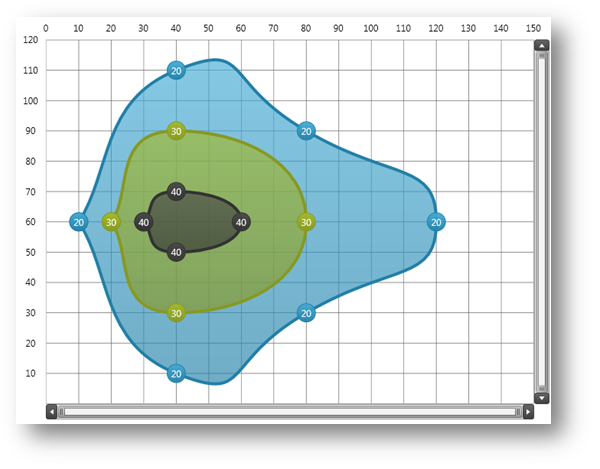
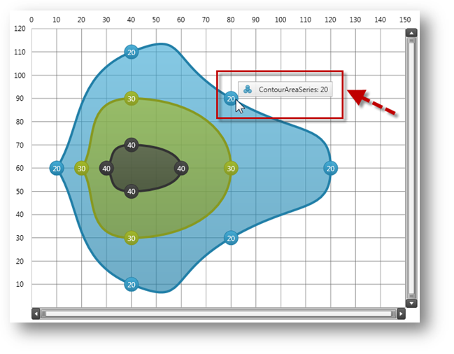

////

|metadata|
{
    "name": "datachart-creating-custom-series",
    "controlName": ["{DataChartName}"],
    "tags": ["Charting","Data Presentation","Getting Started","How Do I"],
    "guid": "01e94d58-aefe-4cdb-a050-cb94bedc467b",  
    "buildFlags": ["SL","WPF","win-rt"],
    "createdOn": "2014-06-05T19:39:00.6433745Z"
}
|metadata|
////

= Creating Custom Series

This topic introduces series inheritance feature of the link:{DataChartLink}.{DataChartName}.html[{DataChartName}]™ control and explains, with code examples, how to use it to create a custom type of series.

== Overview

The topic is organized as follows:

* <<Introduction,Introduction>>
* <<Example,Example>>

** <<Preview,Preview>>
** <<Procedure,Procedure>>

*** <<InheritingSeries,Inheriting Series>>
*** <<CreatingDefaultStyle,Creating Default Style>>
*** <<IntegratingAxes,Integrating Axes>>
*** <<OverridingSeriesMethods,Overriding Series Methods>>
*** <<ProvidingCustomCode,Providing Custom Code>>
*** <<RenderingSeries,Rendering Series>>

ifdef::sl,wpf,win-phone[]
*** <<IntegratingLegend,Integrating Legend>>

endif::sl,wpf,win-phone[]

*** <<IntegratingTooltips,Integrating Tooltips>>

* <<RelatedContent,Related Content>>

** link:datachart-axes.html[Chart Axes]
** link:datachart-series.html[Chart Series]

== Introduction

The {DataChartName} control is designed to allow application developers to implement custom type of series in their applications. This is accomplished by inheriting from the link:{DataChartLink}.series.html[Series] class, implementing required properties, and overriding methods of the base class. The Series is the base class for all {DataChartName} series and it provides basic properties and allows interfacing with the chart control. Moreover, custom series can be created by inheriting from existing types of series (e.g. link:{DataChartLink}.scatterseries.html[ScatterSeries]) and implementing custom features however this is out of the scope of this topic.

== Example

Example of custom type of series is a contour area series which renders as a collection of filled contours along data points with the same values plotted in the Cartesian coordinate system. When all elements of the ContourAreaSeries are implemented the series is defined as shown in the following code listing.

.Note:
[NOTE]
====
The following code examples assume that you added link:resources-contourdatasample.html[Sample Contour Data] and link:resources-beziercurvebuilder.html[Bezier Curve Builder] resources to you project as source code files. These resources provide sample data model and a class for generating contours of the ContourAreaSeries.
====

ifdef::wpf[]

*In XAML:*

----
xmlns:ig="http://schemas.infragistics.com/xaml"
xmlns:local="clr-namespace:Infragistics.Samples.Common"
----

endif::wpf[]

ifdef::win-universal[]

*In XAML:*

----
xmlns:ig="using:Infragistics.Controls.Charts"xmlns:custom="using:Infragistics.Samples.Common"
----

endif::win-universal[]

ifdef::wpf,win-universal[]

*In XAML:*

----
<ig:{DataChartName}.Series>
    <custom:ContourAreaSeries x:Name="customSeries" 
                              ItemsSource="{StaticResource data}"
                              XAxis="{Binding ElementName=xAxis}" 
                              YAxis="{Binding ElementName=yAxis}">
    </custom:ContourAreaSeries>
</ig:{DataChartName}.Series>
----

endif::wpf,win-universal[]

ifdef::wpf[]

*In Visual Basic:*

----
Imports Infragistics.Samples.Data    ' provides ContourData
Imports Infragistics.Samples.Common  ' provides ContourAreaSeries
...
Dim series As New ContourAreaSeries()
series.ItemsSource = New ContourDataSample()
series.XAxis = xAxis
series.YAxis = yAxis
...
Me.DataChart.Series.Add(series)
----

endif::wpf[]

ifdef::win-forms[]

*In Visual Basic:*

----
Imports Infragistics.Samples.Data    ' provides ContourData
Imports Infragistics.Samples.Common  ' provides ContourAreaSeries
...
Dim series As New ContourAreaSeries()
series.ItemsSource = New ContourDataSample()
series.XAxis = xAxis
series.YAxis = yAxis
...
Me.DataChart.Series.Add(series)
----

endif::win-forms[]

ifdef::xamarin[]

*In Visual Basic:*

----
Imports Infragistics.Samples.Data    ' provides ContourData
Imports Infragistics.Samples.Common  ' provides ContourAreaSeries
...
Dim series As New ContourAreaSeries()
series.ItemsSource = New ContourDataSample()
series.XAxis = xAxis
series.YAxis = yAxis
...
Me.DataChart.Series.Add(series)
----

endif::xamarin[]

ifdef::wpf[]

*In C#:*

----
using Infragistics.Samples.Data      // provides ContourData 
using Infragistics.Samples.Common;   // provides ContourAreaSeries
...
ContourAreaSeries series = new ContourAreaSeries();
series.ItemsSource = new ContourDataSample();
series.XAxis = xAxis;
series.YAxis = yAxis;
...
this.DataChart.Series.Add(series);
----

endif::wpf[]

ifdef::win-forms[]

*In C#:*

----
using Infragistics.Samples.Data      // provides ContourData 
using Infragistics.Samples.Common;   // provides ContourAreaSeries
...
ContourAreaSeries series = new ContourAreaSeries();
series.ItemsSource = new ContourDataSample();
series.XAxis = xAxis;
series.YAxis = yAxis;
...
this.DataChart.Series.Add(series);
----

endif::win-forms[]

ifdef::xamarin[]

*In C#:*

----
using Infragistics.Samples.Data      // provides ContourData 
using Infragistics.Samples.Common;   // provides ContourAreaSeries
...
ContourAreaSeries series = new ContourAreaSeries();
series.ItemsSource = new ContourDataSample();
series.XAxis = xAxis;
series.YAxis = yAxis;
...
this.DataChart.Series.Add(series);
----

endif::xamarin[]

== Preview

ifdef::sl,wpf,win-phone,win-universal[]

endif::sl,wpf,win-phone,win-universal[]

Figure 1 – Preview of the ContourAreaSeries rendered as a collection of filled contours along data points with the same values.

== Procedure

This section provides step-by-step instructions for creating the ContourAreaSeries and full code example is provided at the end of topic.

[start=1]
. Inheriting Series – This code snippet shows how to create a class for the ContourAreaSeries and inherit from the Series base class.

ifdef::wpf[]

*In Visual Basic:*

----
Imports {DataChartNamespace} ' provides elements of {DataChartName}
...
Namespace Infragistics.Samples.Common
    ''' 

    ''' Represents a custom type of ContourAreaSeries for {DataChartName} control.
    ''' 

    Public Class ContourAreaSeries
        Inherits Series
        Public Sub New()
            ' creates default style for the series from generic resource dictionary
            ' which should be added to generic.xaml or merged with resources of the application 
            Me.DefaultStyleKey = GetType(ContourAreaSeries)
        End Sub
    End Class
End Namespace
----

endif::wpf[]

ifdef::win-forms[]

*In Visual Basic:*

----
Imports {DataChartNamespace} ' provides elements of {DataChartName}
...
Namespace Infragistics.Samples.Common
    ''' 

    ''' Represents a custom type of ContourAreaSeries for {DataChartName} control.
    ''' 

    Public Class ContourAreaSeries
        Inherits Series
        Public Sub New()
            ' creates default style for the series from generic resource dictionary
            ' which should be added to generic.xaml or merged with resources of the application 
            Me.DefaultStyleKey = GetType(ContourAreaSeries)
        End Sub
    End Class
End Namespace
----

endif::win-forms[]

ifdef::xamarin[]

*In Visual Basic:*

----
Imports {DataChartNamespace} ' provides elements of {DataChartName}
...
Namespace Infragistics.Samples.Common
    ''' 

    ''' Represents a custom type of ContourAreaSeries for {DataChartName} control.
    ''' 

    Public Class ContourAreaSeries
        Inherits Series
        Public Sub New()
            ' creates default style for the series from generic resource dictionary
            ' which should be added to generic.xaml or merged with resources of the application 
            Me.DefaultStyleKey = GetType(ContourAreaSeries)
        End Sub
    End Class
End Namespace
----

endif::xamarin[]

ifdef::wpf[]

*In C#:*

----
using {DataChartNamespace}; // provides elements of {DataChartName}
...
namespace Infragistics.Samples.Common
{
  /// 

  /// Represents a custom type of ContourAreaSeries for {DataChartName} control.
  /// 

  public class ContourAreaSeries : Series
  {
    public ContourAreaSeries()
    {
        // creates default style for the series from generic resource dictionary
        // which should be added to generic.xaml or merged with resources of the application 
        this.DefaultStyleKey = typeof(ContourAreaSeries);
    }
  }
}
----

endif::wpf[]

ifdef::win-forms[]

*In C#:*

----
using {DataChartNamespace}; // provides elements of {DataChartName}
...
namespace Infragistics.Samples.Common
{
  /// 

  /// Represents a custom type of ContourAreaSeries for {DataChartName} control.
  /// 

  public class ContourAreaSeries : Series
  {
    public ContourAreaSeries()
    {
        // creates default style for the series from generic resource dictionary
        // which should be added to generic.xaml or merged with resources of the application 
        this.DefaultStyleKey = typeof(ContourAreaSeries);
    }
  }
}
----

endif::win-forms[]

ifdef::xamarin[]

*In C#:*

----
using {DataChartNamespace}; // provides elements of {DataChartName}
...
namespace Infragistics.Samples.Common
{
  /// 

  /// Represents a custom type of ContourAreaSeries for {DataChartName} control.
  /// 

  public class ContourAreaSeries : Series
  {
    public ContourAreaSeries()
    {
        // creates default style for the series from generic resource dictionary
        // which should be added to generic.xaml or merged with resources of the application 
        this.DefaultStyleKey = typeof(ContourAreaSeries);
    }
  }
}
----

endif::xamarin[]

[start=2]
. Creating Default Style – Each series must have a default style defined in application generic.xaml or in a resource dictionary that is merged with application resources. The following code snippet shows how to define default style for the ContourAreaSeries type.

ifdef::wpf,win-universal[]

*In XAML:*

----
<ResourceDictionary
...>
    <!-- generic style for the ContourAreaSeries series type -->
    
</ResourceDictionary>
----

endif::wpf,win-universal[]

[start=3]
. Integrating Axes - This code snippet shows how to create two dependency properties that are used for binding the custom series to x-axis and y-axis. Also it shows how to attach, using lambda expressions, event handlers that are raised when new values are assigned to these properties.

.Note:
[NOTE]
====
Although, this code uses NumericXAxis and NumericYAxis for types of x-axis and y-axis properties, you are not limited to these axes as you can use other types of axes as well. Refer to the Axes topic for more information on existing types of axes in the {DataChartName} control.
====

ifdef::wpf[]

*In Visual Basic:*

----
#Region "Property - XAxis"
Public Const XAxisPropertyName As String = "XAxis"
Public Shared ReadOnly XAxisProperty As DependencyProperty = DependencyProperty.Register(XAxisPropertyName, GetType(NumericXAxis), GetType(ContourAreaSeries), New PropertyMetadata(Nothing, Function(sender, e) 
Dim series As ContourAreaSeries = DirectCast(sender, ContourAreaSeries)
series.RaisePropertyChanged(XAxisPropertyName, e.OldValue, e.NewValue)
End Function))
Public Property XAxis() As NumericXAxis
    Get
        Return TryCast(Me.GetValue(XAxisProperty), NumericXAxis)
    End Get
    Set
        Me.SetValue(XAxisProperty, value)
    End Set
End Property
#End Region
#Region "Property - YAxis"
Public Const YAxisPropertyName As String = "YAxis"
Public Shared ReadOnly YAxisProperty As DependencyProperty = DependencyProperty.Register(YAxisPropertyName, GetType(NumericYAxis), GetType(ContourAreaSeries), New PropertyMetadata(Nothing, Function(sender, e) 
Dim series As ContourAreaSeries = DirectCast(sender, ContourAreaSeries)
series.RaisePropertyChanged(YAxisPropertyName, e.OldValue, e.NewValue)
End Function))
Public Property YAxis() As NumericYAxis
    Get
        Return TryCast(Me.GetValue(YAxisProperty), NumericYAxis)
    End Get
    Set
        Me.SetValue(YAxisProperty, value)
    End Set
End Property
#End Region
----

endif::wpf[]

ifdef::win-forms[]

*In Visual Basic:*

----
#Region "Property - XAxis"
Public Const XAxisPropertyName As String = "XAxis"
Public Shared ReadOnly XAxisProperty As DependencyProperty = DependencyProperty.Register(XAxisPropertyName, GetType(NumericXAxis), GetType(ContourAreaSeries), New PropertyMetadata(Nothing, Function(sender, e) 
Dim series As ContourAreaSeries = DirectCast(sender, ContourAreaSeries)
series.RaisePropertyChanged(XAxisPropertyName, e.OldValue, e.NewValue)
End Function))
Public Property XAxis() As NumericXAxis
    Get
        Return TryCast(Me.GetValue(XAxisProperty), NumericXAxis)
    End Get
    Set
        Me.SetValue(XAxisProperty, value)
    End Set
End Property
#End Region
#Region "Property - YAxis"
Public Const YAxisPropertyName As String = "YAxis"
Public Shared ReadOnly YAxisProperty As DependencyProperty = DependencyProperty.Register(YAxisPropertyName, GetType(NumericYAxis), GetType(ContourAreaSeries), New PropertyMetadata(Nothing, Function(sender, e) 
Dim series As ContourAreaSeries = DirectCast(sender, ContourAreaSeries)
series.RaisePropertyChanged(YAxisPropertyName, e.OldValue, e.NewValue)
End Function))
Public Property YAxis() As NumericYAxis
    Get
        Return TryCast(Me.GetValue(YAxisProperty), NumericYAxis)
    End Get
    Set
        Me.SetValue(YAxisProperty, value)
    End Set
End Property
#End Region
----

endif::win-forms[]

ifdef::xamarin[]

*In Visual Basic:*

----
#Region "Property - XAxis"
Public Const XAxisPropertyName As String = "XAxis"
Public Shared ReadOnly XAxisProperty As DependencyProperty = DependencyProperty.Register(XAxisPropertyName, GetType(NumericXAxis), GetType(ContourAreaSeries), New PropertyMetadata(Nothing, Function(sender, e) 
Dim series As ContourAreaSeries = DirectCast(sender, ContourAreaSeries)
series.RaisePropertyChanged(XAxisPropertyName, e.OldValue, e.NewValue)
End Function))
Public Property XAxis() As NumericXAxis
    Get
        Return TryCast(Me.GetValue(XAxisProperty), NumericXAxis)
    End Get
    Set
        Me.SetValue(XAxisProperty, value)
    End Set
End Property
#End Region
#Region "Property - YAxis"
Public Const YAxisPropertyName As String = "YAxis"
Public Shared ReadOnly YAxisProperty As DependencyProperty = DependencyProperty.Register(YAxisPropertyName, GetType(NumericYAxis), GetType(ContourAreaSeries), New PropertyMetadata(Nothing, Function(sender, e) 
Dim series As ContourAreaSeries = DirectCast(sender, ContourAreaSeries)
series.RaisePropertyChanged(YAxisPropertyName, e.OldValue, e.NewValue)
End Function))
Public Property YAxis() As NumericYAxis
    Get
        Return TryCast(Me.GetValue(YAxisProperty), NumericYAxis)
    End Get
    Set
        Me.SetValue(YAxisProperty, value)
    End Set
End Property
#End Region
----

endif::xamarin[]

ifdef::wpf[]

*In C#:*

----
#region Property - XAxis
public const string XAxisPropertyName = "XAxis";
public static readonly DependencyProperty XAxisProperty =
    DependencyProperty.Register(XAxisPropertyName, typeof(NumericXAxis),
    typeof(ContourAreaSeries), new PropertyMetadata(null, (sender, e) =>
    {
        ContourAreaSeries series = (ContourAreaSeries)sender;
        series.RaisePropertyChanged(XAxisPropertyName, e.OldValue, e.NewValue);
    }));
public NumericXAxis XAxis
{
    get
    {
        return this.GetValue(XAxisProperty) as NumericXAxis;
    }
    set
    {
        this.SetValue(XAxisProperty, value);
    }
}
#endregion
#region Property - YAxis
public const string YAxisPropertyName = "YAxis";
public static readonly DependencyProperty YAxisProperty =
    DependencyProperty.Register(YAxisPropertyName, typeof(NumericYAxis),
    typeof(ContourAreaSeries), new PropertyMetadata(null, (sender, e) =>
    {
        ContourAreaSeries series = (ContourAreaSeries)sender;
        series.RaisePropertyChanged(YAxisPropertyName, e.OldValue, e.NewValue);
    }));
public NumericYAxis YAxis
{
    get
    {
        return this.GetValue(YAxisProperty) as NumericYAxis;
    }
    set
    {
        this.SetValue(YAxisProperty, value);
    }
}
#endregion
----

endif::wpf[]

ifdef::win-forms[]

*In C#:*

----
#region Property - XAxis
public const string XAxisPropertyName = "XAxis";
public static readonly DependencyProperty XAxisProperty =
    DependencyProperty.Register(XAxisPropertyName, typeof(NumericXAxis),
    typeof(ContourAreaSeries), new PropertyMetadata(null, (sender, e) =>
    {
        ContourAreaSeries series = (ContourAreaSeries)sender;
        series.RaisePropertyChanged(XAxisPropertyName, e.OldValue, e.NewValue);
    }));
public NumericXAxis XAxis
{
    get
    {
        return this.GetValue(XAxisProperty) as NumericXAxis;
    }
    set
    {
        this.SetValue(XAxisProperty, value);
    }
}
#endregion
#region Property - YAxis
public const string YAxisPropertyName = "YAxis";
public static readonly DependencyProperty YAxisProperty =
    DependencyProperty.Register(YAxisPropertyName, typeof(NumericYAxis),
    typeof(ContourAreaSeries), new PropertyMetadata(null, (sender, e) =>
    {
        ContourAreaSeries series = (ContourAreaSeries)sender;
        series.RaisePropertyChanged(YAxisPropertyName, e.OldValue, e.NewValue);
    }));
public NumericYAxis YAxis
{
    get
    {
        return this.GetValue(YAxisProperty) as NumericYAxis;
    }
    set
    {
        this.SetValue(YAxisProperty, value);
    }
}
#endregion
----

endif::win-forms[]

ifdef::xamarin[]

*In C#:*

----
#region Property - XAxis
public const string XAxisPropertyName = "XAxis";
public static readonly DependencyProperty XAxisProperty =
    DependencyProperty.Register(XAxisPropertyName, typeof(NumericXAxis),
    typeof(ContourAreaSeries), new PropertyMetadata(null, (sender, e) =>
    {
        ContourAreaSeries series = (ContourAreaSeries)sender;
        series.RaisePropertyChanged(XAxisPropertyName, e.OldValue, e.NewValue);
    }));
public NumericXAxis XAxis
{
    get
    {
        return this.GetValue(XAxisProperty) as NumericXAxis;
    }
    set
    {
        this.SetValue(XAxisProperty, value);
    }
}
#endregion
#region Property - YAxis
public const string YAxisPropertyName = "YAxis";
public static readonly DependencyProperty YAxisProperty =
    DependencyProperty.Register(YAxisPropertyName, typeof(NumericYAxis),
    typeof(ContourAreaSeries), new PropertyMetadata(null, (sender, e) =>
    {
        ContourAreaSeries series = (ContourAreaSeries)sender;
        series.RaisePropertyChanged(YAxisPropertyName, e.OldValue, e.NewValue);
    }));
public NumericYAxis YAxis
{
    get
    {
        return this.GetValue(YAxisProperty) as NumericYAxis;
    }
    set
    {
        this.SetValue(YAxisProperty, value);
    }
}
#endregion
----

endif::xamarin[]

[start=4]
. Overriding Series Methods – This code snippet shows series methods that must be overridden in order to render the series when specific properties of the custom series have changed.

ifdef::wpf[]

*In Visual Basic:*

----
''' 

''' Calls rendering of this series any time the Viewport rect has changed
''' 

Protected Overrides Sub ViewportRectChangedOverride(oldViewportRect As Rect, newViewportRect As Rect)
    MyBase.ViewportRectChangedOverride(oldViewportRect, newViewportRect)
    Me.RenderSeries(False)
End Sub
''' 

''' Calls rendering of this series any time the Window rect has changed
''' 

Protected Overrides Sub WindowRectChangedOverride(oldWindowRect As Rect, newWindowRect As Rect)
    MyBase.WindowRectChangedOverride(oldWindowRect, newWindowRect)
    Me.RenderSeries(False)
End Sub
''' 

''' Checks if series should be re-draw any time a property of the series has changed
''' 

Protected Overrides Sub PropertyUpdatedOverride(sender As Object, propertyName As String, oldValue As Object, newValue As Object)
    MyBase.PropertyUpdatedOverride(sender, propertyName, oldValue, newValue)
    Select Case propertyName
                      ' renders series on changes made to the items source
        Case ItemsSourcePropertyName
            Me.RenderSeries(False)
            If Me.XAxis IsNot Nothing Then
                Me.XAxis.UpdateRange()
            End If
            If Me.YAxis IsNot Nothing Then
                Me.YAxis.UpdateRange()
            End If
            Exit Select
                      ' renders series if a new the x-axis is assigned
        Cae XAxisPropertyName
            If oldValue IsNot Nothing Then
                DirectCast(oldValue, Axis).DeregisterSeries(Me)
            End If
            If newValue IsNot Nothing Then
                DirectCast(newValue, Axis).RegisterSeries(Me)
            End If
            If (XAxis IsNot Nothing AndAlso Not XAxis.UpdateRange()) OrElse (newValue Is Nothing AndAlso oldValue IsNot Nothing) Then
                RenderSeries(False)
            End If
            Exit Select
                      ' renders series if a new the y-axis is assigned
        Case YAxisPropertyName
            If oldValue IsNot Nothing Then
                DirectCast(oldValue, Axis).DeregisterSeries(Me)
            End If
            If newValue IsNot Nothing Then
                DirectCast(newValue, Axis).RegisterSeries(Me)
            End If
            If (YAxis IsNot Nothing AndAlso Not YAxis.UpdateRange()) OrElse (newValue Is Nothing AndAlso oldValue IsNot Nothing) Then
                RenderSeries(False)
            End If
            Exit Select
    End Select
End Sub
''' 

''' Calculates range of a given axis based on  X/Y values of data items
''' 

''' <param name="axis"></param>
''' <returns></returns>
Protected Overrides Function GetRange(axis As Axis) As AxisRange
    Dim myData As ContourData = TryCast(Me.ItemsSource, ContourData)
    If myData Is Nothing Then
        Return MyBase.GetRange(axis)
    End If
           ' for x-axis range use X values of data points
    If axis = Me.XAxis Then
        Dim min As Double = Double.MaxValue
        Dim max As Double = Double.MinValue
        For Each dataPoint As ContourDataPoint In myData
            min = System.Math.Min(min, dataPoint.X)
            max = System.Math.Max(max, dataPoint.X)
        Next
        Return New AxisRange(min, max)
           ' for y-axis range use Y values of data points
    ElseIf axis = Me.YAxis Then
        Dim min As Double = Double.MaxValue
        Dim max As Double = Double.MinValue
        For Each dataPoint As ContourDataPoint In myData
            min = System.Math.Min(min, dataPoint.Y)
            max = System.Math.Max(max, dataPoint.Y)
        Next
        Return New AxisRange(min, max)
    Else
        Return MyBase.GetRange(axis)
    End If
End Function
----

endif::wpf[]

ifdef::win-forms[]

*In Visual Basic:*

----
''' 

''' Calls rendering of this series any time the Viewport rect has changed
''' 

Protected Overrides Sub ViewportRectChangedOverride(oldViewportRect As Rect, newViewportRect As Rect)
    MyBase.ViewportRectChangedOverride(oldViewportRect, newViewportRect)
    Me.RenderSeries(False)
End Sub
''' 

''' Calls rendering of this series any time the Window rect has changed
''' 

Protected Overrides Sub WindowRectChangedOverride(oldWindowRect As Rect, newWindowRect As Rect)
    MyBase.WindowRectChangedOverride(oldWindowRect, newWindowRect)
    Me.RenderSeries(False)
End Sub
''' 

''' Checks if series should be re-draw any time a property of the series has changed
''' 

Protected Overrides Sub PropertyUpdatedOverride(sender As Object, propertyName As String, oldValue As Object, newValue As Object)
    MyBase.PropertyUpdatedOverride(sender, propertyName, oldValue, newValue)
    Select Case propertyName
                      ' renders series on changes made to the items source
        Case ItemsSourcePropertyName
            Me.RenderSeries(False)
            If Me.XAxis IsNot Nothing Then
                Me.XAxis.UpdateRange()
            End If
            If Me.YAxis IsNot Nothing Then
                Me.YAxis.UpdateRange()
            End If
            Exit Select
                      ' renders series if a new the x-axis is assigned
        Cae XAxisPropertyName
            If oldValue IsNot Nothing Then
                DirectCast(oldValue, Axis).DeregisterSeries(Me)
            End If
            If newValue IsNot Nothing Then
                DirectCast(newValue, Axis).RegisterSeries(Me)
            End If
            If (XAxis IsNot Nothing AndAlso Not XAxis.UpdateRange()) OrElse (newValue Is Nothing AndAlso oldValue IsNot Nothing) Then
                RenderSeries(False)
            End If
            Exit Select
                      ' renders series if a new the y-axis is assigned
        Case YAxisPropertyName
            If oldValue IsNot Nothing Then
                DirectCast(oldValue, Axis).DeregisterSeries(Me)
            End If
            If newValue IsNot Nothing Then
                DirectCast(newValue, Axis).RegisterSeries(Me)
            End If
            If (YAxis IsNot Nothing AndAlso Not YAxis.UpdateRange()) OrElse (newValue Is Nothing AndAlso oldValue IsNot Nothing) Then
                RenderSeries(False)
            End If
            Exit Select
    End Select
End Sub
''' 

''' Calculates range of a given axis based on  X/Y values of data items
''' 

''' <param name="axis"></param>
''' <returns></returns>
Protected Overrides Function GetRange(axis As Axis) As AxisRange
    Dim myData As ContourData = TryCast(Me.ItemsSource, ContourData)
    If myData Is Nothing Then
        Return MyBase.GetRange(axis)
    End If
           ' for x-axis range use X values of data points
    If axis = Me.XAxis Then
        Dim min As Double = Double.MaxValue
        Dim max As Double = Double.MinValue
        For Each dataPoint As ContourDataPoint In myData
            min = System.Math.Min(min, dataPoint.X)
            max = System.Math.Max(max, dataPoint.X)
        Next
        Return New AxisRange(min, max)
           ' for y-axis range use Y values of data points
    ElseIf axis = Me.YAxis Then
        Dim min As Double = Double.MaxValue
        Dim max As Double = Double.MinValue
        For Each dataPoint As ContourDataPoint In myData
            min = System.Math.Min(min, dataPoint.Y)
            max = System.Math.Max(max, dataPoint.Y)
        Next
        Return New AxisRange(min, max)
    Else
        Return MyBase.GetRange(axis)
    End If
End Function
----

endif::win-forms[]

ifdef::xamarin[]

*In Visual Basic:*

----
''' 

''' Calls rendering of this series any time the Viewport rect has changed
''' 

Protected Overrides Sub ViewportRectChangedOverride(oldViewportRect As Rect, newViewportRect As Rect)
    MyBase.ViewportRectChangedOverride(oldViewportRect, newViewportRect)
    Me.RenderSeries(False)
End Sub
''' 

''' Calls rendering of this series any time the Window rect has changed
''' 

Protected Overrides Sub WindowRectChangedOverride(oldWindowRect As Rect, newWindowRect As Rect)
    MyBase.WindowRectChangedOverride(oldWindowRect, newWindowRect)
    Me.RenderSeries(False)
End Sub
''' 

''' Checks if series should be re-draw any time a property of the series has changed
''' 

Protected Overrides Sub PropertyUpdatedOverride(sender As Object, propertyName As String, oldValue As Object, newValue As Object)
    MyBase.PropertyUpdatedOverride(sender, propertyName, oldValue, newValue)
    Select Case propertyName
                      ' renders series on changes made to the items source
        Case ItemsSourcePropertyName
            Me.RenderSeries(False)
            If Me.XAxis IsNot Nothing Then
                Me.XAxis.UpdateRange()
            End If
            If Me.YAxis IsNot Nothing Then
                Me.YAxis.UpdateRange()
            End If
            Exit Select
                      ' renders series if a new the x-axis is assigned
        Cae XAxisPropertyName
            If oldValue IsNot Nothing Then
                DirectCast(oldValue, Axis).DeregisterSeries(Me)
            End If
            If newValue IsNot Nothing Then
                DirectCast(newValue, Axis).RegisterSeries(Me)
            End If
            If (XAxis IsNot Nothing AndAlso Not XAxis.UpdateRange()) OrElse (newValue Is Nothing AndAlso oldValue IsNot Nothing) Then
                RenderSeries(False)
            End If
            Exit Select
                      ' renders series if a new the y-axis is assigned
        Case YAxisPropertyName
            If oldValue IsNot Nothing Then
                DirectCast(oldValue, Axis).DeregisterSeries(Me)
            End If
            If newValue IsNot Nothing Then
                DirectCast(newValue, Axis).RegisterSeries(Me)
            End If
            If (YAxis IsNot Nothing AndAlso Not YAxis.UpdateRange()) OrElse (newValue Is Nothing AndAlso oldValue IsNot Nothing) Then
                RenderSeries(False)
            End If
            Exit Select
    End Select
End Sub
''' 

''' Calculates range of a given axis based on  X/Y values of data items
''' 

''' <param name="axis"></param>
''' <returns></returns>
Protected Overrides Function GetRange(axis As Axis) As AxisRange
    Dim myData As ContourData = TryCast(Me.ItemsSource, ContourData)
    If myData Is Nothing Then
        Return MyBase.GetRange(axis)
    End If
           ' for x-axis range use X values of data points
    If axis = Me.XAxis Then
        Dim min As Double = Double.MaxValue
        Dim max As Double = Double.MinValue
        For Each dataPoint As ContourDataPoint In myData
            min = System.Math.Min(min, dataPoint.X)
            max = System.Math.Max(max, dataPoint.X)
        Next
        Return New AxisRange(min, max)
           ' for y-axis range use Y values of data points
    ElseIf axis = Me.YAxis Then
        Dim min As Double = Double.MaxValue
        Dim max As Double = Double.MinValue
        For Each dataPoint As ContourDataPoint In myData
            min = System.Math.Min(min, dataPoint.Y)
            max = System.Math.Max(max, dataPoint.Y)
        Next
        Return New AxisRange(min, max)
    Else
        Return MyBase.GetRange(axis)
    End If
End Function
----

endif::xamarin[]

ifdef::wpf[]

*In C#:*

----
/// 

/// Calls rendering of this series any time the Viewport rect has changed
/// 

protected override void ViewportRectChangedOverride(Rect oldViewportRect, Rect newViewportRect)
{
    base.ViewportRectChangedOverride(oldViewportRect, newViewportRect);
    this.RenderSeries(false);
}
/// 

/// Calls rendering of this series any time the Window rect has changed
/// 

protected override void WindowRectChangedOverride(Rect oldWindowRect, Rect newWindowRect)
{
    base.WindowRectChangedOverride(oldWindowRect, newWindowRect);
    this.RenderSeries(false);
}
/// 

/// Checks if series should be re-draw any time a property of the series has changed
/// 

protected override void PropertyUpdatedOverride(object sender, string propertyName, object oldValue, object newValue)
{
    base.PropertyUpdatedOverride(sender, propertyName, oldValue, newValue);
    switch (propertyName)
    {
        // renders series on changes made to the items source
        case ItemsSourcePropertyName:
            this.RenderSeries(false);
            if (this.XAxis != null)
            {
                this.XAxis.UpdateRange();
            }
            if (this.YAxis != null)
            {
                this.YAxis.UpdateRange();
            }
            break;
        // renders series if a new the x-axis is assigned
        case XAxisPropertyName:
            if (oldValue != null)
            {
                ((Axis)oldValue).DeregisterSeries(this);
            }
            if (newValue != null)
            {
                ((Axis)newValue).RegisterSeries(this);
            }
            if ((XAxis != null && !XAxis.UpdateRange()) ||
                (newValue == null && oldValue != null))
            {
                RenderSeries(false);
            }
            break;
        // renders series if a new the y-axis is assigned
        case YAxisPropertyName:
            if (oldValue != null)
            {
                ((Axis)oldValue).DeregisterSeries(this);
            }
            if (newValue != null)
            {
                ((Axis)newValue).RegisterSeries(this);
            }
            if ((YAxis != null && !YAxis.UpdateRange()) ||
                (newValue == null && oldValue != null))
            {
                RenderSeries(false);
            }
            break;
    }
}
/// 

/// Calculates range of a given axis based on  X/Y values of data items
/// 

/// <returns></returns>
protected override AxisRange GetRange(Axis axis)
{
    ContourData myData = this.ItemsSource as ContourData;
    if (myData == null)
    {
        return base.GetRange(axis);
    }
    // for x-axis range use X values of data points
    if (axis == this.XAxis)
    {
        double min = double.MaxValue;
        double max = double.MinValue;
        foreach (ContourDataPoint dataPoint in myData)
        {
            min = System.Math.Min(min, dataPoint.X);
            max = System.Math.Max(max, dataPoint.X);
        }
        return new AxisRange(min, max);
    }
    // for y-axis range use Y values of data points
    else if (axis == this.YAxis)
    {
        double min = double.MaxValue;
        double max = double.MinValue;
        foreach (ContourDataPoint dataPoint in myData)
        {
            min = System.Math.Min(min, dataPoint.Y);
            max = System.Math.Max(max, dataPoint.Y);
        }
        return new AxisRange(min, max);
    }
    else
    {
        return base.GetRange(axis);
    }
}
----

endif::wpf[]

ifdef::win-forms[]

*In C#:*

----
/// 

/// Calls rendering of this series any time the Viewport rect has changed
/// 

protected override void ViewportRectChangedOverride(Rect oldViewportRect, Rect newViewportRect)
{
    base.ViewportRectChangedOverride(oldViewportRect, newViewportRect);
    this.RenderSeries(false);
}
/// 

/// Calls rendering of this series any time the Window rect has changed
/// 

protected override void WindowRectChangedOverride(Rect oldWindowRect, Rect newWindowRect)
{
    base.WindowRectChangedOverride(oldWindowRect, newWindowRect);
    this.RenderSeries(false);
}
/// 

/// Checks if series should be re-draw any time a property of the series has changed
/// 

protected override void PropertyUpdatedOverride(object sender, string propertyName, object oldValue, object newValue)
{
    base.PropertyUpdatedOverride(sender, propertyName, oldValue, newValue);
    switch (propertyName)
    {
        // renders series on changes made to the items source
        case ItemsSourcePropertyName:
            this.RenderSeries(false);
            if (this.XAxis != null)
            {
                this.XAxis.UpdateRange();
            }
            if (this.YAxis != null)
            {
                this.YAxis.UpdateRange();
            }
            break;
        // renders series if a new the x-axis is assigned
        case XAxisPropertyName:
            if (oldValue != null)
            {
                ((Axis)oldValue).DeregisterSeries(this);
            }
            if (newValue != null)
            {
                ((Axis)newValue).RegisterSeries(this);
            }
            if ((XAxis != null && !XAxis.UpdateRange()) ||
                (newValue == null && oldValue != null))
            {
                RenderSeries(false);
            }
            break;
        // renders series if a new the y-axis is assigned
        case YAxisPropertyName:
            if (oldValue != null)
            {
                ((Axis)oldValue).DeregisterSeries(this);
            }
            if (newValue != null)
            {
                ((Axis)newValue).RegisterSeries(this);
            }
            if ((YAxis != null && !YAxis.UpdateRange()) ||
                (newValue == null && oldValue != null))
            {
                RenderSeries(false);
            }
            break;
    }
}
/// 

/// Calculates range of a given axis based on  X/Y values of data items
/// 

/// <returns></returns>
protected override AxisRange GetRange(Axis axis)
{
    ContourData myData = this.ItemsSource as ContourData;
    if (myData == null)
    {
        return base.GetRange(axis);
    }
    // for x-axis range use X values of data points
    if (axis == this.XAxis)
    {
        double min = double.MaxValue;
        double max = double.MinValue;
        foreach (ContourDataPoint dataPoint in myData)
        {
            min = System.Math.Min(min, dataPoint.X);
            max = System.Math.Max(max, dataPoint.X);
        }
        return new AxisRange(min, max);
    }
    // for y-axis range use Y values of data points
    else if (axis == this.YAxis)
    {
        double min = double.MaxValue;
        double max = double.MinValue;
        foreach (ContourDataPoint dataPoint in myData)
        {
            min = System.Math.Min(min, dataPoint.Y);
            max = System.Math.Max(max, dataPoint.Y);
        }
        return new AxisRange(min, max);
    }
    else
    {
        return base.GetRange(axis);
    }
}
----

endif::win-forms[]

ifdef::xamarin[]

*In C#:*

----
/// 

/// Calls rendering of this series any time the Viewport rect has changed
/// 

protected override void ViewportRectChangedOverride(Rect oldViewportRect, Rect newViewportRect)
{
    base.ViewportRectChangedOverride(oldViewportRect, newViewportRect);
    this.RenderSeries(false);
}
/// 

/// Calls rendering of this series any time the Window rect has changed
/// 

protected override void WindowRectChangedOverride(Rect oldWindowRect, Rect newWindowRect)
{
    base.WindowRectChangedOverride(oldWindowRect, newWindowRect);
    this.RenderSeries(false);
}
/// 

/// Checks if series should be re-draw any time a property of the series has changed
/// 

protected override void PropertyUpdatedOverride(object sender, string propertyName, object oldValue, object newValue)
{
    base.PropertyUpdatedOverride(sender, propertyName, oldValue, newValue);
    switch (propertyName)
    {
        // renders series on changes made to the items source
        case ItemsSourcePropertyName:
            this.RenderSeries(false);
            if (this.XAxis != null)
            {
                this.XAxis.UpdateRange();
            }
            if (this.YAxis != null)
            {
                this.YAxis.UpdateRange();
            }
            break;
        // renders series if a new the x-axis is assigned
        case XAxisPropertyName:
            if (oldValue != null)
            {
                ((Axis)oldValue).DeregisterSeries(this);
            }
            if (newValue != null)
            {
                ((Axis)newValue).RegisterSeries(this);
            }
            if ((XAxis != null && !XAxis.UpdateRange()) ||
                (newValue == null && oldValue != null))
            {
                RenderSeries(false);
            }
            break;
        // renders series if a new the y-axis is assigned
        case YAxisPropertyName:
            if (oldValue != null)
            {
                ((Axis)oldValue).DeregisterSeries(this);
            }
            if (newValue != null)
            {
                ((Axis)newValue).RegisterSeries(this);
            }
            if ((YAxis != null && !YAxis.UpdateRange()) ||
                (newValue == null && oldValue != null))
            {
                RenderSeries(false);
            }
            break;
    }
}
/// 

/// Calculates range of a given axis based on  X/Y values of data items
/// 

/// <returns></returns>
protected override AxisRange GetRange(Axis axis)
{
    ContourData myData = this.ItemsSource as ContourData;
    if (myData == null)
    {
        return base.GetRange(axis);
    }
    // for x-axis range use X values of data points
    if (axis == this.XAxis)
    {
        double min = double.MaxValue;
        double max = double.MinValue;
        foreach (ContourDataPoint dataPoint in myData)
        {
            min = System.Math.Min(min, dataPoint.X);
            max = System.Math.Max(max, dataPoint.X);
        }
        return new AxisRange(min, max);
    }
    // for y-axis range use Y values of data points
    else if (axis == this.YAxis)
    {
        double min = double.MaxValue;
        double max = double.MinValue;
        foreach (ContourDataPoint dataPoint in myData)
        {
            min = System.Math.Min(min, dataPoint.Y);
            max = System.Math.Max(max, dataPoint.Y);
        }
        return new AxisRange(min, max);
    }
    else
    {
        return base.GetRange(axis);
    }
}
----

endif::xamarin[]

[start=5]
. Providing Custom Code – This code snippet shows how to implement custom logic for getting brushes used when rendering different elements of the ContourAreaSeries.

.Note:
[NOTE]
====
This does not have to be implemented this way and you can provide your own logic or implement a property of link:{DataChartLink}.brushscale.html[BrushScale] type (see link:{DataChartLink}.bubbleseries{ApiProp}fillscale.html[FillScale] property of the link:{DataChartLink}.bubbleseries.html[BubbleSeries]) to determine the color pattern for rendering the series and to simplify implementation of the custom series.
====

ifdef::wpf[]

*In Visual Basic:*

----
Public Property ActualContourBrushes() As BrushCollection
    Get
        Return _actualContourBrushes
    End Get
    Private Set
        _actualContourBrushes = Value
    End Set
End Property
Private _actualContourBrushes As BrushCollection
Public Property ActualContourOutlines() As BrushCollection
    Get
        Return _actualContourOutlines
    End Get
    Private Set
        _actualContourOutlines = Value
    End Set
End Property
Private _actualContourOutlines As BrushCollection
Public Property ActualContourMarkerOutlines() As BrushCollection
    Get
        Return _actualContourMarkerOutlines
    End Get
    Private Set
        _actualContourMarkerOutlines = Value
    End Set
End Property
Private _actualContourMarkerOutlines As BrushCollection
Public Property ActualContourMarkerBrushes() As BrushCollection
    Get
        Return _actualContourMarkerBrushes
    End Get
    Private Set
        _actualContourMarkerBrushes = Value
    End Set
End Property
Private _actualContourMarkerBrushes As BrushCollection
#Region "Brush Methods"
Private Function GetContourPathFill(conturIndex As Integer) As Brush
    Return GetValidBrush(conturIndex, Me.ActualContourBrushes)
End Function
Private Function GetContourPathStroke(conturIndex As Integer) As Brush
    Return GetValidBrush(conturIndex, Me.ActualContourOutlines)
End Function
Private Function GetContourMarkerOutline(conturIndex As Integer) As Brush
    Return GetValidBrush(conturIndex, Me.ActualContourMarkerOutlines)
End Function
Private Function GetContourMarkerFill(conturIndex As Integer) As Brush
    Return GetValidBrush(conturIndex, Me.ActualContourMarkerBrushes)
End Function
Private Function GetValidBrush(conturIndex As Integer, brushes As BrushCollection) As Brush
    If brushes Is Nothing OrElse brushes.Count = 0 Then
        Return New SolidColorBrush(Colors.Black)
    End If
    If conturIndex >= 0 AndAlso conturIndex < brushes.Count Then
        Return brushes(conturIndex)
    End If
    conturIndex = conturIndex Mod brushes.Count
    Return brushes(conturIndex)
End Function
#End Region
----

endif::wpf[]

ifdef::win-forms[]

*In Visual Basic:*

----
Public Property ActualContourBrushes() As BrushCollection
    Get
        Return _actualContourBrushes
    End Get
    Private Set
        _actualContourBrushes = Value
    End Set
End Property
Private _actualContourBrushes As BrushCollection
Public Property ActualContourOutlines() As BrushCollection
    Get
        Return _actualContourOutlines
    End Get
    Private Set
        _actualContourOutlines = Value
    End Set
End Property
Private _actualContourOutlines As BrushCollection
Public Property ActualContourMarkerOutlines() As BrushCollection
    Get
        Return _actualContourMarkerOutlines
    End Get
    Private Set
        _actualContourMarkerOutlines = Value
    End Set
End Property
Private _actualContourMarkerOutlines As BrushCollection
Public Property ActualContourMarkerBrushes() As BrushCollection
    Get
        Return _actualContourMarkerBrushes
    End Get
    Private Set
        _actualContourMarkerBrushes = Value
    End Set
End Property
Private _actualContourMarkerBrushes As BrushCollection
#Region "Brush Methods"
Private Function GetContourPathFill(conturIndex As Integer) As Brush
    Return GetValidBrush(conturIndex, Me.ActualContourBrushes)
End Function
Private Function GetContourPathStroke(conturIndex As Integer) As Brush
    Return GetValidBrush(conturIndex, Me.ActualContourOutlines)
End Function
Private Function GetContourMarkerOutline(conturIndex As Integer) As Brush
    Return GetValidBrush(conturIndex, Me.ActualContourMarkerOutlines)
End Function
Private Function GetContourMarkerFill(conturIndex As Integer) As Brush
    Return GetValidBrush(conturIndex, Me.ActualContourMarkerBrushes)
End Function
Private Function GetValidBrush(conturIndex As Integer, brushes As BrushCollection) As Brush
    If brushes Is Nothing OrElse brushes.Count = 0 Then
        Return New SolidColorBrush(Colors.Black)
    End If
    If conturIndex >= 0 AndAlso conturIndex < brushes.Count Then
        Return brushes(conturIndex)
    End If
    conturIndex = conturIndex Mod brushes.Count
    Return brushes(conturIndex)
End Function
#End Region
----

endif::win-forms[]

ifdef::xamarin[]

*In Visual Basic:*

----
Public Property ActualContourBrushes() As BrushCollection
    Get
        Return _actualContourBrushes
    End Get
    Private Set
        _actualContourBrushes = Value
    End Set
End Property
Private _actualContourBrushes As BrushCollection
Public Property ActualContourOutlines() As BrushCollection
    Get
        Return _actualContourOutlines
    End Get
    Private Set
        _actualContourOutlines = Value
    End Set
End Property
Private _actualContourOutlines As BrushCollection
Public Property ActualContourMarkerOutlines() As BrushCollection
    Get
        Return _actualContourMarkerOutlines
    End Get
    Private Set
        _actualContourMarkerOutlines = Value
    End Set
End Property
Private _actualContourMarkerOutlines As BrushCollection
Public Property ActualContourMarkerBrushes() As BrushCollection
    Get
        Return _actualContourMarkerBrushes
    End Get
    Private Set
        _actualContourMarkerBrushes = Value
    End Set
End Property
Private _actualContourMarkerBrushes As BrushCollection
#Region "Brush Methods"
Private Function GetContourPathFill(conturIndex As Integer) As Brush
    Return GetValidBrush(conturIndex, Me.ActualContourBrushes)
End Function
Private Function GetContourPathStroke(conturIndex As Integer) As Brush
    Return GetValidBrush(conturIndex, Me.ActualContourOutlines)
End Function
Private Function GetContourMarkerOutline(conturIndex As Integer) As Brush
    Return GetValidBrush(conturIndex, Me.ActualContourMarkerOutlines)
End Function
Private Function GetContourMarkerFill(conturIndex As Integer) As Brush
    Return GetValidBrush(conturIndex, Me.ActualContourMarkerBrushes)
End Function
Private Function GetValidBrush(conturIndex As Integer, brushes As BrushCollection) As Brush
    If brushes Is Nothing OrElse brushes.Count = 0 Then
        Return New SolidColorBrush(Colors.Black)
    End If
    If conturIndex >= 0 AndAlso conturIndex < brushes.Count Then
        Return brushes(conturIndex)
    End If
    conturIndex = conturIndex Mod brushes.Count
    Return brushes(conturIndex)
End Function
#End Region
----

endif::xamarin[]

ifdef::wpf[]

*In C#:*

----
public BrushCollection ActualContourBrushes { get; private set; }
public BrushCollection ActualContourOutlines { get; private set; }
public BrushCollection ActualContourMarkerOutlines { get; private set; }
public BrushCollection ActualContourMarkerBrushes { get; private set; }
#region Brush Methods
private Brush GetContourPathFill(int conturIndex)
{
    return GetValidBrush(conturIndex, this.ActualContourBrushes);
}
private Brush GetContourPathStroke(int conturIndex)
{
    return GetValidBrush(conturIndex, this.ActualContourOutlines);
}
private Brush GetContourMarkerOutline(int conturIndex)
{
    return GetValidBrush(conturIndex, this.ActualContourMarkerOutlines);
}
private Brush GetContourMarkerFill(int conturIndex)
{
    return GetValidBrush(conturIndex, this.ActualContourMarkerBrushes);
}
private Brush GetValidBrush(int conturIndex, BrushCollection brushes)
{
    if (brushes == null || brushes.Count == 0)
    {
        return new SolidColorBrush(Colors.Black);
    }
    if (conturIndex >= 0 && conturIndex < brushes.Count)
    {
        return brushes[conturIndex];
    }
    conturIndex = conturIndex % brushes.Count;
    return brushes[conturIndex];
}
#endregion
----

endif::wpf[]

ifdef::win-forms[]

*In C#:*

----
public BrushCollection ActualContourBrushes { get; private set; }
public BrushCollection ActualContourOutlines { get; private set; }
public BrushCollection ActualContourMarkerOutlines { get; private set; }
public BrushCollection ActualContourMarkerBrushes { get; private set; }
#region Brush Methods
private Brush GetContourPathFill(int conturIndex)
{
    return GetValidBrush(conturIndex, this.ActualContourBrushes);
}
private Brush GetContourPathStroke(int conturIndex)
{
    return GetValidBrush(conturIndex, this.ActualContourOutlines);
}
private Brush GetContourMarkerOutline(int conturIndex)
{
    return GetValidBrush(conturIndex, this.ActualContourMarkerOutlines);
}
private Brush GetContourMarkerFill(int conturIndex)
{
    return GetValidBrush(conturIndex, this.ActualContourMarkerBrushes);
}
private Brush GetValidBrush(int conturIndex, BrushCollection brushes)
{
    if (brushes == null || brushes.Count == 0)
    {
        return new SolidColorBrush(Colors.Black);
    }
    if (conturIndex >= 0 && conturIndex < brushes.Count)
    {
        return brushes[conturIndex];
    }
    conturIndex = conturIndex % brushes.Count;
    return brushes[conturIndex];
}
#endregion
----

endif::win-forms[]

ifdef::xamarin[]

*In C#:*

----
public BrushCollection ActualContourBrushes { get; private set; }
public BrushCollection ActualContourOutlines { get; private set; }
public BrushCollection ActualContourMarkerOutlines { get; private set; }
public BrushCollection ActualContourMarkerBrushes { get; private set; }
#region Brush Methods
private Brush GetContourPathFill(int conturIndex)
{
    return GetValidBrush(conturIndex, this.ActualContourBrushes);
}
private Brush GetContourPathStroke(int conturIndex)
{
    return GetValidBrush(conturIndex, this.ActualContourOutlines);
}
private Brush GetContourMarkerOutline(int conturIndex)
{
    return GetValidBrush(conturIndex, this.ActualContourMarkerOutlines);
}
private Brush GetContourMarkerFill(int conturIndex)
{
    return GetValidBrush(conturIndex, this.ActualContourMarkerBrushes);
}
private Brush GetValidBrush(int conturIndex, BrushCollection brushes)
{
    if (brushes == null || brushes.Count == 0)
    {
        return new SolidColorBrush(Colors.Black);
    }
    if (conturIndex >= 0 && conturIndex < brushes.Count)
    {
        return brushes[conturIndex];
    }
    conturIndex = conturIndex % brushes.Count;
    return brushes[conturIndex];
}
#endregion
----

endif::xamarin[]

[start=6]
. Rendering Series – The RenderSeriesOverride method determines how a custom series is rendered in the {DataChartName} control. The following code snippet shows how to implement this method in order to render the custom series as a collection of filled contours along data points with the same values.

ifdef::wpf[]

*In Visual Basic:*

----
''' 

''' Renders the Custom Contour Area Series using bound data points
''' 

Protected Overrides Sub RenderSeriesOverride(animate As Boolean)
    ' disables series rendering with transitions (Motion Framework)
    MyBase.RenderSeriesOverride(animate)
    ' check if the series can be rendered:
    ' - the Viewport (the bounds rectangle for the series) is not empty, 
    ' - the RootCanvas (the container for the custom graphics) is not null.  
    ' - the Axes are not null.  
    ' - the ItemsSource is not null.  
    If Me.Viewport.IsEmpty OrElse Me.RootCanvas Is Nothing OrElse _
       Me.XAxis Is Nothing OrElse Me.YAxis Is Nothing OrElse _
              Me.ItemsSource Is Nothing Then
        Return
    End If
    ' clears the RootCanvas on every render of the series
    Me.RootCanvas.Children.Clear()
    ' create data structure for contours based on values of items in the source of this series
    Dim data As ContourData = DirectCast(Me.ItemsSource, ContourData)
    Dim dataContours As New Dictionary(Of Double, PointCollection)()
    For Each dataPoint As ContourDataPoint In data
        ' scale locations (X/Y) of data point to the series' viewport
        Dim x As Double = Me.XAxis.GetScaledValue(dataPoint.X, Me.SeriesViewer.WindowRect, Me.Viewport)
        Dim y As Double = Me.YAxis.GetScaledValue(dataPoint.Y, Me.SeriesViewer.WindowRect, Me.Viewport)
        ' store scaled locations of data point based on the Value property of data points
        Dim key As Double = dataPoint.Value
        If dataContours.ContainsKey(key) Then
            dataContours(key).Add(New Point(x, y))
        Else
            Dim dataPoints As New PointCollection() From { New Point(x, y) }
            dataContours.Add(key, dataPoints)
        End If
    Next
    ' sort contours data based on contout 
    Dim sortedContours = From item In dataContoursOrder By item.Key Ascendingitem
    ' re-use chart's brushes and outlines for actual contour's brushes and outlines 
    Me.ActualContourBrushes = DirectCast(Me.SeriesViewer, {DataChartName}).Brushes
    Me.ActualContourOutlines = DirectCast(Me.SeriesViewer, {DataChartName}).MarkerOutlines
    Me.ActualContourMarkerBrushes = DirectCast(Me.SeriesViewer, {DataChartName}).MarkerBrushes
    Me.ActualContourMarkerOutlines = DirectCast(Me.SeriesViewer, {DataChartName}).MarkerOutlines
    ' create elements of contours based on contours data structure
    Dim conturIndex As Integer = 0
    For Each contour As KeyValuePair(Of Double, PointCollection) In sortedContours
        'dataContours)
        For Each point As Point In contour.Value
            ' get parameters of a contour marker
            Dim contourMarkerValue As Double = contour.Key
            Dim contourMarkerSize As Double = 25
            Dim contourMarkerLocationLeft As Double = point.X - contourMarkerSize / 2
            Dim contourMarkerLocationTop As Double = point.Y - contourMarkerSize / 2
            ' create element for shape of a contour marker
            Dim contourMarker As New Ellipse()
            contourMarker.Fill = GetContourMarkerFill(conturIndex)
            contourMarker.Stroke = GetContourMarkerOutline(conturIndex)
            contourMarker.StrokeThickness = 1.0
            contourMarker.Width = contourMarkerSize
            contourMarker.Height = contourMarkerSize
            ' create element for value of a contour marker
            Dim markerValueBlock As New TextBlock()
            markerValueBlock.Text = contourMarkerValue.ToString()
            markerValueBlock.Foreground = New SolidColorBrush(Colors.White)
            markerValueBlock.VerticalAlignment = VerticalAlignment.Center
            markerValueBlock.HorizontalAlignment = HorizontalAlignment.Center
            ' create element to hold elements of a contour marker 
            Dim markerGrid As New Grid()
            markerGrid.Children.Add(contourMarker)
            markerGrid.Children.Add(markerValueBlock)
            Canvas.SetLeft(markerGrid, contourMarkerLocationLeft)
            Canvas.SetTop(markerGrid, contourMarkerLocationTop)
            Canvas.SetZIndex(markerGrid, conturIndex + 11)
            ' render the marker of the current contour on the canvas of this series
            Me.RootCanvas.Children.Add(markerGrid)
        Next
        Dim contourPoints As PointCollection = contour.Value
        ' create curve from points of a contour
        Dim contourFigure As PathFigure = BezierCurveBuilder.GetBezierSegments(contourPoints, 1.0, True)
        contourFigure.IsClosed = True
        ' create a new PathGeometry for a contour
        Dim contourGeo As New PathGeometry()
        contourGeo.Figures.Add(contourFigure)
        ' create a new Path for a contour
        Dim contourShape As New Path()
        contourShape.Data = contourGeo
        contourShape.Stroke = GetContourPathStroke(conturIndex)
        contourShape.StrokeThickness = Me.Thickness
        contourShape.Fill = GetContourPathFill(conturIndex)
        Canvas.SetZIndex(contourShape, conturIndex + 10)
        ' render shape of the current contour on the canvas of this series
        Me.RootCanvas.Children.Add(contourShape)
        conturIndex += 1
    Next
End Sub
----

endif::wpf[]

ifdef::win-forms[]

*In Visual Basic:*

----
''' 

''' Renders the Custom Contour Area Series using bound data points
''' 

Protected Overrides Sub RenderSeriesOverride(animate As Boolean)
    ' disables series rendering with transitions (Motion Framework)
    MyBase.RenderSeriesOverride(animate)
    ' check if the series can be rendered:
    ' - the Viewport (the bounds rectangle for the series) is not empty, 
    ' - the RootCanvas (the container for the custom graphics) is not null.  
    ' - the Axes are not null.  
    ' - the ItemsSource is not null.  
    If Me.Viewport.IsEmpty OrElse Me.RootCanvas Is Nothing OrElse _
       Me.XAxis Is Nothing OrElse Me.YAxis Is Nothing OrElse _
              Me.ItemsSource Is Nothing Then
        Return
    End If
    ' clears the RootCanvas on every render of the series
    Me.RootCanvas.Children.Clear()
    ' create data structure for contours based on values of items in the source of this series
    Dim data As ContourData = DirectCast(Me.ItemsSource, ContourData)
    Dim dataContours As New Dictionary(Of Double, PointCollection)()
    For Each dataPoint As ContourDataPoint In data
        ' scale locations (X/Y) of data point to the series' viewport
        Dim x As Double = Me.XAxis.GetScaledValue(dataPoint.X, Me.SeriesViewer.WindowRect, Me.Viewport)
        Dim y As Double = Me.YAxis.GetScaledValue(dataPoint.Y, Me.SeriesViewer.WindowRect, Me.Viewport)
        ' store scaled locations of data point based on the Value property of data points
        Dim key As Double = dataPoint.Value
        If dataContours.ContainsKey(key) Then
            dataContours(key).Add(New Point(x, y))
        Else
            Dim dataPoints As New PointCollection() From { New Point(x, y) }
            dataContours.Add(key, dataPoints)
        End If
    Next
    ' sort contours data based on contout 
    Dim sortedContours = From item In dataContoursOrder By item.Key Ascendingitem
    ' re-use chart's brushes and outlines for actual contour's brushes and outlines 
    Me.ActualContourBrushes = DirectCast(Me.SeriesViewer, {DataChartName}).Brushes
    Me.ActualContourOutlines = DirectCast(Me.SeriesViewer, {DataChartName}).MarkerOutlines
    Me.ActualContourMarkerBrushes = DirectCast(Me.SeriesViewer, {DataChartName}).MarkerBrushes
    Me.ActualContourMarkerOutlines = DirectCast(Me.SeriesViewer, {DataChartName}).MarkerOutlines
    ' create elements of contours based on contours data structure
    Dim conturIndex As Integer = 0
    For Each contour As KeyValuePair(Of Double, PointCollection) In sortedContours
        'dataContours)
        For Each point As Point In contour.Value
            ' get parameters of a contour marker
            Dim contourMarkerValue As Double = contour.Key
            Dim contourMarkerSize As Double = 25
            Dim contourMarkerLocationLeft As Double = point.X - contourMarkerSize / 2
            Dim contourMarkerLocationTop As Double = point.Y - contourMarkerSize / 2
            ' create element for shape of a contour marker
            Dim contourMarker As New Ellipse()
            contourMarker.Fill = GetContourMarkerFill(conturIndex)
            contourMarker.Stroke = GetContourMarkerOutline(conturIndex)
            contourMarker.StrokeThickness = 1.0
            contourMarker.Width = contourMarkerSize
            contourMarker.Height = contourMarkerSize
            ' create element for value of a contour marker
            Dim markerValueBlock As New TextBlock()
            markerValueBlock.Text = contourMarkerValue.ToString()
            markerValueBlock.Foreground = New SolidColorBrush(Colors.White)
            markerValueBlock.VerticalAlignment = VerticalAlignment.Center
            markerValueBlock.HorizontalAlignment = HorizontalAlignment.Center
            ' create element to hold elements of a contour marker 
            Dim markerGrid As New Grid()
            markerGrid.Children.Add(contourMarker)
            markerGrid.Children.Add(markerValueBlock)
            Canvas.SetLeft(markerGrid, contourMarkerLocationLeft)
            Canvas.SetTop(markerGrid, contourMarkerLocationTop)
            Canvas.SetZIndex(markerGrid, conturIndex + 11)
            ' render the marker of the current contour on the canvas of this series
            Me.RootCanvas.Children.Add(markerGrid)
        Next
        Dim contourPoints As PointCollection = contour.Value
        ' create curve from points of a contour
        Dim contourFigure As PathFigure = BezierCurveBuilder.GetBezierSegments(contourPoints, 1.0, True)
        contourFigure.IsClosed = True
        ' create a new PathGeometry for a contour
        Dim contourGeo As New PathGeometry()
        contourGeo.Figures.Add(contourFigure)
        ' create a new Path for a contour
        Dim contourShape As New Path()
        contourShape.Data = contourGeo
        contourShape.Stroke = GetContourPathStroke(conturIndex)
        contourShape.StrokeThickness = Me.Thickness
        contourShape.Fill = GetContourPathFill(conturIndex)
        Canvas.SetZIndex(contourShape, conturIndex + 10)
        ' render shape of the current contour on the canvas of this series
        Me.RootCanvas.Children.Add(contourShape)
        conturIndex += 1
    Next
End Sub
----

endif::win-forms[]

ifdef::xamarin[]

*In Visual Basic:*

----
''' 

''' Renders the Custom Contour Area Series using bound data points
''' 

Protected Overrides Sub RenderSeriesOverride(animate As Boolean)
    ' disables series rendering with transitions (Motion Framework)
    MyBase.RenderSeriesOverride(animate)
    ' check if the series can be rendered:
    ' - the Viewport (the bounds rectangle for the series) is not empty, 
    ' - the RootCanvas (the container for the custom graphics) is not null.  
    ' - the Axes are not null.  
    ' - the ItemsSource is not null.  
    If Me.Viewport.IsEmpty OrElse Me.RootCanvas Is Nothing OrElse _
       Me.XAxis Is Nothing OrElse Me.YAxis Is Nothing OrElse _
              Me.ItemsSource Is Nothing Then
        Return
    End If
    ' clears the RootCanvas on every render of the series
    Me.RootCanvas.Children.Clear()
    ' create data structure for contours based on values of items in the source of this series
    Dim data As ContourData = DirectCast(Me.ItemsSource, ContourData)
    Dim dataContours As New Dictionary(Of Double, PointCollection)()
    For Each dataPoint As ContourDataPoint In data
        ' scale locations (X/Y) of data point to the series' viewport
        Dim x As Double = Me.XAxis.GetScaledValue(dataPoint.X, Me.SeriesViewer.WindowRect, Me.Viewport)
        Dim y As Double = Me.YAxis.GetScaledValue(dataPoint.Y, Me.SeriesViewer.WindowRect, Me.Viewport)
        ' store scaled locations of data point based on the Value property of data points
        Dim key As Double = dataPoint.Value
        If dataContours.ContainsKey(key) Then
            dataContours(key).Add(New Point(x, y))
        Else
            Dim dataPoints As New PointCollection() From { New Point(x, y) }
            dataContours.Add(key, dataPoints)
        End If
    Next
    ' sort contours data based on contout 
    Dim sortedContours = From item In dataContoursOrder By item.Key Ascendingitem
    ' re-use chart's brushes and outlines for actual contour's brushes and outlines 
    Me.ActualContourBrushes = DirectCast(Me.SeriesViewer, {DataChartName}).Brushes
    Me.ActualContourOutlines = DirectCast(Me.SeriesViewer, {DataChartName}).MarkerOutlines
    Me.ActualContourMarkerBrushes = DirectCast(Me.SeriesViewer, {DataChartName}).MarkerBrushes
    Me.ActualContourMarkerOutlines = DirectCast(Me.SeriesViewer, {DataChartName}).MarkerOutlines
    ' create elements of contours based on contours data structure
    Dim conturIndex As Integer = 0
    For Each contour As KeyValuePair(Of Double, PointCollection) In sortedContours
        'dataContours)
        For Each point As Point In contour.Value
            ' get parameters of a contour marker
            Dim contourMarkerValue As Double = contour.Key
            Dim contourMarkerSize As Double = 25
            Dim contourMarkerLocationLeft As Double = point.X - contourMarkerSize / 2
            Dim contourMarkerLocationTop As Double = point.Y - contourMarkerSize / 2
            ' create element for shape of a contour marker
            Dim contourMarker As New Ellipse()
            contourMarker.Fill = GetContourMarkerFill(conturIndex)
            contourMarker.Stroke = GetContourMarkerOutline(conturIndex)
            contourMarker.StrokeThickness = 1.0
            contourMarker.Width = contourMarkerSize
            contourMarker.Height = contourMarkerSize
            ' create element for value of a contour marker
            Dim markerValueBlock As New TextBlock()
            markerValueBlock.Text = contourMarkerValue.ToString()
            markerValueBlock.Foreground = New SolidColorBrush(Colors.White)
            markerValueBlock.VerticalAlignment = VerticalAlignment.Center
            markerValueBlock.HorizontalAlignment = HorizontalAlignment.Center
            ' create element to hold elements of a contour marker 
            Dim markerGrid As New Grid()
            markerGrid.Children.Add(contourMarker)
            markerGrid.Children.Add(markerValueBlock)
            Canvas.SetLeft(markerGrid, contourMarkerLocationLeft)
            Canvas.SetTop(markerGrid, contourMarkerLocationTop)
            Canvas.SetZIndex(markerGrid, conturIndex + 11)
            ' render the marker of the current contour on the canvas of this series
            Me.RootCanvas.Children.Add(markerGrid)
        Next
        Dim contourPoints As PointCollection = contour.Value
        ' create curve from points of a contour
        Dim contourFigure As PathFigure = BezierCurveBuilder.GetBezierSegments(contourPoints, 1.0, True)
        contourFigure.IsClosed = True
        ' create a new PathGeometry for a contour
        Dim contourGeo As New PathGeometry()
        contourGeo.Figures.Add(contourFigure)
        ' create a new Path for a contour
        Dim contourShape As New Path()
        contourShape.Data = contourGeo
        contourShape.Stroke = GetContourPathStroke(conturIndex)
        contourShape.StrokeThickness = Me.Thickness
        contourShape.Fill = GetContourPathFill(conturIndex)
        Canvas.SetZIndex(contourShape, conturIndex + 10)
        ' render shape of the current contour on the canvas of this series
        Me.RootCanvas.Children.Add(contourShape)
        conturIndex += 1
    Next
End Sub
----

endif::xamarin[]

ifdef::wpf[]

*In C#:*

----
/// 

/// Renders the Custom Contour Area Series using bound data points
/// 

protected override void RenderSeriesOverride(bool animate)
{
    // disables series rendering with transitions (Motion Framework)
    base.RenderSeriesOverride(animate);
    // check if the series can be rendered:
    // - the Viewport (the bounds rectangle for the series) is not empty, 
    // - the RootCanvas (the container for the custom graphics) is not null.  
    // - the Axes are not null.  
    // - the ItemsSource is not null.  
    if (this.Viewport.IsEmpty || this.RootCanvas == null ||
        this.XAxis == null || this.YAxis == null ||
        this.ItemsSource == null)
    {
        return;
    }
    // clears the RootCanvas on every render of the series
    this.RootCanvas.Children.Clear();
    // create data structure for contours based on values of items in the source of this series
    ContourData data = (ContourData)this.ItemsSource;
    Dictionary<double, PointCollection> dataContours = new Dictionary<double, PointCollection>();
    foreach (ContourDataPoint dataPoint in data)
    {
        // scale locations (X/Y) of data point to the series' viewport
        double x = this.XAxis.GetScaledValue(dataPoint.X, this.SeriesViewer.WindowRect, this.Viewport);
        double y = this.YAxis.GetScaledValue(dataPoint.Y, this.SeriesViewer.WindowRect, this.Viewport);
        // store scaled locations of data point based on the Value property of data points
        double key = dataPoint.Value;
        if (dataContours.ContainsKey(key))
        {
            dataContours[key].Add(new Point(x, y));
        }
        else
        {
            PointCollection dataPoints = new PointCollection { new Point(x, y) };
            dataContours.Add(key, dataPoints);
        }
    }
    // sort contours data based on contout 
    var sortedContours = from item in dataContours
                            orderby item.Key ascending
                            select item;
    //// re-use chart's brushes and outlines for actual contour's brushes and outlines 
    this.ActualContourBrushes = (({DataChartName})this.SeriesViewer).Brushes;
    this.ActualContourOutlines = (({DataChartName})this.SeriesViewer).MarkerOutlines;
    this.ActualContourMarkerBrushes = (({DataChartName})this.SeriesViewer).MarkerBrushes;
    this.ActualContourMarkerOutlines = (({DataChartName})this.SeriesViewer).MarkerOutlines;
    // create elements of contours based on contours data structure
    int conturIndex = 0;
    foreach (KeyValuePair<double, PointCollection> contour in sortedContours) //dataContours)
    {
        foreach (Point point in contour.Value)
        {
            // get parameters of a contour marker
            double contourMarkerValue = contour.Key;
            double contourMarkerSize = 25;
            double contourMarkerLocationLeft = point.X - contourMarkerSize / 2;
            double contourMarkerLocationTop = point.Y - contourMarkerSize / 2;
            // create element for shape of a contour marker
            Ellipse contourMarker = new Ellipse();
            contourMarker.Fill = GetContourMarkerFill(conturIndex);
            contourMarker.Stroke = GetContourMarkerOutline(conturIndex);
            contourMarker.StrokeThickness = 1.0;
            contourMarker.Width = contourMarkerSize;
            contourMarker.Height = contourMarkerSize;
            // create element for value of a contour marker
            TextBlock markerValueBlock = new TextBlock();
            markerValueBlock.Text = contourMarkerValue.ToString();
            markerValueBlock.Foreground = new SolidColorBrush(Colors.White);
            markerValueBlock.VerticalAlignment = VerticalAlignment.Center;
            markerValueBlock.HorizontalAlignment = HorizontalAlignment.Center;
            // create element to hold elements of a contour marker 
            Grid markerGrid = new Grid();
            markerGrid.Children.Add(contourMarker);
            markerGrid.Children.Add(markerValueBlock);
            Canvas.SetLeft(markerGrid, contourMarkerLocationLeft);
            Canvas.SetTop(markerGrid, contourMarkerLocationTop);
            Canvas.SetZIndex(markerGrid, conturIndex + 11);
            // render the marker of the current contour on the canvas of this series
            this.RootCanvas.Children.Add(markerGrid);
        }
        PointCollection contourPoints = contour.Value;
        // create curve from points of a contour
        PathFigure contourFigure = BezierCurveBuilder.GetBezierSegments(contourPoints, 1.0, true);
        contourFigure.IsClosed = true;
        // create a new PathGeometry for a contour
        PathGeometry contourGeo = new PathGeometry();
        contourGeo.Figures.Add(contourFigure);
        // create a new Path for a contour
        Path contourShape = new Path();
        contourShape.Data = contourGeo;
        contourShape.Stroke = GetContourPathStroke(conturIndex);
        contourShape.StrokeThickness = this.Thickness;
        contourShape.Fill = GetContourPathFill(conturIndex);
        Canvas.SetZIndex(contourShape, conturIndex + 10);
        // render shape of the current contour on the canvas of this series
        this.RootCanvas.Children.Add(contourShape);
        conturIndex++;
    }
}
----

endif::wpf[]

ifdef::win-forms[]

*In C#:*

----
/// 

/// Renders the Custom Contour Area Series using bound data points
/// 

protected override void RenderSeriesOverride(bool animate)
{
    // disables series rendering with transitions (Motion Framework)
    base.RenderSeriesOverride(animate);
    // check if the series can be rendered:
    // - the Viewport (the bounds rectangle for the series) is not empty, 
    // - the RootCanvas (the container for the custom graphics) is not null.  
    // - the Axes are not null.  
    // - the ItemsSource is not null.  
    if (this.Viewport.IsEmpty || this.RootCanvas == null ||
        this.XAxis == null || this.YAxis == null ||
        this.ItemsSource == null)
    {
        return;
    }
    // clears the RootCanvas on every render of the series
    this.RootCanvas.Children.Clear();
    // create data structure for contours based on values of items in the source of this series
    ContourData data = (ContourData)this.ItemsSource;
    Dictionary<double, PointCollection> dataContours = new Dictionary<double, PointCollection>();
    foreach (ContourDataPoint dataPoint in data)
    {
        // scale locations (X/Y) of data point to the series' viewport
        double x = this.XAxis.GetScaledValue(dataPoint.X, this.SeriesViewer.WindowRect, this.Viewport);
        double y = this.YAxis.GetScaledValue(dataPoint.Y, this.SeriesViewer.WindowRect, this.Viewport);
        // store scaled locations of data point based on the Value property of data points
        double key = dataPoint.Value;
        if (dataContours.ContainsKey(key))
        {
            dataContours[key].Add(new Point(x, y));
        }
        else
        {
            PointCollection dataPoints = new PointCollection { new Point(x, y) };
            dataContours.Add(key, dataPoints);
        }
    }
    // sort contours data based on contout 
    var sortedContours = from item in dataContours
                            orderby item.Key ascending
                            select item;
    //// re-use chart's brushes and outlines for actual contour's brushes and outlines 
    this.ActualContourBrushes = (({DataChartName})this.SeriesViewer).Brushes;
    this.ActualContourOutlines = (({DataChartName})this.SeriesViewer).MarkerOutlines;
    this.ActualContourMarkerBrushes = (({DataChartName})this.SeriesViewer).MarkerBrushes;
    this.ActualContourMarkerOutlines = (({DataChartName})this.SeriesViewer).MarkerOutlines;
    // create elements of contours based on contours data structure
    int conturIndex = 0;
    foreach (KeyValuePair<double, PointCollection> contour in sortedContours) //dataContours)
    {
        foreach (Point point in contour.Value)
        {
            // get parameters of a contour marker
            double contourMarkerValue = contour.Key;
            double contourMarkerSize = 25;
            double contourMarkerLocationLeft = point.X - contourMarkerSize / 2;
            double contourMarkerLocationTop = point.Y - contourMarkerSize / 2;
            // create element for shape of a contour marker
            Ellipse contourMarker = new Ellipse();
            contourMarker.Fill = GetContourMarkerFill(conturIndex);
            contourMarker.Stroke = GetContourMarkerOutline(conturIndex);
            contourMarker.StrokeThickness = 1.0;
            contourMarker.Width = contourMarkerSize;
            contourMarker.Height = contourMarkerSize;
            // create element for value of a contour marker
            TextBlock markerValueBlock = new TextBlock();
            markerValueBlock.Text = contourMarkerValue.ToString();
            markerValueBlock.Foreground = new SolidColorBrush(Colors.White);
            markerValueBlock.VerticalAlignment = VerticalAlignment.Center;
            markerValueBlock.HorizontalAlignment = HorizontalAlignment.Center;
            // create element to hold elements of a contour marker 
            Grid markerGrid = new Grid();
            markerGrid.Children.Add(contourMarker);
            markerGrid.Children.Add(markerValueBlock);
            Canvas.SetLeft(markerGrid, contourMarkerLocationLeft);
            Canvas.SetTop(markerGrid, contourMarkerLocationTop);
            Canvas.SetZIndex(markerGrid, conturIndex + 11);
            // render the marker of the current contour on the canvas of this series
            this.RootCanvas.Children.Add(markerGrid);
        }
        PointCollection contourPoints = contour.Value;
        // create curve from points of a contour
        PathFigure contourFigure = BezierCurveBuilder.GetBezierSegments(contourPoints, 1.0, true);
        contourFigure.IsClosed = true;
        // create a new PathGeometry for a contour
        PathGeometry contourGeo = new PathGeometry();
        contourGeo.Figures.Add(contourFigure);
        // create a new Path for a contour
        Path contourShape = new Path();
        contourShape.Data = contourGeo;
        contourShape.Stroke = GetContourPathStroke(conturIndex);
        contourShape.StrokeThickness = this.Thickness;
        contourShape.Fill = GetContourPathFill(conturIndex);
        Canvas.SetZIndex(contourShape, conturIndex + 10);
        // render shape of the current contour on the canvas of this series
        this.RootCanvas.Children.Add(contourShape);
        conturIndex++;
    }
}
----

endif::win-forms[]

ifdef::xamarin[]

*In C#:*

----
/// 

/// Renders the Custom Contour Area Series using bound data points
/// 

protected override void RenderSeriesOverride(bool animate)
{
    // disables series rendering with transitions (Motion Framework)
    base.RenderSeriesOverride(animate);
    // check if the series can be rendered:
    // - the Viewport (the bounds rectangle for the series) is not empty, 
    // - the RootCanvas (the container for the custom graphics) is not null.  
    // - the Axes are not null.  
    // - the ItemsSource is not null.  
    if (this.Viewport.IsEmpty || this.RootCanvas == null ||
        this.XAxis == null || this.YAxis == null ||
        this.ItemsSource == null)
    {
        return;
    }
    // clears the RootCanvas on every render of the series
    this.RootCanvas.Children.Clear();
    // create data structure for contours based on values of items in the source of this series
    ContourData data = (ContourData)this.ItemsSource;
    Dictionary<double, PointCollection> dataContours = new Dictionary<double, PointCollection>();
    foreach (ContourDataPoint dataPoint in data)
    {
        // scale locations (X/Y) of data point to the series' viewport
        double x = this.XAxis.GetScaledValue(dataPoint.X, this.SeriesViewer.WindowRect, this.Viewport);
        double y = this.YAxis.GetScaledValue(dataPoint.Y, this.SeriesViewer.WindowRect, this.Viewport);
        // store scaled locations of data point based on the Value property of data points
        double key = dataPoint.Value;
        if (dataContours.ContainsKey(key))
        {
            dataContours[key].Add(new Point(x, y));
        }
        else
        {
            PointCollection dataPoints = new PointCollection { new Point(x, y) };
            dataContours.Add(key, dataPoints);
        }
    }
    // sort contours data based on contout 
    var sortedContours = from item in dataContours
                            orderby item.Key ascending
                            select item;
    //// re-use chart's brushes and outlines for actual contour's brushes and outlines 
    this.ActualContourBrushes = (({DataChartName})this.SeriesViewer).Brushes;
    this.ActualContourOutlines = (({DataChartName})this.SeriesViewer).MarkerOutlines;
    this.ActualContourMarkerBrushes = (({DataChartName})this.SeriesViewer).MarkerBrushes;
    this.ActualContourMarkerOutlines = (({DataChartName})this.SeriesViewer).MarkerOutlines;
    // create elements of contours based on contours data structure
    int conturIndex = 0;
    foreach (KeyValuePair<double, PointCollection> contour in sortedContours) //dataContours)
    {
        foreach (Point point in contour.Value)
        {
            // get parameters of a contour marker
            double contourMarkerValue = contour.Key;
            double contourMarkerSize = 25;
            double contourMarkerLocationLeft = point.X - contourMarkerSize / 2;
            double contourMarkerLocationTop = point.Y - contourMarkerSize / 2;
            // create element for shape of a contour marker
            Ellipse contourMarker = new Ellipse();
            contourMarker.Fill = GetContourMarkerFill(conturIndex);
            contourMarker.Stroke = GetContourMarkerOutline(conturIndex);
            contourMarker.StrokeThickness = 1.0;
            contourMarker.Width = contourMarkerSize;
            contourMarker.Height = contourMarkerSize;
            // create element for value of a contour marker
            TextBlock markerValueBlock = new TextBlock();
            markerValueBlock.Text = contourMarkerValue.ToString();
            markerValueBlock.Foreground = new SolidColorBrush(Colors.White);
            markerValueBlock.VerticalAlignment = VerticalAlignment.Center;
            markerValueBlock.HorizontalAlignment = HorizontalAlignment.Center;
            // create element to hold elements of a contour marker 
            Grid markerGrid = new Grid();
            markerGrid.Children.Add(contourMarker);
            markerGrid.Children.Add(markerValueBlock);
            Canvas.SetLeft(markerGrid, contourMarkerLocationLeft);
            Canvas.SetTop(markerGrid, contourMarkerLocationTop);
            Canvas.SetZIndex(markerGrid, conturIndex + 11);
            // render the marker of the current contour on the canvas of this series
            this.RootCanvas.Children.Add(markerGrid);
        }
        PointCollection contourPoints = contour.Value;
        // create curve from points of a contour
        PathFigure contourFigure = BezierCurveBuilder.GetBezierSegments(contourPoints, 1.0, true);
        contourFigure.IsClosed = true;
        // create a new PathGeometry for a contour
        PathGeometry contourGeo = new PathGeometry();
        contourGeo.Figures.Add(contourFigure);
        // create a new Path for a contour
        Path contourShape = new Path();
        contourShape.Data = contourGeo;
        contourShape.Stroke = GetContourPathStroke(conturIndex);
        contourShape.StrokeThickness = this.Thickness;
        contourShape.Fill = GetContourPathFill(conturIndex);
        Canvas.SetZIndex(contourShape, conturIndex + 10);
        // render shape of the current contour on the canvas of this series
        this.RootCanvas.Children.Add(contourShape);
        conturIndex++;
    }
}
----

endif::xamarin[]

[start=7]
. At this point the custom series has all elements implemented and it is ready to be added to the xamChart control. The following code snippet shows how to define and show data using the ContourAreaSeries.

ifdef::wpf,win-universal[]

*In XAML:*

----
<UserControl x:Class="Infragistics.Samples.CustomSeriesExample"       
	  xmlns="http://schemas.microsoft.com/winfx/2006/xaml/presentation"       
	  xmlns:x="http://schemas.microsoft.com/winfx/2006/xaml" 
      xmlns:d="http://schemas.microsoft.com/expression/blend/2008"
      xmlns:mc="http://schemas.openxmlformats.org/markup-compatibility/2006"
      mc:Ignorable="d"
      ...>    <UserControl.Resources>
        <ResourceDictionary>
            <ResourceDictionary.MergedDictionaries>
            <!-- loads default style for the ContourAreaSeries series from resource dictionary -->
                <ResourceDictionary Source="/ContourAreaSeries.xaml" />
            </ResourceDictionary.MergedDictionaries>
        </ResourceDictionary>
     </UserControl.Resources>
    <Grid x:Name="LayoutRoot">
        <Grid.Resources>
            <models:ContourDataSample x:Key="data" />
        </Grid.Resources>
        <ig:{DataChartName} x:Name="DataChart" Margin="0"
                         HorizontalZoomable="True" HorizontalZoombarVisibility="Visible"
                         VerticalZoomable="True" VerticalZoombarVisibility="Visible">
             <ig:{DataChartName}.Axes>
                <ig:NumericXAxis Name="xAxis" MinimumValue="0" MaximumValue="150" Interval="10"/>
                <ig:NumericYAxis Name="yAxis" MinimumValue="0" MaximumValue="120" Interval="10" />
            </ig:{DataChartName}.Axes>
            <!-- ========================================================================== -->
            <ig:{DataChartName}.Series>
                <custom:ContourAreaSeries x:Name="customSeries"                                           ItemsSource="{StaticResource data}"
                                          XAxis="{Binding ElementName=xAxis}" 
                                          YAxis="{Binding ElementName=yAxis}">
                </custom:ContourAreaSeries>
            </ig:{DataChartName}.Series>
            <!-- ========================================================================== -->
        </ig:{DataChartName}>
    </Grid>
</UserControl>
----

endif::wpf,win-universal[]

ifdef::sl,wpf,win-phone,win-universal[]
image::images/xamDataChart_Creating_Custom_Series_02.png[]
endif::sl,wpf,win-phone,win-universal[]

Figure 2 – Preview of ContourAreaSeries with contours rendered along data points with the same values.

ifdef::sl,wpf,win-phone[]
[start=8]
. Integrating Legend - By default, custom series does not appear in the legend because the LegendItemTemplate is null by default. However, this can be easily changed by setting a data template to the LegendItemTemplate property of the series as it is shown in the following code snippet.

ifdef::wpf[]

*In XAML:*

----
...
<ig:{DataChartName}.Series>
    <custom:ContourAreaSeries Title="ContourAreaSeries">
        <custom:ContourAreaSeries.LegendItemTemplate>
             <DataTemplate >
                  <StackPanel Orientation="Horizontal" Margin="1" Visibility="{Binding Series.Visibility}">
                      <ContentPresenter Content="{Binding}" ContentTemplate="{Binding Series.LegendItemBadgeTemplate}" />
                      <ContentPresenter Content="{Binding Series.Title, TargetNullValue=Series Title}" />
                  </StackPanel>
             </DataTemplate>
        </custom:ContourAreaSeries.LegendItemTemplate>
        <custom:ContourAreaSeries.LegendItemBadgeTemplate>
             <DataTemplate >
                  <Grid Width="19" Height="14" Margin="0,0,5,0">
                       <Grid Width="14" Height="14">
                           <Ellipse Width="7" Height="7" Margin="0" Fill="{Binding Series.ActualBrush}" Stroke="{Binding Series.ActualOutline}" StrokeThickness="0.75" HorizontalAlignment="Center" VerticalAlignment="Top" />
                           <Ellipse Width="7" Height="7" Margin="0" Fill="{Binding Series.ActualBrush}" Stroke="{Binding Series.ActualOutline}" StrokeThickness="0.75" HorizontalAlignment="Left" VerticalAlignment="Bottom" />
                           <Ellipse Width="7" Height="7" Margin="0" Fill="{Binding Series.ActualBrush}" Stroke="{Binding Series.ActualOutline}" StrokeThickness="0.75" HorizontalAlignment="Right" VerticalAlignment="Bottom" />
                           <Ellipse Width="7" Height="7" Margin="0" Fill="{Binding Series.ActualBrush}" Stroke="{Binding Series.ActualOutline}" StrokeThickness="0.75" HorizontalAlignment="Center" VerticalAlignment="Center" />
                       </Grid>
                  </Grid>
             </DataTemplate>
        </custom:ContourAreaSeries.LegendItemBadgeTemplate>
    </custom:ContourAreaSeries>
</ig:{DataChartName}.Series>
----

endif::wpf[]

ifdef::sl[]

image::images/xamDataChart_Creating_Custom_Series_03.png[]

endif::sl[]

Figure 3 – Preview of ContourAreaSeries with a legend showing the series as a legend item.

endif::sl,wpf,win-phone[]

[start=9]
. Integrating Tooltips – This code snippet shows how to provide support for displaying tooltips on series’ markers by overriding the GetItem method and implementing logic for getting a data point corresponding to a marker on which the cursor is hover

.Note:
[NOTE]
====
By default, a Series will not display tooltips. To implement tooltips in a custom series, the GetItem method must be overridden and it must return a non-null value otherwise tooltip will not be displayed.
====

ifdef::wpf[]

*In Visual Basic:*

----
''' 

''' Gets the item associated with the specified world position 
''' when a tooltip must be displayed on the series' marker
''' 

Protected Overrides Function GetItem(worldPoint As Point) As Object
 Dim cursorPoint As Point = New Point(((worldPoint.X - Me.SeriesViewer.ActualWindowRect.Left)  _
                 * (Me.Viewport.Width / Me.SeriesViewer.ActualWindowRect.Width)), ((worldPoint.Y - Me.SeriesViewer.ActualWindowRect.Top)  _
                 * (Me.Viewport.Height / Me.SeriesViewer.ActualWindowRect.Height)))
    Dim data As ContourData = DirectCast(Me.ItemsSource, ContourData)
    For Each dataPoint As ContourDataPoint In data
        ' scale locations of data point to the series' viewport
        Dim x As Double = Me.XAxis.GetScaledValue(dataPoint.X, Me.SeriesViewer.ActualWindowRect, Me.Viewport)
        Dim y As Double = Me.YAxis.GetScaledValue(dataPoint.Y, Me.SeriesViewer.ActualWindowRect, Me.Viewport)
        Dim size As Double = 25
        Dim left As Double = x - size / 2
        Dim top As Double = y - size / 2
        Dim itemBounds As New Rect(left, top, size, size)
        If itemBounds.Contains(cursorPoint) Then
            Return dataPoint
        End If
    Next
    Return Nothing
End Function
----

endif::wpf[]

ifdef::win-forms[]

*In Visual Basic:*

----
''' 

''' Gets the item associated with the specified world position 
''' when a tooltip must be displayed on the series' marker
''' 

Protected Overrides Function GetItem(worldPoint As Point) As Object
 Dim cursorPoint As Point = New Point(((worldPoint.X - Me.SeriesViewer.ActualWindowRect.Left)  _
                 * (Me.Viewport.Width / Me.SeriesViewer.ActualWindowRect.Width)), ((worldPoint.Y - Me.SeriesViewer.ActualWindowRect.Top)  _
                 * (Me.Viewport.Height / Me.SeriesViewer.ActualWindowRect.Height)))
    Dim data As ContourData = DirectCast(Me.ItemsSource, ContourData)
    For Each dataPoint As ContourDataPoint In data
        ' scale locations of data point to the series' viewport
        Dim x As Double = Me.XAxis.GetScaledValue(dataPoint.X, Me.SeriesViewer.ActualWindowRect, Me.Viewport)
        Dim y As Double = Me.YAxis.GetScaledValue(dataPoint.Y, Me.SeriesViewer.ActualWindowRect, Me.Viewport)
        Dim size As Double = 25
        Dim left As Double = x - size / 2
        Dim top As Double = y - size / 2
        Dim itemBounds As New Rect(left, top, size, size)
        If itemBounds.Contains(cursorPoint) Then
            Return dataPoint
        End If
    Next
    Return Nothing
End Function
----

endif::win-forms[]

ifdef::xamarin[]

*In Visual Basic:*

----
''' 

''' Gets the item associated with the specified world position 
''' when a tooltip must be displayed on the series' marker
''' 

Protected Overrides Function GetItem(worldPoint As Point) As Object
 Dim cursorPoint As Point = New Point(((worldPoint.X - Me.SeriesViewer.ActualWindowRect.Left)  _
                 * (Me.Viewport.Width / Me.SeriesViewer.ActualWindowRect.Width)), ((worldPoint.Y - Me.SeriesViewer.ActualWindowRect.Top)  _
                 * (Me.Viewport.Height / Me.SeriesViewer.ActualWindowRect.Height)))
    Dim data As ContourData = DirectCast(Me.ItemsSource, ContourData)
    For Each dataPoint As ContourDataPoint In data
        ' scale locations of data point to the series' viewport
        Dim x As Double = Me.XAxis.GetScaledValue(dataPoint.X, Me.SeriesViewer.ActualWindowRect, Me.Viewport)
        Dim y As Double = Me.YAxis.GetScaledValue(dataPoint.Y, Me.SeriesViewer.ActualWindowRect, Me.Viewport)
        Dim size As Double = 25
        Dim left As Double = x - size / 2
        Dim top As Double = y - size / 2
        Dim itemBounds As New Rect(left, top, size, size)
        If itemBounds.Contains(cursorPoint) Then
            Return dataPoint
        End If
    Next
    Return Nothing
End Function
----

endif::xamarin[]

ifdef::wpf[]

*In C#:*

----
/// 

/// Gets the item associated with the specified world position 
/// when a tooltip must be displayed on the series' marker
/// 

protected override object GetItem(Point worldPoint)
{
    Point cursorPoint = new Point(
(worldPoint.X - this.SeriesViewer.ActualWindowRect.Left) * this.Viewport.Width / this.SeriesViewer.ActualWindowRect.Width,
(worldPoint.Y - this.SeriesViewer.ActualWindowRect.Top) * this.Viewport.Height / this.SeriesViewer.ActualWindowRect.Height);
ContourData data = (ContourData)this.ItemsSource;
    foreach (ContourDataPoint dataPoint in data)
    {
        // scale locations of data point to the series' viewport
        double x = this.XAxis.GetScaledValue(dataPoint.X, this.SeriesViewer.ActualWindowRect, this.Viewport);
        double y = this.YAxis.GetScaledValue(dataPoint.Y, this.SeriesViewer.ActualWindowRect, this.Viewport);
        double size = 25;
        double left = x - size / 2;
        double top = y - size / 2;
        Rect itemBounds = new Rect(left, top, size, size);
        if (itemBounds.Contains(cursorPoint))
        {
            return dataPoint;
        }
    }
    return null;
}
----

endif::wpf[]

ifdef::win-forms[]

*In C#:*

----
/// 

/// Gets the item associated with the specified world position 
/// when a tooltip must be displayed on the series' marker
/// 

protected override object GetItem(Point worldPoint)
{
    Point cursorPoint = new Point(
(worldPoint.X - this.SeriesViewer.ActualWindowRect.Left) * this.Viewport.Width / this.SeriesViewer.ActualWindowRect.Width,
(worldPoint.Y - this.SeriesViewer.ActualWindowRect.Top) * this.Viewport.Height / this.SeriesViewer.ActualWindowRect.Height);
ContourData data = (ContourData)this.ItemsSource;
    foreach (ContourDataPoint dataPoint in data)
    {
        // scale locations of data point to the series' viewport
        double x = this.XAxis.GetScaledValue(dataPoint.X, this.SeriesViewer.ActualWindowRect, this.Viewport);
        double y = this.YAxis.GetScaledValue(dataPoint.Y, this.SeriesViewer.ActualWindowRect, this.Viewport);
        double size = 25;
        double left = x - size / 2;
        double top = y - size / 2;
        Rect itemBounds = new Rect(left, top, size, size);
        if (itemBounds.Contains(cursorPoint))
        {
            return dataPoint;
        }
    }
    return null;
}
----

endif::win-forms[]

ifdef::xamarin[]

*In C#:*

----
/// 

/// Gets the item associated with the specified world position 
/// when a tooltip must be displayed on the series' marker
/// 

protected override object GetItem(Point worldPoint)
{
    Point cursorPoint = new Point(
(worldPoint.X - this.SeriesViewer.ActualWindowRect.Left) * this.Viewport.Width / this.SeriesViewer.ActualWindowRect.Width,
(worldPoint.Y - this.SeriesViewer.ActualWindowRect.Top) * this.Viewport.Height / this.SeriesViewer.ActualWindowRect.Height);
ContourData data = (ContourData)this.ItemsSource;
    foreach (ContourDataPoint dataPoint in data)
    {
        // scale locations of data point to the series' viewport
        double x = this.XAxis.GetScaledValue(dataPoint.X, this.SeriesViewer.ActualWindowRect, this.Viewport);
        double y = this.YAxis.GetScaledValue(dataPoint.Y, this.SeriesViewer.ActualWindowRect, this.Viewport);
        double size = 25;
        double left = x - size / 2;
        double top = y - size / 2;
        Rect itemBounds = new Rect(left, top, size, size);
        if (itemBounds.Contains(cursorPoint))
        {
            return dataPoint;
        }
    }
    return null;
}
----

endif::xamarin[]

The "Item" in the DataContext of the Tooltip will be the returns value of the GetItem method. The following code snippet shows how to define a tooltip containing series title and a value of the data point’s Value property.

ifdef::wpf,win-universal[]

*In XAML:*

----
...
<ig:{DataChartName}.Series>
    <custom:ContourAreaSeries Title="ContourAreaSeries"
                              ToolTip="{}{Series.Title}: {Item.Value}">
    </custom:ContourAreaSeries>
</ig:{DataChartName}.Series>
----

endif::wpf,win-universal[]

ifdef::sl,wpf,win-phone,win-universal[]

endif::sl,wpf,win-phone,win-universal[]

Figure 4 – Preview of ContourAreaSeries with a tooltip showing value of a data point.

== Related Content

* link:datachart-axes.html[Chart Axes]
* link:datachart-series.html[Chart Series]