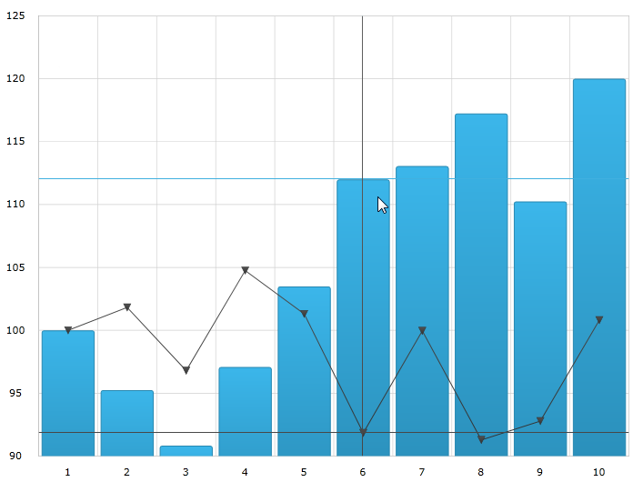

////
|metadata|
{
    "name": "datachart-crosshairlayer",
    "controlName": ["{DataChartName}"],
    "tags": ["Charting","Getting Started","How Do I"],
    "guid": "d20ed73f-d348-478e-bfab-4c4cbc5b3825",
    "buildFlags": ["ANDROID","SL","WPF","WINFORMS"],
    "createdOn": "2014-06-05T19:39:00.631372Z"
}
|metadata|
////

= Crosshair Layer

== Topic Overview

=== Purpose

This topic provides information about the crosshair layer used for hover interactions. It describes the properties of the crosshair layer and provides an implementation example.

=== Required background

The following topics are prerequisites to understanding this topic:

[options="header", cols="a,a"]
|====
|Topic|Purpose

| link:datachart-getting-started-with-datachart.html[Getting Started with Data Chart]
|The _{DataChartName}_ control requires a data object model to be mapped to control's DataContext property. This article will provide a simple data object model but you can create your own and use it with this sample code instead.

| link:datachart-category-series-overview.html[Category Series]
|This topic explains various types of Category Series in the _{DataChartName}_ control.

|====

=== In this topic

This topic contains the following sections:

* <<Overview,Overview>>
* <<Preview,Preview>>
* <<Properties,Properties>>
* <<Example,Example>>
* <<RelatedContent,Related Content>>

[[Overview]]
== Overview

=== Crosshair layer overview

The link:{DataChartLink}.crosshairlayer_members.html[CrosshairLayer] renders as crossing lines intersecting at the actual value of every series that they are configured to target with each series rendering a separate set of lines.

You can configure the link:{DataChartLink}.crosshairlayer_members.html[CrosshairLayer] so that the layer will only display one specific series as by default they target all series on the  _{DataChartName}_  control. To achieve this, set the link:{DataChartLink}.crosshairlayer{ApiProp}targetseries.html[TargetSeries] property. For more information on this property, see the <<Properties,Properties>> section below.

By default, the color of the crosshair lines is a lighter color than the series that it is interacting with. However, this default setting can be overridden so that you can select a color that will be used for the crosshair lines. This is done by setting the link:{DataChartLink}.series{ApiProp}brush.html[Brush] property. For more information on this property see the link:datachart-commonproperties.html[Common Properties] topic.

[[Preview]]

=== Preview

The following image is a preview of the  _{DataChartName}_  control rendered with the link:{DataChartLink}.crosshairlayer_members.html[CrosshairLayer] added.

[[Properties]]
== Properties

=== Crosshair layer properties

The following table summarizes the properties of the crosshair layer.

[options="header", cols="a,a,a"]
|====
|Property Name|Property Type|Description

| pick:[xaml,win-forms=" link:{DataChartLink}.crosshairlayer{ApiProp}horizontallinevisibility.html[HorizontalLineVisibility]"] pick:[android=" link:{DataChartLink}.crosshairlayer{ApiProp}ishorizontallinevisible.html[setIsHorizontalLineVisible]"] 
|
ifdef::xaml,win-forms[] 

Visibility 

endif::xaml,win-forms[] 

ifdef::android[] 

bool 

endif::android[]
|This property specifies if the horizontal line of the crosshair layer should be visible.

| pick:[xaml,win-forms=" link:{DataChartLink}.crosshairlayer{ApiProp}verticallinevisibility.html[VerticalLineVisibility]"] pick:[android=" link:{DataChartLink}.crosshairlayer{ApiProp}isverticallinevisible.html[setIsVerticalLineVisible]"] 
|
ifdef::xaml,win-forms[] 

Visibility 

endif::xaml,win-forms[] 

ifdef::android[] 

bool 

endif::android[]
|This property specifies if the vertical line of the crosshair layer should be visible.

| link:{DataChartLink}.crosshairlayer{ApiProp}targetseries.html[TargetSeries]
|Series
|This property specifies which series should have an enabled crosshair layer. 

It is possible to create a separate crosshair layer for each series and configure them individually.

| link:{DataChartLink}.crosshairlayer{ApiProp}useinterpolation.html[UseInterpolation]
|bool
|This property specifies if the vertical crosshair should cross the series at an interpolated position between data points. Usually the crosshair layer finds the closest point in a series and ensures that the crosshairs meet at that point, however if the points are sparse then you should enable this property.

ifdef::xaml,win-forms[]

|link:{DataChartLink}.crosshairlayer{ApiProp}isaxisannotationenabled.html[IsAxisAnnotationEnabled]
|bool
|This property specifies whether to draw annotations over the axes where the crosshair meets with them.

endif::xaml,win-forms[]

|====

[[Example]]
== Example

=== Example

The following screenshot illustrates how the {DataChartName} control with the link:{DataChartLink}.crosshairlayer{ApiProp}targetseries.html[TargetSeries] property of the link:{DataChartLink}.crosshairlayer_members.html[CrosshairLayer] object looks configured using the following setting:

[options="header", cols="a,a"]
|====
|Property|Value

| link:{DataChartLink}.crosshairlayer{ApiProp}targetseries.html[TargetSeries]
|series1

|====

image::images/Crosshair_Layer_2.png[]

Following is the code used in this implementation

ifdef::wpf,win-universal[]

*In XAML:*

[source,xaml]
----
<ig:CrosshairLayer 
   TargetSeries="{Binding ElementName=series1}"
/>
----

endif::wpf,win-universal[]

ifdef::wpf,win-forms[]

*In C#:*

----
var crosshairLayerSeries = new CrossHairLightLayer();
crosshairLayerSeries.TargetSeries = series1;
chart.Series.Add(crosshairLayerSeries);
----

*In Visual Basic:*

----
Dim crosshairLayerSeries As new CrossHairLightLayer()
crosshairLayerSeries.TargetSeries = series1
chart.Series.Add(crosshairLayerSeries)
----

endif::wpf,win-forms[]

ifdef::xamarin[]

*In C#:*

----
var crosshairLayerSeries = new CrossHairLightLayer();
crosshairLayerSeries.TargetSeries = series1;
chart.Series.Add(crosshairLayerSeries);
----

endif::xamarin[]

[[_Ref345510469]]
== Related Content

[options="header", cols="a,a"]
|====
|Topic|Purpose

| link:datachart-chartannotationlayers.html[Chart Annotation Layers]
|This topic provides conceptual information about the hover interactions available on the link:{DataChartLink}.{DataChartName}.html[{DataChartName}™] control including the different types of hover interaction layers available.

| link:datachart-commonproperties.html[Common Properties]
|This topic provides information about the properties and methods that the hover interaction feature uses for highlighting, hovering and interacting with the tooltip interactions inherited from the link:{DataChartLink}.series_members.html[Series] class.

| link:datachart-categoryitemhighlightlayer.html[Category Item Highlight Layer]
|This topic provides information about the category item highlight layer used for hover interactions. It describes the properties of the category item highlight layer and provides an example of its implementation.

| link:datachart-categorytooltiplayer.html[Category Tooltip Layer]
|This topic provides information about the category tooltip layer used for hover interactions. It describes the properties of the category tooltip layer and provides an example of its implementation.

| link:datachart-itemtooltiplayer.html[Item Tooltip Layer]
|This topic provides information about the item tooltip layer which is used for hover interactions. It describes the properties of the item tooltip layer and also provides an example of its implementation.

|====