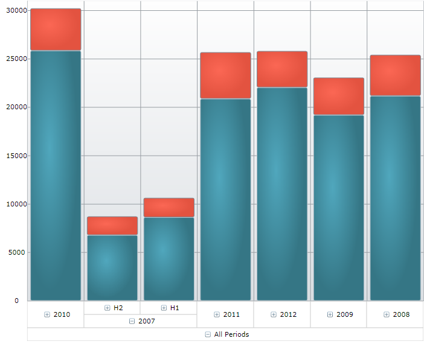

////
|metadata|
{
    "name": "datachart-customizing-series-when-used-with-multi-dimensional-data-(olap-data)-(xamdatachart)",
    "controlName": ["{DataChartName}"],
    "tags": ["Charting","Drilldown","How Do I","Tips and Tricks"],
    "guid": "30e13d6b-4a05-4e17-bee1-446e8f6e6402",
    "buildFlags": ["SL","WPF"],
    "createdOn": "2014-06-05T19:39:00.5743474Z"
}
|metadata|
////

= Customizing Series When Used With Multi-Dimensional Data (OLAP Data)

=== Purpose

This topic explains how to display multiple series types in one chart or to use stacked series when working with multi-dimensional data (OnLine Analytical Processing (OLAP) data) in the  _{DataChartName}_™ control.

=== Required background

The following table lists the topics required as a prerequisite to understanding this topic.

[options="header", cols="a,a"]
|====
|Topic|Purpose

| link:datachart-visualizing-multi-dimensional-data-(olap-data)-({DataChartName}).html[Visualizing Multi-Dimensional Data (OLAP Data) ({DataChartName})]
|This topic explains, with code examples, how to display multi-dimensional data (OLAP) data) in the _{DataChartName}_ control.

| link:datachart-series.html[Chart Series]
|This topic provides an overview of the _{DataChartName}_ control series.

|====

=== In this topic

This topic contains the following sections:

* <<_Ref333571021,Configuring the Series Type When Using OLAP Data>>
* <<_Ref333522856,Displaying Multiple Series Types>>

** <<_Ref327461264,Introduction>>
** <<_Ref327461267,Preview>>
** <<_Ref327461269,Requirements>>
** <<_Ref327461272,Overview>>
** <<_Ref327461274,Steps>>
** <<_Ref333522847,Code>>

* <<_Ref333571052,Using Stacked Series With the OlapXAxis>>

** <<_Ref327461280,Introduction>>
** <<_Ref327461286,Preview>>
** <<_Ref333571088,Requirements>>
** <<_Ref327461291,Steps>>
** <<_Ref333571095,Code>>

* <<_Ref327461318,Related Content>>

[[_Ref327461259]]

[[_Ref333571021]]
== Configuring the Series Type When Using OLAP Data

[[_Ref333571025]]

=== Configuring the series type when using OLAP data summary

When you use the  _{DataChartName}_   control to display data, you normally have a choice of the axes and series that you want rendered. This gives you full control over the series to be displayed. With the OlapXAxis on the other hand, you are limited to using a numeric y-axis and, by default, you can choose from a pre-defined set of series that can be displayed. The series type is managed by the link:{ApiPlatform}controls.charts.olap{ApiProp}{DataChartNamespace}.olapxaxis{ApiProp}defaultseries.html[DefaultSeries] property which specifies what is being generated for all rows or columns of the current slice of the data.

To display single series, set the link:{ApiPlatform}controls.charts.olap{ApiProp}{DataChartNamespace}.olapxaxis{ApiProp}defaultseries.html[DefaultSeries] property to any of the pre-defined series types. If the property is not set, column series are used. Because the OlapXAxis is an x-axis, you cannot use any kind of vertical series, e.g. Bar series. However, there are some other means to use series different from the predefined ones. If you want to display multiple types of series or if you want to use stacked series (which are not included in the link:{ApiPlatform}controls.charts.olap{ApiProp}{DataChartNamespace}.olapxaxisdefaultseries.html[OlapXAxisDefaultSeries] enumeration), you must use the link:{ApiPlatform}controls.charts.olap{ApiProp}{DataChartNamespace}.olapaxis{ApiProp}seriesinitializing_ev.html[SeriesInitializing] and link:{ApiPlatform}controls.charts.olap{ApiProp}{DataChartNamespace}.olapaxis{ApiProp}seriescreating_ev.html[SeriesCreating] events.

[[_Ref333522856]]
== Displaying Multiple Series Types

[[_Ref327461264]]

=== Introduction

This procedure takes you step-by-step toward displaying Column, Line, and Point series when using multi-dimensional data.

[[_Ref327461267]]

=== Preview

The following screenshot is a preview of the final result.

image::images/xamDataChart_Customizing_Series_When_Used_With_Multi-Dimensional_Data_01.png[]

[[_Ref327461269]]

=== Requirements

To complete the procedure, you need the following:

* A {PlatformName} {PlatformIDE} application project with a  _{DataChartName}_   configured with an OlapXAxis as described in the link:datachart-visualizing-multi-dimensional-data-(olap-data)-({DataChartName}).html[Visualizing Multi-Dimensional Data (OLAP Data) ({DataChartName})] topic.

[[_Ref327461272]]

=== Overview

The following is a conceptual overview of the process:

*1. Subscribing to the required events*

*2. Adding the required helper variables*

*3.Replacing the default series using a series-creating event*

[[_Ref327461274]]

=== Steps

=== 1. Subscribe to the required events.

*Subscribe to the*  link:{ApiPlatform}controls.charts.olap{ApiProp}{DataChartNamespace}.olapaxis{ApiProp}seriescreating_ev.html[SeriesCreating]  *and*  link:{ApiPlatform}controls.charts.olap{ApiProp}{DataChartNamespace}.olapaxis{ApiProp}seriesinitializing_ev.html[SeriesInitializing]  *events.*

The `SeriesCreating` event occurs every time before a generated series is added to the data chart. The event handler for this event is where you replace the default series with series of your choosing. The `SeriesInitializing` event is raised before creation of all series has begun. This is for example when a user expands an axis label, or when a new hierarchy is added to the data source. After that for each series the `SeriesCreating` event is raised multiple times depending on the number of required series.

=== 2. Add the required helper variables.

*Add an integer variable for keeping the current count of series.*

In the example in this procedure, an integer variable is used to hold the count of the series that are currently created. This is needed in order to be able to identify different occurrences of the `SeriesCreating` event. When the `SeriesInitializing` event is raised, set this variable to zero and, on `SeriesCreating`, increment it. Based on the value of this field we create different types of series.

This approach is used for simplicity, but you can implement some more sophisticated logic to choose what types of series should be used, for example based on to what measures used in the data source the series correspond.

=== 3. Replacing the default series using a series-creating event.

To display the desired type of series,  *you need to create a new series and set it as the value of the*  link:{ApiPlatform}controls.charts.olap{ApiProp}{ApiVersion}{DataChartNamespace}.seriescreatingeventargs{ApiProp}series.html[Series]  *property of the*  link:{ApiPlatform}controls.charts.olap{ApiProp}{DataChartNamespace}.seriescreatingeventargs_members.html[SeriesCreatingEventArgs]. The Series to be used are provided as arguments to the `SeriesCreating` event. These arguments also contain an link:{ApiPlatform}controls.charts.olap{ApiProp}{DataChartNamespace}.olapseriesinfo_members.html[OlapSeriesInfo] object with all the information needed to create the new series.

To create a new series and assign the required properties:

*1. Set the*   pick:[wpf,win-universal=" link:{ApiPlatform}controls.charts.olap{ApiProp}{DataChartNamespace}.olapseriesinfo{ApiProp}itemssource.html[ItemsSource]"]  pick:[win-forms=" link:{DataChartLink}.series{ApiProp}datasource.html[DataSource]"]   *of the series to the*  `ItemsSource` provided by the `SeriesInfo` * .*

*2. Set the*  link:{DataChartLink}.anchoredcategoryseries{ApiProp}valuememberpath.html[ValueMemberPath]  * property.*

The data source is a list of link:{ApiPlatform}controls.charts.olap{ApiProp}{DataChartNamespace}.olapaxiscell_members.html[OlapAxisCell] objects. The value that you have to bind to is to be found in the link:{ApiPlatform}olap~infragistics.olap.data.base.cell{ApiProp}value.html[Value] property of the link:{ApiPlatform}controls.charts.olap{ApiProp}{DataChartNamespace}.olapaxiscell{ApiProp}cell.html[Cell] associated with the `OlapAxisCell` object.

This means that the `ValueMemberPath` has to be `"``Cell.Value``"`.

*3. Set the*  link:{ApiPlatform}controls.charts.olap{ApiProp}{DataChartNamespace}.olapseriesinfo{ApiProp}name.html[Name]  * property to the name supplied with the series info.*

*4.*   *Set the*  link:{ApiPlatform}controls.charts.olap{ApiProp}{DataChartNamespace}.olapseriesinfo{ApiProp}title.html[Title]  * to the one from the series info.*

[[_Ref333522847]]

=== Code

Following is the complete code of the procedure.

ifdef::wpf,win-universal[]

*In XAML:*

[source,xaml]
----
<UserControl    
…
      xmlns:ig="http://schemas.infragistics.com/xaml"
      xmlns:models="clr-namespace:Infragistics.Samples.Data.Models"
      xmlns:olap="http://schemas.infragistics.com/olap">
<UserControl.Resources>
        <ResourceDictionary>
            <models:SalesDataSample x:Key="DataSample"/>
            <olap:FlatDataSource
                x:Key="DataSource"
                Columns="[Date].[Date]"
                Measures="AmountOfSale, NumberOfUnits"
                MeasureListLocation="Rows"
                ItemsSource="{StaticResource DataSample}" />
        </ResourceDictionary>
    </UserControl.Resources>
    <Grid x:Name="LayoutRoot" Background="White">
        <Grid.ColumnDefinitions>
            <ColumnDefinition />
            <ColumnDefinition Width="Auto"/>
        </Grid.ColumnDefinitions>
        <ig:{DataChartName} x:Name="DataChart" HorizontalZoomable="True" VerticalZoomable="True" Width="700" >
            <ig:{DataChartName}.Axes>
                <ig:NumericYAxis x:Name="YAxis" MinimumValue="0"/>
                <ig:OlapXAxis
                    YAxis="{Binding ElementName=YAxis}"
                    DataSource="{StaticResource DataSource}"
                    OlapAxisSource="Columns"
                    DefaultSeries="ColumnSeries"
                    SeriesInitializing="OlapXAxis_SeriesInitializing"
                    SeriesCreating="OlapXAxis_SeriesCreating"/>
            </ig:{DataChartName}.Axes>
        </ig:{DataChartName}>
    </Grid>
</UserControl>
----

endif::wpf,win-universal[]

ifdef::wpf[]

*In C#:*

[source,csharp]
----
…
public partial class MainPage : UserControl
    {
        int seriesIndex = 0;
        public MainPage()
        {
            InitializeComponent();
        }
        private void OlapXAxis_SeriesCreating(object sender, Infragistics.Controls.Charts.SeriesCreatingEventArgs e)
        {
            switch (seriesIndex)
            {
                case 0:
                    e.Series = new ColumnSeries()
                    {
                        ItemsSource = e.SeriesInfo.ItemsSource,
                        ValueMemberPath = "Cell.Value",
                        Title = e.SeriesInfo.Title,
                        Name = e.SeriesInfo.Name
                    };
                    break;
                case 1:
                    e.Series = new LineSeries()
                    {
                        ItemsSource = e.SeriesInfo.ItemsSource,
                        ValueMemberPath = "Cell.Value",
                        Title = e.SeriesInfo.Title,
                        Name = e.SeriesInfo.Name
                    };
                    break;
                case 2:
                    e.Series = new PointSeries()
                    {
                        ItemsSource = e.SeriesInfo.ItemsSource,
                        ValueMemberPath = "Cell.Value",
                        Title = e.SeriesInfo.Title,
                        Name = e.SeriesInfo.Name
                    };
                    break;
            }
            seriesIndex++;
        }
        private void OlapXAxis_SeriesInitializing(object sender, Infragistics.Controls.Charts.SeriesInitializingEventArgs e)
        {
            seriesIndex = 0;
        }
----

endif::wpf[]

ifdef::win-forms[]

*In C#:*

[source,csharp]
----
…
public partial class MainPage : UserControl
    {
        int seriesIndex = 0;
        public MainPage()
        {
            InitializeComponent();
        }
        private void OlapXAxis_SeriesCreating(object sender, Infragistics.Controls.Charts.SeriesCreatingEventArgs e)
        {
            switch (seriesIndex)
            {
                case 0:
                    e.Series = new ColumnSeries()
                    {
                        ItemsSource = e.SeriesInfo.ItemsSource,
                        ValueMemberPath = "Cell.Value",
                        Title = e.SeriesInfo.Title,
                        Name = e.SeriesInfo.Name
                    };
                    break;
                case 1:
                    e.Series = new LineSeries()
                    {
                        ItemsSource = e.SeriesInfo.ItemsSource,
                        ValueMemberPath = "Cell.Value",
                        Title = e.SeriesInfo.Title,
                        Name = e.SeriesInfo.Name
                    };
                    break;
                case 2:
                    e.Series = new PointSeries()
                    {
                        ItemsSource = e.SeriesInfo.ItemsSource,
                        ValueMemberPath = "Cell.Value",
                        Title = e.SeriesInfo.Title,
                        Name = e.SeriesInfo.Name
                    };
                    break;
            }
            seriesIndex++;
        }
        private void OlapXAxis_SeriesInitializing(object sender, Infragistics.Controls.Charts.SeriesInitializingEventArgs e)
        {
            seriesIndex = 0;
        }
----

endif::win-forms[]

ifdef::xamarin[]

*In C#:*

[source,csharp]
----
…
public partial class MainPage : UserControl
    {
        int seriesIndex = 0;
        public MainPage()
        {
            InitializeComponent();
        }
        private void OlapXAxis_SeriesCreating(object sender, Infragistics.Controls.Charts.SeriesCreatingEventArgs e)
        {
            switch (seriesIndex)
            {
                case 0:
                    e.Series = new ColumnSeries()
                    {
                        ItemsSource = e.SeriesInfo.ItemsSource,
                        ValueMemberPath = "Cell.Value",
                        Title = e.SeriesInfo.Title,
                        Name = e.SeriesInfo.Name
                    };
                    break;
                case 1:
                    e.Series = new LineSeries()
                    {
                        ItemsSource = e.SeriesInfo.ItemsSource,
                        ValueMemberPath = "Cell.Value",
                        Title = e.SeriesInfo.Title,
                        Name = e.SeriesInfo.Name
                    };
                    break;
                case 2:
                    e.Series = new PointSeries()
                    {
                        ItemsSource = e.SeriesInfo.ItemsSource,
                        ValueMemberPath = "Cell.Value",
                        Title = e.SeriesInfo.Title,
                        Name = e.SeriesInfo.Name
                    };
                    break;
            }
            seriesIndex++;
        }
        private void OlapXAxis_SeriesInitializing(object sender, Infragistics.Controls.Charts.SeriesInitializingEventArgs e)
        {
            seriesIndex = 0;
        }
----

endif::xamarin[]

ifdef::wpf[]

*In Visual Basic:*

[source,vb]
----
Imports {DataChartNamespace}
Partial Public Class MainPage
    Inherits UserControl
    Private seriesIndex As Integer
    Public Sub New()
        InitializeComponent()
    End Sub
    Private Sub OlapXAxis_SeriesInitializing(sender As System.Object, e As SeriesInitializingEventArgs)
        seriesIndex = 0
    End Sub
    Private Sub OlapXAxis_SeriesCreating(sender As System.Object, e As SeriesCreatingEventArgs)
        Select Case seriesIndex
            Case 0
                e.Series = New ColumnSeries() With { _
                 .ItemsSource = e.SeriesInfo.ItemsSource, _
                 .ValueMemberPath = "Cell.Value", _
                 .Title = e.SeriesInfo.Title, _
                 .Name = e.SeriesInfo.Name _
                }
                Exit Select
            Case 1
                e.Series = New LineSeries() With { _
                 .ItemsSource = e.SeriesInfo.ItemsSource, _
                 .ValueMemberPath = "Cell.Value", _
                 .Title = e.SeriesInfo.Title, _
                 .Name = e.SeriesInfo.Name _
                }
                Exit Select
            Case 2
                e.Series = New PointSeries() With { _
                 .ItemsSource = e.SeriesInfo.ItemsSource, _
                 .ValueMemberPath = "Cell.Value", _
                 .Title = e.SeriesInfo.Title, _
                 .Name = e.SeriesInfo.Name _
                }
                Exit Select
        End Select        
        seriesIndex += 1
    End Sub
End Class
----

endif::wpf[]

ifdef::win-forms[]

*In Visual Basic:*

[source,vb]
----
Imports {DataChartNamespace}
Partial Public Class MainPage
    Inherits UserControl
    Private seriesIndex As Integer
    Public Sub New()
        InitializeComponent()
    End Sub
    Private Sub OlapXAxis_SeriesInitializing(sender As System.Object, e As SeriesInitializingEventArgs)
        seriesIndex = 0
    End Sub
    Private Sub OlapXAxis_SeriesCreating(sender As System.Object, e As SeriesCreatingEventArgs)
        Select Case seriesIndex
            Case 0
                e.Series = New ColumnSeries() With { _
                 .ItemsSource = e.SeriesInfo.ItemsSource, _
                 .ValueMemberPath = "Cell.Value", _
                 .Title = e.SeriesInfo.Title, _
                 .Name = e.SeriesInfo.Name _
                }
                Exit Select
            Case 1
                e.Series = New LineSeries() With { _
                 .ItemsSource = e.SeriesInfo.ItemsSource, _
                 .ValueMemberPath = "Cell.Value", _
                 .Title = e.SeriesInfo.Title, _
                 .Name = e.SeriesInfo.Name _
                }
                Exit Select
            Case 2
                e.Series = New PointSeries() With { _
                 .ItemsSource = e.SeriesInfo.ItemsSource, _
                 .ValueMemberPath = "Cell.Value", _
                 .Title = e.SeriesInfo.Title, _
                 .Name = e.SeriesInfo.Name _
                }
                Exit Select
        End Select        
        seriesIndex += 1
    End Sub
End Class
----

endif::win-forms[]

ifdef::xamarin[]

*In Visual Basic:*

[source,vb]
----
Imports {DataChartNamespace}
Partial Public Class MainPage
    Inherits UserControl
    Private seriesIndex As Integer
    Public Sub New()
        InitializeComponent()
    End Sub
    Private Sub OlapXAxis_SeriesInitializing(sender As System.Object, e As SeriesInitializingEventArgs)
        seriesIndex = 0
    End Sub
    Private Sub OlapXAxis_SeriesCreating(sender As System.Object, e As SeriesCreatingEventArgs)
        Select Case seriesIndex
            Case 0
                e.Series = New ColumnSeries() With { _
                 .ItemsSource = e.SeriesInfo.ItemsSource, _
                 .ValueMemberPath = "Cell.Value", _
                 .Title = e.SeriesInfo.Title, _
                 .Name = e.SeriesInfo.Name _
                }
                Exit Select
            Case 1
                e.Series = New LineSeries() With { _
                 .ItemsSource = e.SeriesInfo.ItemsSource, _
                 .ValueMemberPath = "Cell.Value", _
                 .Title = e.SeriesInfo.Title, _
                 .Name = e.SeriesInfo.Name _
                }
                Exit Select
            Case 2
                e.Series = New PointSeries() With { _
                 .ItemsSource = e.SeriesInfo.ItemsSource, _
                 .ValueMemberPath = "Cell.Value", _
                 .Title = e.SeriesInfo.Title, _
                 .Name = e.SeriesInfo.Name _
                }
                Exit Select
        End Select        
        seriesIndex += 1
    End Sub
End Class
----

endif::xamarin[]

[[_Ref333571052]]
== Using Stacked Series With the OlapXAxis

[[_Ref327461280]]

=== Introduction

When using link:datachart-category-series-overview.html[stacked series], you need a data source that contains objects with all the values that you want to display as stack pieces. However the data sources provided for each series only contain the values for one series. Therefore, you have to create a custom class to save the values needed to display the series. This way you add one stacked series to the chart and populate their `Series` collection with multiple link:{DataChartLink}.stackedfragmentseries_properties.html[StackedFragmentedSeries] that have a common data source.

[[_Ref327461286]]

=== Preview

The following screenshot is a preview of the final result.

[[_Ref333571088]]

=== Requirements

To complete the procedure, you need the following:

* A {PlatformName} {PlatformIDE} application project with a  _{DataChartName}_   configured with an OlapXAxis as described in the link:datachart-visualizing-multi-dimensional-data-(olap-data)-({DataChartName}).html[Visualizing Multi-Dimensional Data (OLAP Data) ({DataChartName})] topic.
* Understanding of the Stacked Series type of the  _{DataChartName}_  . For information, refer to the link:datachart-category-stacked-column-series.html[Stacked Column Series] topic.

[[_Ref327461288]]

=== Overview

This topic takes you step-by-step toward replacing the default series used with an OlapXAxis with StackedColumnSeries. The following is a conceptual overview of the process: *1. Subscribing to the required events2.*   *Adding the required helper variables3. Adding the helper class for storing*   *the series’ data*   *4.*   *Replacing the default series using the events* 

[[_Ref327461291]]

=== Steps

=== 1. Subscribe to the required events.

*Subscribe to the*  link:{ApiPlatform}controls.charts.olap{ApiProp}{DataChartNamespace}.olapaxis{ApiProp}seriescreating_ev.html[SeriesCreating]  *and*  link:{ApiPlatform}controls.charts.olap{ApiProp}{DataChartNamespace}.olapaxis{ApiProp}seriesinitializing_ev.html[SeriesInitializing]  *events.*

The `SeriesCreating` event occurs every time before a generated series is added to the data chart. The `SeriesInitializing` event is raised before creation of all series has begun. This is the case, for instance, when a user expands an axis label, or when a new hierarchy is added to the data source. After that, for each series, the `SeriesCreating` event is raised as many times as the number of required series.

=== 2. Add the required helper variables.

*1. Add an integer variable for keeping the current count of series.*

In the example in this procedure, an integer variable is used to store the current count of the created link:{DataChartLink}.stackedfragmentseries_properties.html[StackedFragmentedSeries]. This is needed for the sake of identifying the different occurrences of the `SeriesCreating` event.  *When the*  `SeriesInitializing`  *event is raised,*   *set this variable to*   _0_    *and, on*  `SeriesCreating` *, increment it* .

*2. Add a*   _StackedColumnSeries_    * variable to use in the chart.*

In addition to the integer field, you must have a link:{DataChartLink}.stackedcolumnseries_members.html[StackedColumnSeries] field to store a reference to the stacked column series that are to be used in the data chart. If you want, you can replace this with any kind of stacked series that derives from link:{DataChartLink}.horizontalstackedseriesbase_members.html[HorizontalStackedSeriesBase], the rest of the code will be practically the same.

=== 3. Add the helper class for storing the series’ data.

In order to be able to create the common data source for the stacked series,  *add a class that contains a list of double values* . The purpose of this list is to store the settings of each of the series’ data sources. When all the data sources of the series are added to the list, it is used as the  pick:[wpf,win-universal=" link:{DataChartLink}.series{ApiProp}itemssource.html[ItemsSource]"]  pick:[win-forms=" link:{DataChartLink}.series{ApiProp}datasource.html[DataSource]"]  of the link:{DataChartLink}.stackedcolumnseries_members.html[StackedColumnSeries].

ifdef::wpf[]

*In C#:*

[source,csharp]
----
private class StackedSeriesData
{
    public StackedSeriesData()
    {
        Data = new List<double>();
    }
    public List<double> Data { get; set; }
}
----

endif::wpf[]

ifdef::win-forms[]

*In C#:*

[source,csharp]
----
private class StackedSeriesData
{
    public StackedSeriesData()
    {
        Data = new List<double>();
    }
    public List<double> Data { get; set; }
}
----

endif::win-forms[]

ifdef::xamarin[]

*In C#:*

[source,csharp]
----
private class StackedSeriesData
{
    public StackedSeriesData()
    {
        Data = new List<double>();
    }
    public List<double> Data { get; set; }
}
----

endif::xamarin[]

ifdef::wpf[]

*In Visual Basic:*

[source,vb]
----
 Private Class StackedSeriesData
        Public Property Data As List(Of Double)
        Public Sub New()
            Data = New List(Of Double)
        End Sub
    End Class
----

endif::wpf[]

ifdef::win-forms[]

*In Visual Basic:*

[source,vb]
----
 Private Class StackedSeriesData
        Public Property Data As List(Of Double)
        Public Sub New()
            Data = New List(Of Double)
        End Sub
    End Class
----

endif::win-forms[]

ifdef::xamarin[]

*In Visual Basic:*

[source,vb]
----
 Private Class StackedSeriesData
        Public Property Data As List(Of Double)
        Public Sub New()
            Data = New List(Of Double)
        End Sub
    End Class
----

endif::xamarin[]

=== 4. Replace the default series using the events.

*1. In the*  `SeriesInitializing`  *event handler, initialize the series and set the counter to*   _0_   * .*

This means to assign the series variable added in step 2 a new instance of the `StackedColumnSeries`. This way, every time a `SeriesCreating` is raised, you can replace the automatically generated series with the stacked ones.

ifdef::wpf[]

*In C#:*

[source,csharp]
----
private void OlapXAxis_SeriesInitializing(object sender, Infragistics.Controls.Charts.SeriesInitializingEventArgs e)
{
    series = new StackedColumnSeries();
    seriesIndex = 0;
}
----

endif::wpf[]

ifdef::win-forms[]

*In C#:*

[source,csharp]
----
private void OlapXAxis_SeriesInitializing(object sender, Infragistics.Controls.Charts.SeriesInitializingEventArgs e)
{
    series = new StackedColumnSeries();
    seriesIndex = 0;
}
----

endif::win-forms[]

ifdef::xamarin[]

*In C#:*

[source,csharp]
----
private void OlapXAxis_SeriesInitializing(object sender, Infragistics.Controls.Charts.SeriesInitializingEventArgs e)
{
    series = new StackedColumnSeries();
    seriesIndex = 0;
}
----

endif::xamarin[]

ifdef::wpf[]

*In Visual Basic:*

[source,vb]
----
Private Sub OlapXAxis_SeriesInitializing(sender As Object, e As Infragistics.Controls.Charts.SeriesInitializingEventArgs)
      series = New StackedColumnSeries()
      seriesIndex = 0
End Sub
----

endif::wpf[]

ifdef::win-forms[]

*In Visual Basic:*

[source,vb]
----
Private Sub OlapXAxis_SeriesInitializing(sender As Object, e As Infragistics.Controls.Charts.SeriesInitializingEventArgs)
      series = New StackedColumnSeries()
      seriesIndex = 0
End Sub
----

endif::win-forms[]

ifdef::xamarin[]

*In Visual Basic:*

[source,vb]
----
Private Sub OlapXAxis_SeriesInitializing(sender As Object, e As Infragistics.Controls.Charts.SeriesInitializingEventArgs)
      series = New StackedColumnSeries()
      seriesIndex = 0
End Sub
----

endif::xamarin[]

*2. Create the common data source when the first time*  `SeriesCreating`  *is raised.*

In the `SeriesCreating` event handler, check if the series counter is  _0_  . If so, this means that this is the first time the event is raised for the current state of the data source and you must to create the new data source that will be common for all stacked fragmented series.

ifdef::wpf[]

*In C#:*

[source,csharp]
----
private void OlapXAxis_SeriesCreating(object sender, Infragistics.Controls.Charts.SeriesCreatingEventArgs e)
{
    if (seriesIndex == 0)
    {
        series.ItemsSource = Enumerable.Range(0, e.SeriesInfo.ItemsSource.Count).Select(i => new StackedSeriesData()).ToList();
    }
…
----

endif::wpf[]

ifdef::win-forms[]

*In C#:*

[source,csharp]
----
private void OlapXAxis_SeriesCreating(object sender, Infragistics.Controls.Charts.SeriesCreatingEventArgs e)
{
    if (seriesIndex == 0)
    {
        series.ItemsSource = Enumerable.Range(0, e.SeriesInfo.ItemsSource.Count).Select(i => new StackedSeriesData()).ToList();
    }
…
----

endif::win-forms[]

ifdef::xamarin[]

*In C#:*

[source,csharp]
----
private void OlapXAxis_SeriesCreating(object sender, Infragistics.Controls.Charts.SeriesCreatingEventArgs e)
{
    if (seriesIndex == 0)
    {
        series.ItemsSource = Enumerable.Range(0, e.SeriesInfo.ItemsSource.Count).Select(i => new StackedSeriesData()).ToList();
    }
…
----

endif::xamarin[]

ifdef::wpf[]

*In Visual Basic:*

[source,vb]
----
Private Sub OlapXAxis_SeriesCreating(sender As System.Object, e As SeriesCreatingEventArgs)
    If seriesIndex = 0 Then
        series.ItemsSource = Enumerable.Range(0, e.SeriesInfo.ItemsSource.Count).[Select](Function(i) New StackedSeriesData()).ToList()
    End If
----

endif::wpf[]

ifdef::win-forms[]

*In Visual Basic:*

[source,vb]
----
Private Sub OlapXAxis_SeriesCreating(sender As System.Object, e As SeriesCreatingEventArgs)
    If seriesIndex = 0 Then
        series.ItemsSource = Enumerable.Range(0, e.SeriesInfo.ItemsSource.Count).[Select](Function(i) New StackedSeriesData()).ToList()
    End If
----

endif::win-forms[]

ifdef::xamarin[]

*In Visual Basic:*

[source,vb]
----
Private Sub OlapXAxis_SeriesCreating(sender As System.Object, e As SeriesCreatingEventArgs)
    If seriesIndex = 0 Then
        series.ItemsSource = Enumerable.Range(0, e.SeriesInfo.ItemsSource.Count).[Select](Function(i) New StackedSeriesData()).ToList()
    End If
----

endif::xamarin[]

*3. Populate the common data source and add*  `StackedFragmentedSeries`  *to the stacked series.*

After you have populated the `StackedColumnSeries`’  pick:[wpf,win-universal=" link:{DataChartLink}.series{ApiProp}itemssource.html[ItemsSource]"]  pick:[win-forms=" link:{DataChartLink}.series{ApiProp}datasource.html[DataSource]"]  the first time when SeriesCreating is raised, you must add the items supplied with the current `SeriesInfo.ItemsSource` to the common data source.

ifdef::wpf[]

*In C#:*

[source,csharp]
----
…
for (int i = 0; i < e.SeriesInfo.ItemsSource.Count; i++)
{
    ((List<StackedSeriesData>)series.ItemsSource)[i].Data.Add(Convert.ToDouble(e.SeriesInfo.ItemsSource[i].Cell.Value));
}
…
----

endif::wpf[]

ifdef::win-forms[]

*In C#:*

[source,csharp]
----
…
for (int i = 0; i < e.SeriesInfo.ItemsSource.Count; i++)
{
    ((List<StackedSeriesData>)series.ItemsSource)[i].Data.Add(Convert.ToDouble(e.SeriesInfo.ItemsSource[i].Cell.Value));
}
…
----

endif::win-forms[]

ifdef::xamarin[]

*In C#:*

[source,csharp]
----
…
for (int i = 0; i < e.SeriesInfo.ItemsSource.Count; i++)
{
    ((List<StackedSeriesData>)series.ItemsSource)[i].Data.Add(Convert.ToDouble(e.SeriesInfo.ItemsSource[i].Cell.Value));
}
…
----

endif::xamarin[]

ifdef::wpf[]

*In Visual Basic:*

[source,vb]
----
…
For i = 0 To e.SeriesInfo.ItemsSource.Count - 1
    DirectCast(series.ItemsSource, List(Of StackedSeriesData))(i).Data.Add(Convert.ToDouble(e.SeriesInfo.ItemsSource(i).Cell.Value))
Next
…
----

endif::wpf[]

ifdef::win-forms[]

*In Visual Basic:*

[source,vb]
----
…
For i = 0 To e.SeriesInfo.ItemsSource.Count - 1
    DirectCast(series.ItemsSource, List(Of StackedSeriesData))(i).Data.Add(Convert.ToDouble(e.SeriesInfo.ItemsSource(i).Cell.Value))
Next
…
----

endif::win-forms[]

ifdef::xamarin[]

*In Visual Basic:*

[source,vb]
----
…
For i = 0 To e.SeriesInfo.ItemsSource.Count - 1
    DirectCast(series.ItemsSource, List(Of StackedSeriesData))(i).Data.Add(Convert.ToDouble(e.SeriesInfo.ItemsSource(i).Cell.Value))
Next
…
----

endif::xamarin[]

*4. Create and configure the*  link:{DataChartLink}.stackedfragmentseries_properties.html[StackedFragmentedSeries].

A.  *Create the*  link:{DataChartLink}.stackedfragmentseries_properties.html[StackedFragmentedSeries]  *and add them to the*  `StackedColumnSeries`* .*

B.  *Increment the series counter.*

C.  *Set the*  `StackedColumnSeries` as the value of the link:{ApiPlatform}controls.charts.olap{ApiProp}{ApiVersion}{DataChartNamespace}.seriescreatingeventargs{ApiProp}series.html[Series] property of the event arguments.

ifdef::wpf[]

*In C#:*

[source,csharp]
----
…
    series.Series.Add(new StackedFragmentSeries() { ValueMemberPath = string.Format("Data[{0}]", seriesIndex), Title = e.SeriesInfo.Title });
    e.Series = series;
    seriesIndex++;
}
----

endif::wpf[]

ifdef::win-forms[]

*In C#:*

[source,csharp]
----
…
    series.Series.Add(new StackedFragmentSeries() { ValueMemberPath = string.Format("Data[{0}]", seriesIndex), Title = e.SeriesInfo.Title });
    e.Series = series;
    seriesIndex++;
}
----

endif::win-forms[]

ifdef::xamarin[]

*In C#:*

[source,csharp]
----
…
    series.Series.Add(new StackedFragmentSeries() { ValueMemberPath = string.Format("Data[{0}]", seriesIndex), Title = e.SeriesInfo.Title });
    e.Series = series;
    seriesIndex++;
}
----

endif::xamarin[]

ifdef::wpf[]

*In Visual Basic:*

[source,vb]
----
…
    series.Series.Add(New StackedFragmentSeries() With { _
     .ValueMemberPath = String.Format("Data[{0}]", seriesIndex), _
    .Title = e.SeriesInfo.Title
    })
    e.Series = series
    seriesIndex = seriesIndex + 1
End Sub
----

endif::wpf[]

ifdef::win-forms[]

*In Visual Basic:*

[source,vb]
----
…
    series.Series.Add(New StackedFragmentSeries() With { _
     .ValueMemberPath = String.Format("Data[{0}]", seriesIndex), _
    .Title = e.SeriesInfo.Title
    })
    e.Series = series
    seriesIndex = seriesIndex + 1
End Sub
----

endif::win-forms[]

ifdef::xamarin[]

*In Visual Basic:*

[source,vb]
----
…
    series.Series.Add(New StackedFragmentSeries() With { _
     .ValueMemberPath = String.Format("Data[{0}]", seriesIndex), _
    .Title = e.SeriesInfo.Title
    })
    e.Series = series
    seriesIndex = seriesIndex + 1
End Sub
----

endif::xamarin[]

.Note:
[NOTE]
====
Steps 4.3 and 4.4 are performed every time the `SeriesCreating` event is raised.
====

[[_Ref333571095]]

=== Code

Following is the full C# and VB.NET code of the procedure. For the XAML code, use the code snippet listed in the <<_Ref333522847,Code>> block of <<_Ref333522856,Displaying Multiple Series Types>>.

ifdef::wpf[]

*In C#:*

[source,csharp]
----
…    
public partial class MainPage : UserControl
    {
        int seriesIndex = 0;
        StackedColumnSeries series;
        public MainPage()
        {
            InitializeComponent();
        }
        private class StackedSeriesData
        {
            public StackedSeriesData()
            {
                Data = new List<double>();
            }
            public List<double> Data { get; set; }
        }
        private void OlapXAxis_SeriesCreating(object sender, Infragistics.Controls.Charts.SeriesCreatingEventArgs e)
        {
            if (seriesIndex == 0)
            {
                series.ItemsSource = Enumerable.Range(0, e.SeriesInfo.ItemsSource.Count).Select(i => new StackedSeriesData()).ToList();
            }
            for (int i = 0; i < e.SeriesInfo.ItemsSource.Count; i++)
            {
                ((List<StackedSeriesData>)series.ItemsSource)[i].Data.Add(Convert.ToDouble(e.SeriesInfo.ItemsSource[i].Cell.Value));
            }
            series.Series.Add(new StackedFragmentSeries() { ValueMemberPath = string.Format("Data[{0}]", seriesIndex), Title = e.SeriesInfo.Title });
            e.Series = series;
            seriesIndex++;
        }
        private void OlapXAxis_SeriesInitializing(object sender, Infragistics.Controls.Charts.SeriesInitializingEventArgs e)
        {
            series = new StackedColumnSeries();
            seriesIndex = 0;
        }
}
----

endif::wpf[]

ifdef::win-forms[]

*In C#:*

[source,csharp]
----
…    
public partial class MainPage : UserControl
    {
        int seriesIndex = 0;
        StackedColumnSeries series;
        public MainPage()
        {
            InitializeComponent();
        }
        private class StackedSeriesData
        {
            public StackedSeriesData()
            {
                Data = new List<double>();
            }
            public List<double> Data { get; set; }
        }
        private void OlapXAxis_SeriesCreating(object sender, Infragistics.Controls.Charts.SeriesCreatingEventArgs e)
        {
            if (seriesIndex == 0)
            {
                series.ItemsSource = Enumerable.Range(0, e.SeriesInfo.ItemsSource.Count).Select(i => new StackedSeriesData()).ToList();
            }
            for (int i = 0; i < e.SeriesInfo.ItemsSource.Count; i++)
            {
                ((List<StackedSeriesData>)series.ItemsSource)[i].Data.Add(Convert.ToDouble(e.SeriesInfo.ItemsSource[i].Cell.Value));
            }
            series.Series.Add(new StackedFragmentSeries() { ValueMemberPath = string.Format("Data[{0}]", seriesIndex), Title = e.SeriesInfo.Title });
            e.Series = series;
            seriesIndex++;
        }
        private void OlapXAxis_SeriesInitializing(object sender, Infragistics.Controls.Charts.SeriesInitializingEventArgs e)
        {
            series = new StackedColumnSeries();
            seriesIndex = 0;
        }
}
----

endif::win-forms[]

ifdef::xamarin[]

*In C#:*

[source,csharp]
----
…    
public partial class MainPage : UserControl
    {
        int seriesIndex = 0;
        StackedColumnSeries series;
        public MainPage()
        {
            InitializeComponent();
        }
        private class StackedSeriesData
        {
            public StackedSeriesData()
            {
                Data = new List<double>();
            }
            public List<double> Data { get; set; }
        }
        private void OlapXAxis_SeriesCreating(object sender, Infragistics.Controls.Charts.SeriesCreatingEventArgs e)
        {
            if (seriesIndex == 0)
            {
                series.ItemsSource = Enumerable.Range(0, e.SeriesInfo.ItemsSource.Count).Select(i => new StackedSeriesData()).ToList();
            }
            for (int i = 0; i < e.SeriesInfo.ItemsSource.Count; i++)
            {
                ((List<StackedSeriesData>)series.ItemsSource)[i].Data.Add(Convert.ToDouble(e.SeriesInfo.ItemsSource[i].Cell.Value));
            }
            series.Series.Add(new StackedFragmentSeries() { ValueMemberPath = string.Format("Data[{0}]", seriesIndex), Title = e.SeriesInfo.Title });
            e.Series = series;
            seriesIndex++;
        }
        private void OlapXAxis_SeriesInitializing(object sender, Infragistics.Controls.Charts.SeriesInitializingEventArgs e)
        {
            series = new StackedColumnSeries();
            seriesIndex = 0;
        }
}
----

endif::xamarin[]

ifdef::wpf[]

*In Visual Basic:*

[source,vb]
----
Imports {DataChartNamespace}
Partial Public Class MainPage
    Inherits UserControl
    Private Class StackedSeriesData
        Public Property Data As List(Of Double)
        Public Sub New()
            Data = New List(Of Double)
        End Sub
    End Class
    Private series As StackedColumnSeries
    Private seriesIndex As Integer
    Public Sub New()
        InitializeComponent()
    End Sub
    Private Sub OlapXAxis_SeriesInitializing(sender As System.Object, e As SeriesInitializingEventArgs)
        series = New StackedColumnSeries()
        seriesIndex = 0
    End Sub
    Private Sub OlapXAxis_SeriesCreating(sender As System.Object, e As SeriesCreatingEventArgs)
        If seriesIndex = 0 Then
            series.ItemsSource = Enumerable.Range(0, e.SeriesInfo.ItemsSource.Count).[Select](Function(f) New StackedSeriesData()).ToList()
        End If
        For i = 0 To e.SeriesInfo.ItemsSource.Count - 1
            DirectCast(series.ItemsSource, List(Of StackedSeriesData))(i).Data.Add(Convert.ToDouble(e.SeriesInfo.ItemsSource(i).Cell.Value))
        Next
        series.Series.Add(New StackedFragmentSeries() With { _
         .ValueMemberPath = String.Format("Data[{0}]", seriesIndex), _
        .Title = e.SeriesInfo.Title
        })
        e.Series = series
        seriesIndex += 1
    End Sub
End Class
----

endif::wpf[]

ifdef::win-forms[]

*In Visual Basic:*

[source,vb]
----
Imports {DataChartNamespace}
Partial Public Class MainPage
    Inherits UserControl
    Private Class StackedSeriesData
        Public Property Data As List(Of Double)
        Public Sub New()
            Data = New List(Of Double)
        End Sub
    End Class
    Private series As StackedColumnSeries
    Private seriesIndex As Integer
    Public Sub New()
        InitializeComponent()
    End Sub
    Private Sub OlapXAxis_SeriesInitializing(sender As System.Object, e As SeriesInitializingEventArgs)
        series = New StackedColumnSeries()
        seriesIndex = 0
    End Sub
    Private Sub OlapXAxis_SeriesCreating(sender As System.Object, e As SeriesCreatingEventArgs)
        If seriesIndex = 0 Then
            series.ItemsSource = Enumerable.Range(0, e.SeriesInfo.ItemsSource.Count).[Select](Function(f) New StackedSeriesData()).ToList()
        End If
        For i = 0 To e.SeriesInfo.ItemsSource.Count - 1
            DirectCast(series.ItemsSource, List(Of StackedSeriesData))(i).Data.Add(Convert.ToDouble(e.SeriesInfo.ItemsSource(i).Cell.Value))
        Next
        series.Series.Add(New StackedFragmentSeries() With { _
         .ValueMemberPath = String.Format("Data[{0}]", seriesIndex), _
        .Title = e.SeriesInfo.Title
        })
        e.Series = series
        seriesIndex += 1
    End Sub
End Class
----

endif::win-forms[]

ifdef::xamarin[]

*In Visual Basic:*

[source,vb]
----
Imports {DataChartNamespace}
Partial Public Class MainPage
    Inherits UserControl
    Private Class StackedSeriesData
        Public Property Data As List(Of Double)
        Public Sub New()
            Data = New List(Of Double)
        End Sub
    End Class
    Private series As StackedColumnSeries
    Private seriesIndex As Integer
    Public Sub New()
        InitializeComponent()
    End Sub
    Private Sub OlapXAxis_SeriesInitializing(sender As System.Object, e As SeriesInitializingEventArgs)
        series = New StackedColumnSeries()
        seriesIndex = 0
    End Sub
    Private Sub OlapXAxis_SeriesCreating(sender As System.Object, e As SeriesCreatingEventArgs)
        If seriesIndex = 0 Then
            series.ItemsSource = Enumerable.Range(0, e.SeriesInfo.ItemsSource.Count).[Select](Function(f) New StackedSeriesData()).ToList()
        End If
        For i = 0 To e.SeriesInfo.ItemsSource.Count - 1
            DirectCast(series.ItemsSource, List(Of StackedSeriesData))(i).Data.Add(Convert.ToDouble(e.SeriesInfo.ItemsSource(i).Cell.Value))
        Next
        series.Series.Add(New StackedFragmentSeries() With { _
         .ValueMemberPath = String.Format("Data[{0}]", seriesIndex), _
        .Title = e.SeriesInfo.Title
        })
        e.Series = series
        seriesIndex += 1
    End Sub
End Class
----

endif::xamarin[]

[[_Code_Example:_Displaying]]
[[_Code]]
[[_Ref327461318]]
== Related Content

The following topics provide additional information related to this topic.

[options="header", cols="a,a"]
|====
|Topic|Purpose

| link:xampivotgrid-integration-with-chart.html[Integration with Data Chart]
|This topic demonstrates how to build interaction between the _xamPivotGrid_™ and the _{DataChartName}_ controls.

|====
