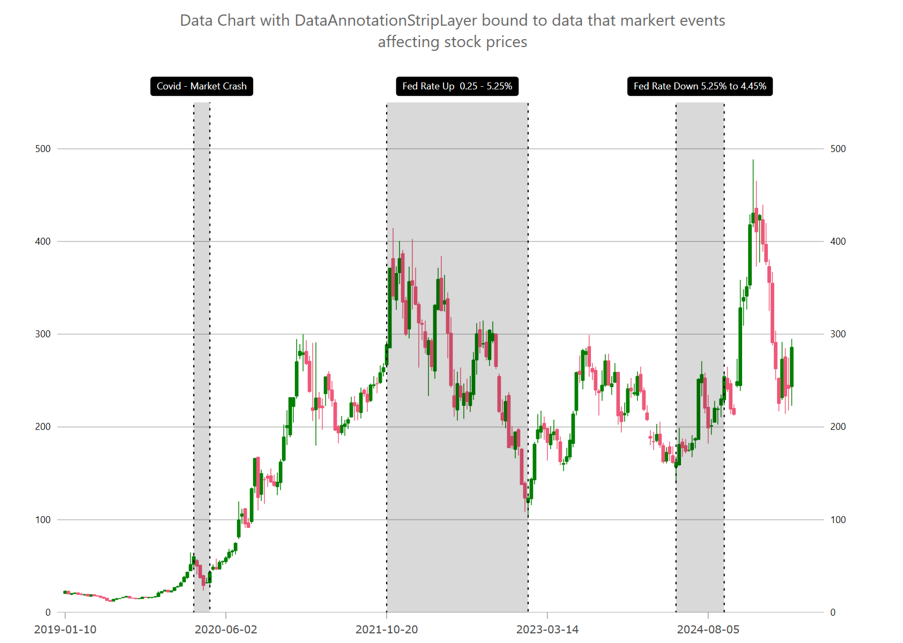

= Chart Data Annotation Strip Layer (Beta)

In {ProductName}, the link:{DataChartLink}.DataAnnotationStripLayer.html[DataAnnotationStripLayer] renders multiple vertical or horizontal strips between 2 values on an axis in the link:{DataChartLink}.{DataChartName}.html[{DataChartName}] component. This data annotation layer can be used to annotate duration of events (e.g. stock market crash) on x-axis or important range of values on y-axis. Setting the TargetAxis property to y-axis will render data annotation layer as horizontal strips or setting TargetAxis property to x-axis will render data annotation layer as vertical strips. Similarly to all series, the DataAnnotationStripLayer also supports data binding via the {ApiDataSource} property that can be set to a collection of data items which should have at least 1 numeric data column mapped to the AnnotationValueMemberPath property. 

.Note:
[NOTE]
====
This feature is designed to support cartesian axes and does not currently support radius or angle axes.
====

For example, you can use DataAnnotationStripLayer to annotate chart with stock market crashes and changes in federal interest rates.

== Rendering Strip Annotations

The following code snippet demonstrates how to render link:{DataChartLink}.DataAnnotationStripLayer.html[DataAnnotationStripLayer] as shown in the picture above. Also, this example shows how to render custom overlay text in plot that is explained more in detailed in the [Chart Overlay Text] topic.

ifdef::wpf[]

*In XAML*:

[source, xaml]
----
<ig:DataAnnotationStripLayer
StartValueMemberPath="Start"
EndValueMemberPath="End"
{ApiDataSource}="{Binding}" />
----

endif::wpf[]

ifdef::wpf,win-forms[]

*In C#*:

[source, cs]
----

var xAxisBottom = new CategoryXAxis
{
    Label = "Date",
    DataSource = data,
    TickLength = 0,
    LabelLocation = AxisLabelsLocation.OutsideTop,
    LabelFontSize= 12,
    LabelMargin = new Padding(8, 3, 8, 5), 
    LabelExtent = 40,
    LabelTextColor = Color.Transparent,
};
chart.Axes.Add(xAxisBottom);

chart.Series.Add(CreateStockMarketEvents(xAxisBottom));

public Series CreateStockMarketEvents(Axis targetAxis)
{
    var annoLayer = new DataAnnotationStripLayer();
    annoLayer.Brush = Brushes.Black;
    annoLayer.Outline = Brushes.Black;
    annoLayer.StartValueMemberPath = "Start";
    annoLayer.EndValueMemberPath = "End";
    annoLayer.TargetAxis = targetAxis;
    annoLayer.DataSource = new List<Annotation>
    {
        new Annotation() { Start = 40, End = 45, Label = "Covid - Market Crash" },
        new Annotation() { Start = 100, End = 144, Label = "Fed Rate Up  0.25 - 5.25%"  },
        new Annotation() { Start = 190, End = 205, Label = "Fed Rate Down 5.25% to 4.45%"  },
    };

    // setting optional properties
    annoLayer.StartLabelDisplayMode = DataAnnotationDisplayMode.Hidden; 
    annoLayer.EndLabelDisplayMode = DataAnnotationDisplayMode.Hidden;
    annoLayer.EndLabelDisplayMode = DataAnnotationDisplayMode.Hidden;
    annoLayer.CenterLabelDisplayMode = DataAnnotationDisplayMode.DataLabel;
    annoLayer.CenterLabelMemberPath = "Label";

    return annoLayer;
}   

----

endif::wpf,win-forms[]

== Styling Strip Annotations

The following code example shows how you can customize the link:{DataChartLink}.DataAnnotationStripLayer.html[DataAnnotationStripLayer] by setting styling properties such as background, border color, and border thickness of axis annotations as styling properties of the Overlay Text.

ifdef::wpf,win-forms[]

*In C#*:

[source, cs]
----
chart.Series.Add(StylingDataAnnotationStripLayer(xAxisBottom)); 

public Series StylingDataAnnotationStripLayer(Axis targetAxis)
{
    var annoLayer = new DataAnnotationStripLayer();
    // NOTE see setup properties in the first examples

    // styling start label of annotations 
    annoLayer.StartLabelDisplayMode = DataAnnotationDisplayMode.AxisValue;
    annoLayer.StartLabelTextColor = Brushes.White;
    annoLayer.StartLabelBackground = Brushes.Orange;
    annoLayer.StartLabelBorderColor = Brushes.Black;
    annoLayer.StartLabelBorderThickness = 1;
    annoLayer.StartLabelBorderRadius = 4;
    annoLayer.StartLabelPadding = new Thickness(4);

    // styling end label of annotations 
    annoLayer.EndLabelDisplayMode = DataAnnotationDisplayMode.AxisValue;
    annoLayer.EndLabelTextColor = Brushes.White;
    annoLayer.EndLabelBackground = Brushes.Orange;
    annoLayer.EndLabelBorderColor = Brushes.Black;
    annoLayer.EndLabelBorderThickness = 1;
    annoLayer.EndLabelBorderRadius = 4;
    annoLayer.EndLabelPadding = new Thickness(4);

    // styling center label of annotations 
    annoLayer.AnnotationLabelDisplayMode = DataAnnotationDisplayMode.AxisValue;
    annoLayer.AnnotationTextColor = Brushes.White;
    annoLayer.AnnotationBackground = Brushes.Orange;
    annoLayer.AnnotationBorderColor = Brushes.Black;
    annoLayer.AnnotationBorderThickness = 1;
    annoLayer.AnnotationBorderRadius = 4;
    annoLayer.AnnotationPadding = new Thickness(4);

    // styling optional overlay text 
    annoLayer.OverlayTextColor = Brushes.White;
    annoLayer.OverlayTextBackground = Brushes.Green;
    annoLayer.OverlayTextBorderColor = Brushes.Black;
    annoLayer.OverlayTextBorderThickness = 1;
    annoLayer.OverlayTextBorderRadius = 4;
    annoLayer.OverlayTextHorizontalMargin = 5;
    annoLayer.OverlayTextHorizontalPadding = 2;
    annoLayer.OverlayTextVerticalMargin = 5;
    annoLayer.OverlayTextVerticalPadding = 2;

    return annoLayer;
}

----

endif::wpf,win-forms[]

== API References

The following table provides most important properties for the link:{DataChartLink}.DataAnnotationStripLayer.html[DataAnnotationStripLayer] and their descriptions.
 
[options="header", cols="a,a,a"]
|====
|Property Name|Property Type|Description

| link:{DataChartLink}.dataannotationaxislayer{ApiProp}targetaxis.html[TargetAxis]
|`Axis`
|This property specifies which axis should have an enabled annotation layer.

| link:{DataChartLink}.series{ApiProp}{ApiDataSource}.html[{ApiDataSource}]
|`IEnumerable`
|This property binds data to the annotation layer to provide the precise shape.

| link:{DataChartLink}.dataannotationslicelayer{ApiProp}AnnotationValueMemberPath.html[AnnotationValueMemberPath]
|`string`
|This property is a mapping to the name of the data column with values used to position annotations.

| link:{DataChartLink}.dataannotationaxislayer{ApiProp}AnnotationLabelDisplayMode.html[AnnotationLabelDisplayMode]
|`DataAnnotationDisplayMode`
|Configurable display modes of label on axis annotation.

| link:{DataChartLink}.dataannotationaxislayer{ApiProp}AnnotationTextColor.html[AnnotationTextColor]
|`object`
|Configurable setting that manages the color of the text within the annotation.

| link:{DataChartLink}.dataannotationaxislayer{ApiProp}AnnotationBackground.html[AnnotationBackground]
|`object`
|Configurable setting of the color used for backing of the axis annotation.

| link:{DataChartLink}.dataannotationaxislayer{ApiProp}AnnotationBorderColor.html[AnnotationBorderColor]
|`object`
|Configurable setting of the color used for border color of the axis annotation.

| link:{DataChartLink}.dataannotationshapelayer{ApiProp}OverlayTextMemberPath.html[OverlayTextMemberPath]
|`string`
|This property is a mapping to the name of the data column representing the overlay text that will be displayed as overlay text aside the annotation.

| link:{DataChartLink}.dataannotationshapelayer{ApiProp}OverlayTextLocation.html[OverlayTextLocation]
|`string`
|This property manages where the overlay text is positioned.

|====
