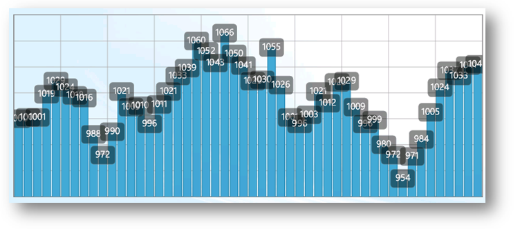

////

|metadata|
{
    "name": "datachart-displaying-marker-values",
    "controlName": ["{DataChartName}"],
    "tags": ["Application Scenarios","Charting","How Do I","Templating"],
    "guid": "ed6b6329-a299-445b-bcf9-6809a8344153",  
    "buildFlags": ["wpf","win-universal"],
    "createdOn": "2014-06-05T19:39:00.6863924Z"
}
|metadata|
////

= Displaying Marker Values

This topic explains, with a code example, how to display marker values in the link:{DataChartLink}.{DataChartName}.html[{DataChartName}]™ control.

== Introduction

In the {DataChartName} control, you can display the value of data points in the markers. (Figure 1) To do this, add a custom maker data template to the link:{DataChartLink}.markerseries{ApiProp}markertemplate.html[MarkerTemplate] property of the link:datachart-series.html[Chart Series] that inherit from link:{DataChartLink}.markerseries.html[MarkerSeries] class.

ifdef::sl,wpf,win-phone,win-universal[]

endif::sl,wpf,win-phone,win-universal[]

Figure 1: A {DataChartName} with a custom marker template displaying values of data points

== Code Example

The code snippet below demonstrates how to display values in the markers of the link:{DataChartLink}.columnseries.html[ColumnSeries].

.Note:
[NOTE]
====
The approach shown can be used also with the other series that inherit the link:{DataChartLink}.markerseries.html[MarkerSeries] base class.
====

ifdef::wpf,win-universal[]

*In XAML:*

----
<ig:{DataChartName} x:Name="dataChart" >
    <ig:{DataChartName}.Series>
        <ig:ColumnSeries ItemsSource="{Binding}"
                         ValueMemberPath="Value" 
                         XAxis="{Binding ElementName=xAxis}"
                         YAxis="{Binding ElementName=yAxis}">
             <ig:ColumnSeries.MarkerTemplate>
                  <DataTemplate>
                      <Grid Width="40" Height="30" Margin="0,0,0,0">
                           <Border CornerRadius="5" Background="#72010101" 
                                   BorderBrush="DimGray" BorderThickness="0.5">
                                   <!--Note: Text property of TextBlock is bound to
                                   property of items that make up the data source -->
                              <TextBlock Margin="2" Text="{Binding Item.Value}" 
                                         Foreground="White" FontSize="15" 
                                         HorizontalAlignment="Center" />
                           </Border>
                      </Grid>
                  </DataTemplate>
             </ig:ColumnSeries.MarkerTemplate>
        </ig:ColumnSeries >
    </ig:{DataChartName}.Series>
</ig:{DataChartName}>
----

endif::wpf,win-universal[]

[[RelatedContent]]
== Related Content

* link:datachart-customizing-markers.html[Customizing Markers]
* link:datachart-chart-synchronization.html[Chart Synchronization]
* link:datachart-series-types.html[Series Types]
* link:datachart-series-requirements.html[Series Requirements]