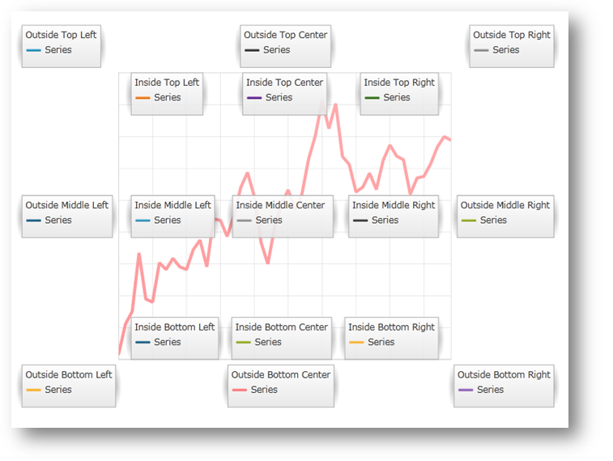
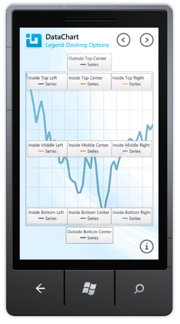

////
|metadata|
{
    "name": "datachart-docking-legends",
    "controlName": ["{DataChartName}"],
    "tags": ["Application Scenarios","Charting","How Do I"],
    "guid": "fb5bd3f3-d0a2-4e0b-8b61-8f80dee12ddf",
    "buildFlags": ["wpf","win-universal"],
    "createdOn": "2014-06-05T19:39:00.678389Z"
}
|metadata|
////

= Docking Legends

This topic explains, with a code example, how to dock a legend to the link:{DataChartLink}.{DataChartName}.html[{DataChartName}]™ control.

== Introduction

Legends, just like other User Interface (UI) controls can be docked to the {DataChartName} control plot area. Legends are docked by first wrapping the {DataChartName} and link:{DataChartLink}.legend.html[Legend] controls with the link:{ApiPlatform}datavisualization{ApiVersion}~infragistics.controls.xamdock.html[xamDock]™ container control and then setting the respective docking properties. (Table 1 below) Alternatively, you can wrap the {DataChartName} and the other controls with {PlatformName} host controls like the StackPanel, Grid, and others.

ifdef::sl,wpf[]

endif::sl,wpf[]

ifdef::win-phone[]

endif::win-phone[]

Figure 1: The {DataChartName} control with Legend controls docked in different locations of the chart plot area

== Docking Properties

Table 1 explains the available properties for docking Legend objects to the {DataChartName} control.

Table 1: Properties for docking child controls in the xamDock control

[options="header", cols="a,a,a,a"]
|====
|Property Name|Type|Description|Default Value

|xamDock.Edge
| link:{ApiPlatform}datavisualization{ApiVersion}~infragistics.controls.dockedge.html[DockEdge]
|Determines dock edge of a child control in the xamDock container. The available values are: 

* Central 

* InsideBottom 

* InsideLeft 

* InsideRight 

* InsideTop 

* OutsideBottom 

* OutsideLeft 

* OutsideRight 

* OutsideTop 

|InsideTop

|xamDock.VerticalDockAlignment
|VerticalAlignment
|Determines vertical dock alignment of a child control in the xamDock container. The available values are: 

* Top 

* Center 

* Bottom 

* Stretch 

|Top

|xamDock.HorizontalDockAlignment
|HorizontalAlignment
|Determines horizontal dock alignment of a child control in the xamDock container. The available values are: 

* Left 

* Center 

* Right 

* Stretch 

|Left

|====

== Code Example

The following example provides all possible docking locations of legends relative to the chart plot area. But only one of the Legend objects provided can be used at time and bound to the Legend property of the {DataChartName} control. In order to display multiple legends per series then you need to bind the legend to Legend property of the Series object instead of that of the {DataChartName} control. For further details, refer to the Multiple Legends topic. 

.Note:
[NOTE]
====
This example assumes that you know how to set up your application for the xamDock and {DataChartName} controls and bind the data context to the chart. If you need information about this, refer to the link:datachart-getting-started-with-datachart.html[Getting Started with Data Chart] topic.
====

ifdef::win-universal[]

*In XAML:*

[source,xaml]
----
xmlns:ig="using:Infragistics.Controls.Charts"
----

endif::win-universal[]

ifdef::wpf[]

*In XAML:*

----
xmlns:ig=http://schemas.infragistics.com/xaml
----

endif::wpf[]

ifdef::wpf,win-universal[]

*In XAML:*

ifdef::wpf[]
----
<ig:XamDock x:Name="dockContainer" >
    <ig:{DataChartName} x:Name="dataChart" 
                     ig:XamDock.Edge="Central" 
                     Legend="{Binding ElementName=LegendOTL}" >
    </ig:{DataChartName}>
    <ig:Legend x:Name="LegendOTC" Content="OutsideTopCenter" 
                ig:XamDock.Edge="OutsideTop"  
                ig:XamDock.HorizontalDockAlignment="Center"  >
    </ig:Legend>
    <!-- Note: These are other docking options for Legend -->
    <ig:Legend x:Name="LegendOTL" Content="OutsideTopLeft" 
                ig:XamDock.Edge="OutsideTop" 
                ig:XamDock.VerticalDockAlignment="Top" 
                ig:XamDock.HorizontalDockAlignment="Left"  >    
    </ig:Legend>
    <ig:Legend x:Name="LegendOTR" Content="OutsideTopRight" 
                ig:XamDock.Edge="OutsideTop" 
                ig:XamDock.VerticalDockAlignment="Top" 
                ig:XamDock.HorizontalDockAlignment="Right"  >    
    </ig:Legend>
    <ig:Legend x:Name="LegendOLC" Content="OutsideMiddleLeft" 
                ig:XamDock.Edge="OutsideLeft" 
                ig:XamDock.VerticalDockAlignment="Center" 
                ig:XamDock.HorizontalDockAlignment="Center"  >
    </ig:Legend>
    <ig:Legend x:Name="LegendORC" Content="OutsideMiddleRight" 
                ig:XamDock.Edge="OutsideRight" 
                ig:XamDock.VerticalDockAlignment="Center" 
                ig:XamDock.HorizontalDockAlignment="Center" >
    </ig:Legend>
    <ig:Legend x:Name="LegendOBL" Content="OutsideBottomLeft" 
                ig:XamDock.Edge="OutsideBottom" 
                ig:XamDock.VerticalDockAlignment="Center" 
                ig:XamDock.HorizontalDockAlignment="Left"   >
    </ig:Legend>
    <ig:Legend x:Name="LegendOBR" Content="OutsideBottomRight" 
                ig:XamDock.Edge="OutsideBottom" 
                ig:XamDock.VerticalDockAlignment="Center" 
                ig:XamDock.HorizontalDockAlignment="Right"    >
    </ig:Legend>
     <ig:Legend x:Name="LegendOBC" Content="OutsideBottomCenter" 
                ig:XamDock.Edge="OutsideBottom" 
                ig:XamDock.VerticalDockAlignment="Center" 
                ig:XamDock.HorizontalDockAlignment="Center" >
    </ig:Legend>
    <ig:Legend x:Name="LegendITC" Content="InsideTopLeft"  
                ig:XamDock.Edge="InsideTop" 
                ig:XamDock.VerticalDockAlignment="Top" 
                ig:XamDock.HorizontalDockAlignment="Left"  >
    </ig:Legend>
    <ig:Legend x:Name="LegendITL" Content="InsideTopCenter"  
                ig:XamDock.Edge="InsideTop" 
                ig:XamDock.VerticalDockAlignment="Top" 
                ig:XamDock.HorizontalDockAlignment="Center" >
    </ig:Legend>
    <ig:Legend x:Name="LegendITR" Content="InsideTopRight"   
                ig:XamDock.Edge="InsideTop" 
                ig:XamDock.VerticalDockAlignment="Top" 
                ig:XamDock.HorizontalDockAlignment="Right" >
    </ig:Legend>
    <ig:Legend x:Name="LegendIC" Content="InsideCenter"  
                ig:XamDock.Edge="Central" 
                ig:XamDock.VerticalDockAlignment="Center" 
                ig:XamDock.HorizontalDockAlignment="Center" >
    </ig:Legend>
    <ig:Legend x:Name="LegendILC" Content="InsideCenterLeft"  
                ig:XamDock.Edge="InsideLeft" 
                ig:XamDock.VerticalDockAlignment="Center" 
                ig:XamDock.HorizontalDockAlignment="Center" >
    </ig:Legend>
    <ig:Legend x:Name="LegendIRC" Content="InsideCenterRight" 
                ig:XamDock.Edge="InsideRight" 
                ig:XamDock.VerticalDockAlignment="Center" 
                ig:XamDock.HorizontalDockAlignment="Center">
    </ig:Legend>
    <ig:Legend x:Name="LegendIBC" Content="InsideBottomLeft"   
                ig:XamDock.Edge="InsideBottom" 
                ig:XamDock.VerticalDockAlignment="Top" 
                ig:XamDock.HorizontalDockAlignment="Left" >
    </ig:Legend>
    <ig:Legend x:Name="LegendIBL" Content="InsideBottomCenter"  
                ig:XamDock.Edge="InsideBottom" 
                ig:XamDock.VerticalDockAlignment="Top" 
                ig:XamDock.HorizontalDockAlignment="Center" >
    </ig:Legend>
    <ig:Legend x:Name="LegendIBR" Content="InsideBottomRight"   
                ig:XamDock.Edge="InsideBottom" 
                ig:XamDock.VerticalDockAlignment="Top" 
                ig:XamDock.HorizontalDockAlignment="Right" >
    </ig:Legend>
</ig:XamDock>
----
endif::wpf[]

ifdef::win-universal[]
----
<ig:XamDock x:Name="dockContainer" >
    <ig:{DataChartName} x:Name="dataChart" 
                     ig:XamDock.Edge="Central" 
                     Legend="{Binding ElementName=LegendOTL}" >
    </ig:{DataChartName}>
    <ig:Legend x:Name="LegendOTC" Content="OutsideTopCenter" 
                ig:XamDock.Edge="OutsideTop"  
                ig:XamDock.HorizontalDockAlignment="Center"  >
    </ig:Legend>
    <!-- Note: These are other docking options for Legend -->
    <ig:Legend x:Name="LegendOTL" Content="OutsideTopLeft" 
                ig:XamDock.Edge="OutsideTop" 
                ig:XamDock.VerticalDockAlignment="Top" 
                ig:XamDock.HorizontalDockAlignment="Left"  >    
    </ig:Legend>
    <ig:Legend x:Name="LegendOTR" Content="OutsideTopRight" 
                ig:XamDock.Edge="OutsideTop" 
                ig:XamDock.VerticalDockAlignment="Top" 
                ig:XamDock.HorizontalDockAlignment="Right"  >    
    </ig:Legend>
    <ig:Legend x:Name="LegendOLC" Content="OutsideMiddleLeft" 
                ig:XamDock.Edge="OutsideLeft" 
                ig:XamDock.VerticalDockAlignment="Center" 
                ig:XamDock.HorizontalDockAlignment="Center"  >
    </ig:Legend>
    <ig:Legend x:Name="LegendORC" Content="OutsideMiddleRight" 
                ig:XamDock.Edge="OutsideRight" 
                ig:XamDock.VerticalDockAlignment="Center" 
                ig:XamDock.HorizontalDockAlignment="Center" >
    </ig:Legend>
    <ig:Legend x:Name="LegendOBL" Content="OutsideBottomLeft" 
                ig:XamDock.Edge="OutsideBottom" 
                ig:XamDock.VerticalDockAlignment="Center" 
                ig:XamDock.HorizontalDockAlignment="Left"   >
    </ig:Legend>
    <ig:Legend x:Name="LegendOBR" Content="OutsideBottomRight" 
                ig:XamDock.Edge="OutsideBottom" 
                ig:XamDock.VerticalDockAlignment="Center" 
                ig:XamDock.HorizontalDockAlignment="Right"    >
    </ig:Legend>
     <ig:Legend x:Name="LegendOBC" Content="OutsideBottomCenter" 
                ig:XamDock.Edge="OutsideBottom" 
                ig:XamDock.VerticalDockAlignment="Center" 
                ig:XamDock.HorizontalDockAlignment="Center" >
    </ig:Legend>
    <ig:Legend x:Name="LegendITC" Content="InsideTopLeft"  
                ig:XamDock.Edge="InsideTop" 
                ig:XamDock.VerticalDockAlignment="Top" 
                ig:XamDock.HorizontalDockAlignment="Left"  >
    </ig:Legend>
    <ig:Legend x:Name="LegendITL" Content="InsideTopCenter"  
                ig:XamDock.Edge="InsideTop" 
                ig:XamDock.VerticalDockAlignment="Top" 
                ig:XamDock.HorizontalDockAlignment="Center" >
    </ig:Legend>
    <ig:Legend x:Name="LegendITR" Content="InsideTopRight"   
                ig:XamDock.Edge="InsideTop" 
                ig:XamDock.VerticalDockAlignment="Top" 
                ig:XamDock.HorizontalDockAlignment="Right" >
    </ig:Legend>
    <ig:Legend x:Name="LegendIC" Content="InsideCenter"  
                ig:XamDock.Edge="Central" 
                ig:XamDock.VerticalDockAlignment="Center" 
                ig:XamDock.HorizontalDockAlignment="Center" >
    </ig:Legend>
    <ig:Legend x:Name="LegendILC" Content="InsideCenterLeft"  
                ig:XamDock.Edge="InsideLeft" 
                ig:XamDock.VerticalDockAlignment="Center" 
                ig:XamDock.HorizontalDockAlignment="Center" >
    </ig:Legend>
    <ig:Legend x:Name="LegendIRC" Content="InsideCenterRight" 
                ig:XamDock.Edge="InsideRight" 
                ig:XamDock.VerticalDockAlignment="Center" 
                ig:XamDock.HorizontalDockAlignment="Center">
    </ig:Legend>
    <ig:Legend x:Name="LegendIBC" Content="InsideBottomLeft"   
                ig:XamDock.Edge="InsideBottom" 
                ig:XamDock.VerticalDockAlignment="Top" 
                ig:XamDock.HorizontalDockAlignment="Left" >
    </ig:Legend>
    <ig:Legend x:Name="LegendIBL" Content="InsideBottomCenter"  
                ig:XamDock.Edge="InsideBottom" 
                ig:XamDock.VerticalDockAlignment="Top" 
                ig:XamDock.HorizontalDockAlignment="Center" >
    </ig:Legend>
    <ig:Legend x:Name="LegendIBR" Content="InsideBottomRight"   
                ig:XamDock.Edge="InsideBottom" 
                ig:XamDock.VerticalDockAlignment="Top" 
                ig:XamDock.HorizontalDockAlignment="Right" >
    </ig:Legend>
</ig:XamDock>
----
endif::win-universal[]

endif::wpf,win-universal[]

== Related Content

* link:datachart-common-legend.html[Adding Common Legend]
* link:datachart-multiple-legends.html[Adding Multiple Legends]