////
|metadata|
{
    "name": "datachart-financial-indicators-overview",
    "controlName": ["{DataChartName}"],
    "tags": ["Charting","How Do I"],
    "guid": "65e70f8b-2dd7-429c-acfc-bef3e1a0220e",
    "buildFlags": [],
    "createdOn": "2014-06-05T19:39:00.4613012Z"
}
|metadata|
////

= Financial Indicators
 
=== Purpose

This topic provides detailed overview and instruction on how to create financial indicators in the  link:{DataChartLink}.{DataChartName}.html[{DataChartName}]™ control.

=== Required Background

The following topics are prerequisites to understanding this topic:

[options="header", cols="a,a"]
|====
|Topic|Purpose

| link:datachart-datachart.html[{DataChartName} ]
|This topic provides a general overview of the _{DataChartName}_ control

| link:datachart-getting-started-with-datachart.html[Getting Started with Data Chart]
|This topic provides information on how to get started with the _{DataChartName}_ control.

| link:datachart-series-requirements.html[Series Requirements]
|This topic provides information on requirements of Series objects in the _{DataChartName}_ control.

|====

=== In this topic

This topic contains the following sections:

* <<_Introduction,Introduction>>
* <<_DataMapping,Data Mapping>>
* <<_FinancialIndicators,Types of Indicators>>
* <<_CodeExample,Code Example>>
* <<_RelatedContent,Related Content>>

[[_Introduction]]
== Introduction

Financial Indicators are often used by traders to measure changes and to show trends in stock prices. These indicators are usually displayed in above or below of the link:datachart-series-financial-price-series-overview.html[Financial Price Series] because they do not share the same Y-Axis scale. In contrast, link:datachart-financial-overlays-overview.html[Financial Overlays] can share the same Y-Axis with the `FinancialPriceSeries` and as result Financial Overlays are usually plotted in front of the `FinancialPriceSeries`. However, the chart control supports plotting both overlays as well as indicators in the same plot area, if desired, using multiple axes or by sharing axes. For more information on this, please refer to link:datachart-multiple-axes.html[Using Multiple Axes] and link:datachart-multiple-series.html[Adding Multiple Series] articles.

For more detailed information on financial overlays and indicators, please refer to the following online resources:

* link:http://en.wikipedia.org/wiki/Technical_analysis#Price-based_indicators[Technical Analysis]
* link:http://help.yahoo.com/l/us/yahoo/finance/charts/chart-12.html[Technical Indicator Details]

[[_DataMapping]]
== Data Mapping

All financial indicators require specific data mapping to stock price values (open, high, low, close), and stock volume. The following table lists properties of financial indicators with mappings data columns. You can find an example of financial stock data in the link:resources-sample-stocks-data.html[Sample Stocks Data] source.

[options="header", cols="a,a,a"]
|====
|Property Name|Property Type|Data Columns

| link:{DataChartLink}.FinancialSeries{ApiProp}OpenMemberPath.html[OpenMemberPath]
|`string`
|Open

| link:{DataChartLink}.FinancialSeries{ApiProp}CloseMemberPath.html[CloseMemberPath]
|`string`
|Close

| link:{DataChartLink}.FinancialSeries{ApiProp}HighMemberPath.html[HighMemberPath]
|`string`
|High

| link:{DataChartLink}.FinancialSeries{ApiProp}LowMemberPath.html[LowMemberPath]
|`string`
|Low

| link:{DataChartLink}.FinancialSeries{ApiProp}VolumeMemberPath.html[VolumeMemberPath]
|`string`
|Volume

|====

[[_FinancialIndicators]]
== Financial Indicators
 
The {DataChartName} control supports over 30 types of financial indicators and the following table provides previews as as well as descriptions of these financial indicators:

[cols="a"]
|====
|Types of Financial Indicators

| link:{DataChartLink}.absolutevolumeoscillatorindicator.html[AbsoluteVolumeOscillatorIndicator] (AVO) is calculated by taking the difference between two average volume measures. It is similar to the Percentage Volume Oscillator, but scores range from -100% to +100%. The indicator is used to identify whether volume trends are increasing or decreasing. The user can select the time period for analysis.

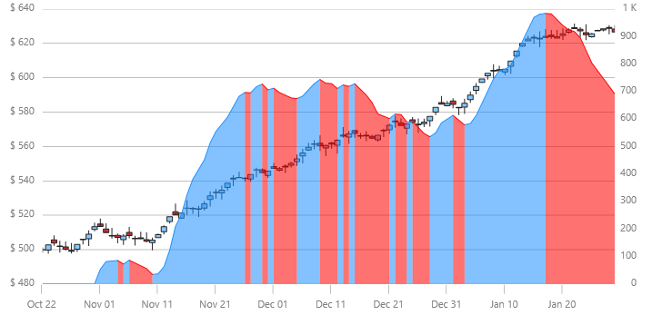

| link:{DataChartLink}.accumulationdistributionindicator.html[AccumulationDistributionIndicator] (ADI) is a very popular volume related indicator. It evaluates the supply and demand of a stock, security, or index over time by looking at disparities in whether investors are selling or buying.

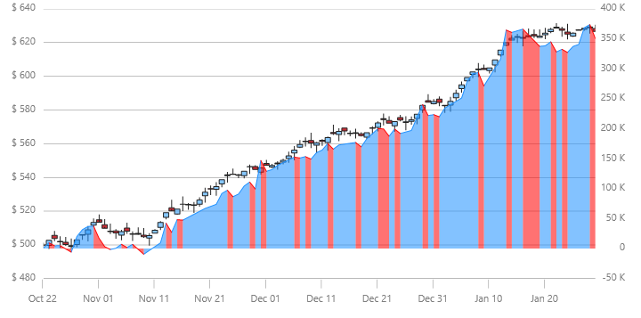

| link:{DataChartLink}.averagedirectionalindexindicator.html[AverageDirectionalIndexIndicator] (ADX) measures trend strength without regard to trend direction. This indicator is usally used together with Minus Directional Indicator (-DI) and Plus Directional Indicator (+DI) to determine the strength and direction of the stock trends. 

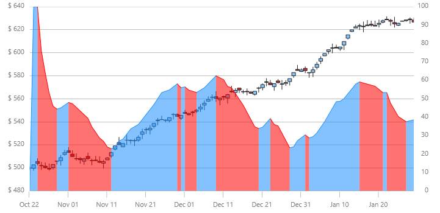

| link:{DataChartLink}.averagetruerangeindicator.html[AverageTrueRangeIndicator] is (ATR) measures a security's degree of price movement or volatility within a given period of time. The indicator is not a measure of price direction or duration, but simply the amount of price movement or volatility. The Average True Range (ATR) is frequently calculated with a 14 day period using several bases, including: daily, weekly or monthly. The Average True Range is the exponential moving average of the TR values for the last 14 periods. The actual period used can vary depending on user preference.

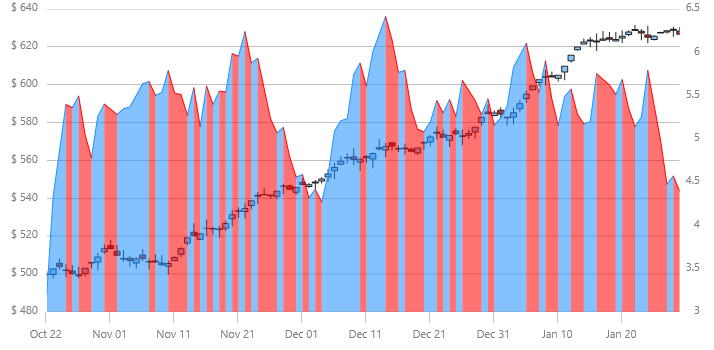

| link:{DataChartLink}.bollingerbandwidthindicator.html[BollingerBandWidthIndicator] (BBW) is used with the Bollinger Bands Overlay. Bollinger Band Width Indicator represents the width of the Bollinger bands at a given point. The more variation there is, the wider the band. Narrowing bandwidth (lower values) indicates decreases in standard deviation and widening bandwidth (higher values) indicates increasing standard deviation in price. The BollingerBandWidthIndicator supports a scaling factor like the link:{DataChartLink}.bollingerbandsoverlay.html[BollingerBandsOverlay], so that their values can be matched.

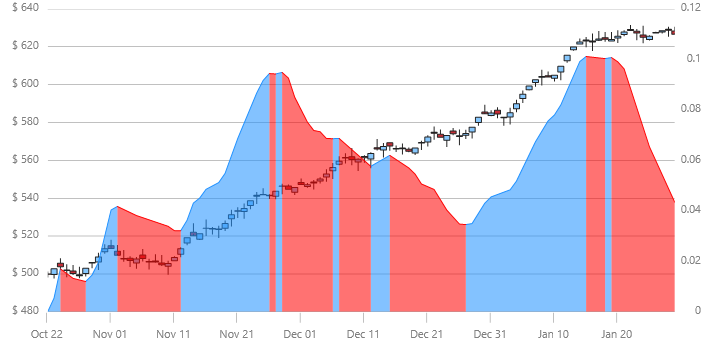

| link:{DataChartLink}.chaikinvolatilityindicator.html[ChaikinVolatilityIndicator] (CHV) reflects the volatility of a security by showing the percent change of the Exponential Moving Average of the difference in high and low prices during a specified period of time.

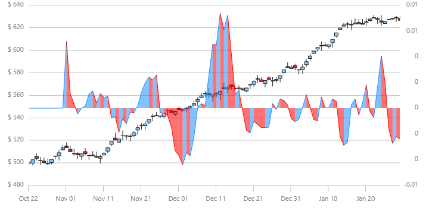

| link:{DataChartLink}.chaikinoscillatorindicator.html[ChaikinOscillatorIndicator] is (COI) used to identify trends in the accumulation/distribution indicator. The Chaikin Oscillator is the 10-day exponential moving average (EMA) of the accumulation/distribution indicator subtracted from the 3-day EMA of the accumulation/distribution indicator.

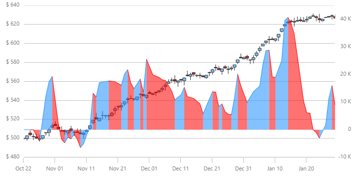

| link:{DataChartLink}.commoditychannelindexindicator.html[CommodityChannelIndexIndicator] (CCI) is used to identify cyclical trends in a security. The indicator is based on the assumption that securities prices change in cycles that can be identified. It is calculated by dividing difference of the Simple Moving Average of the Typical Price (SMATP) during a given time period with the previous period’s Typical Price (TP) by the product of the Constant and the Mean Absolute Deviation.

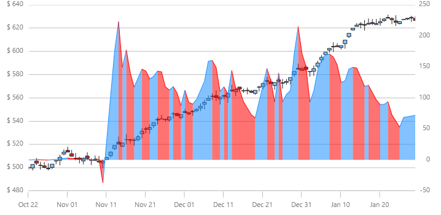

| link:{DataChartLink}.detrendedpriceoscillatorindicator.html[DetrendedPriceOscillatorIndicator] (DPO) is designed to control for long-term pricing trends in order to identify short-term trends. It is based on a displaced moving average and is not a momentum oscillator.

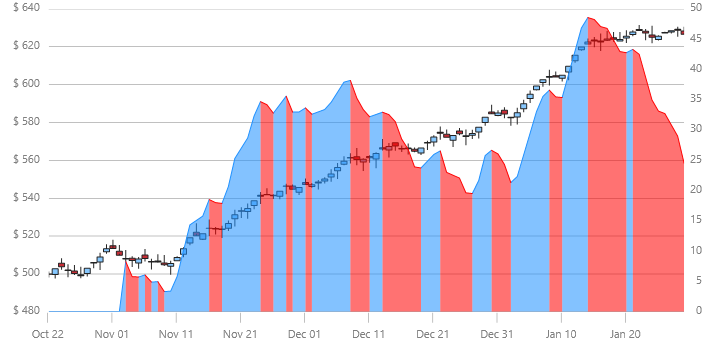

| link:{DataChartLink}.easeofmovementindicator.html[EaseOfMovementIndicator] is used (EOM) to identify the volume needed to change the price of a security. It is usually smoothed with a moving average.

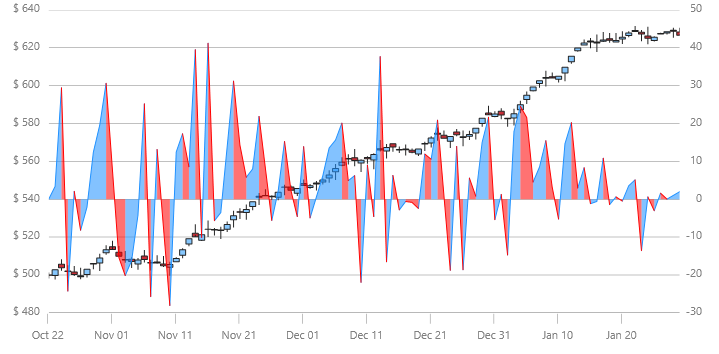

| link:{DataChartLink}.faststochasticoscillatorindicator.html[FastStochasticOscillatorIndicator] (FSO) displays the closing price relative to the high-low range over a given period of time. 

There are three types of Stochastic Oscillators: Fast, Slow, and Full. The Stochastic Oscillator is a momentum indicator that shows the relation of the current close price relative to the high/low range over a given time period using a scale of 0 to 100. It is based on the premise that prices will close near 100 in a rising market and closer to 0 in a declining market. 

The Fast Stochastic Oscillator Indicator is used to identify buying or selling divergences. The Slow Stochastic Oscillator uses a 3-day SMA and the Full Stochastic Oscillator is the Slow Stochastic Oscillator with time period customization.

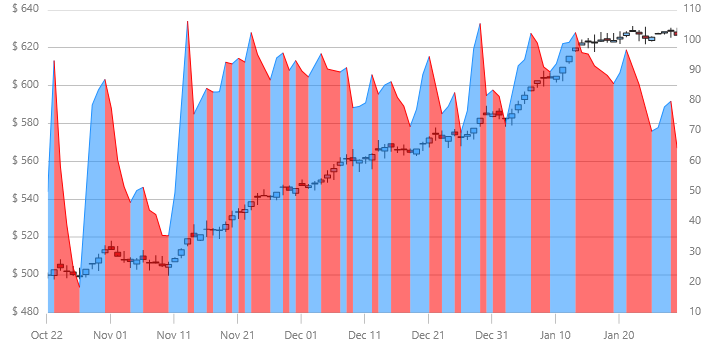

| link:{DataChartLink}.forceindexindicator.html[ForceIndexIndicator] (FII) is a price-and-volume oscillator that financial analysts use to determine if a stock's trend is positive or negative. The force index is calculated by subtracting yesterday's closing price from today's closing price and multiplying the difference with the current day’s volume. If the closing price is higher today than yesterday, the force is positive. If the closing price is lower than yesterday's, the force is negative.

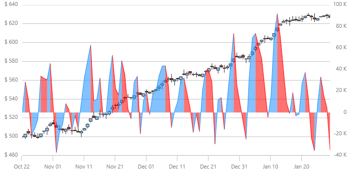

| link:{DataChartLink}.fullstochasticoscillatorindicator.html[FullStochasticOscillatorIndicator] (FSO) displays the closing price relative to the high-low range over a given period of time. There are three types of Stochastic Oscillators: Fast, Slow, and Full. The Stochastic Oscillator is a momentum indicator that shows the relation of the current close price relative to the high/low range over a given time period using a scale of 0 to 100. It is based on the premise that prices will close near 100 in a rising market and closer to 0 in a declining market. 

The Fast Stochastic Oscillator Indicator is used to identify buying or selling divergences. The Slow Stochastic Oscillator uses a 3-day SMA and the Full Stochastic Oscillator is the Slow Stochastic Oscillator with time period customization.

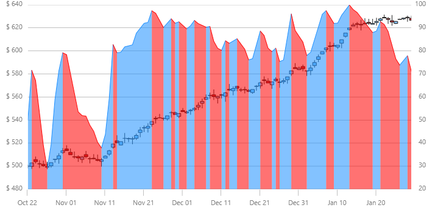

| link:{DataChartLink}.marketfacilitationindexindicator.html[MarketFacilitationIndexIndicator] (MFI) combines price and volume in analysis to measure efficiency. It is calculated by taking the difference between the low price and the high price and dividing it by the volume.

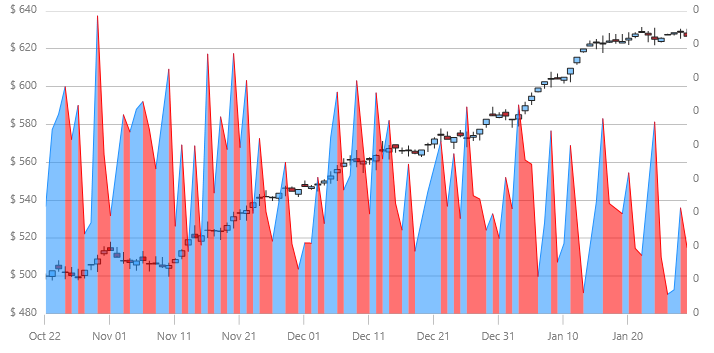

| link:{DataChartLink}.massindexindicator.html[MassIndexIndicator] (MII) is used for finding trend reversals. It is based on the premise that reversals are likely to happen when the price range widens. The calculation compares the previous trading ranges (highs minus lows). EMAs are used for this purpose. If there is substantial movement, the Mass Index Indicator increases, if there are small movements the Mass Index Indicator decreases.

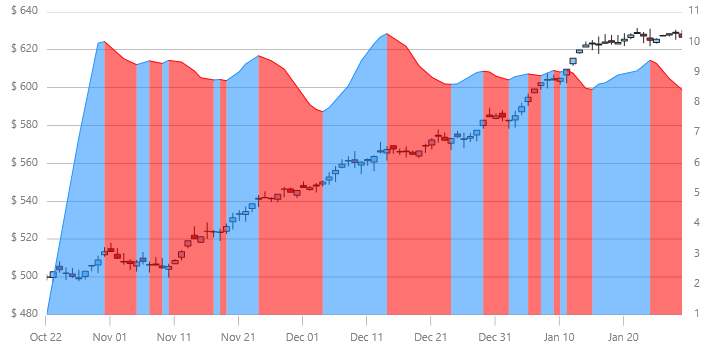

| link:{DataChartLink}.medianpriceindicator.html[MedianPriceIndicator] (MPI) represents the middle point between the high and low prices. Median is a measure of central tendency. The Median Price Indicator displays a chart of the median.

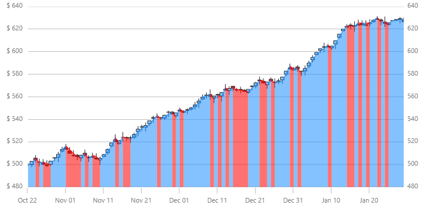

| link:{DataChartLink}.moneyflowindexindicator.html[MoneyFlowIndexIndicator] (MFI) is a momentum indicator and is similar to the Relative Strength Index (RSI The MFI is used as a measure of the money flowing in and out of a security and can be used to predict a trend reversal. MFI ranges from 0 and 100 and is interpreted like the RSI.

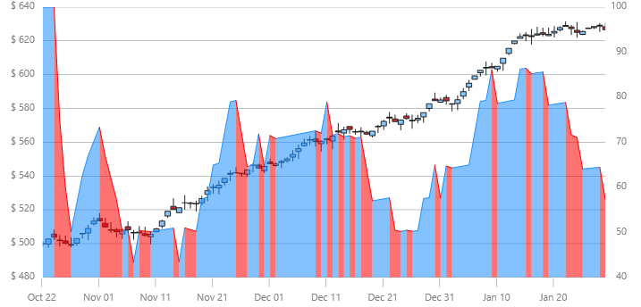

| link:{DataChartLink}.movingaverageconvergencedivergenceindicator.html[MovingAverageConvergenceDivergenceIndicator] (MACD) is one of the most popular indicators for financial services. It is used to identify changes in the strength, direction, momentum, or length of a trend for a stock price. MACD is computed by taking the difference between two exponential moving averages (EMAs) of closing prices. The difference is then charted over time with a moving average of the difference.

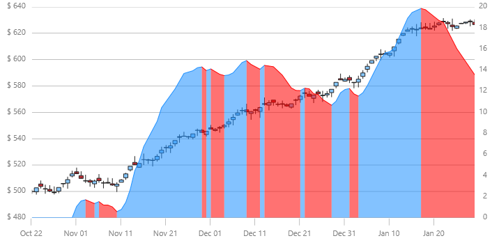

| link:{DataChartLink}.negativevolumeindexindicator.html[NegativeVolumeIndexIndicator] (NVI) is frequently used in combination with the link:{DataChartLink}.positivevolumeindexindicator.html[PositiveVolumeIndexIndicator]. This calculation can be used to identify bull markets. These two indicators are based on the premise that smart money trades on low volume days and less informed or overly optimistic investors trade on high volume days.

| link:{DataChartLink}.onbalancevolumeindicator.html[OnBalanceVolumeIndicator] (OBV) calculates a running total of sales volume for a stock and displays whether this volume is flowing in (purchasing) or out (selling) of a given stock. The total volume for a day is given a positive or negative value depending on whether the prices were higher or lower that day than the previous day. A higher closing price would yield a positive value and a lower closing price would result in a negative value. These values are accumulated into the running total.

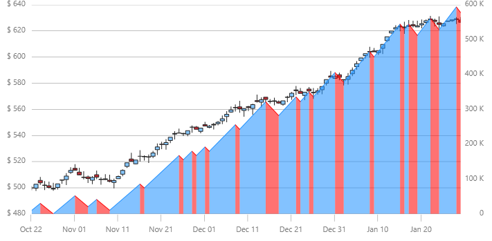

| link:{DataChartLink}.percentagepriceoscillatorindicator.html[PercentagePriceOscillatorIndicator] (PPO) shows the difference between two moving averages. The difference is presented as a percentage of the larger moving average. The end user selects the time period for analysis.

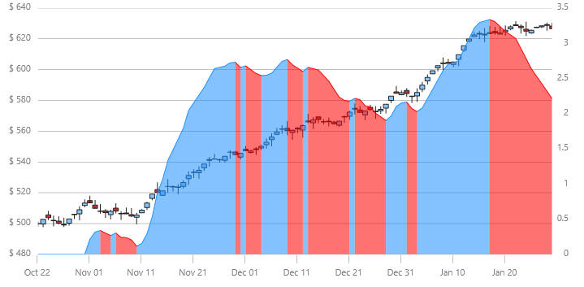

| link:{DataChartLink}.percentagevolumeoscillatorindicator.html[PercentageVolumeOscillatorIndicator] (PVO) is the percentage difference between volume smoothed using a long period and a short period. The PVO Indicator hovers around zero. The user can select the various period values to analyze. This indicator changes, when graphically displayed, can be useful for detecting patterns in volume. An increasing PVO indicates increases in volume levels and a declining PVO indicates declining volume levels.

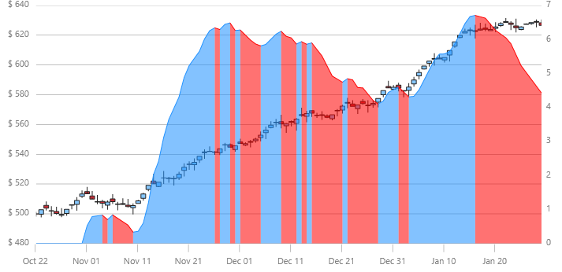

| link:{DataChartLink}.positivevolumeindexindicator.html[PositiveVolumeIndexIndicator] (PVI) is used together with the Negative Volume Index, it can be used to identify bull markets. These two indicators are based on the premise that smart money trades on low volume days and less informed or overly optimistic investors trade on high volume days.

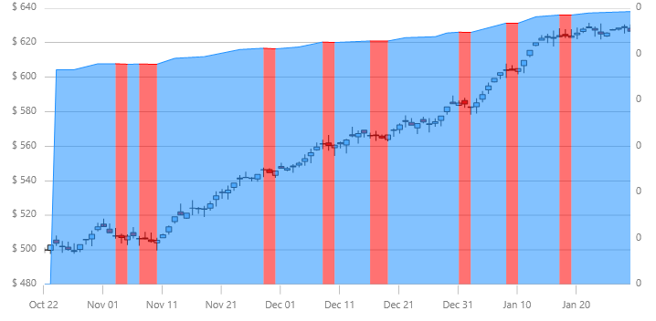

| link:{DataChartLink}.pricevolumetrendindicator.html[PriceVolumeTrendIndicator] (PVT) is a momentum based indicator used to measure money flow by adding or subtracting a portion of the daily volume. This added or subtracted value dependens on the amount of the current day's price rising or falling compared to the previous day's close. This indicator is primarily used to confirm trends, as well as spot possible trading signals due to divergences. 

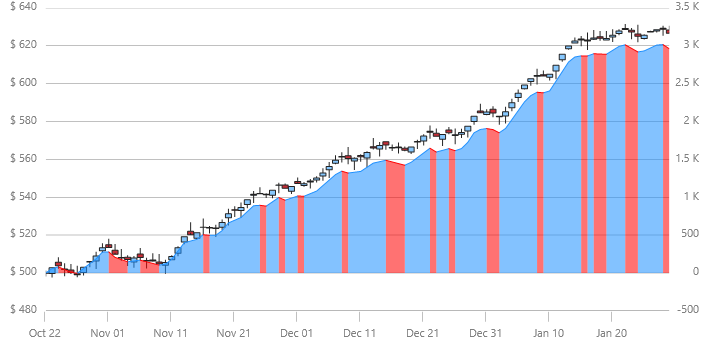

| link:{DataChartLink}.rateofchangeandmomentumindicator.html[RateOfChangeAndMomentumIndicator] (ROCM) calculates the difference between one closing price and the closing price N days ago. Momentum is the absolute difference and usually refers to a price trend. When an upward trend continues the momentum and ROC indicators are positive. When a declining trend continues the momentum and ROC indicators are negative.

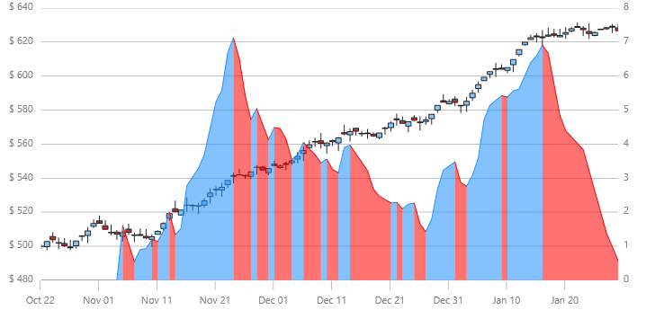

| link:{DataChartLink}.relativestrengthindexindicator.html[RelativeStrengthIndexIndicator] (RSI) is a commonly used measure of market strength/weakness calculated on closing prices during a specified time period. It is based on the premise that prices close higher in strong market periods and lower in weak periods. RSI is the ratio of higher closes to lower closes. The range is 0 to 100.

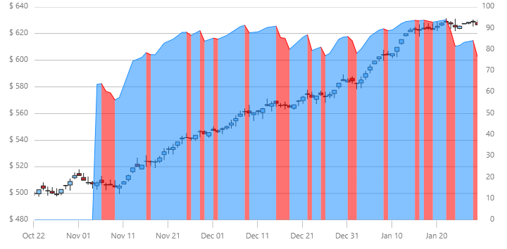

| link:{DataChartLink}.slowstochasticoscillatorindicator.html[SlowStochasticOscillatorIndicator] (SSO) displays the closing price relative to the high-low range over a given period of time. There are three types of Stochastic Oscillators: Fast, Slow, and Full. The Stochastic Oscillator is a momentum indicator that shows the relation of the current close price relative to the high/low range over a given time period using a scale of 0 to 100. It is based on the premise that prices will close near 100 in a rising market and closer to 0 in a declining market. 

The Fast Stochastic Oscillator Indicator is used to identify buying or selling divergences. The Slow Stochastic Oscillator uses a 3-day SMA and the Full Stochastic Oscillator is the Slow Stochastic Oscillator with time period.

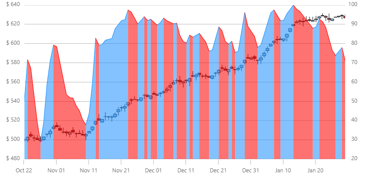

| link:{DataChartLink}.standarddeviationindicator.html[StandardDeviationIndicator] (SDI) measures statistical variation in stock prices or volatility. The difference between an individual security’s closing price and the average security closing price is called the dispersion. The larger the dispersion is the higher the standard deviation will be and therefore the volatility. The smaller the dispersion is (the difference between an individual closing price and the average price), the smaller the standard deviation and the lower the price volatility.

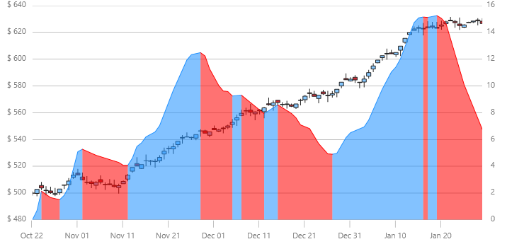

| link:{DataChartLink}.stochrsiindicator.html[StochRSIIndicator] or Stochastic Relative Strength IndexI Indicator (SRSI) measures when a security is overbought or oversold within a specified period of time. The values range from 0 to 1. The StochRSI Indicator is calculated by applying the Stochastic Oscillator formula to link:{DataChartLink}.relativestrengthindexindicator.html[RelativeStrengthIndexIndicator] (RSI) data.

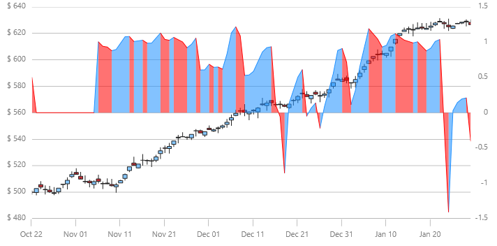

| link:{DataChartLink}.trixindicator.html[TRIXIndicator] (TRIX) is a measure of momentum used to identify overbought or oversold securities. Like other oscillators, TRIX scores hover around zero. A positive value indicates an overbought security while a negative value indicates an oversold one. TRIX is calculated using a triple exponential smoothed moving average of the price over a specific period of time. A signal line is frequently used to indicate where a security’s price is likely to be in the future.

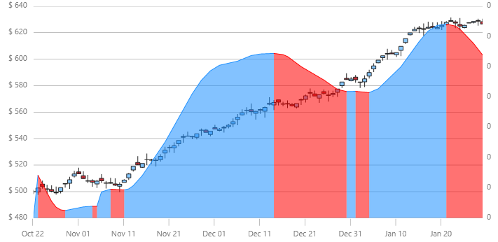

| link:{DataChartLink}.typicalpriceindicator.html[TypicalPriceIndicator] (TPI) is common financial pivot point that represents the arithmetic average of the High, Low, and Closing prices of a security for a given period of time.

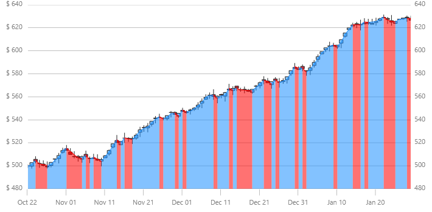

| link:{DataChartLink}.ultimateoscillatorindicator.html[UltimateOscillatorIndicator] (UOI) uses the weighted average from three different time periods in order to reduce the volatility and noise associated with other indicators that are based on single time periods. Since this is a range bound indicator, the scores are between 0 and 100. 

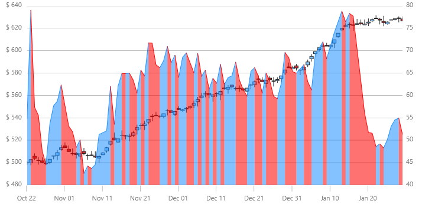

| link:{DataChartLink}.weightedcloseindicator.html[WeightedCloseIndicator] (WCI) is similar to the Typical Price Indicator in that it represents an average of the high price, low price, and closing price for a day. However, with the Weighted Close Indicator, more emphasis is placed on the closing price and it is included twice when calculating the arithmetic average. 

| link:{DataChartLink}.williamspercentrindicator.html[WilliamsPercentRIndicator] (WPRI) is similar to the Stochastic Oscillator. However, the scale ranges from 0 to -100. It is useful for identifying overbought and oversold securities. The Williams Percent Range Indicator is calculated by dividing the difference between the highest high for the period and the current close by the highest high minus the lowest low for the period.

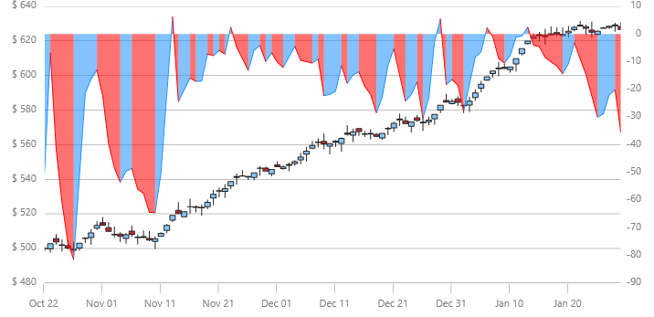

|====

[[_CodeExample]]
== Code Example

The following code snippet shows how to add a `PositiveVolumeIndexIndicator` to the Data Chart control with binding to the link:resources-sample-stocks-data.html[Stock Price Data] source.  

.Note:
[NOTE]
====
You can use the same code to create instances of other type of financial indicators by just replacing the `PositiveVolumeIndexIndicator` type.
====

ifdef::wpf,win-universal[]
*In XAML:*
[source,xaml]
----
<ig:XamDataChart x:Name="DataChart" >
    <ig:{DataChartName}.Resources>
        <local:StockPriceData x:Key="data" />
    </ig:{DataChartName}.Resources>
    <ig:XamDataChart.Axes>
        <ig:NumericYAxis x:Name="yAxis"  />
        <ig:CategoryXAxis x:Name="xAxis" ItemsSource="{StaticResource data}" Label="{}{Date}" />
    </ig:XamDataChart.Axes>
    <ig:XamDataChart.Series>
        <ig:PositiveVolumeIndexIndicator 
                XAxis="{Binding ElementName=xAxis}" 
                YAxis="{Binding ElementName=yAxis}" 
                ItemsSource="{StaticResource data}" 
                OpenMemberPath="Open" 
                CloseMemberPath="Close" 
                HighMemberPath="High" 
                LowMemberPath="Low" 
                VolumeMemberPath="Volume">
        </ig:PositiveVolumeIndexIndicator>
    </ig:XamDataChart.Series>
</ig:XamDataChart>
----
endif::wpf,win-universal[]
 
ifdef::xamarin[]
*In XAML:*
[source,xaml]
----
<ig:XamDataChart x:Name="DataChart" >
    <ig:{DataChartName}.Resources>
		<ResourceDictionary>
			<local:StockPriceData x:Key="data" />
		</ResourceDictionary>	
    </ig:{DataChartName}.Resources>
    <ig:XamDataChart.Axes>
        <ig:NumericYAxis x:Name="yAxis"  />
        <ig:CategoryXAxis x:Name="xAxis" ItemsSource="{StaticResource data}" Label="Date" />
    </ig:XamDataChart.Axes>
    <ig:XamDataChart.Series>
        <ig:PositiveVolumeIndexIndicator 
                XAxis="{x:Reference xAxis}" 
                YAxis="{x:Reference yAxis}" 
                ItemsSource="{StaticResource data}" 
                OpenMemberPath="Open" 
                CloseMemberPath="Close" 
                HighMemberPath="High" 
                LowMemberPath="Low" 
                VolumeMemberPath="Volume">
        </ig:PositiveVolumeIndexIndicator>
    </ig:XamDataChart.Series>
</ig:XamDataChart>
----
endif::xamarin[]
 

ifdef::wpf,win-universal,xamarin[]
*In C#:*
[source,csharp]
----
var data = new StockPriceData(); 
var yAxis = new NumericYAxis();
var xAxis = new CategoryXAxis();
xAxis.ItemsSource = data;
xAxis.Label = "{Date}";
var series = new PositiveVolumeIndexIndicator();
series.ItemsSource = data;
series.OpenMemberPath = "Open";
series.HighMemberPath = "High";
series.LowMemberPath = "Low";
series.CloseMemberPath = "Close";
series.VolumeMemberPath = "Volume";
series.XAxis = xAxis;
series.YAxis = yAxis;
this.DataChart.Axes.Add(xAxis);
this.DataChart.Axes.Add(yAxis);
this.DataChart.Series.Add(series);
----
endif::wpf,win-universal,xamarin[]

ifdef::win-forms[]
*In C#:*
[source,csharp]
----
var data = new StockPriceData(); 
var yAxis = new NumericYAxis();
var xAxis = new CategoryXAxis();
xAxis.DataSource = data;
xAxis.Label = "{Date}";
var series = new PositiveVolumeIndexIndicator();
series.DataSource = data;
series.OpenMemberPath = "Open";
series.HighMemberPath = "High";
series.LowMemberPath = "Low";
series.CloseMemberPath = "Close";
series.VolumeMemberPath = "Volume";
series.XAxis = xAxis;
series.YAxis = yAxis;
this.DataChart.Axes.Add(xAxis);
this.DataChart.Axes.Add(yAxis);
this.DataChart.Series.Add(series);
----
endif::win-forms[]

ifdef::wpf,win-universal[]
*In Visual Basic:*
[source,vb]
----
Dim data As New StockPriceData()
Dim yAxis As New NumericYAxis()
Dim xAxis As New CategoryXAxis() 
xAxis.ItemsSource = data 
xAxis.Label = "Date"
Dim series As New PositiveVolumeIndexIndicator() 
series.ItemsSource = data
series.OpenMemberPath = "Open"
series.HighMemberPath = "High"
series.LowMemberPath = "Low"
series.CloseMemberPath = "Close"
series.VolumeMemberPath = "Volume"
series.XAxis = xAxis
series.YAxis = yAxis
Me.DataChart.Axes.Add(xAxis)
Me.DataChart.Axes.Add(yAxis)
Me.DataChart.Series.Add(series)
----
endif::wpf,win-universal[]

ifdef::win-forms[]
*In Visual Basic:*
[source,vb]
----
Dim data As New StockPriceData()
Dim yAxis As New NumericYAxis()
Dim xAxis As New CategoryXAxis()
xAxis.DataSource = data
xAxis.Label = "{Date}"
Dim series As New PositiveVolumeIndexIndicator()
series.DataSource = data
series.OpenMemberPath = "Open"
series.HighMemberPath = "High"
series.LowMemberPath = "Low"
series.CloseMemberPath = "Close"
series.VolumeMemberPath = "Volume"
series.XAxis = xAxis
series.YAxis = yAxis
Me.DataChart.Axes.Add(xAxis)
Me.DataChart.Axes.Add(yAxis)
Me.DataChart.Series.Add(series)
----
endif::win-forms[]

[[_RelatedContent]]
== Related Content

=== Topics

The following topics provide additional information related to this topic.

[options="header", cols="a,a"]
|====
|Topic|Purpose

| link:datachart-datachart.html[{DataChartName}] 

|This topic provides a general overview of the _{DataChartName}_ control

| link:datachart-getting-started-with-datachart.html[Getting Started with Data Chart]
|This topic provides information on how to get started with the _{DataChartName}_ control.

| link:datachart-series-requirements.html[Series Requirements]
|This topic provides information on requirements of Series objects in the _{DataChartName}_ control.

|====