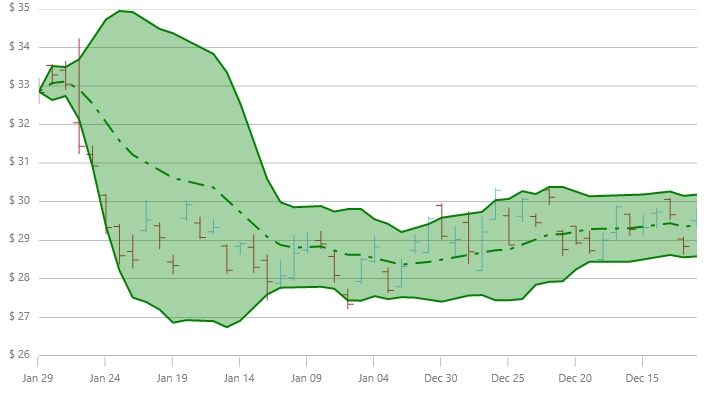
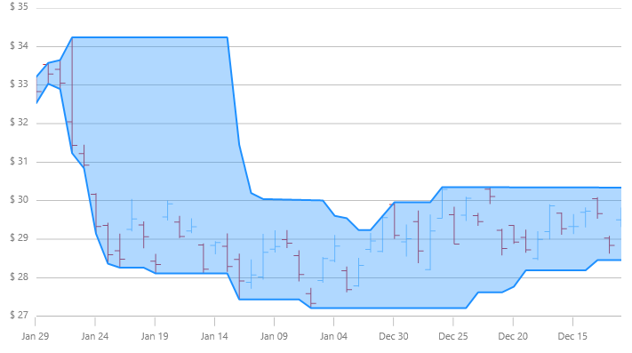

////
|metadata|
{
    "name": "datachart-financial-overlays-overview",
    "controlName": ["{DataChartName}"],
    "tags": ["Charting","How Do I"],
    "guid": "",
    "buildFlags": [],
    "createdOn": "2017-03-05T19:39:00.4613012Z"
}
|metadata|
////

= Financial Overlays
 
=== Purpose

This topic provides detailed overview and instruction on how to create financial overlays in the  link:{DataChartLink}.{DataChartName}.html[{DataChartName}]™ control.

=== Required Background

The following topics are prerequisites to understanding this topic:

[options="header", cols="a,a"]
|====
|Topic|Purpose

| link:datachart-datachart.html[{DataChartName} ]
|This topic provides a general overview of the _{DataChartName}_ control

| link:datachart-getting-started-with-datachart.html[Getting Started with Data Chart]
|This topic provides information on how to get started with the _{DataChartName}_ control.

| link:datachart-series-requirements.html[Series Requirements]
|This topic provides information on requirements of Series objects in the _{DataChartName}_ control.

|====

=== In this topic

This topic contains the following sections:

* <<_Introduction,Introduction>>
* <<_DataMapping,Data Mapping>>
* <<_OverlaysTypes,Types of Overlays>>
* <<_CodeExample,Code Example>>
* <<_RelatedContent,Related Content>>

[[_Introduction]]
== Introduction

Financial Overlays are often used by traders to measure changes and to show trends in stock prices. These overlays are usually displayed in front of the link:datachart-series-financial-price-series-overview.html[Financial Price Series] because they share the same Y-Axis scale. In contrast, link:datachart-financial-indicators-overview.html[Financial Indicators] do not share the same Y-Axis scale with the `FinancialPriceSeries` and as result Financial Indicators are usually plotted below or above the `FinancialPriceSeries` or Financial Overlays. However, the chart control supports plotting both overlays as well as indicators in the same plot area, if desired, using multiple axes or by sharing axes. For more information on this, please refer to link:datachart-multiple-axes.html[Using Multiple Axes] and link:datachart-multiple-series.html[Adding Multiple Series] articles.

For more detailed information on financial overlays and indicators, please refer to the following online resources:

* link:http://en.wikipedia.org/wiki/Technical_analysis#Price-based_indicators[Technical Analysis]
* link:http://help.yahoo.com/l/us/yahoo/finance/charts/chart-12.html[Technical Indicator Details]

[[_DataMapping]]
== Data Mapping

All financial overlays require specific data mapping to stock price values (open, high, low, close), and stock volume. The following table lists properties of financial overlays with mappings data columns. You can find an example of financial stock data in the link:resources-sample-stocks-data.html[Stocks Price Data] source.

[options="header", cols="a,a,a"]
|====
|Property Name|Property Type|Data Columns

| link:{DataChartLink}.FinancialSeries{ApiProp}OpenMemberPath.html[OpenMemberPath]
|`string`
|Open

| link:{DataChartLink}.FinancialSeries{ApiProp}CloseMemberPath.html[CloseMemberPath]
|`string`
|Close

| link:{DataChartLink}.FinancialSeries{ApiProp}HighMemberPath.html[HighMemberPath]
|`string`
|High

| link:{DataChartLink}.FinancialSeries{ApiProp}LowMemberPath.html[LowMemberPath]
|`string`
|Low

| link:{DataChartLink}.FinancialSeries{ApiProp}VolumeMemberPath.html[VolumeMemberPath]
|`string`
|Volume

|====

[[_OverlaysTypes]]
== Types of Financial Overlays

The {DataChartName} control supports over 2 types of financial overlays and the following table provides previews as as well as descriptions of these financial overlays:

[cols="a"]
|====
|Overlay Types  

| link:{DataChartLink}.bollingerbandsoverlay.html[BollingerBandsOverlay] (BBO) is a financial overlay that is a visual set of bands plotted above and below the price series. Bollinger Bands are based on the standard deviation in the prices, so they incorporate price changes in their width. The bands are wider when the standard deviation increases and narrower when the standard deviation decreases and are smoothed by a moving average. Apart from the standard deviation and smoothing period being user adjustable, there is also a user adjustable multiplier to affect the scale of the BollingerBandsOverlay width 

| link:{DataChartLink}.pricechanneloverlay.html[PriceChannelOverlay] (PCO) displays price volatility. The changes in price over time are displayed between two parallel lines. The lower line is the trend line and is drawn on the lows prices, and the upper line is the channel line and is based on the high prices. Channels show trend direction for any time frame. Price channels, or trend, can be up, down or sideways 

|====

[[_CodeExample]]
== Code Example

The following code snippet shows how to add a `BollingerBandsOverlay` to the Data Chart control with binding to the link:resources-sample-stocks-data.html[Stock Price Data] source.  

.Note:
[NOTE]
====
You can use the same code to create instances of other type of financial overlays by just replacing the `BollingerBandsOverlay` type with the `PriceChannelOverlay` type.
====

ifdef::wpf,win-universal[]
*In XAML:*
[source,xaml]
----
<ig:{DataChartName} x:Name="DataChart" >
    <ig:{DataChartName}.Resources>
        <local:StockPriceData x:Key="data" />
    </ig:{DataChartName}.Resources>
    <ig:{DataChartName}.Axes>
        <ig:NumericYAxis x:Name="yAxis"  />
        <ig:CategoryXAxis x:Name="xAxis" ItemsSource="{StaticResource data}" Label="{}{Date}" />
    </ig:{DataChartName}.Axes>
    <ig:{DataChartName}.Series>
        <ig:BollingerBandsOverlay 
                XAxis="{Binding ElementName=xAxis}" 
                YAxis="{Binding ElementName=yAxis}" 
                ItemsSource="{StaticResource data}" 
                OpenMemberPath="Open" 
                CloseMemberPath="Close" 
                HighMemberPath="High" 
                LowMemberPath="Low" 
                VolumeMemberPath="Volume">
        </ig:BollingerBandsOverlay>
    </ig:{DataChartName}.Series>
</ig:{DataChartName}>
----
endif::wpf,win-universal[]
 
ifdef::xamarin[]
*In XAML:*
[source,xaml]
----
<ig:{DataChartName} x:Name="DataChart" >
    <ig:{DataChartName}.Resources>
		<ResourceDictionary>
			<local:StockPriceData x:Key="data" />
		</ResourceDictionary>	
    </ig:{DataChartName}.Resources>
    <ig:{DataChartName}.Axes>
        <ig:NumericYAxis x:Name="yAxis"  />
        <ig:CategoryXAxis x:Name="xAxis" ItemsSource="{StaticResource data}" Label="Date" />
    </ig:{DataChartName}.Axes>
    <ig:{DataChartName}.Series>
        <ig:BollingerBandsOverlay 
                XAxis="{x:Reference xAxis}" 
                YAxis="{x:Reference yAxis}" 
                ItemsSource="{StaticResource data}" 
                OpenMemberPath="Open" 
                CloseMemberPath="Close" 
                HighMemberPath="High" 
                LowMemberPath="Low" 
                VolumeMemberPath="Volume">
        </ig:BollingerBandsOverlay>
    </ig:{DataChartName}.Series>
</ig:{DataChartName}>
----
endif::xamarin[]
 

ifdef::wpf,win-universal,xamarin[]
*In C#:*
[source,csharp]
----
var data = new StockPriceData(); 
var yAxis = new NumericYAxis();
var xAxis = new CategoryXAxis();
xAxis.ItemsSource = data;
xAxis.Label = "{Date}";
var overlay = new BollingerBandsOverlay();
overlay.ItemsSource = data;
overlay.OpenMemberPath = "Open";
overlay.HighMemberPath = "High";
overlay.LowMemberPath = "Low";
overlay.CloseMemberPath = "Close";
overlay.VolumeMemberPath = "Volume";
overlay.XAxis = xAxis;
overlay.YAxis = yAxis;
this.DataChart.Axes.Add(xAxis);
this.DataChart.Axes.Add(yAxis);
this.DataChart.Series.Add(overlay);
----
endif::wpf,win-universal,xamarin[]

ifdef::win-forms[]
*In C#:*
[source,csharp]
----
var data = new StockPriceData(); 
var yAxis = new NumericYAxis();
var xAxis = new CategoryXAxis();
xAxis.DataSource = data;
xAxis.Label = "{Date}";
var overlay = new BollingerBandsOverlay();
overlay.DataSource = data;
overlay.OpenMemberPath = "Open";
overlay.HighMemberPath = "High";
overlay.LowMemberPath = "Low";
overlay.CloseMemberPath = "Close";
overlay.VolumeMemberPath = "Volume";
overlay.XAxis = xAxis;
overlay.YAxis = yAxis;
this.DataChart.Axes.Add(xAxis);
this.DataChart.Axes.Add(yAxis);
this.DataChart.Series.Add(overlay);
----
endif::win-forms[]

ifdef::wpf,win-universal[]
*In Visual Basic:*
[source,vb]
----
Dim data As New StockPriceData()
Dim yAxis As New NumericYAxis()
Dim xAxis As New CategoryXAxis() 
xAxis.ItemsSource = data 
xAxis.Label = "Date"
Dim overlay As New BollingerBandsOverlay() 
overlay.ItemsSource = data
overlay.OpenMemberPath = "Open"
overlay.HighMemberPath = "High"
overlay.LowMemberPath = "Low"
overlay.CloseMemberPath = "Close"
overlay.VolumeMemberPath = "Volume"
overlay.XAxis = xAxis
overlay.YAxis = yAxis
Me.DataChart.Axes.Add(xAxis)
Me.DataChart.Axes.Add(yAxis)
Me.DataChart.Series.Add(overlay)
----
endif::wpf,win-universal[]

ifdef::win-forms[]
*In Visual Basic:*
[source,vb]
----
Dim data As New StockPriceData()
Dim yAxis As New NumericYAxis()
Dim xAxis As New CategoryXAxis()
xAxis.DataSource = data
xAxis.Label = "{Date}"
Dim overlay As New BollingerBandsOverlay()
overlay.DataSource = data
overlay.OpenMemberPath = "Open"
overlay.HighMemberPath = "High"
overlay.LowMemberPath = "Low"
overlay.CloseMemberPath = "Close"
overlay.VolumeMemberPath = "Volume"
overlay.XAxis = xAxis
overlay.YAxis = yAxis
Me.DataChart.Axes.Add(xAxis)
Me.DataChart.Axes.Add(yAxis)
Me.DataChart.Series.Add(overlay)
----
endif::win-forms[]

[[_RelatedContent]]
== Related Content

=== Topics

The following topics provide additional information related to this topic.

[options="header", cols="a,a"]
|====
|Topic|Purpose

| link:datachart-datachart.html[{DataChartName}] 

|This topic provides a general overview of the _{DataChartName}_ control

| link:datachart-getting-started-with-datachart.html[Getting Started with Data Chart]
|This topic provides information on how to get started with the _{DataChartName}_ control.

| link:datachart-series-requirements.html[Series Requirements]
|This topic provides information on requirements of Series objects in the _{DataChartName}_ control.

|====