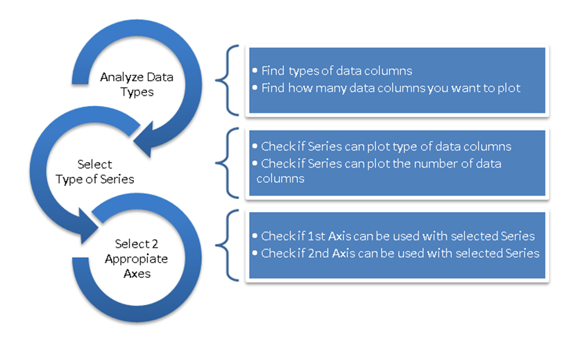

////

|metadata|
{
    "name": "datachart-getting-started-with-datachart",
    "controlName": ["{DataChartName}"],
    "tags": ["Charting","Getting Started"],
    "guid": "5f39946e-59dc-43f0-bd49-91714053bfbb",  
    "buildFlags": [],
    "createdOn": "2014-06-05T19:39:00.7013987Z"
}
|metadata|
////

= Getting Started with Data Chart

== Topic Overview

=== Purpose

This topic provides information on how to get started with the  _link:{DataChartLink}.{DataChartName}.html[{DataChartName}]™_   control in your application.

=== Required background

The following topics are prerequisites to understanding this topic:

[options="header", cols="a,a"]
|====
|Topic|Purpose

ifdef::xamarin[]
| link:xamarin-project-with-infragistics-controls.html[Creating Project with Infragistics Controls]
|This topic explains how to create application project to use with Ultimate UI for Xamarin controls.
endif::xamarin[]

| link:datachart-datachart.html[{DataChartName}]
|This topic provides a general overview of the _{DataChartName}_ .

|====

=== In this topic

This topic contains the following sections:

* <<Ref397366350,Understanding Chart>>
* <<Ref397366354,Selecting Chart>>
* <<Ref386478106,Creating Chart>>

[[Ref397366350]]

=== Understanding Chart

This section provides information on basic elements of the chart control that are required to plot data.

[options="header", cols="a,a"]
|====
|Chart Element|Descrption

| link:{DataChartLink}.{DataChartName}.html[{DataChartName}]
|The _{DataChartName}_ is a control that supports various types of data visualizations which are called Series objects. The chart control can contain multiple visualizations of your data in the same chart plot area.

| link:{DataChartLink}.series.html[Series]
|The Series objects provide actual visualization of your data. The chart support different types of Series and all types of series are listed in the link:datachart-series-types.html[Series Types] topic. Each type of series can plot data that meets certain data requirements (such as number of data column and their types) as well as what type of axis can be used with it. Refer to the link:datachart-series-requirements.html[Series Requirements] topic for requirements for each of the series.

| link:{DataChartLink}.axis.html[Axis]
|The Axis objects provide context and information about range of data in a form of labels, numbers, tickmarks, gridlines, stips, and titles. The chart support different types of Axis objects which can be used only with certain types of Series. Refer to the link:datachart-axes.html[Chart Axes] topic for more information about types of axis supported by the chart control.

|====

[[Ref397366354]]

=== Selecting Chart

Based on type of your data, you need to choose which type of series you want to use in the chart control. Some types of series offer support only for certain types of axis. Therefore, you also need to select valid axes that work with selected series.

The following flow chart explains the process of selecting series and axes based on data that you wish to plot in the chart control.

[[Ref386478106]]

=== Creating Chart

After selecting type of series and two valid axes, you can create an instance of the {DataChartName} control in your application. The following topics provide instructions on how to create the Data Chart control using different methods.

[options="header", cols="a,a"]
|====
|Topic|Purpose

ifdef::xaml,android[]
| link:datachart-creating-chart-in-code-behind-xaml.html[Creating Chart in Code Behind]
|This topic provides instruction how to create the {DataChartName} control in code behind.
endif::xaml,android[]

ifdef::xaml[]
| link:datachart-creating-chart-in-xaml-code.html[Creating Chart in XAML Code]
|This topic provides instruction how to create the {DataChartName} control in XAML code.
endif::xaml[]

ifdef::wpf,win-universal[]
| link:datachart-creating-chart-in-ms-blend-xaml.html[Creating Chart in MS Blend]
|This topic provides instruction how to create the {DataChartName} control in MS Blend designer.
endif::wpf,win-universal[]

ifdef::win-forms[]
| link:datachart-creating-chart-in-vs-designer-winforms.html[Creating Chart In VS Designer]
|This topic provides instruction how to create the {DataChartName} control in {PlatformIDE} designer.
endif::win-forms[]

ifdef::win-forms[]
| link:datachart-creating-chart-in-code-behind-winforms.html[Creating Chart In Code Behind]
|This topic provides instruction how to create the {DataChartName} control in code behind.
endif::win-forms[]

|====