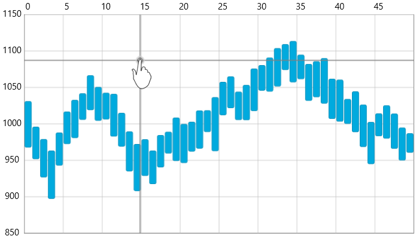
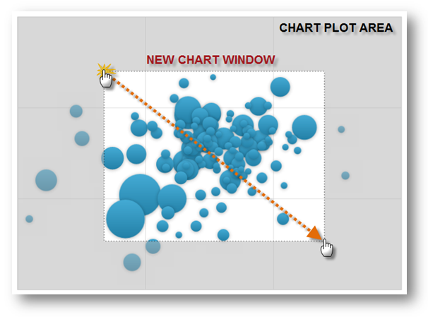
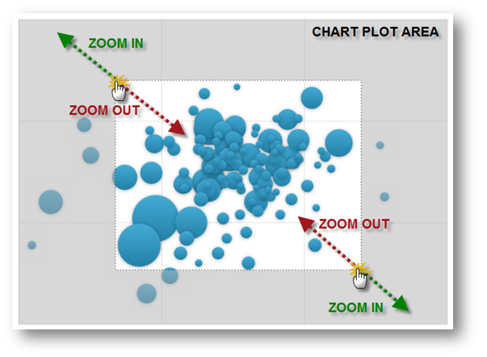
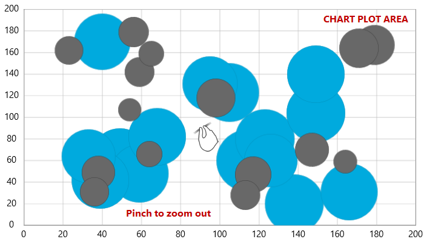
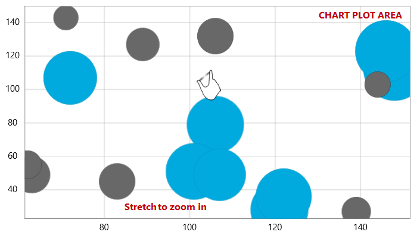
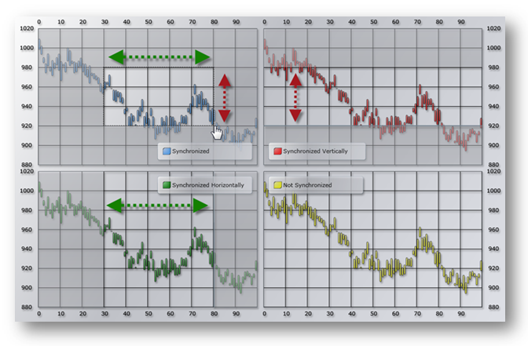
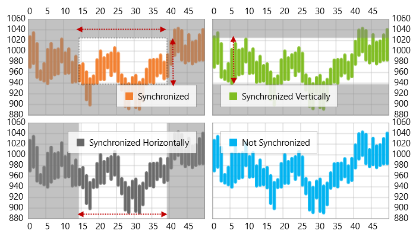
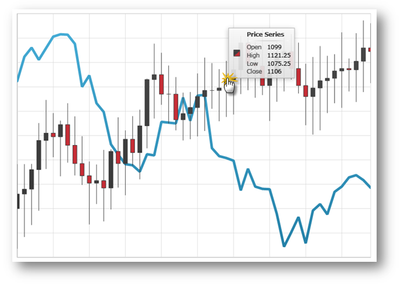

////
|metadata|
{
    "name": "datachart-interactions",
    "controlName": ["{DataChartName}"],
    "tags": ["Charting","How Do I"],
    "guid": "a5ba37a7-ffc7-4c55-9661-67a4d0659d1a",
    "buildFlags": [],
    "createdOn": "2014-06-05T19:39:00.6573809Z"
}
|metadata|
////

= Chart Interactions

The link:{DataChartLink}.{DataChartName}.html[{DataChartName}]™ control makes it easy for your users to get a close-up look at data points because when you can show tens of thousands of data points, the individual points lose their identity when completely zoomed out. Use the keyboard, zoombar, mouse wheel, or drag-select any rectangular region with the mouse to zoom in for greater detail and use arrows keys to pan the chart area. In addition, chart crosshairs can be used to show the relationship between points on the graph that are aligned on or near the same axis values. Also chart tooltips can be customized to display detailed information about data points.

This section is your gateway to important task-based information that will help you handle common end user interaction with the {DataChartName} control.

* link:datachart-chart-crosshair.html[Chart Crosshair]
* link:datachart-chart-navigation.html[Chart Navigation]

ifdef::wpf,win-universal[]
* link:datachart-chart-synchronization.html[Chart Synchronization]

endif::wpf,win-universal[]

ifdef::wpf,win-universal[]
* link:datachart-chart-tooltips.html[Chart Tooltips]

endif::wpf,win-universal[]

ifdef::wpf,win-universal,sl,win-phone[]

endif::wpf,win-universal,sl,win-phone[]

ifdef::win-forms[]
image::images/WF_Chart_Crosshair.png[]
endif::win-forms[]

The {DataChartName} control with a custom style for crosshair lines

ifdef::sl,wpf,win-universal[]

endif::sl,wpf,win-universal[]

ifdef::sl,wpf,win-universal[]
The {DataChartName} control with zooming to a specific area using mouse dragging
endif::sl,wpf,win-universal[]

ifdef::win-phone[]

endif::win-phone[]

ifdef::win-universal[]

endif::win-universal[]

ifdef::win-universal[]

endif::win-universal[]

ifdef::win-phone[]
The {DataChartName} control showing chart zooming using finger stretching and pinching
endif::win-phone[]

ifdef::sl,wpf,win-phone[]

endif::sl,wpf,win-phone[]

ifdef::win-universal[]

endif::win-universal[]

ifdef::sl,wpf,win-phone,win-universal[]
The {DataChartName} controls with different synchronization modes
endif::sl,wpf,win-phone,win-universal[]

ifdef::sl,wpf,win-phone,win-forms[]

endif::sl,wpf,win-phone,win-forms[]

ifdef::win-universal[]
image::images/xamDataChart_RT_Chart_Tooltips_01.png[]
endif::win-universal[]

The {DataChartName} control with custom tooltip showing values of Financial Price Series