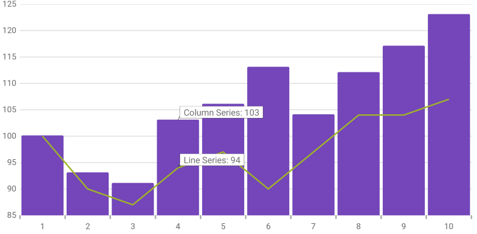

////
|metadata|
{
    "name": "datachart-itemtooltiplayer",
    "controlName": ["{DataChartName}"],
    "tags": ["Charting","Getting Started","How Do I"],
    "guid": "090c1df8-54f3-4d15-a5bb-838702753837",
    "buildFlags": ["ANDROID","SL","WPF","WINFORMS"],
    "createdOn": "2014-06-05T19:39:00.6353742Z"
}
|metadata|
////

= Item Tooltip Layer

=== Purpose

This topic provides information about the item tooltip layer which is used for hover interactions in the link:datachart-category-series-overview.html[Category Series]. It describes the properties of the item tooltip layer and also provides an example of its implementation.

=== Required background

The following topics are prerequisites to understanding this topic:

[options="header", cols="a,a"]
|====
|Topic|Purpose

| link:datachart-getting-started-with-datachart.html[Getting Started with Data Chart]
|The _{DataChartName}_ control requires a data object model to be mapped to control's DataContext property. This article will provide a simple data object model but you can create your own and use it with this sample code instead.

| link:datachart-category-series-overview.html[Category Series]
|This topic explains various types of Category Series in the _{DataChartName}_ control.

|====

=== In this topic

This topic contains the following sections:

* <<Overview,Overview>>
* <<Properties,Properties>>
* <<Example,Example>>
* <<RelatedContent,Related Content>>

[[Overview]]
== Overview

=== Item tooltip layer overview

The link:{DataChartLink}.itemtooltiplayer_members.html[ItemToolTipLayer] displays tooltips for all the series on the  _{DataChartName}_  control individually when a pointer pick:[wpf,win-universal="hovers over"]pick:[xamarin="tap and holds"] that particular series.

The tooltip style is inherited from the chart. pick:[wpf,sl,win-universal="However, you can override this default behavior by setting the"]
pick:[wpf,sl,win-universal=" link:{DataChartLink}.itemtooltiplayer{ApiProp}tooltipstyle.html[ToolTipStyle]"] pick:[wpf,sl,win-universal="property."]
pick:[xaml="For more information see the"] <<Properties,Properties>> pick:[xaml="section below."]

[[Preview]]

=== Preview

The following image is a preview of the  _{DataChartName}_  control renders with the link:{DataChartLink}.itemtooltiplayer_members.html[ItemToolTipLayer] added.

ifdef::wpf,win-universal[]
image::images/Item_Tooltip_Layer_1.png[]
endif::wpf,win-universal[]

ifdef::xamarin[]

endif::xamarin[]

[[Properties]]
== Properties

=== Item tooltip layer summary

The following table summarizes the properties of the link:{DataChartLink}.itemtooltiplayer_members.html[ItemToolTipLayer] layer.

[options="header", cols="a,a,a"]
|====
|Property Name|Property Type|Description

| link:{DataChartLink}.itemtooltiplayer{ApiProp}targetseries.html[TargetSeries]
|`Series`
|This property specifies which series should have an enabled item tooltip layer. 

It is possible to create a separate item tooltip layer for each series and configure them individually.

ifdef::wpf,win-universal[]
| link:{DataChartLink}.itemtooltiplayer{ApiProp}tooltipstyle.html[ToolTipStyle]
|`Style`
|This property specifies a style to apply to the displayed tooltip. By default, the tooltip inherits its style from the chart, but setting this property will override this default setting.

| link:{DataChartLink}.itemtooltiplayer{ApiProp}pointertooltipstyle.html[PointerToolTipStyle]
|`Style`
|This property specifies a style to apply to the pointer area of the tooltip.
endif::wpf,win-universal[]

| link:{DataChartLink}.itemtooltiplayer{ApiProp}useinterpolation.html[UseInterpolation]
|`bool`
|This property specifies if the tooltip’s x position should be interpolated rather than snapping to the gridlines or the center spaces.

|====

[[Example]]
== Example

=== Example

The following screenshot demonstrates how the  _{DataChartName}_  control with the link:{DataChartLink}.itemtooltiplayer{ApiProp}targetseries.html[TargetSeries] property of the link:{DataChartLink}.itemtooltiplayer_members.html[ItemToolTipLayer] object looks as a result of the following setting:

[options="header", cols="a,a"]
|====
|Property|Value

| link:{DataChartLink}.itemtooltiplayer{ApiProp}targetseries.html[TargetSeries]
|series1

|====

ifdef::wpf,win-universal[]
image::images/Item_Tooltip_Layer_2.png[]
endif::wpf,win-universal[]

ifdef::xamarin[]
image::images/Item_Tooltip_Layer_4.png[]
endif::xamarin[]

Following is the code used in this implementation

ifdef::wpf,win-universal[]

*In XAML:*

[source,xaml]
----
<ig:{DataChartName} x:Name="theChart" Margin="5,0,5,0" >
   <ig:{DataChartName}.Axes>
      <ig:CategoryXAxis x:Name="xmCategoryXAxis"
                        ItemsSource="{StaticResource CategoryData1}"
                        Label="{}{Category}">
        <ig:CategoryXAxis.LabelSettings>
           <ig:AxisLabelSettings x:Name="xmCategoryXAxisLabel" Extent="25" VerticalAlignment="Bottom" FontSize="11" />
           </ig:CategoryXAxis.LabelSettings>
        </ig:CategoryXAxis>
        <ig:NumericYAxis x:Name="xmNumericYAxis1">
           <ig:NumericYAxis.LabelSettings>
              <ig:AxisLabelSettings x:Name="xmNumericYAxisLabel" Extent="50" Location="OutsideLeft" />
              </ig:NumericYAxis.LabelSettings>
           </ig:NumericYAxis>
        </ig:{DataChartName}.Axes>
        <ig:{DataChartName}.Series>
           <ig:ColumnSeries x:Name="series1" 
                            ItemsSource="{StaticResource CategoryData1}"
                            ValueMemberPath="Value" 
                            XAxis="{Binding ElementName=xmCategoryXAxis}" 
                            YAxis="{Binding ElementName=xmNumericYAxis1}">
              <ig:ColumnSeries.ToolTip>
                 <TextBlock Text="{Binding Item.Value}" />
              </ig:ColumnSeries.ToolTip>
           </ig:ColumnSeries>
           <ig:LineSeries ItemsSource="{StaticResource CategoryData2}" 
                          ValueMemberPath="Value" 
                          XAxis="{Binding ElementName=xmCategoryXAxis}" 
                          YAxis="{Binding ElementName=xmNumericYAxis1}">
            <ig:LineSeries.ToolTip>
               <TextBlock Text="{Binding Item.Value}" />
            </ig:LineSeries.ToolTip>
         </ig:LineSeries>
         <ig:ItemToolTipLayer 
                 TargetSeries="{Binding ElementName=series1}"
         />
   </ig:{DataChartName}.Series>
</ig:{DataChartName}>
----

endif::wpf,win-universal[]

ifdef::xamarin[]

[source,xaml]
----
<ig:{DataChartName} x:Name="theChart">
    <ig:{DataChartName}.Axes>
        <ig:CategoryXAxis x:Name="xAxis"
                          ItemsSource="{Binding CategoryData1}"
                          Label="Category"/>
        <ig:NumericYAxis x:Name="yAxis"/>
    </ig:{DataChartName}.Axes>
    <ig:{DataChartName}.Series>
        <ig:ColumnSeries x:Name="series1"
                         ItemsSource="{Binding CategoryData1}"
                         ValueMemberPath="Value"
                         XAxis="{x:Reference xAxis}"
                         YAxis="{x:Reference yAxis}">
            <ig:ColumnSeries.ToolTipTemplate>
                <DataTemplate>
                    <Label Text="{Binding Item.Value}" FontSize="12" />
                </DataTemplate>
            </ig:ColumnSeries.ToolTipTemplate>
        </ig:ColumnSeries>
        <ig:LineSeries ItemsSource="{Binding CategoryData2}"
                       ValueMemberPath="Value"
                       XAxis="{x:Reference xAxis}"
                       YAxis="{x:Reference yAxis}">
            <ig:LineSeries.ToolTipTemplate>
                <DataTemplate>
                    <Label Text="{Binding Item.Value}" FontSize="12" />
                </DataTemplate>
            </ig:LineSeries.ToolTipTemplate>
        </ig:Lineseries>
        
        <ig:ItemToolTipLayer TargetSeries="{x:Reference series1}"/>
    </ig:{DataChartName}.Series>
</ig:{DataChartName}>
----

endif::xamarin[]

ifdef::wpf[]

*In C#:*

----
var itemToolTipLayerSeries = new ItemToolTipLayer();
itemToolTipLayerSeries.TargetSeries = series1;
chart.Series.Add(itemToolTipLayerSeries);
----

endif::wpf[]

ifdef::win-forms[]

*In C#:*

----
var itemToolTipLayerSeries = new ItemToolTipLayer();
itemToolTipLayerSeries.TargetSeries = series1;
chart.Series.Add(itemToolTipLayerSeries);
----

endif::win-forms[]

ifdef::xamarin[]

*In C#:*

----
var itemToolTipLayerSeries = new ItemToolTipLayer();
itemToolTipLayerSeries.TargetSeries = series1;
chart.Series.Add(itemToolTipLayerSeries);
----

endif::xamarin[]

[[RelatedContent]]
== Related Content

[options="header", cols="a,a"]
|====
|Topic|Purpose

ifdef::wpf[]
| link:datachart-commonproperties.html[Common Properties]
|This topic provides information about the properties and methods that the hover interaction feature uses for highlighting, hovering and interacting with the tooltip interactions inherited from the link:{DataChartLink}.series_members.html[Series] class.
endif::wpf[]

| link:datachart-crosshairlayer.html[Crosshair Layer]
|This topic provides information about the crosshair layer used for hover interactions. It describes the properties of the crosshair layer and provides an implementation example.

| link:datachart-categoryhighlightlayer.html[Category Highlight Layer]
|This topic provides information about the category highlight layer which is used for hover interactions. It describes the properties of the category highlight layer and provides an example of its implementation.

| link:datachart-categoryitemhighlightlayer.html[Category Item Highlight Layer]
|This topic provides information about the category item highlight layer used for hover interactions. It describes the properties of the category item highlight layer and provides an example of its implementation.

| link:datachart-categorytooltiplayer.html[Category Tooltip Layer]
|This topic provides information about the category tooltip layer used for hover interactions. It describes the properties of the category tooltip layer and provides an example of its implementation.

|====