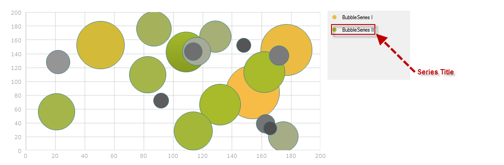
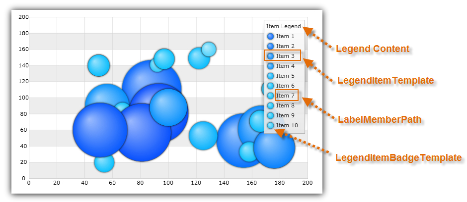
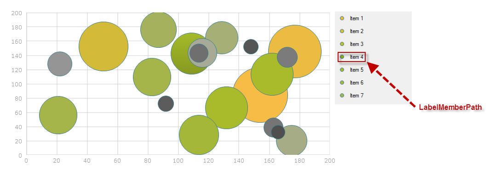
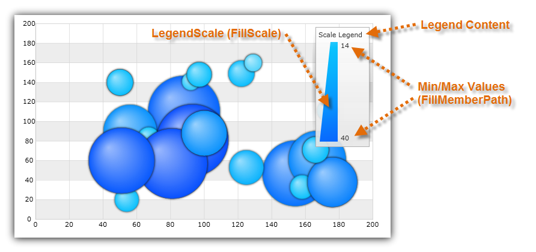
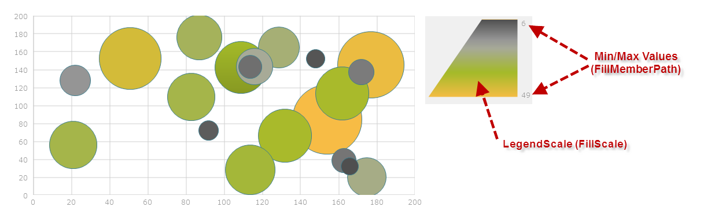

////
|metadata|
{
    "name": "datachart-legends",
    "controlName": ["{DataChartName}"],
    "tags": ["Charting"],
    "guid": "5e4aa82c-8645-490e-b0d0-dd733c4bec20",
    "buildFlags": [],
    "createdOn": "2014-06-05T19:39:00.6743876Z"
}
|metadata|
////

= Chart Legends

This topic introduces legends and explains which type of legends are supported by link:datachart-series.html[Chart Series] in the link:{DataChartLink}.{DataChartName}.html[{DataChartName}]™ control. The topic is organized as follows:

* <<Introduction,Introduction>>
* <<Legends,Types of Legends>>

** <<BasicLegend,Basic Legend>>
ifdef::wpf,win-universal,xamarin[]
** <<ScaleLegend,Scale Legend>>
endif::wpf,win-universal,xamarin[]
** <<ItemLegend,Item Legend>>

ifdef::android,wpf,win-universal[]
* <<Properties,Common Properties>>
endif::android,wpf,win-universal[]
* <<RelatedContent,Related Content>>

[[Introduction]]
== Introduction

Legends help end-user identify visuals of chart series with contextual infomration releated to data plotted in the chart control. Most charts should have at least one legend in order to make it easier to understand data displayed in the chart plot area. However, it is not a requirement and the chart can render without any legends. Most legends are small so you can render them over the chart control or outside of the chart if you decided to do so.

[[Legends]]
== Types of Legends

The {DataChartName} control supports various types of legends, but not all legends can be used with any type of series. The following list shows the supported group of series for each legend type.

[[BasicLegend]]
* Basic link:{LegendLink}.{LegendName}.html[{LegendName}]
 
+
ifdef::xamarin,wpf,win-universal,android,xamarin[] 
image::images/xamDataChart_Legends_02.png[] 
endif::xamarin,wpf,win-universal,android,xamarin[] 
ifdef::win-forms[] 
 
endif::win-forms[] 
+
Supported series:

** link:datachart-category-series-overview.html[Category Series] 
** link:datachart-series-financial-price-series-overview.html[Financial Series] 
** link:datachart-financial-indicators-overview.html[Financial Indicators] 
** link:datachart-financial-overlays-overview.html[Financial Overlays] 
** link:datachart-polar-series-overview.html[Polar Series] 
** link:datachart-radial-series-overview.html[Radial Series] 
** link:datachart-scatter-series-overview.html[Scatter Series] 

[[ItemLegend]]
* link:{ItemLegendLink}.{ItemLegendName}.html[{ItemLegendName}]

+
ifdef::xamarin,wpf,win-universal,android[] 
 
endif::xamarin,wpf,win-universal,android[] 
ifdef::win-forms[] 
 
endif::win-forms[] 
+
Supported series:

** link:datachart-bubble-series.html[Scatter Bubble Series]

[[ScaleLegend]]
* link:{SCaleLegendLink}.{ScaleLegendName}.html[{ScaleLegendName}]

+
ifdef::wpf,win-universal,xamarin[] 
 
endif::wpf,win-universal,xamarin[] 
ifdef::win-forms[] 
 
endif::win-forms[] 
+
Supported series:

** link:datachart-bubble-series.html[Scatter Bubble Series]

[[Properties]]
ifdef::android,wpf,win-universal[]
== Common Properties

All chart legends inherit from the same base class and they shares common properties with each other. The following table lists these common properties.
 
[options="header", cols="a,a,a"]
|====
|Property Name|Property Type|Description

ifdef::wpf,win-universal[]
| link:{DataChartLink}.legendbase{ApiProp}itemsfontfamily.html[ItemsFontFamily]
|FontFamily
|Determines font family for legend items.
endif::wpf,win-universal[]

ifdef::wpf,win-universal[]
| link:{DataChartLink}.legendbase{ApiProp}itemsfontsize.html[ItemsFontSize]
|double
|Determines font size for legend items.
endif::wpf,win-universal[]

ifdef::wpf,win-universal[]
| link:{DataChartLink}.legendbase{ApiProp}itemsfontstretch.html[ItemsFontStretch]
|FontStretch
|Determines font stretch for legend items.
endif::wpf,win-universal[]

ifdef::wpf,win-universal[]
| link:{DataChartLink}.legendbase{ApiProp}itemsfontstyle.html[ItemsFontStyle]
|FontStyle
|Determines font style for legend items.
endif::wpf,win-universal[]

ifdef::wpf,win-universal[]
| link:{DataChartLink}.legendbase{ApiProp}itemsfontweight.html[ItemsFontWeight]
|FontWeight
|Determines font weight for legend items.
endif::wpf,win-universal[]

ifdef::wpf,win-universal[]
| link:{DataChartLink}.legendbase{ApiProp}itemsforeground.html[ItemsForeground]
|Brush
|Determines foreground brush for legend items.
endif::wpf,win-universal[]

ifdef::wpf,win-universal[]
| link:{DataChartLink}.legendbase{ApiProp}itemshorizontalalignment.html[ItemsHorizontalAlignment]
|HorizontalAlignment
|Determines horizontal alignment of legend items in the legend.
endif::wpf,win-universal[]

ifdef::wpf,win-universal[]
| link:{DataChartLink}.legendbase{ApiProp}itemsverticalalignment.html[ItemsVerticalAlignment]
|VerticalAlignment
|Determines vertical alignment of legend items in the legend.
endif::wpf,win-universal[]

ifdef::wpf,win-universal[]
| link:{DataChartLink}.legendbase{ApiProp}titlefontfamily.html[TitleFontFamily]
|FontFamily
|Determines font family for legend title.
endif::wpf,win-universal[]

ifdef::wpf,win-universal[]
| link:{DataChartLink}.legendbase{ApiProp}titlefontsize.html[TitleFontSize]
|double
|Determines font size for legend title.
endif::wpf,win-universal[]

ifdef::wpf,win-universal[]
| link:{DataChartLink}.legendbase{ApiProp}titlefontstretch.html[TitleFontStretch]
|FontStretch
|Determines font stretch for legend title.
endif::wpf,win-universal[]

ifdef::wpf,win-universal[]
| link:{DataChartLink}.legendbase{ApiProp}titlefontstyle.html[TitleFontStyle]
|FontStyle
|Determines font style for legend title.
endif::wpf,win-universal[]

ifdef::wpf,win-universal[]
| link:{DataChartLink}.legendbase{ApiProp}titlefontweight.html[TitleFontWeight]
|FontWeight
|Determines font weight for legend title.
endif::wpf,win-universal[]

ifdef::wpf,win-universal[]
| link:{DataChartLink}.legendbase{ApiProp}titleforeground.html[TitleForeground]
|Brush
|Determines foreground brush for legend title.
endif::wpf,win-universal[]

ifdef::wpf,win-universal[]
| link:{DataChartLink}.legendbase{ApiProp}titlehorizontalalignment.html[TitleHorizontalAlignment]
|HorizontalAlignment
|Determines horizontal alignment of legend title in the legend.
endif::wpf,win-universal[]

ifdef::wpf,win-universal[]
| link:{DataChartLink}.legendbase{ApiProp}titleverticalalignment.html[TitleVerticalAlignment]
|VerticalAlignment
|Determines vertical alignment of legend title in the legend.
endif::wpf,win-universal[]

ifdef::android[]
| link:{DataChartLink}.legendviewbase{ApiProp}ishorizontal.html[IsHorizontal]
|boolean
|Determines vertical/horizontal orientation of legend items in the legend.
endif::android[]

ifdef::android[]
| link:{DataChartLink}.legendviewbase{ApiProp}fontstyle.html[FontStyle]
|int
|Determines text color in the legend.
endif::android[]

ifdef::android[]
| link:{DataChartLink}.legendviewbase{ApiProp}fontfamily.html[FontFamily]
|string
|Determines text color in the legend.
endif::android[]

ifdef::android[]
| link:{DataChartLink}.legendviewbase{ApiProp}textsize.html[TextSize]
|double
|Determines text size in the legend.
endif::android[]

ifdef::android[]
| link:{DataChartLink}.legendviewbase{ApiProp}textcolor.html[TextColor]
|int
|Determines text color in the legend.
endif::android[]

ifdef::android[]
| link:{DataChartLink}.legendviewbase{ApiProp}typeface.html[Typeface]
|Typeface
|Determines typeface to use in the legend. Overrides FontFamily and FontStyle settings.
endif::android[]

ifdef::wpf,win-universal[]
| link:http://msdn.microsoft.com/en-us/library/system.windows.controls.contentcontrol.content.aspx[Content]
|object
|Determines text displyed as header of legend above legend items.
endif::wpf,win-universal[]

ifdef::wpf,win-universal[]
| link:http://msdn.microsoft.com/en-us/library/system.windows.controls.control.template.aspx[Template]
|object
|Determines a template for the legend, which allows styling of the legend header and legend items.
endif::wpf,win-universal[]

ifdef::wpf,win-universal[]
|Series. pick:[wpf,win-universal=" link:{DataChartLink}.series{ApiProp}legenditemtemplate.html[LegendItemTemplate]"]
|DataTemplate
|Determines a template for the legend item of a given chart series.
endif::wpf,win-universal[]

ifdef::wpf,win-universal[]
|Series.link:{DataChartLink}.series{ApiProp}legend.html[Legend]
|LegendBase (Legend, ItemLegend,or ScaleLegend)
|Determines unique legend for a single series in chart.
endif::wpf,win-universal[]

ifdef::wpf,win-universal[]
|

{DataChartName}.link:{DataChartLinkBase}.{DataChartBase}{ApiProp}legend.html[Legend]

ifdef::android,xamarin[] 

{DataChartName}.link:{DataChartLink}.series{ApiProp}legend.html[Legend]

endif::android,xamarin[]
|LegendBase (Legend, ItemLegend,or ScaleLegend)
|Determines common legend for all series in chart .
endif::wpf,win-universal[]

|====

endif::android,wpf,win-universal[]

[[RelatedContent]]
== Related Content

* link:datachart-configuring-basiclegend.html[Configuring Basic Legend]

ifdef::wpf,win-universal,win-forms,xamarin,android[]
* link:datachart-configuring-itemlegend.html[Configuring Item Legend]
endif::wpf,win-universal,win-forms,xamarin,android[]

ifdef::wpf,win-universal,win-forms,xamarin[]
* link:datachart-configuring-scalelegend.html[Configuring Scale Legend]
endif::wpf,win-universal,win-forms,xamarin[]

ifdef::wpf,win-universal,xamarin[]
* link:datachart-common-legend.html[Adding Common Legend]
endif::wpf,win-universal,xamarin[]

ifdef::wpf,win-universal,xamarin[]
* link:datachart-multiple-legends.html[Adding Multiple Legends]
endif::wpf,win-universal,xamarin[]

ifdef::wpf,win-universal[]
* link:datachart-docking-legends.html[Docking Legends]
endif::wpf,win-universal[]