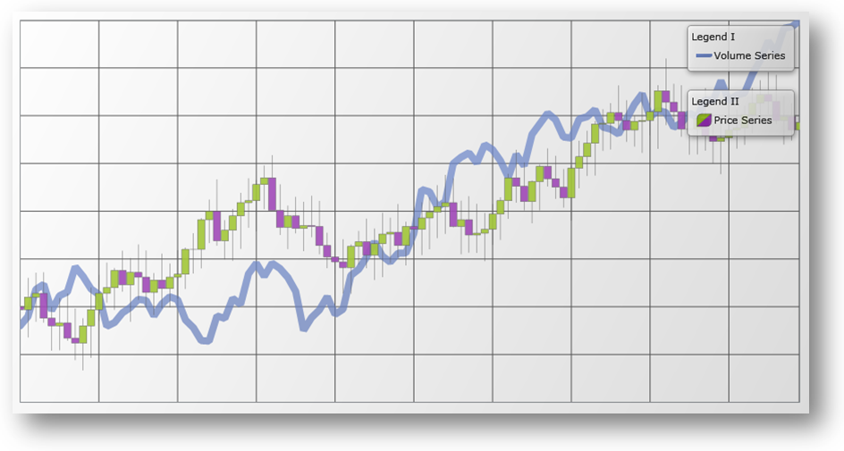

////
|metadata|
{
    "name": "datachart-multiple-legends",
    "controlName": ["{DataChartName}"],
    "tags": ["Application Scenarios","Charting","How Do I"],
    "guid": "177a0735-6ef5-40f6-af24-16d8d5c4b4d4",
    "buildFlags": ["wpf","win-universal"],
    "createdOn": "2014-06-05T19:39:00.6803898Z"
}
|metadata|
////

= Adding Multiple Legends

By default, the link:{DataChartLink}.{DataChartName}.html[{DataChartName}]™ does not display a link:{DataChartLink}.series{ApiProp}legend.html[Legend] for series added in the chart plot area. If you want to show an individual Legend for each series, you need to add a number of Legend objects to the container of {DataChartName} control and then bind each Legend to corresponding link:{DataChartLink}.series.html[Series] object’s link:{DataChartLink}.series{ApiProp}legend.html[Legend] property. In addition, you must set the link:{DataChartLink}.series{ApiProp}title.html[Title] property for each Series object otherwise its corresponding legend item will display a default series title.

ifdef::wpf[]
You can also specify the location of the Legend in relationship to the {DataChartName} control’s plot area. For more information on this, please refer to link:datachart-docking-legends.html[Docking Legends] topic.
endif::wpf[]

The following example code demonstrates how to add individual Legend for each series defined in the {DataChartName} control.

ifdef::wpf,win-universal[]
*In XAML:*
[source,xaml]
----
<Grid>
    <Grid.RowDefinitions>
        <RowDefinition Height="Auto" />
        <RowDefinition Height="Auto" />
        <RowDefinition Height="*" /> 
    </Grid.RowDefinitions>
    <Grid.ColumnDefinitions>
        <ColumnDefinition Width="*" />
        <ColumnDefinition Width="Auto" />
    </Grid.ColumnDefinitions>
     
    <ig:{DataChartName} Grid.ColumnSpan="2" Grid.RowSpan="3">
        ...
        <ig:{DataChartName}.Series>
            <ig:LineSeries Title="Volume Series" 
                           Legend="{Binding ElementName=Legend1}">
            </ig:LineSeries>
            <ig:FinancialPriceSeries Title="Price Series"
                                     Legend="{Binding ElementName=Legend2}">
            </ig:FinancialPriceSeries>
        </ig:{DataChartName}.Series>
    </ig:{DataChartName}> 
    <ig:Legend x:Name="Legend1" 
               Content="Legend I" 
               Margin="10" 
               Grid.Row="0" Grid.Column="1">
    </ig:Legend>
    <ig:Legend x:Name="Legend2"
               Content="Legend II" 
               Margin="10" 
               Grid.Row="1" Grid.Column="1">
    </ig:Legend> 
</Grid>
----
endif::wpf,win-universal[]

ifdef::xamarin[]
*In XAML:*
[source,xaml]
----
<Grid>
    <Grid.RowDefinitions>
        <RowDefinition Height="Auto" />
        <RowDefinition Height="Auto" />
        <RowDefinition Height="*" /> 
    </Grid.RowDefinitions>
    <Grid.ColumnDefinitions>
        <ColumnDefinition Width="*" />
        <ColumnDefinition Width="Auto" />
    </Grid.ColumnDefinitions>
     
    <ig:{DataChartName} Grid.ColumnSpan="2" Grid.RowSpan="3">
        ...
        <ig:{DataChartName}.Series>
            <ig:LineSeries Title="Volume Series" 
                           Legend="{x:Reference Legend1}">
            </ig:LineSeries>
            <ig:FinancialPriceSeries Title="Price Series"
                                     Legend="{x:Reference Legend2}">
            </ig:FinancialPriceSeries>
        </ig:{DataChartName}.Series>
    </ig:{DataChartName}> 
    <ig:Legend x:Name="Legend1"  
               Margin="10" 
               Grid.Row="0" Grid.Column="1">
    </ig:Legend>
    <ig:Legend x:Name="Legend2" 
               Margin="10" 
               Grid.Row="1" Grid.Column="1">
    </ig:Legend> 
</Grid>
----
endif::xamarin[]

The following image shows how the {DataChartName} control might look like with multiple legends.

== Related Content

* link:datachart-common-legend.html[Adding Common Legend]

ifdef::wpf,win-universal[]
* link:datachart-docking-legends.html[Docking Legends]
endif::wpf,win-universal[]