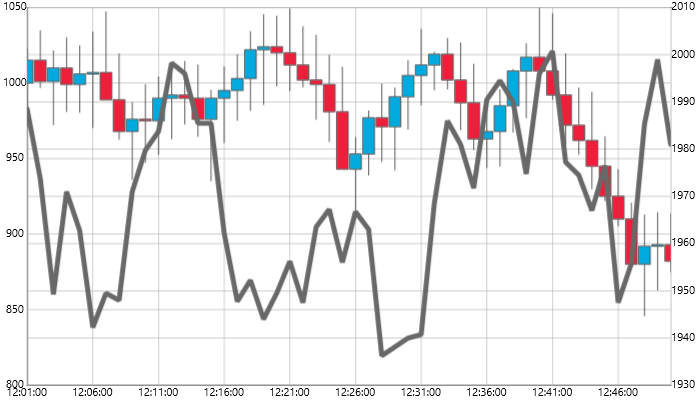
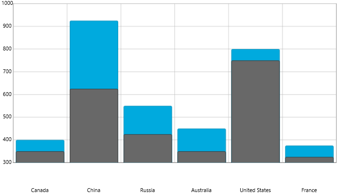
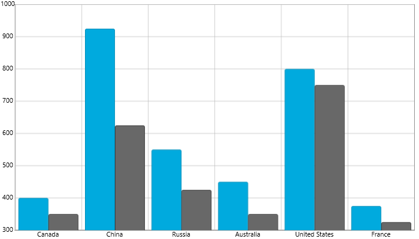

////
|metadata|
{
    "name": "datachart-multiple-series",
    "controlName": ["{DataChartName}"],
    "tags": ["Application Scenarios","Charting","How Do I"],
    "guid": "a3dde4c0-c34f-4561-90fa-0f9f010ca3e4",
    "buildFlags": [],
    "createdOn": "2014-06-05T19:39:00.6933954Z"
}
|metadata|
////

= Adding Multiple Series

This topic explains, with code examples, how to create composite charts by plotting multiple types of link:datachart-series-types.html[Series] in the same plot area of the {DataChartName}™ control.

== Overview

The topic is organized as follows:

* <<Introduction,Introduction>>
* <<Examples,Examples>>

** <<MultipleSeriesFromMixedGroupsOfSeries,Multiple Series from Mixed Groups of Series>>
** <<MultipleOverlaidSeries,Multiple Overlaid Series>>
** <<MultipleClusteredSeries,Multiple Clustered Series>>

* <<RelatedContent,Related Content>>

[[Introduction]]
== Introduction

The {DataChartName} supports plotting unlimited number of Series in the same chart plot area. This is accomplished by adding the various types of Series objects to the {DataChartName} control’s Series collection. Each series that is added to the chart must have a pair of appropriate types of Axis and data member mapping. For more information on this refer to the link:datachart-series-requirements.html[Series Requirements] topic. In addition to support of plotting multiple series in any combination, some types of axes can be shared between various series (see Table 1) making composite charts a much easier process.

When plotting multiple series with different data sources, it is important to note that the chart will not align items of multiple data sources when plotting series with CategoryDateTimeXAxis or TimeXAxis. As a result, developers should align data items by inserting null items where one data source does not have corresponding items with another data source.

The following table shows types of axes supported by various series and which axes can be shared between different series in the Data Chart. Refer to the <<Examples,Examples>> section of this topic and to the link:datachart-multiple-axes.html[Using Multiple Axes] topic for more information on how to share axes.

[options="header", cols="a,a,a,a,a"]
|====
|Type of Range Series|Valid X-Axis|Valid Y-Axis|Valid Radius Axis|Valid Angle Axis

| link:datachart-category-range-area-series.html[Range Area Series]
|CategoryXAxis, CategoryDateTimeXAxispick:[wpf,win-forms=", TimeXAxis"]
|NumericYAxis
|N/A
|N/A

| link:datachart-category-range-column-series.html[Range Column Series]
|CategoryXAxis, CategoryDateTimeXAxispick:[wpf,win-forms=", TimeXAxis"]
|NumericYAxis
|N/A
|N/A
 
|====

[options="header", cols="a,a,a,a,a"]
|====
|Type of Category Series|Valid X-Axis|Valid Y-Axis|Valid Radius Axis|Valid Angle Axis

| link:datachart-category-bar-series.html[Bar Series]
|NumericXAxis
|CategoryYAxis
|N/A
|N/A

| link:datachart-category-area-series.html[Area Series]
|CategoryXAxis, CategoryDateTimeXAxispick:[wpf,win-forms=", TimeXAxis"]
|NumericYAxis
|N/A
|N/A

| link:datachart-category-column-series.html[Column Series]
|CategoryXAxis, CategoryDateTimeXAxispick:[wpf,win-forms=", TimeXAxis"]
|NumericYAxis
|N/A
|N/A

| link:datachart-category-line-series.html[Line Series]
|CategoryXAxis, CategoryDateTimeXAxispick:[wpf,win-forms=", TimeXAxis"]
|NumericYAxis
|N/A
|N/A

| link:datachart-category-point-series.html[Point Series]
|CategoryXAxis, CategoryDateTimeXAxispick:[wpf,win-forms=", TimeXAxis"]
|NumericYAxis
|N/A
|N/A

| link:datachart-category-spline-series.html[Spline Series]
|CategoryXAxis, CategoryDateTimeXAxispick:[wpf,win-forms=", TimeXAxis"]
|NumericYAxis
|N/A
|N/A

| link:datachart-category-spline-area-series.html[Spline Area Series]
|CategoryXAxis, CategoryDateTimeXAxispick:[wpf,win-forms=", TimeXAxis"]
|NumericYAxis
|N/A
|N/A

| link:datachart-category-step-area-series.html[Step Area Series]
|CategoryXAxis, CategoryDateTimeXAxispick:[wpf,win-forms=", TimeXAxis"]
|NumericYAxis
|N/A
|N/A

| link:datachart-category-step-line-series.html[Step Line Series]
|CategoryXAxis, CategoryDateTimeXAxispick:[wpf,win-forms=", TimeXAxis"]
|NumericYAxis
|N/A
|N/A

| link:datachart-category-waterfall-series.html[Waterfall Series]
|CategoryXAxis, CategoryDateTimeXAxispick:[wpf,win-forms=", TimeXAxis"]
|NumericYAxis
|N/A
|N/A
|====

ifdef::wpf,win-universal,win-forms[]
[options="header", cols="a,a,a,a,a"]
|====
|Type of Stacked Series|Valid X-Axis|Valid Y-Axis|Valid Radius Axis|Valid Angle Axis

| link:datachart-category-stacked-area-series.html[Stacked Area Series]
|CategoryXAxis, CategoryDateTimeXAxispick:[wpf,win-forms=", TimeXAxis"]
|NumericYAxis
|N/A
|N/A

| link:datachart-category-stacked-column-series.html[Stacked Column Series]
|CategoryXAxis, CategoryDateTimeXAxispick:[wpf,win-forms=", TimeXAxis"]
|NumericYAxis
|N/A
|N/A

| link:datachart-category-stacked-line-series.html[Stacked Line Series]
|CategoryXAxis, CategoryDateTimeXAxispick:[wpf,win-forms=", TimeXAxis"]
|NumericYAxis
|N/A
|N/A

| link:datachart-category-stacked-spline-series.html[Stacked Spline Series]
|CategoryXAxis, CategoryDateTimeXAxispick:[wpf,win-forms=", TimeXAxis"]
|NumericYAxis
|N/A
|N/A

| link:datachart-category-stacked-spline-area-series.html[Stacked Spline Area Series]
|CategoryXAxis, CategoryDateTimeXAxispick:[wpf,win-forms=", TimeXAxis"]
|NumericYAxis
|N/A
|N/A

| link:datachart-category-stacked-100-area-series.html[Stacked 100-Area Series]
|CategoryXAxis, CategoryDateTimeXAxispick:[wpf,win-forms=", TimeXAxis"]
|NumericYAxis
|N/A
|N/A

| link:datachart-category-stacked-100-column-series.html[Stacked 100-Column Series]
|CategoryXAxis, CategoryDateTimeXAxispick:[wpf,win-forms=", TimeXAxis"]
|NumericYAxis
|N/A
|N/A

| link:datachart-category-stacked-100-line-series.html[Stacked 100-Line Series]
|CategoryXAxis, CategoryDateTimeXAxispick:[wpf,win-forms=", TimeXAxis"]
|NumericYAxis
|N/A
|N/A

| link:datachart-category-stacked-100-spline-series.html[Stacked 100-Spline Series]
|CategoryXAxis, CategoryDateTimeXAxispick:[wpf,win-forms=", TimeXAxis"]
|NumericYAxis
|N/A
|N/A

| link:datachart-category-stacked-100-spline-area-series.html[Stacked 100-Spline Area Series]
|CategoryXAxis, CategoryDateTimeXAxispick:[wpf,win-forms=", TimeXAxis"]
|NumericYAxis
|N/A
|N/A

| link:datachart-category-stacked-bar-series.html[Stacked Bar Series]
|NumericXAxis
|CategoryYAxis
|N/A
|N/A

| link:datachart-category-stacked-100-bar-series.html[Stacked 100-Bar Series]
|NumericXAxis
|CategoryYAxis
|N/A
|N/A

|====
endif::wpf,win-universal,win-forms[]
 

[options="header", cols="a,a,a,a,a"]
|====
|Type of Financial Series|Valid X-Axis|Valid Y-Axis|Valid Radius Axis|Valid Angle Axis

| link:{DataChartLink}.financialpriceseries.html[Financial Price Series]
|CategoryXAxis, CategoryDateTimeXAxispick:[wpf,win-forms=", TimeXAxis"]
|NumericYAxis
|N/A
|N/A

| link:{DataChartLink}.absolutevolumeoscillatorindicator.html[Absolute Volume Oscillator Indicator]
|CategoryXAxis, CategoryDateTimeXAxispick:[wpf,win-forms=", TimeXAxis"]
|NumericYAxis
|N/A
|N/A

| link:{DataChartLink}.accumulationdistributionindicator.html[Accumulation Distribution Indicator]
|CategoryXAxis, CategoryDateTimeXAxispick:[wpf,win-forms=", TimeXAxis"]
|NumericYAxis
|N/A
|N/A

| link:{DataChartLink}.averagedirectionalindexindicator.html[Average Directional Index Indicator]
|CategoryXAxis, CategoryDateTimeXAxispick:[wpf,win-forms=", TimeXAxis"]
|NumericYAxis
|N/A
|N/A

| link:{DataChartLink}.averagetruerangeindicator.html[Average True Range Indicator]
|CategoryXAxis, CategoryDateTimeXAxispick:[wpf,win-forms=", TimeXAxis"]
|NumericYAxis
|N/A
|N/A

| link:{DataChartLink}.bollingerbandsoverlay.html[Bollinger Bands Overlay]
|CategoryXAxis, CategoryDateTimeXAxispick:[wpf,win-forms=", TimeXAxis"]
|NumericYAxis
|N/A
|N/A

| link:{DataChartLink}.bollingerbandwidthindicator.html[Bollinger Band Width Indicator]
|CategoryXAxis, CategoryDateTimeXAxispick:[wpf,win-forms=", TimeXAxis"]
|NumericYAxis
|N/A
|N/A

| link:{DataChartLink}.chaikinoscillatorindicator.html[Chaikin Oscillator Indicator]
|CategoryXAxis, CategoryDateTimeXAxispick:[wpf,win-forms=", TimeXAxis"]
|NumericYAxis
|N/A
|N/A

| link:{DataChartLink}.chaikinvolatilityindicator.html[Chaikin Volatility Indicator]
|CategoryXAxis, CategoryDateTimeXAxispick:[wpf,win-forms=", TimeXAxis"]
|NumericYAxis
|N/A
|N/A

| link:{DataChartLink}.commoditychannelindexindicator.html[Commodity Channel Index Indicator]
|CategoryXAxis, CategoryDateTimeXAxispick:[wpf,win-forms=", TimeXAxis"]
|NumericYAxis
|N/A
|N/A

| link:{DataChartLink}.detrendedpriceoscillatorindicator.html[Detrended Price Oscillator Indicator]
|CategoryXAxis, CategoryDateTimeXAxispick:[wpf,win-forms=", TimeXAxis"]
|NumericYAxis
|N/A
|N/A

| link:{DataChartLink}.easeofmovementindicator.html[Ease Of Movement Indicator]
|CategoryXAxis, CategoryDateTimeXAxispick:[wpf,win-forms=", TimeXAxis"]
|NumericYAxis
|N/A
|N/A

| link:{DataChartLink}.faststochasticoscillatorindicator.html[Fast Stochastic Oscillator Indicator]
|CategoryXAxis, CategoryDateTimeXAxispick:[wpf,win-forms=", TimeXAxis"]
|NumericYAxis
|N/A
|N/A

| link:{DataChartLink}.forceindexindicator.html[ForceIndex Indicator]
|CategoryXAxis, CategoryDateTimeXAxispick:[wpf,win-forms=", TimeXAxis"]
|NumericYAxis
|N/A
|N/A

| link:{DataChartLink}.fullstochasticoscillatorindicator.html[Full Stochastic Oscillator Indicator]
|CategoryXAxis, CategoryDateTimeXAxispick:[wpf,win-forms=", TimeXAxis"]
|NumericYAxis
|N/A
|N/A

| link:{DataChartLink}.marketfacilitationindexindicator.html[Market Facilitation Index Indicator]
|CategoryXAxis, CategoryDateTimeXAxispick:[wpf,win-forms=", TimeXAxis"]
|NumericYAxis
|N/A
|N/A

| link:{DataChartLink}.massindexindicator.html[MassIndex Indicator]
|CategoryXAxis, CategoryDateTimeXAxispick:[wpf,win-forms=", TimeXAxis"]
|NumericYAxis
|N/A
|N/A

| link:{DataChartLink}.medianpriceindicator.html[MedianPrice Indicator]
|CategoryXAxis, CategoryDateTimeXAxispick:[wpf,win-forms=", TimeXAxis"]
|NumericYAxis
|N/A
|N/A

| link:{DataChartLink}.moneyflowindexindicator.html[MoneyFlowIndex Indicator]
|CategoryXAxis, CategoryDateTimeXAxispick:[wpf,win-forms=", TimeXAxis"]
|NumericYAxis
|N/A
|N/A

| link:{DataChartLink}.movingaverageconvergencedivergenceindicator.html[Moving Average Convergence Divergence Indicator]
|CategoryXAxis, CategoryDateTimeXAxispick:[wpf,win-forms=", TimeXAxis"]
|NumericYAxis
|N/A
|N/A

| link:{DataChartLink}.negativevolumeindexindicator.html[Negative Volume Index Indicator]
|CategoryXAxis, CategoryDateTimeXAxispick:[wpf,win-forms=", TimeXAxis"]
|NumericYAxis
|N/A
|N/A

| link:{DataChartLink}.onbalancevolumeindicator.html[OnBalance Volume Indicator]
|CategoryXAxis, CategoryDateTimeXAxispick:[wpf,win-forms=", TimeXAxis"]
|NumericYAxis
|N/A
|N/A

| link:{DataChartLink}.percentagevolumeoscillatorindicator.html[Percentage Volume Oscillator Indicator]
|CategoryXAxis, CategoryDateTimeXAxispick:[wpf,win-forms=", TimeXAxis"]
|NumericYAxis
|N/A
|N/A

| link:{DataChartLink}.positivevolumeindexindicator.html[Positive Volume Index Indicator]
|CategoryXAxis, CategoryDateTimeXAxispick:[wpf,win-forms=", TimeXAxis"]
|NumericYAxis
|N/A
|N/A

| link:{DataChartLink}.pricevolumetrendindicator.html[PriceVolume Trend Indicator]
|CategoryXAxis, CategoryDateTimeXAxispick:[wpf,win-forms=", TimeXAxis"]
|NumericYAxis
|N/A
|N/A

| link:{DataChartLink}.pricechanneloverlay.html[Price Channel Overlay]
|CategoryXAxis, CategoryDateTimeXAxispick:[wpf,win-forms=", TimeXAxis"]
|NumericYAxis
|N/A
|N/A

| link:{DataChartLink}.rateofchangeandmomentumindicator.html[Rate of Change And Momentum Indicator]
|CategoryXAxis, CategoryDateTimeXAxispick:[wpf,win-forms=", TimeXAxis"]
|NumericYAxis
|N/A
|N/A

| link:{DataChartLink}.relativestrengthindexindicator.html[Relative Strength Index Indicator]
|CategoryXAxis, CategoryDateTimeXAxispick:[wpf,win-forms=", TimeXAxis"]
|NumericYAxis
|N/A
|N/A

| link:{DataChartLink}.slowstochasticoscillatorindicator.html[Slow Stochastic Oscillator Indicator]
|CategoryXAxis, CategoryDateTimeXAxispick:[wpf,win-forms=", TimeXAxis"]
|NumericYAxis
|N/A
|N/A

| link:{DataChartLink}.standarddeviationindicator.html[Standard Deviation Indicator]
|CategoryXAxis, CategoryDateTimeXAxispick:[wpf,win-forms=", TimeXAxis"]
|NumericYAxis
|N/A
|N/A

| link:{DataChartLink}.stochrsiindicator.html[StochRSI Indicator]
|CategoryXAxis, CategoryDateTimeXAxispick:[wpf,win-forms=", TimeXAxis"]
|NumericYAxis
|N/A
|N/A

| link:{DataChartLink}.trixindicator.html[TRIX Indicator]
|CategoryXAxis, CategoryDateTimeXAxispick:[wpf,win-forms=", TimeXAxis"]
|NumericYAxis
|N/A
|N/A

| link:{DataChartLink}.typicalpriceindicator.html[Typical Price Indicator]
|CategoryXAxis, CategoryDateTimeXAxispick:[wpf,win-forms=", TimeXAxis"]
|NumericYAxis
|N/A
|N/A

| link:{DataChartLink}.ultimateoscillatorindicator.html[Ultimate Oscillator Indicator]
|CategoryXAxis, CategoryDateTimeXAxispick:[wpf,win-forms=", TimeXAxis"]
|NumericYAxis
|N/A
|N/A

| link:{DataChartLink}.weightedcloseindicator.html[Weighted Close Indicator]
|CategoryXAxis, CategoryDateTimeXAxispick:[wpf,win-forms=", TimeXAxis"]
|NumericYAxis
|N/A
|N/A

| link:{DataChartLink}.williamspercentrindicator.html[Williams PercentR Indicator]
|CategoryXAxis, CategoryDateTimeXAxispick:[wpf,win-forms=", TimeXAxis"]
|NumericYAxis
|N/A
|N/A

|====

[options="header", cols="a,a,a,a,a"]
|====
|Type of Scatter Series|Valid X-Axis|Valid Y-Axis|Valid Radius Axis|Valid Angle Axis

| link:datachart-scatter-series-overview.html[Scatter (Point) Series]
|NumericXAxis
|NumericYAxis
|N/A
|N/A

| link:datachart-scatter-series-overview.html[Scatter Line Series]
|NumericXAxis
|NumericYAxis
|N/A
|N/A

| link:datachart-scatter-series-overview.html[Scatter Spline Series]
|NumericXAxis
|NumericYAxis
|N/A
|N/A

ifdef::wpf,win-universal[]
| link:datachart-scatter-high-density-scatter-series.html[High Density Scatter Series]
|NumericXAxis
|NumericYAxis
|N/A
|N/A
endif::wpf,win-universal[]
 
| link:datachart-bubble-series.html[Scatter Bubble Series]
|NumericXAxis
|NumericYAxis
|N/A
|N/A 
|====

[options="header", cols="a,a,a,a,a"]
|====
|Type of Polar Series|Valid X-Axis|Valid Y-Axis|Valid Radius Axis|Valid Angle Axis

| link:datachart-scatter-series-overview.html[Polar Area Series]
|N/A
|N/A
|NumericRadiusAxis
|NumericAngleAxis

| link:datachart-polar-line-series.html[Polar Line Series]
|N/A
|N/A
|NumericRadiusAxis
|NumericAngleAxis

| link:datachart-polar-scatter-series.html[Polar Scatter Series]
|N/A
|N/A
|NumericRadiusAxis
|NumericAngleAxis

| link:datachart-polar-spline-series.html[Polar Spline Series]
|N/A
|N/A
|NumericRadiusAxis
|NumericAngleAxis

| link:datachart-polar-spline-area-series.html[Polar Spline Area Series]
|N/A
|N/A
|NumericRadiusAxis
|NumericAngleAxis
|====

[options="header", cols="a,a,a,a,a"]
|====
|Type of Radial Series|Valid X-Axis|Valid Y-Axis|Valid Radius Axis|Valid Angle Axis

| link:datachart-radial-area-series.html[Radial Area Series]
|N/A
|N/A
|NumericRadiusAxis
|CategoryAngleAxis

| link:datachart-radial-line-series.html[Radial Line Series]
|N/A
|N/A
|NumericRadiusAxis
|CategoryAngleAxis

| link:datachart-radial-column-series.html[Radial Column Series]
|N/A
|N/A
|NumericRadiusAxis
|CategoryAngleAxis

| link:datachart-radial-pie-series.html[Radial Pie Series]
|N/A
|N/A
|NumericRadiusAxis
|CategoryAngleAxis
|====

.Note:
[NOTE]
====
Some financial indicator series (e.g. BollingerBandsOverlay and ChaikinOscillatorIndicator) have different range of values on y-axis and they should be plotted in separated charts or have unique y-axes in the same chart. For more information, please refer to the link:datachart-multiple-axes.html[Using Multiple Axes] topic.
====

[[Examples]]
== Examples

This section provides a few examples of using multiple series in the {DataChartName} control. Refer to topics for individual types of series for more information on data rendering rules.

[[MultipleSeriesFromMixedGroupsOfSeries]]
== Multiple Series from Mixed Groups of Series

From the previous section, you learned that series can be mixed from different groups of series. An example of this is usage of the LineSeries type from the Category Series group and the FinancialPriceSeries type from the Financial Series group. In this example, the LineSeries will plot volume of stock market and the FinancialPriceSeries type will plot stock prices (open, high, low, and close) in the same chart plot area. In addition these two series will share x-axis in order to align data points horizontally. You can apply the same logic for plotting other types of series in any combinations you want as long as link:datachart-series-requirements.html[Series Requirements] are met.

Figure 1 – Sample implementation of LineSeries and FinancialPriceSeries sharing the same x-axis.

ifdef::win-universal[]
*In XAML:*
[source,xaml]
----
xmlns:ig="using:Infragistics.Controls.Charts"
----
endif::win-universal[]

ifdef::xamarin[]
*In XAML:*
[source,xaml]
----
xmlns:ig="clr-namespace:Infragistics.XamarinForms.Controls.Charts;assembly=Infragistics.XF.Charts"
----
endif::xamarin[]

ifdef::wpf[]
*In XAML:*
[source,xaml]
----
xmlns:ig="http://schemas.infragistics.com/xaml"
----
endif::wpf[]

ifdef::wpf,win-universal[]
*In XAML:*
[source,xaml]
----
<ig:{DataChartName} x:Name="DataChart" >
    <ig:{DataChartName}.Axes>
        <ig:CategoryXAxis x:Name="sharedXAxis" ItemsSource="{Binding}" Label="{}{Date:hh:mm:ss}">
            <ig:CategoryXAxis.LabelSettings>
                <ig:AxisLabelSettings Location="OutsideBottom" />
            </ig:CategoryXAxis.LabelSettings>
        </ig:CategoryXAxis>
        <ig:NumericYAxis x:Name="volumeYAxis" >
            <ig:NumericYAxis.LabelSettings>
                <ig:AxisLabelSettings Location="OutsideRight" />
            </ig:NumericYAxis.LabelSettings>
        </ig:NumericYAxis>
        <ig:NumericYAxis x:Name="priceYAxis">
            <ig:NumericYAxis.LabelSettings>
                <ig:AxisLabelSettings Location="OutsideLeft" />
            </ig:NumericYAxis.LabelSettings>
        </ig:NumericYAxis>
    </ig:{DataChartName}.Axes>
    <!-- ========================================================================== -->
    <ig:{DataChartName}.Series>
        <ig:FinancialPriceSeries x:Name="priceSeries" Title="Stock Price"
                                 DisplayType="Candlestick"
                                 ItemsSource="{Binding}"
                                 OpenMemberPath="Open"
                                 CloseMemberPath="Close"
                                 HighMemberPath="High"
                                 LowMemberPath="Low"
                                 XAxis="{Binding ElementName=sharedXAxis}"
                                 YAxis="{Binding ElementName=priceYAxis}">
        </ig:FinancialPriceSeries>
        <ig:LineSeries x:Name="volumeSeries"  
                       Title="Stock Volume" 
                       ValueMemberPath="Volume" ItemsSource="{Binding}" 
                       XAxis="{Binding ElementName=sharedXAxis}" 
                       YAxis="{Binding ElementName=volumeYAxis}"                      
                       MarkerType="None"                       
                       Thickness="5" />
    </ig:{DataChartName}.Series>
    <!-- ========================================================================== -->
</ig:{DataChartName}>
----
endif::wpf,win-universal[]

ifdef::xamarin[]
*In XAML:*
[source,xaml]
----
<ig:{DataChartName} x:Name="DataChart" >
    <ig:{DataChartName}.Axes>
        <ig:CategoryXAxis x:Name="sharedXAxis" ItemsSource="{Binding}" Label="Date" LabelLocation="OutsideBottom" />
        <ig:NumericYAxis x:Name="volumeYAxis" LabelLocation="OutsideRight" />
        <ig:NumericYAxis x:Name="priceYAxis" LabelLocation="OutsideLeft" />
    </ig:{DataChartName}.Axes>
    <!-- ========================================================================== -->
    <ig:{DataChartName}.Series>
        <ig:FinancialPriceSeries x:Name="priceSeries" Title="Stock Price"
                                 DisplayType="Candlestick"
                                 ItemsSource="{Binding}"
                                 OpenMemberPath="Open"
                                 CloseMemberPath="Close"
                                 HighMemberPath="High"
                                 LowMemberPath="Low"
                                 XAxis="{x:Reference sharedXAxis}"
                                 YAxis="{x:Reference priceYAxis}">
        </ig:FinancialPriceSeries>
        <ig:LineSeries x:Name="volumeSeries"  
                       Title="Stock Volume" 
                       ValueMemberPath="Volume" ItemsSource="{Binding}" 
                       XAxis="{x:Reference sharedXAxis}" 
                       YAxis="{x:Reference volumeYAxis}"                      
                       MarkerType="None"                       
                       Thickness="5" />
    </ig:{DataChartName}.Series>
    <!-- ========================================================================== -->
</ig:{DataChartName}>
----
endif::xamarin[]

ifdef::wpf[]
*In Visual Basic:*
[source,vb]
----
Imports {DataChartNamespace}
...
Dim volumeYAxis As New NumericYAxis()
Dim priceYAxis As New NumericYAxis()
Dim sharedXAxis As New CategoryXAxis()
' set location for the axes
sharedXAxis.LabelSettings = New AxisLabelSettings() With { .Location = AxisLabelsLocation.OutsideBottom }
volumeYAxis.LabelSettings = New AxisLabelSettings() With { .Location = AxisLabelsLocation.OutsideRight }
priceYAxis.LabelSettings = New AxisLabelSettings() With { .Location = AxisLabelsLocation.OutsideLeft }
' add created axes to the chart
Me.DataChart.Axes.Add(volumeYAxis)
Me.DataChart.Axes.Add(priceYAxis)
Me.DataChart.Axes.Add(sharedXAxis)
' create a series for displaying stock volume
Dim volumeSeries As New LineSeries()
volumeSeries.ValueMemberPath = "Volume"
volumeSeries.XAxis = sharedXAxis
volumeSeries.YAxis = volumeYAxis
' create a series for displaying stock price values
Dim priceSeries As New FinancialPriceSeries()
priceSeries.HighMemberPath = "High"
priceSeries.LowMemberPath = "Low"
priceSeries.OpenMemberPath = "Open"
priceSeries.CloseMemberPath = "Close"
priceSeries.XAxis = sharedXAxis
priceSeries.YAxis = priceYAxis
' add created series to the chart
Me.DataChart.Series.Add(priceSeries)
Me.DataChart.Series.Add(volumeSeries)
----
endif::wpf[]

ifdef::win-forms[]
[source,vb]
----
Imports {DataChartNamespace}
...
Dim volumeYAxis As New NumericYAxis()
Dim priceYAxis As New NumericYAxis()
Dim sharedXAxis As New CategoryXAxis()
' set location for the axes
sharedXAxis.LabelLocation = AxisLabelsLocation.OutsideBottom
volumeYAxis.LabelLocation = AxisLabelsLocation.OutsideRight 
priceYAxis.LabelLocation = AxisLabelsLocation.OutsideLeft
' add created axes to the chart
Me.DataChart.Axes.Add(volumeYAxis)
Me.DataChart.Axes.Add(priceYAxis)
Me.DataChart.Axes.Add(sharedXAxis)
' create a series for displaying stock volume
Dim volumeSeries As New LineSeries()
volumeSeries.ValueMemberPath = "Volume"
volumeSeries.XAxis = sharedXAxis
volumeSeries.YAxis = volumeYAxis
' create a series for displaying stock price values
Dim priceSeries As New FinancialPriceSeries()
priceSeries.HighMemberPath = "High"
priceSeries.LowMemberPath = "Low"
priceSeries.OpenMemberPath = "Open"
priceSeries.CloseMemberPath = "Close"
priceSeries.XAxis = sharedXAxis
priceSeries.YAxis = priceYAxis
' add created series to the chart
Me.DataChart.Series.Add(priceSeries)
Me.DataChart.Series.Add(volumeSeries)
----
endif::win-forms[]
 
ifdef::android[]
*In Java:*
[source,js]
----
NumericYAxis volumeYAxis = new NumericYAxis();
NumericYAxis priceYAxis = new NumericYAxis();
CategoryXAxis sharedXAxis = new CategoryXAxis();

//set location for the axes
sharedXAxis.setLabelLocation(AxisLabelsLocation.OUTSIDEBOTTOM);
volumeYAxis.setLabelLocation(AxisLabelsLocation.OUTSIDERIGHT);
priceYAxis.setLabelLocation(AxisLabelsLocation.OUTSIDELEFT);

//add created axes to the chart
chart.addAxis(volumeYAxis);
chart.addAxis(priceYAxis);
chart.addAxis(sharedXAxis);

//create series for displaying stock volume
LineSeries volumeSeries = new LineSeries();
volumeSeries.setValueMemberPath("Volume");
volumeSeries.setXAxis(sharedXAxis);
volumeSeries.setYAxis(volumeYAxis);

//create a series for displaying stock price values
FinancialPriceSeries priceSeries = new FinancialPriceSeries();
priceSeries.setHighMemberPath("High");
priceSeries.setLowMemberPath("Low");
priceSeries.setOpenMemberPath("Open");
priceSeries.setCloseMemberPath("Close");
priceSeries.setXAxis(sharedXAxis);
priceSeries.setYAxis(priceYAxis);

//add created series to chart
chart.addSeries(priceSeries);
chart.addSeries(volumeSeries);
----
endif::android[]
 
ifdef::wpf,win-universal[]
*In C#:*
[source,csharp]
----
using {DataChartNamespace};
// ...
var volumeYAxis = new NumericYAxis();
var priceYAxis = new NumericYAxis();
var sharedXAxis = new CategoryXAxis();

// set location for the axes
sharedXAxis.LabelSettings = new AxisLabelSettings { Location = AxisLabelsLocation.OutsideBottom};
volumeYAxis.LabelSettings = new AxisLabelSettings { Location = AxisLabelsLocation.OutsideRight};
priceYAxis.LabelSettings = new AxisLabelSettings { Location = AxisLabelsLocation.OutsideLeft};
sharedXAxis.LabelLocation = AxisLabelsLocation.OutsideBottom;
volumeYAxis.LabelLocation = AxisLabelsLocation.OutsideRight;
priceYAxis.LabelLocation = AxisLabelsLocation.OutsideLeft;

// add created axes to the chart
this.DataChart.Axes.Add(volumeYAxis);
this.DataChart.Axes.Add(priceYAxis);
this.DataChart.Axes.Add(sharedXAxis);

// create a series for displaying stock volume
var volumeSeries = new LineSeries();
volumeSeries.ValueMemberPath = "Volume";
volumeSeries.XAxis = sharedXAxis;
volumeSeries.YAxis = volumeYAxis;

// create a series for displaying stock price values
var priceSeries = new FinancialPriceSeries();
priceSeries.HighMemberPath = "High";
priceSeries.LowMemberPath = "Low";
priceSeries.OpenMemberPath = "Open";
priceSeries.CloseMemberPath = "Close";
priceSeries.XAxis = sharedXAxis;
priceSeries.YAxis = priceYAxis;

// add created series to the chart
this.DataChart.Series.Add(priceSeries);
this.DataChart.Series.Add(volumeSeries);
----
endif::wpf,win-universal[]

ifdef::win-forms,xamarin[]
*In C#:*
[source,csharp]
----
using {DataChartNamespace};
...
var volumeYAxis = new NumericYAxis();
var priceYAxis = new NumericYAxis();
var sharedXAxis = new CategoryXAxis();

// set location for the axes
sharedXAxis.LabelLocation = AxisLabelsLocation.OutsideBottom;
volumeYAxis.LabelLocation = AxisLabelsLocation.OutsideRight;
priceYAxis.LabelLocation = AxisLabelsLocation.OutsideLeft;

// add created axes to the chart
this.DataChart.Axes.Add(volumeYAxis);
this.DataChart.Axes.Add(priceYAxis);
this.DataChart.Axes.Add(sharedXAxis);

// create a series for displaying stock volume
var volumeSeries = new LineSeries();
volumeSeries.ValueMemberPath = "Volume";
volumeSeries.XAxis = sharedXAxis;
volumeSeries.YAxis = volumeYAxis;

// create a series for displaying stock price values
var priceSeries = new FinancialPriceSeries();
priceSeries.HighMemberPath = "High";
priceSeries.LowMemberPath = "Low";
priceSeries.OpenMemberPath = "Open";
priceSeries.CloseMemberPath = "Close";
priceSeries.XAxis = sharedXAxis;
priceSeries.YAxis = priceYAxis;

// add created series to the chart
this.DataChart.Series.Add(priceSeries);
this.DataChart.Series.Add(volumeSeries);
----
endif::win-forms,xamarin[]
 
[[MultipleOverlaidSeries]]
== Multiple Overlaid Series

In the {DataChartName}, multiple series that do not share the same x-axis are rendered on top of each other (figure 2). The first series in the Series collection of the {DataChartName} control renders first and all successive series overlap the previous series. Therefore, it is recommended you use semi-transparent brushes for these series, cluster column series by sharing the same x-axis, or plot them in separate charts. In addition, adding a LineSeries to the chart that already has a ColumnSeries will render data points of the LineSeries in the middle of columns of the ColumnSeries (figure 3). This rendering rule also applies to all other non-column types of series (e.g. AreaSeries, SplneSeries etc.) when they are plotted with the ColumnSeries in the {DataChartName} control.

Figure 2 – Overlaid two ColumnSeries objects.

image::images/xamDataChart_RT_Multiple_Series.docx_03.png[]

Figure 3 - Overlaid two ColumnSeries objects and one LineSeries object.

The following code example demonstrates plotting multiple overlaid ColumnSeries with a LineSeries.

ifdef::wpf,win-universal[]
*In XAML:*
[source,xaml]
----
<ig:{DataChartName} x:Name="DataChart" >
    <ig:{DataChartName}.Axes>
        <ig:CategoryXAxis x:Name="categoryXAxis1" ItemsSource="{Binding EnergySampleData}" Label="{}{Country}"/>
        <ig:CategoryXAxis x:Name="categoryXAxis2" ItemsSource="{Binding EnergySampleData}" Label="{}{Country}" Visibility="Collapsed"/>
        <ig:NumericYAxis x:Name="sharedYAxis"/>
    </ig:{DataChartName}.Axes>
    <!-- ========================================================================== -->
    <ig:{DataChartName}.Series>
        <ig:ColumnSeries x:Name="columnSeries1"  
                       ItemsSource="{Binding EnergySampleData}" ValueMemberPath="Coal" 
                       Title="Column Series 1"   
                       XAxis="{Binding ElementName=categoryXAxis1}" 
                       YAxis="{Binding ElementName=sharedYAxis}">
        </ig:ColumnSeries>
        <ig:ColumnSeries x:Name="columnSeries2"  
                       ItemsSource="{Binding EnergySampleData}" ValueMemberPath="Hydro" 
                       Title="Column Series 2"   
                       XAxis="{Binding ElementName=categoryXAxis2}" 
                       YAxis="{Binding ElementName=sharedYAxis}">
        </ig:ColumnSeries>
        <ig:LineSeries x:Name="lineSeries"  
                       Title="Line Series" 
                       ValueMemberPath="Nuclear" ItemsSource="{Binding EnergySampleData}" 
                       XAxis="{Binding ElementName=categoryXAxis1}" 
                       YAxis="{Binding ElementName=sharedYAxis}"                       
                       MarkerType="None"                       
                       Thickness="5" />
    </ig:{DataChartName}.Series>
    <!-- ========================================================================== -->
</ig:{DataChartName}>
----
endif::wpf,win-universal[]

ifdef::xamarin[]
*In XAML:*
[source,xaml]
----
<ig:{DataChartName} x:Name="DataChart" >
    <ig:{DataChartName}.Axes>
        <ig:CategoryXAxis x:Name="categoryXAxis1" ItemsSource="{Binding Data}" Label="Country"/>
        <ig:CategoryXAxis x:Name="categoryXAxis2" ItemsSource="{Binding Data}" Label="Country" LabelVisibility="Collapsed"/>
        <ig:NumericYAxis x:Name="sharedYAxis"/>
    </ig:{DataChartName}.Axes>
    <!-- ========================================================================== -->
    <ig:{DataChartName}.Series>
        <ig:ColumnSeries x:Name="columnSeries1"  
                       ItemsSource="{Binding Data}" 
                       ValueMemberPath="Coal" 
                       Title="Column Series 1"   
                       XAxis="{x:Reference categoryXAxis1}" 
                       YAxis="{x:Reference sharedYAxis}">
        </ig:ColumnSeries>
        <ig:ColumnSeries x:Name="columnSeries2"  
                       ItemsSource="{Binding Data}" 
                       ValueMemberPath="Hydro" 
                       Title="Column Series 2"   
                       XAxis="{x:Reference categoryXAxis2}" 
                       YAxis="{x:Reference sharedYAxis}">
        </ig:ColumnSeries>
        <ig:LineSeries x:Name="lineSeries"  
                       Title="Line Series" 
                       ValueMemberPath="Nuclear" 
                       ItemsSource="{Binding Data}" 
                       XAxis="{x:Reference categoryXAxis1}" 
                       YAxis="{x:Reference sharedYAxis}"                       
                       MarkerType="None"                       
                       Thickness="5" />
    </ig:{DataChartName}.Series>
    <!-- ========================================================================== -->
</ig:{DataChartName}>
----
endif::xamarin[]

ifdef::wpf[]
*In Visual Basic:*
[source,vb]
----
Imports {DataChartNamespace}
' ...
Dim sharedYAxis As New NumericYAxis()
Dim categoryXAxis1 As New CategoryXAxis()
Dim categoryXAxis2 As New CategoryXAxis()

' add created axes to the chart
Me.DataChart.Axes.Add(categoryXAxis1)
Me.DataChart.Axes.Add(categoryXAxis2)
Me.DataChart.Axes.Add(sharedYAxis)

' create overlaid column series
Dim columnSeries1 As New ColumnSeries()
columnSeries1.ValueMemberPath = "Coal"
columnSeries1.XAxis = categoryXAxis1
columnSeries1.YAxis = sharedYAxis
Dim columnSeries2 As New ColumnSeries()
ColumnSeries2.ValueMemberPath = "Hydro"
ColumnSeries2.XAxis = categoryXAxis2
columnSeries2.YAxis = sharedYAxis

' create a line series
Dim lineSeries As New LineSeries()
lineSeries.ValueMemberPath = "Nuclear"
lineSeries.XAxis = categoryXAxis1
lineSeries.YAxis = sharedYAxis

' add created series to the chart
Me.DataChart.Series.Add(columnSeries1)
Me.DataChart.Series.Add(columnSeries2)
Me.DataChart.Series.Add(lineSeries)
----
endif::wpf[]

ifdef::win-forms[]
*In Visual Basic:*
[source,vb]
----
Imports {DataChartNamespace}
' ...
Dim sharedYAxis As New NumericYAxis()
Dim categoryXAxis1 As New CategoryXAxis()
Dim categoryXAxis2 As New CategoryXAxis()

' add created axes to the chart
Me.DataChart.Axes.Add(categoryXAxis1)
Me.DataChart.Axes.Add(categoryXAxis2)
Me.DataChart.Axes.Add(sharedYAxis)

' create overlaid column series
Dim columnSeries1 As New ColumnSeries()
columnSeries1.ValueMemberPath = "Coal"
columnSeries1.XAxis = categoryXAxis1
columnSeries1.YAxis = sharedYAxis
Dim columnSeries2 As New ColumnSeries()
ColumnSeries2.ValueMemberPath = "Hydro"
ColumnSeries2.XAxis = categoryXAxis2
columnSeries2.YAxis = sharedYAxis

' create a line series
Dim lineSeries As New LineSeries()
lineSeries.ValueMemberPath = "Nuclear"
lineSeries.XAxis = categoryXAxis1
lineSeries.YAxis = sharedYAxis

' add created series to the chart
Me.DataChart.Series.Add(columnSeries1)
Me.DataChart.Series.Add(columnSeries2)
Me.DataChart.Series.Add(lineSeries)
----
endif::win-forms[]

ifdef::wpf[]
*In C#:*
[source,csharp]
----
using {DataChartNamespace};
// ... 
var sharedYAxis = new NumericYAxis();
var categoryXAxis1 = new CategoryXAxis();
var categoryXAxis2 = new CategoryXAxis();

// add created axes to the chart
this.DataChart.Axes.Add(categoryXAxis1);
this.DataChart.Axes.Add(categoryXAxis2);
this.DataChart.Axes.Add(sharedYAxis);

// create overlaid column series 
var columnSeries1 = new ColumnSeries();
columnSeries1.ValueMemberPath = "Coal";
columnSeries1.XAxis = categoryXAxis1;
columnSeries1.YAxis = sharedYAxis;
var columnSeries2 = new ColumnSeries();
columnSeries2.ValueMemberPath = "Hydro";
columnSeries2.XAxis = categoryXAxis2;
columnSeries2.YAxis = sharedYAxis;

// create a line series
var lineSeries  = new LineSeries();
lineSeries.ValueMemberPath = "Nuclear";
lineSeries.XAxis = categoryXAxis1;
lineSeries.YAxis = sharedYAxis;

// add created series to the chart
this.DataChart.Series.Add(columnSeries1);
this.DataChart.Series.Add(columnSeries2);
this.DataChart.Series.Add(lineSeries);
----
endif::wpf[]

ifdef::win-forms[]
*In C#:*
[source,csharp]
----
using {DataChartNamespace};
// ... 
var sharedYAxis = new NumericYAxis();
var categoryXAxis1 = new CategoryXAxis();
var categoryXAxis2 = new CategoryXAxis();

// add created axes to the chart
this.DataChart.Axes.Add(categoryXAxis1);
this.DataChart.Axes.Add(categoryXAxis2);
this.DataChart.Axes.Add(sharedYAxis);

// create overlaid column series 
var columnSeries1 = new ColumnSeries();
columnSeries1.ValueMemberPath = "Coal";
columnSeries1.XAxis = categoryXAxis1;
columnSeries1.YAxis = sharedYAxis;
var columnSeries2 = new ColumnSeries();
columnSeries2.ValueMemberPath = "Hydro";
columnSeries2.XAxis = categoryXAxis2;
columnSeries2.YAxis = sharedYAxis;

// create a line series
var lineSeries  = new LineSeries();
lineSeries.ValueMemberPath = "Nuclear";
lineSeries.XAxis = categoryXAxis1;
lineSeries.YAxis = sharedYAxis;

// add created series to the chart
this.DataChart.Series.Add(columnSeries1);
this.DataChart.Series.Add(columnSeries2);
this.DataChart.Series.Add(lineSeries);
----
endif::win-forms[]

ifdef::xamarin[]
*In C#:*
[source,csharp]
----
using {DataChartNamespace};
// ... 
var sharedYAxis = new NumericYAxis();
var categoryXAxis1 = new CategoryXAxis();
var categoryXAxis2 = new CategoryXAxis();

// add created axes to the chart
this.DataChart.Axes.Add(categoryXAxis1);
this.DataChart.Axes.Add(categoryXAxis2);
this.DataChart.Axes.Add(sharedYAxis);

// create overlaid column series 
var columnSeries1 = new ColumnSeries();
columnSeries1.ValueMemberPath = "Coal";
columnSeries1.XAxis = categoryXAxis1;
columnSeries1.YAxis = sharedYAxis;
var columnSeries2 = new ColumnSeries();
columnSeries2.ValueMemberPath = "Hydro";
columnSeries2.XAxis = categoryXAxis2;
columnSeries2.YAxis = sharedYAxis;

// create a line series
var lineSeries  = new LineSeries();
lineSeries.ValueMemberPath = "Nuclear";
lineSeries.XAxis = categoryXAxis1;
lineSeries.YAxis = sharedYAxis;

// add created series to the chart
this.DataChart.Series.Add(columnSeries1);
this.DataChart.Series.Add(columnSeries2);
this.DataChart.Series.Add(lineSeries);
----
endif::xamarin[]

[[MultipleClusteredSeries]]
== Multiple Clustered Series

Multiple column series that share the same x-axis are rendered in clusters where each cluster represents a data point (figure 4). The first series in the Series collection of the {DataChartName} control renders as a column on the left of the cluster. Each successive series is rendered on the right of the previous series. However, adding the LineSeries type of series to clustered column series renders data points of the LineSeries in the center of the clusters (figure 5).

Figure 4 - Clustered two ColumnSeries objects

image::images/xamDataChart_RT_Multiple_Series.docx_05.png[]

Figure 5 - Clustered two ColumnSeries objects with one LineSeries object

The following code example demonstrates plotting multiple clustered ColumnSeries with a LineSeries.

ifdef::wpf,win-universal[]
*In XAML:*
[source,xaml]
----
<ig:{DataChartName} x:Name="DataChart" >
    <ig:{DataChartName}.Axes>
        <ig:CategoryXAxis x:Name="sharedXAxis" ItemsSource="{Binding Data}" Label="{}{Country}"/>
        <ig:NumericYAxis x:Name="sharedYAxis"/>
    </ig:{DataChartName}.Axes>
    <!-- ========================================================================== -->
    <ig:{DataChartName}.Series>
        <ig:ColumnSeries x:Name="columnSeries1"  
                       ItemsSource="{Binding Data}" 
                       ValueMemberPath="Coal" 
                       Title="Column Series 1"   
                       XAxis="{Binding ElementName=sharedXAxis}" 
                       YAxis="{Binding ElementName=sharedYAxis}">
        </ig:ColumnSeries>
        <ig:ColumnSeries x:Name="columnSeries2"  
                       ItemsSource="{Binding Data}" 
                       ValueMemberPath="Hydro" 
                       Title="Column Series 2"   
                       XAxis="{Binding ElementName=sharedXAxis}" 
                       YAxis="{Binding ElementName=sharedYAxis}">
        </ig:ColumnSeries>
        <ig:LineSeries x:Name="lineSeries"  
                       Title="Line Series" 
                       ValueMemberPath="Nuclear" 
                       ItemsSource="{Binding Data}" 
                       XAxis="{Binding ElementName=sharedXAxis}" 
                       YAxis="{Binding ElementName=sharedYAxis}"                        
                       MarkerType="None"                       
                       Thickness="5" />
    </ig:{DataChartName}.Series>
    <!-- ========================================================================== -->
</ig:{DataChartName}>
----
endif::wpf,win-universal[]

ifdef::xamarin[]
*In XAML:*
[source,xaml]
----
<ig:{DataChartName} x:Name="DataChart" >
    <ig:{DataChartName}.Axes>
        <ig:CategoryXAxis x:Name="sharedXAxis" ItemsSource="{Binding Data}" Label="Country"/>
        <ig:NumericYAxis x:Name="sharedYAxis"/>
    </ig:{DataChartName}.Axes>
    <!-- ========================================================================== -->
    <ig:{DataChartName}.Series>
        <ig:ColumnSeries x:Name="columnSeries1"  
                       ItemsSource="{Binding Data}" 
                       ValueMemberPath="Coal" 
                       Title="Column Series 1"   
                       XAxis="{x:Reference sharedXAxis}" 
                       YAxis="{x:Reference sharedYAxis}">
        </ig:ColumnSeries>
        <ig:ColumnSeries x:Name="columnSeries2"  
                       ItemsSource="{Binding Data}" 
                       ValueMemberPath="Hydro" 
                       Title="Column Series 2"   
                       XAxis="{x:Reference sharedXAxis}" 
                       YAxis="{x:Reference sharedYAxis}">
        </ig:ColumnSeries>
        <ig:LineSeries x:Name="lineSeries"  
                       Title="Line Series" 
                       ValueMemberPath="Nuclear" 
                       ItemsSource="{Binding Data}" 
                       XAxis="{x:Reference sharedXAxis}" 
                       YAxis="{x:Reference sharedYAxis}"                        
                       MarkerType="None"                       
                       Thickness="5" />
    </ig:{DataChartName}.Series>
    <!-- ========================================================================== -->
</ig:{DataChartName}>
----
endif::xamarin[]

ifdef::wpf[]
*In Visual Basic:*
[source,vb]
----
Imports {DataChartNamespace}
' ... 
Dim sharedYAxis As New NumericYAxis()
Dim sharedXAxis As New CategoryXAxis()

' add created axes to the chart
Me.DataChart.Axes.Add(sharedXAxis)
Me.DataChart.Axes.Add(sharedYAxis)

' create clustered column series
Dim columnSeries1 As New ColumnSeries()
columnSeries1.ValueMemberPath = "Coal"
columnSeries1.XAxis = sharedXAxis
columnSeries1.YAxis = sharedYAxis
Dim columnSeries2 As New ColumnSeries()
ColumnSeries2.ValueMemberPath = "Hydro"
ColumnSeries2.XAxis = sharedXAxis
columnSeries2.YAxis = sharedYAxis

' create a line series
Dim lineSeries As New LineSeries()
lineSeries.ValueMemberPath = "Nuclear"
lineSeries.XAxis = sharedXAxis
lineSeries.YAxis = sharedYAxis

' add created series to the chart
Me.DataChart.Series.Add(columnSeries1)
Me.DataChart.Series.Add(columnSeries2)
Me.DataChart.Series.Add(lineSeries)
----
endif::wpf[]

ifdef::win-forms[]
*In Visual Basic:*
[source,vb]
----
Imports {DataChartNamespace}
' ... 
Dim sharedYAxis As New NumericYAxis()
Dim sharedXAxis As New CategoryXAxis()

' add created axes to the chart
Me.DataChart.Axes.Add(sharedXAxis)
Me.DataChart.Axes.Add(sharedYAxis)

' create clustered column series
Dim columnSeries1 As New ColumnSeries()
columnSeries1.ValueMemberPath = "Coal"
columnSeries1.XAxis = sharedXAxis
columnSeries1.YAxis = sharedYAxis
Dim columnSeries2 As New ColumnSeries()
ColumnSeries2.ValueMemberPath = "Hydro"
ColumnSeries2.XAxis = sharedXAxis
columnSeries2.YAxis = sharedYAxis

' create a line series
Dim lineSeries As New LineSeries()
lineSeries.ValueMemberPath = "Nuclear"
lineSeries.XAxis = sharedXAxis
lineSeries.YAxis = sharedYAxis

' add created series to the chart
Me.DataChart.Series.Add(columnSeries1)
Me.DataChart.Series.Add(columnSeries2)
Me.DataChart.Series.Add(lineSeries)
----
endif::win-forms[]

ifdef::android[]
*In Java:*
[source,js]
----
NumericYAxis sharedYAxis = new NumericYAxis();
CategoryXAxis categoryXAxis1 = new CategoryXAxis();
CategoryXAxis categoryXAxis2 = new CategoryXAxis();

//add created axes to the chart
chart.addAxis(categoryXAxis1);
chart.addAxis(categoryXAxis2);
chart.addAxis(sharedYAxis);

//create overlaid column series
ColumnSeries columnSeries1 = new ColumnSeries();
columnSeries1.setValueMemberPath("Coal");
columnSeries1.setXAxis(categoryXAxis1);
columnSeries1.setYAxis(sharedYAxis);
ColumnSeries columnSeries2 = new ColumnSeries();
columnSeries2.setValueMemberPath("Hydro");
columnSeries2.setXAxis(categoryXAxis2);
columnSeries2.setYAxis(sharedYAxis);

//create a line series
LineSeries lineSeries = new LineSeries();
lineSeries.setValueMemberPath("Nuclear");
lineSeries.setXAxis(categoryXAxis1);
lineSeries.setYAxis(sharedYAxis);

//add created series to the chart
chart.addSeries(columnSeries1);
chart.addSeries(columnSeries2);
chart.addSeries(lineSeries);
----
endif::android[]

ifdef::wpf[]
*In C#:*
[source,csharp]
----
using {DataChartNamespace};
// ... 
var sharedYAxis = new NumericYAxis();
var sharedXAxis = new CategoryXAxis();

// add created axes to the chart
this.DataChart.Axes.Add(sharedYAxis);
this.DataChart.Axes.Add(sharedXAxis);

// create clustered column series 
var columnSeries1 = new ColumnSeries();
columnSeries1.ValueMemberPath = "Coal";
columnSeries1.XAxis = sharedXAxis;
columnSeries1.YAxis = sharedYAxis;
var columnSeries2 = new ColumnSeries();
columnSeries2.ValueMemberPath = "Hydro";
columnSeries2.XAxis = sharedXAxis;
columnSeries2.YAxis = sharedYAxis;

// create a line series
var lineSeries  = new LineSeries();
lineSeries.ValueMemberPath = "Nuclear";
lineSeries.XAxis = sharedXAxis;
lineSeries.YAxis = sharedYAxis;

// add created series to the chart
this.DataChart.Series.Add(columnSeries1);
this.DataChart.Series.Add(columnSeries2);
this.DataChart.Series.Add(lineSeries);
----
endif::wpf[]

ifdef::win-forms[]
*In C#:*
[source,csharp]
----
using {DataChartNamespace};
// ... 
var sharedYAxis = new NumericYAxis();
var sharedXAxis = new CategoryXAxis();

// add created axes to the chart
this.DataChart.Axes.Add(sharedYAxis);
this.DataChart.Axes.Add(sharedXAxis);

// create clustered column series 
var columnSeries1 = new ColumnSeries();
columnSeries1.ValueMemberPath = "Coal";
columnSeries1.XAxis = sharedXAxis;
columnSeries1.YAxis = sharedYAxis;
var columnSeries2 = new ColumnSeries();
columnSeries2.ValueMemberPath = "Hydro";
columnSeries2.XAxis = sharedXAxis;
columnSeries2.YAxis = sharedYAxis;

// create a line series
var lineSeries  = new LineSeries();
lineSeries.ValueMemberPath = "Nuclear";
lineSeries.XAxis = sharedXAxis;
lineSeries.YAxis = sharedYAxis;

// add created series to the chart
this.DataChart.Series.Add(columnSeries1);
this.DataChart.Series.Add(columnSeries2);
this.DataChart.Series.Add(lineSeries);
----
endif::win-forms[]

ifdef::xamarin[]
*In C#:*
[source,csharp]
----
using {DataChartNamespace};
// ... 
var sharedYAxis = new NumericYAxis();
var sharedXAxis = new CategoryXAxis();

// add created axes to the chart
this.DataChart.Axes.Add(sharedYAxis);
this.DataChart.Axes.Add(sharedXAxis);

// create clustered column series 
var columnSeries1 = new ColumnSeries();
columnSeries1.ValueMemberPath = "Coal";
columnSeries1.XAxis = sharedXAxis;
columnSeries1.YAxis = sharedYAxis;
var columnSeries2 = new ColumnSeries();
columnSeries2.ValueMemberPath = "Hydro";
columnSeries2.XAxis = sharedXAxis;
columnSeries2.YAxis = sharedYAxis;

// create a line series
var lineSeries  = new LineSeries();
lineSeries.ValueMemberPath = "Nuclear";
lineSeries.XAxis = sharedXAxis;
lineSeries.YAxis = sharedYAxis;

// add created series to the chart
this.DataChart.Series.Add(columnSeries1);
this.DataChart.Series.Add(columnSeries2);
this.DataChart.Series.Add(lineSeries);
----
endif::xamarin[]

[[RelatedContent]]
== Related Content

link:datachart-axis-range.html[Configuring Axis Range]

link:datachart-category-series-overview.html[Category Series]

link:datachart-series-financial-price-series-overview.html[Financial Series]

link:datachart-financial-indicators-overview.html[Financial Indicators]
 
link:datachart-polar-series-overview.html[Polar Series] 
 
link:datachart-radial-series-overview.html[Radial Series] 

link:datachart-scatter-series-overview.html[Scatter Series]

link:datachart-series-requirements.html[Series Requirements]