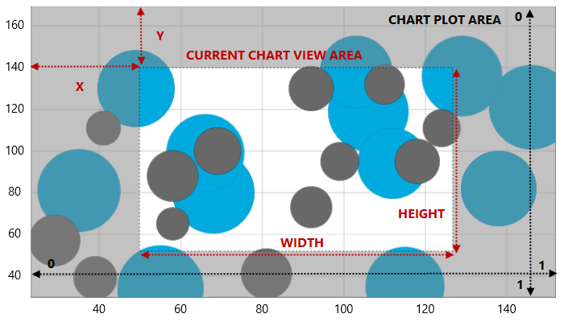

////
|metadata|
{
    "name": "datachart-navigating-chart-using-code",
    "controlName": [],
    "tags": [],
    "guid": "1255e096-e063-484b-8078-442482722843",
    "buildFlags": [],
    "createdOn": "2014-09-25T16:46:53.2302702Z"
}
|metadata|
////

= Navigating Chart Using Code

== Topic Overview

=== Purpose

This topic provides information how to navigate content in the link:{DataChartLink}.{DataChartName}.html[{DataChartName}]™ control in code-behind.

=== Required background

The following table lists the topics required as a prerequisite to understanding this topic.

[options="header", cols="a,a"]
|====
|Topic|Purpose

| link:datachart-datachart.html[{DataChartName}]
|This topic provides an overview of key features in the _{DataChartName}_ control.

| link:datachart-chart-navigation.html[Chart Navigation]
|This topic provides information on using navigation in the _{DataChartName}_ control.

|====

=== In this topic

This topic contains the following sections

* <<NavigationProperties,Navigation Properties>>
* <<CodeExample,Code Example>>

ifdef::sl,wpf,win-universal,win-forms[]
* <<RelatedContent,Related Content>>

endif::sl,wpf,win-universal,win-forms[]

[[NavigationProperties]]
== Navigation Properties

The {DataChartName} control provide several navigation properties that are updated each time a panning or zooming action is performed on the chart. The following table list navigation properties in the chart control:

[options="header", cols="a,a,a,a"]
|====
|Property|Type|Description|Default Value

|
* link:{DataChartLinkBase}.{DataChartBase}{ApiProp}windowpositionhorizontal.html[WindowPositionHorizontal] 

|double
|The X portion of the content view rectangle displayed by the {DataChartName} control.
|NaN 

Displays the chart content positioned left to the X axis.

|
* link:{DataChartLinkBase}.{DataChartBase}{ApiProp}windowpositionvertical.html[WindowPositionVertical] 

|double
|The Y portion of the content view rectangle displayed by the {DataChartName} control.
|NaN 

Displays the chart content positioned above the Y axis.

|
* link:{DataChartLinkBase}.{DataChartBase}{ApiProp}windowrect.html[WindowRect] 

|Rect
|The portion of the {DataChartName} that is currently in view.
|0, 0, 1, 1 

Displays the entire chart content.

|
* link:{DataChartLink}.{DataChartName}{ApiProp}windowscalehorizontal.html[WindowScaleHorizontal] 

|double
|The width portion of the content view rectangle displayed by the {DataChartName} control.
|NaN 

Displays the chart content positioned along the X axis.

|
* link:{DataChartLink}.{DataChartName}{ApiProp}windowscalevertical.html[WindowScaleVertical] 

|double
|The height portion of the content view rectangle displayed by the {DataChartName} control.
|NaN 

Displays the chart content along the Y axis.

|====

Figure 1: The {DataChartName} control with the navigation properties’ values visible

[[CodeExample]]
== Code Example

Navigation of the {DataChartName} control can be managed from code-behind by changing values of the properties listed in Table 2. The following code snippets demonstrate how to zoom and pan chart from code-behind.

ifdef::wpf[]

*In Visual Basic:*

----
' zoom in by factor of 0.05
Me.DataChart.WindowScaleHorizontal -= 0.05
Me.DataChart.WindowScaleVertical -= 0.05
' zoom out by factor of 0.05
Me.DataChart.WindowScaleHorizontal += 0.05
Me.DataChart.WindowScaleVertical += 0.05
' pan up (north direction) by factor of 0.05
Me.DataChart.WindowPositionVertical -= 0.05
' pan down (south direction) by factor of 0.05
Me.DataChart.WindowPositionVertical += 0.05
' pan left (west direction) by factor of 0.05
Me.DataChart.WindowPositionHorizontal -= 0.05
' pan right (east direction) by factor of 0.05
Me.DataChart.WindowPositionHorizontal += 0.05
----

endif::wpf[]

ifdef::win-forms[]

*In Visual Basic:*

----
' zoom in by factor of 0.05
Me.DataChart.WindowScaleHorizontal -= 0.05
Me.DataChart.WindowScaleVertical -= 0.05
' zoom out by factor of 0.05
Me.DataChart.WindowScaleHorizontal += 0.05
Me.DataChart.WindowScaleVertical += 0.05
' pan up (north direction) by factor of 0.05
Me.DataChart.WindowPositionVertical -= 0.05
' pan down (south direction) by factor of 0.05
Me.DataChart.WindowPositionVertical += 0.05
' pan left (west direction) by factor of 0.05
Me.DataChart.WindowPositionHorizontal -= 0.05
' pan right (east direction) by factor of 0.05
Me.DataChart.WindowPositionHorizontal += 0.05
----

endif::win-forms[]

ifdef::wpf[]

*In C#:*

----
// zoom in by factor of 0.05
this.DataChart.WindowScaleHorizontal -= 0.05;
this.DataChart.WindowScaleVertical -= 0.05;
// zoom out by factor of 0.05
this.DataChart.WindowScaleHorizontal += 0.05;
this.DataChart.WindowScaleVertical += 0.05;
// pan up (north direction) by factor of 0.05
this.DataChart.WindowPositionVertical -= 0.05;
// pan down (south direction) by factor of 0.05
this.DataChart.WindowPositionVertical += 0.05;
// pan left (west direction) by factor of 0.05
this.DataChart.WindowPositionHorizontal -= 0.05;
// pan right (east direction) by factor of 0.05
this.DataChart.WindowPositionHorizontal += 0.05;
----

endif::wpf[]

ifdef::win-forms[]

*In C#:*

----
// zoom in by factor of 0.05
this.DataChart.WindowScaleHorizontal -= 0.05;
this.DataChart.WindowScaleVertical -= 0.05;
// zoom out by factor of 0.05
this.DataChart.WindowScaleHorizontal += 0.05;
this.DataChart.WindowScaleVertical += 0.05;
// pan up (north direction) by factor of 0.05
this.DataChart.WindowPositionVertical -= 0.05;
// pan down (south direction) by factor of 0.05
this.DataChart.WindowPositionVertical += 0.05;
// pan left (west direction) by factor of 0.05
this.DataChart.WindowPositionHorizontal -= 0.05;
// pan right (east direction) by factor of 0.05
this.DataChart.WindowPositionHorizontal += 0.05;
----

endif::win-forms[]

ifdef::xamarin[]

*In C#:*

----
// zoom in by factor of 0.05
this.DataChart.WindowScaleHorizontal -= 0.05;
this.DataChart.WindowScaleVertical -= 0.05;
// zoom out by factor of 0.05
this.DataChart.WindowScaleHorizontal += 0.05;
this.DataChart.WindowScaleVertical += 0.05;
// pan up (north direction) by factor of 0.05
this.DataChart.WindowPositionVertical -= 0.05;
// pan down (south direction) by factor of 0.05
this.DataChart.WindowPositionVertical += 0.05;
// pan left (west direction) by factor of 0.05
this.DataChart.WindowPositionHorizontal -= 0.05;
// pan right (east direction) by factor of 0.05
this.DataChart.WindowPositionHorizontal += 0.05;
----

endif::xamarin[]

ifdef::android[]

*In Java:*

[source,js]
----
//Zoom in by a factor of 0.05
chart.setWindowScaleHorizontal(chart.getWindowScaleHorizontal() - 0.05);
chart.setWindowScaleVertical(chart.getWindowScaleVertical() - 0.05);
//Zoom out by a factor of 0.05
chart.setWindowScaleHorizontal(chart.getWindowScaleHorizontal() + 0.05);
chart.setWindowScaleVertical(chart.getWindowScaleVertical() + 0.05);
//Pan up (north direction) by a factor of 0.05
chart.setWindowPositionVertical(chart.getWindowPositionVertical() - 0.05);
//Pan down (south direction) by a factor of 0.05
chart.setWindowPositionVertical(chart.getWindowPositionVertical() + 0.05);
//Pan left (west direction) by a factor of 0.05
chart.setWindowPositionHorizontal(chart.getWindowPositionHorizontal() - 0.05);
//Pan right (east direction) by a factor of 0.05
chart.setWindowPositionHorizontal(chart.getWindowPositionHorizontal() + 0.05);
----

endif::android[]

[[NavigationProperties]]
== Navigation Methods

There are also two methods on the category and numeric axis that you can call in order to programmatically navigate to a specific item or range.  These methods are called ScrollIntoView and ScrollRangeIntoView and they will automatically update the chart's link:{DataChartLinkBase}.{DataChartBase}{ApiProp}windowrect.html[WindowRect] property so it centers on the desired item or range.

For the CategoryXAxis and CategoryYAxis, link:{DataChartLink}.CategoryXAxis{ApiProp}ScrollIntoView.html[ScrollIntoView] takes in the data item of the category you wish to bring into view.  link:{DataChartLink}.CategoryXAxis{ApiProp}ScrollRangeIntoView.html[ScrollRangeIntoView] takes in the minimum and maximum category index that you wish to display.  The index correlates with the items in the ItemsSource.

For the CategoryDateTimeXAxis, only the link:{DataChartLink}.CategoryDateTimeXAxis{ApiProp}ScrollIntoView.html[ScrollIntoView] method is available but it accepts a minimum and maximum date range that you want to bring into view.

For the NumericXAxis and NumericYAxis only link:{DataChartLink}.NumericXAxis{ApiProp}ScrollRangeIntoView.html[ScrollRangeIntoView] is available.  This method takes in the minimum and maximum axis values that wish to be brought into view.

ifdef::sl,wpf,win-universal,win-forms,xamarin[]

[[RelatedContent]]
== Related Content
=== Topics

The following topics provide additional information related to this topic.

[options="header", cols="a,a"]
|====
| *Topic* | *Purpose* 

ifdef::sl,wpf,win-universal,win-forms[]
| link:datachart-navigating-chart-using-moue-and-keyboard.html[Navigating Chart Using Mouse and Keyboard]
|This topic provides information
endif::sl,wpf,win-universal,win-forms[]

ifdef::wpf,win-phone,win-universal,xamarin[]
| link:datachart-navigating-chart-using-touch-gestures.html[Navigating Chart Using Touch Gestures]
|This topic provides information
endif::wpf,win-phone,win-universal,xamarin[]

ifdef::sl,wpf[]
| link:datachart-navigating-chart-using-overview-plus-detail-pane.html[Navigating Chart Using Overview Plus Detail Pane]
|This topic provides information
endif::sl,wpf[]

|====

endif::sl,wpf,win-universal,win-forms,xamarin[]