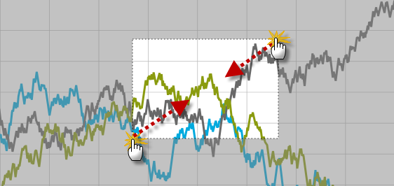
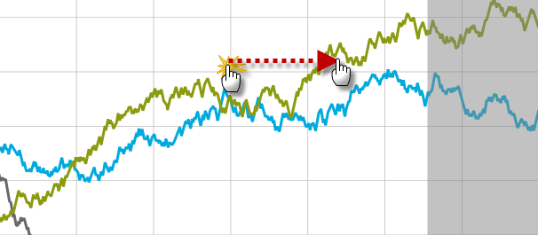

////

|metadata|
{
    "name": "datachart-navigating-chart-using-touch-gestures",
    "controlName": ["{DataChartName}"],
    "tags": ["How Do I"],
    "guid": "35a7b235-1f7f-4f4b-a510-7ff87b4ac03e",  
    "buildFlags": ["WPF","win-phone","win-rt","XAMARIN","ANDROID","WINFORMS"],
    "createdOn": "2014-06-05T19:39:00.7134039Z"
}
|metadata|
////

= Navigating Chart Using Touch Gestures

== Topic Overview

=== Purpose

This topic provides information how to use touch gestures to navigate the content in the link:{DataChartLink}.{DataChartName}.html[{DataChartName}]™ control.

=== Required background

The following table lists the topics required as a prerequisite to understanding this topic.

[options="header", cols="a,a"]
|====
|Topic|Purpose

| link:datachart-datachart.html[{DataChartName}]
|This topic provides an overview of key features in the _{DataChartName}_ control.

| link:datachart-chart-navigation.html[Chart Navigation]
|This topic provides information on using navigation in the _{DataChartName}_ control.

ifdef::sl,wpf[]
| link:datachart-navigating-chart-using-overview-plus-detail-pane.html[Navigating Chart Using Overview Plus Detail Pane]
|This topic provides information how to use the _xamOverviewPlusDetailPane_™ control to navigate content in the _{DataChartName}_ control.
endif::sl,wpf[]

|====

=== In this topic

This topic contains the following sections

* <<_Ref321140025, Touch Gestures >>

** <<_Ref320185129,Introduction>>
** <<_Ref335405092,Touch Gesture Summary>>
** <<_Ref335405096,Zoom in chart content>>
** <<_Ref335405098,Zoom out chart content>>
** <<_Ref335405101,Pan chart content>>

* <<_Ref320185294, Related Content >>

[[_Ref321140025]]
== Touch Gestures

[[_Ref320185129]]

=== Introduction

Touch gestures are interactions with a screen that enables users to navigate and interact with content in the  _{DataChartName}_   control.

ifdef::wpf,win-universal[]
.Note:
[NOTE]
====
The  _{DataChartName}_   control’s default mode pan and zoom behavior uses tab and drag gestures for panning and mouse for zooming. Provided, that is the link:{DataChartLinkBase}.{DataChartBase}{ApiProp}defaultinteraction.html[DefaultInteraction] property is unset; however, if this property is explicitly set to DragZoom, then touch gestures will force chart content zooming.
====
endif::wpf,win-universal[]

[[_Ref335405092]]

=== Touch Gesture Summary

The following table summarizes the user interaction capabilities of the  _{DataChartName}_   control.

[options="header", cols="a,a,a"]
|====
|The user can…|Using…|Details

|Zoom in on chart content
|Stretch gesture
|Touch the surface with two fingers and drag them away from each other.

|Zoom out of chart content
|Pinch gesture
|Touch the surface with two fingers and drag them towards each other.

|Pan chart content
|Pan gesture
|Touch the surface and then move your finger, in the desired direction for the pan, immediately and without losing contact.

|Display a tooltip for all series in the chart
|Tab and Drag gesture
|Touch and hold the surface for a few seconds and then drag the finger.

|====

[[_Ref335405096]]

=== Zoom in chart content

The following picture illustrates how to zoom in on content of the  _{DataChartName}_   control using stretch gesture.

image::images/xamDataChart_Interacting_with_Chart_using_Touch_Gestures_1.png[]

[[_Ref335405098]]

=== Zoom out chart content

The following picture illustrates how to zoom in on content of the  _{DataChartName}_   control using pinch gesture.

[[_Ref335405101]]

=== Pan chart content

The following picture illustrates how to pan content, in the direction of the arrow (right), of the  _{DataChartName}_   control using pan gesture.

[[_Ref320185294]]
== Related Content

=== Topics

The following topics provide additional information related to this topic.

[options="header", cols="a,a"]
|====
| *Topic* | *Purpose* 

| link:datachart-chart-navigation.html[Chart Navigation]
|This topic provides information on using navigation in the _{DataChartName}_ control.

ifdef::wpf,win-universal[]
| link:datachart-chart-tooltips.html[Chart Tooltips]
|This topic provides information on how to display and create custom tooltips in the _{DataChartName}_ control
endif::wpf,win-universal[]

ifdef::sl,wpf[]
| link:datachart-navigating-chart-using-overview-plus-detail-pane.html[Navigating Chart Using Overview Plus Detail Pane]
|This topic provides information how to use the xamOverviewPlusDetailPane™ control to navigate content in the _{DataChartName}_ control.
endif::sl,wpf[]

|====