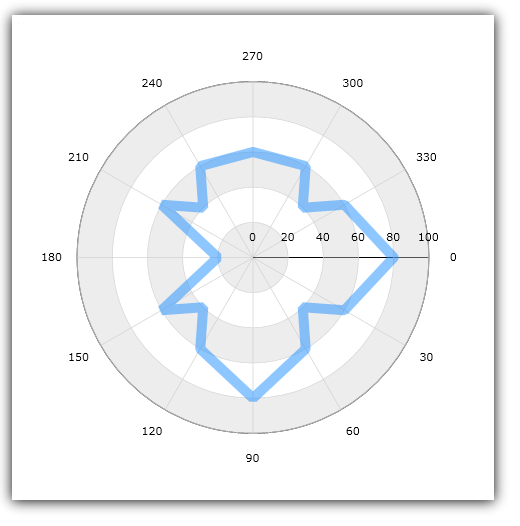
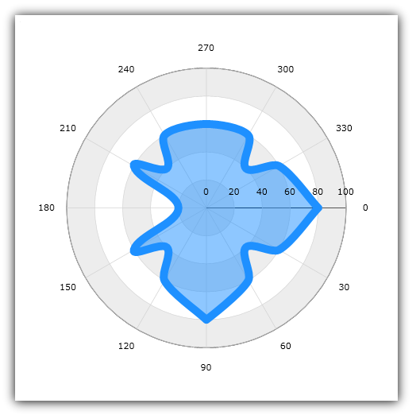
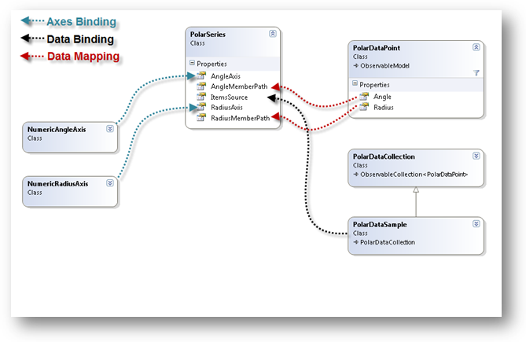

////
|metadata|
{
    "name": "datachart-polar-series-overview",
    "controlName": ["{DataChartName}"],
    "tags": ["Charting","Getting Started"],
    "guid": "86568801-db3c-4336-9f89-04c8942853d9",
    "buildFlags": [],
    "createdOn": "2014-06-05T19:39:00.5493377Z"
}
|metadata|
////

= Polar Series

This topic provides conceptual information to all types of Polar Series in the link:{DataChartLink}.{DataChartName}.html[{DataChartName}]™ control.

=== In This Topic

This topic contains the following sections:

* <<_Introduction,Introduction>>
* <<_Types,Types of Polar Series>>
* <<_Preview,Preview of Polar Series>>
* <<_SimilarSeries,Similar Series>>
* <<_SupportedAxes,Supported Axes>>
* <<_Coordinate,Coordinate System>>
* <<_DataBinding,Data Binding>>
** <<_DataRequirements,Data Requirements>>
** <<_DataSample,Data Sample>>
** <<B_indingDiagram,Binding Diagram>>
* <<_RelatedContent,Related Content>>

[[_Introduction]]
== Introduction

In the `{DataChartName}` control, Polar Series is a group of series that use the polar (angle, radius) coordinate system instead of the Cartesian (x, y) coordinate system to plot data in chart. In other words, Polar Series take concepts of link:datachart-scatter-series-overview.html[Scatter Series] and wrap them around a circle rather than stretching along a horizontal line. This group of series is used to show the relationship among the items in several distinct series of data using the polar coordinates system.

Polar Series draw attention to uneven intervals or clusters of data. They are often used to plot scientific data (e.g. wind direction and speed, direction, and strength of magnetic field, location of objects in solar system), and can highlight the deviation of collected data from predicted results.

[[_Types]]
== Types of Polar Series

The {DataChartName} control supports the following types of Polar Series and each of them is discussed in an individual topic:

* link:datachart-polar-area-series.html[Polar Area Series]
* link:datachart-polar-line-series.html[Polar Line Series]
* link:datachart-polar-scatter-series.html[Polar Scatter Series]
* link:datachart-polar-spline-series.html[Polar Spline Series]
* link:datachart-polar-spline-area-series.html[Polar Spline Area Series]

Refer to above topics to learn how to create a specific type of Polar Series and bind data to it.

[[_Preview]]
== Preview of Polar Series

This section provides preview images for all types of Polar Series.

image::images/xamDataChart_Polar_Series_01.png[]
Figure 1: Sample Polar Area Series

Figure 2: Sample Polar Line Series

image::images/xamDataChart_Polar_Series_03.png[]
Figure 3: Sample Polar Scatter Series

image::images/xamDataChart_Polar_Series_04.png[]
Figure 4: Sample Polar Spline Series

Figure 5: Sample Polar Spline Area Series

[[_SimilarSeries]]
== Similar Series

Some Polar Series have a rough equivalent to Scatter Series. The following table shows an analogy between these types of series by mapping types of the Polar Series to types of Scatter Series.
 
[options="header", cols="a,a"]
|====
|Radial Series Type|Scatter Series Type

| link:{DataChartLink}.PolarAreaSeries.html[PolarAreaSeries]
|None

| link:{DataChartLink}.PolarLineSeries.html[PolarLineSeries]
| link:{DataChartLink}.ScatterLineSeries.html[ScatterLineSeries]

| link:{DataChartLink}.PolarScatterSeries.html[PolarScatterSeries]
| link:{DataChartLink}.ScatterSeries.html[ScatterSeries]

| link:{DataChartLink}.PolarSplineAreaSeries.html[PolarSplineAreaSeries]
|None

| link:{DataChartLink}.PolarSplineSeries.html[PolarSplineSeries]
| link:{DataChartLink}.ScatterSplineSeries.html[ScatterSplineSeries]

|====
 
[[_SupportedAxes]] 
== Supported Axes

The {DataChartName} control provides various types of axes but only two types of axes can be used with all types of Polar Series. The following table lists these supported axes:

[options="header", cols="a,a,a"]
|====
|Series Type| Radius Axis Type | Angle Axis Type 
|`PolarAreaSeries` 
|link:{DataChartLink}.NumericRadiusAxis.html[NumericRadiusAxis]
|link:{DataChartLink}.NumericAngleAxis.html[NumericAngleAxis]
 
|`PolarLineSeries` 
|link:{DataChartLink}.NumericRadiusAxis.html[NumericRadiusAxis]
|link:{DataChartLink}.NumericAngleAxis.html[NumericAngleAxis]
 
|`PolarScatterSeries` 
|link:{DataChartLink}.NumericRadiusAxis.html[NumericRadiusAxis]
|link:{DataChartLink}.NumericAngleAxis.html[NumericAngleAxis]
 
|`PolarSplineAreaSeries` 
|link:{DataChartLink}.NumericRadiusAxis.html[NumericRadiusAxis]
|link:{DataChartLink}.NumericAngleAxis.html[NumericAngleAxis]
 
|`PolarSplineSeries`  
|link:{DataChartLink}.NumericRadiusAxis.html[NumericRadiusAxis]
|link:{DataChartLink}.NumericAngleAxis.html[NumericAngleAxis]
|====

.Note:
[NOTE]
====
Polar Series do not support link:{DataChartLink}.CategoryAngleAxis.html[CategoryAngleAxis] type. Refer to link:datachart-radial-series-overview.html[Radial Series] topic if you want to use `NumericRadiusAxis` with `CategoryAngleAxis` to plot one numeric data columns.
====

In addition, each of Polar Series must have binding set to one angle axis using the link:{DataChartLink}.PolarBase{ApiProp}AngleAxis.html[AngleAxis] property and one radius axis using the link:{DataChartLink}.PolarBase{ApiProp}RadiusAxis.html[RadiusAxis] property. For more information on axes refer to these topics:

* link:datachart-using-numeric-angle-axis.html[Using Numeric Angle Axis] 
* link:datachart-using-numeric-radius-axis.html[Using Numeric Radius Axis] 
* link:datachart-axes.html[Chart Axes] 

[[_Coordinate]]
== Coordinate System

In polar coordinate systems, the location of data points is determined by an angle (angular coordinate) from a fixed direction and distance (radial coordinate) from a fixed point (analogous to the origin of a Cartesian coordinate) which is called "the pole". The lines that start from the pole and point outwards are gridlines of the angular axis (NumericAngleAxis) and the concentric rings that surround the pole are gridlines of the radius axis (NumericRadiusAxis). For more information on how to use axes with Polar Series, refer to the link:datachart-axes.html[Chart Axes] topic.

Figure 6 shows link:{DataChartLink}.PolarScatterSeries.html[PolarScatterSeries] with four data points at various locations in polar coordinate system:

* the blue point is located at the center of the polar chart (0,0 is the pole in the polar coordinate system)
* the red point has a radial coordinate of 120 and angular coordinate of 90 (120, 90)
* the green point has a radial coordinate of 80 and angular coordinate of 60 (80, 60)
* the orange point has a radial coordinate of 160 and angular coordinate of 150 (160, 150)

image::images/xamDataChart_Polar_Series_06.png[]

Figure 6: Schematic representation of data plotting in polar coordinate system in the {DataChartName} control

[[_DataBinding]]
== Data Binding

This section provides information about binding data for all types of Polar Series from data requirements through data sample to binding diagrams.

[[_DataRequirements]]
==== Data Requirements

Similarly to other types of series in the {DataChartName} control, Polar Series also use link:{DataChartLink}.Series~{ApiDataSource}.html[{ApiDataSource}] property to bind data. The following is a list of data requirements for Polar Series:

* The data model must contain at least one numeric data column (e.g. Angle) which is mapped using the link:{DataChartLink}.PolarBase{ApiProp}AngleMemberPath.html[AngleMemberPath] property of Polar series (e.g. link:{DataChartLink}.PolarLineSeries.html[PolarLineSeries])
* The data model must contain at least second numeric data column (e.g. Radius) which is mapped using the link:{DataChartLink}.PolarBase{ApiProp}RadiusMemberPath.html[RadiusMemberPath] property of Polar series (e.g. link:{DataChartLink}.PolarLineSeries.html[PolarLineSeries])
* The data source must contain at least one data items otherwise the chart will not render the Polar series.
* The data source must implement the link:http://msdn.microsoft.com/en-us/library/system.collections.ienumerable.aspx[IEnumerable] interface (e.g. link:http://msdn.microsoft.com/en-us/library/6sh2ey19.aspx[List], link:http://msdn.microsoft.com/en-us/library/ms132397.aspx[Collection], link:http://msdn.microsoft.com/en-us/library/7977ey2c.aspx[Queue], or link:http://msdn.microsoft.com/en-us/library/system.collections.stack.aspx[Stack])
 
For more information on the requirements for the specific types of series, refer to the link:datachart-series-requirements.html[Series Requirements] topic.

[[_DataSample]]
==== Data Sample

An example of object that meets above criteria is the link:resources-sample-polar-data.html[PolarDataSource] which you can download and use it in your project.

[[_BindingDiagram]]
==== Binding Diagram

The following figure shows how binding data to Polar Series works in the {DataChartName} control.

ifdef::xaml,xamarin[]

endif::xaml,xamarin[]

ifdef::win-forms,android[]

endif::win-forms,android[]
 
[[_RelatedContent]]
== Related Content

* link:datachart-series-requirements.html[Series Requirements]
* link:datachart-using-numeric-angle-axis.html[Using Numeric Angle Axis]
* link:datachart-using-numeric-radius-axis.html[Using Numeric Radius Axis]
* link:datachart-polar-area-series.html[Polar Area Series]
* link:datachart-polar-line-series.html[Polar Line Series]
* link:datachart-polar-scatter-series.html[Polar Scatter Series]
* link:datachart-polar-spline-series.html[Polar Spline Series]
* link:datachart-polar-spline-area-series.html[Polar Spline Area Series]