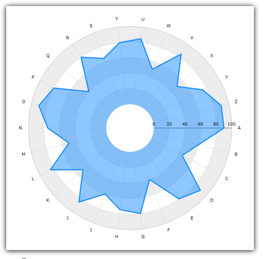

////
|metadata|
{
    "name": "datachart-radial-area-series",
    "controlName": ["{DataChartName}"],
    "tags": ["Charting","Data Binding","Data Presentation","Sample Data Source"],
    "guid": "b908c8ef-3e92-4c91-9479-5fde9e0942df",
    "buildFlags": [],
    "createdOn": "2014-06-05T19:39:00.5413344Z"
}
|metadata|
////

= Radial Area Series

This topic explains, with code examples, how to use Radial Area Series in the link:{DataChartLink}.{DataChartName}.html[{DataChartName}]™ control.

== Introduction

Radial Area Series has a shape of a filled polygon that is bound by a collection of straight lines connecting data points. The link:{DataChartLink}.radialAreaSeries.html[RadialAreaSeries] uses the same concepts of data plotting as the link:{DataChartLink}.AreaSeries.html[AreaSeries] but wraps data points around a circle rather than stretching them along a horizontal line. For more information on this group of series, refer to the link:datachart-radial-series-overview.html[Radial Series] topic.

== Preview

Figure 1 demonstrates what Radial Area Series looks like when plotted in the {DataChartName} control.

Figure 1: Sample implementation of a RadialAreaSeries

== Data Binding

The code snippet below shows how to bind sample radial data (which is available for download from the link:resources-sample-category-data.html[Sample Category Data] resource) to the RadialAreaSeries. The example assumes that you have already configured your project for the {DataChartName} control.

ifdef::sl,wpf,win-universal[]
*In XAML:*
[source,xaml]
----
xmlns:local="clr-namespace:Infragistics.Models;assembly=YourAppName"
...
<ig:{DataChartName} x:Name="DataChart">
    <ig:{DataChartName}.Resources>
        <models:CategoryDataSource x:Key="data" />
        <SolidColorBrush x:Key="AxisStripBrush" Color="LightGray" Opacity=".4" />
    </ig:{DataChartName}.Resources>
    <ig:{DataChartName}.Axes>
        <ig:CategoryAngleAxis x:Name="angleAxis"
                              Interval="1"
                              Label="{}{Category}" 
                              ItemsSource="{StaticResource data}">
        </ig:CategoryAngleAxis>
        <ig:NumericRadiusAxis x:Name="radiusAxis" 
                              Strip="{StaticResource AxisStripBrush}"                                      
                              MinimumValue="0"
                              MaximumValue="150"
                              Interval="50"
                              RadiusExtentScale="0.8"
                              InnerRadiusExtentScale="0.2">
        </ig:NumericRadiusAxis>
    </ig:{DataChartName}.Axes>
    <ig:{DataChartName}.Series>
        <ig:RadialAreaSeries AngleAxis="{Binding ElementName=angleAxis}"
                             ValueAxis="{Binding ElementName=radiusAxis}"
                             ValueMemberPath="Value"
                             Brush="#7F58A6C7"
                             MarkerType="None"
                             Outline="#FF58A6C7"
                             Thickness="5"
                             ItemsSource="{StaticResource data}">
        </ig:RadialAreaSeries>
    </ig:{DataChartName}.Series>
</ig:{DataChartName}>
----
endif::sl,wpf,win-universal[]

ifdef::xamarin[]
*In XAML:*
[source,xaml]
----
xmlns:local="clr-namespace:Infragistics.Models;assembly=YourAppName"
...
<ig:{DataChartName} x:Name="DataChart">
    <ig:{DataChartName}.Resources>
		<ResourceDictionary>
			<local:CategoryDataSource x:Name="data" />
		</ResourceDictionary>	
    </ig:{DataChartName}.Resources>
    <ig:{DataChartName}.Axes>
        <ig:CategoryAngleAxis x:Name="angleAxis"
                              Interval="1"
                              Label="Category" 
                              ItemsSource="{StaticResource data}">
        </ig:CategoryAngleAxis>
        <ig:NumericRadiusAxis x:Name="radiusAxis"                                    
                              MinimumValue="0"
                              MaximumValue="150"
                              Interval="50"
                              RadiusExtentScale="0.8"
                              InnerRadiusExtentScale="0.2">
        </ig:NumericRadiusAxis>
    </ig:{DataChartName}.Axes>
    <ig:{DataChartName}.Series>
        <ig:RadialAreaSeries AngleAxis="{x:Reference angleAxis}"
                             ValueAxis="{x:Reference radiusAxis}"
                             ValueMemberPath="Value"
                             Brush="#7F58A6C7"
                             MarkerType="None"
                             Outline="#FF58A6C7"
                             Thickness="5"
                             ItemsSource="{StaticResource data}">
        </ig:RadialAreaSeries>
    </ig:{DataChartName}.Series>
</ig:{DataChartName}>
----
endif::xamarin[]

ifdef::wpf,win-universal,win-forms,xamarin[]
*In C#:*
[source,csharp]
---- 
var data = new CategoryDataSource();

var angleAxis = new CategoryAngleAxis();
angleAxis.{ApiDataSource} = data;
angleAxis.Label = "{Category}";
angleAxis.Interval = 1;

var radiusAxis = new NumericRadiusAxis();
radiusAxis.MinimumValue = 0;
radiusAxis.MaximumValue = 150;
radiusAxis.Interval = 50;
radiusAxis.RadiusExtentScale = 0.8;
radiusAxis.InnerRadiusExtentScale = 0.2;

var series = new RadialAreaSeries();
series.{ApiDataSource} = data; 
series.ValueMemberPath = "Value";
series.AngleAxis = angleAxis;
series.ValueAxis = radiusAxis; 
series.MarkerType = MarkerType.None;
series.Thickness = 5;

var chart = new {DataChartName}();
chart.Axes.Add(angleAxis);
chart.Axes.Add(radiusAxis);  
chart.Series.Add(series);
----
endif::wpf,win-universal,win-forms,xamarin[]

ifdef::wpf,win-universal,win-forms[]
*In Visual Basic:*
[source,vb]
----
Dim data As New CategoryDataSource()
Dim angleAxis As New CategoryAngleAxis()
angleAxis.{ApiDataSource} = data
angleAxis.Label = "{Category}"
angleAxis.Interval = 1

Dim radiusAxis As New NumericRadiusAxis()
radiusAxis.MinimumValue = 0
radiusAxis.MaximumValue = 150
radiusAxis.Interval = 50
radiusAxis.RadiusExtentScale = 0.8
radiusAxis.InnerRadiusExtentScale = 0.2

Dim series As New RadialAreaSeries()
series.{ApiDataSource} = data 
series.ValueMemberPath = "Value"
series.AngleAxis = angleAxis
series.ValueAxis = radiusAxis
series.MarkerType = MarkerType.None
series.Thickness = 5

Dim chart As New {DataChartName}()
chart.Axes.Add(angleAxis)
chart.Axes.Add(radiusAxis)
chart.Series.Add(series)
----
endif::wpf,win-universal,win-forms[]
 
 
ifdef::android[]
*In Java:*
[source,java]
----
CategoryDataSource data = new CategoryDataSource();
CategoryAngleAxis angleAxis = new CategoryAngleAxis();
angleAxis.setDataSource(data);
angleAxis.setLabel("Category");
angleAxis.setInterval(1);

NumericRadiusAxis radiusAxis = new NumericRadiusAxis();
radiusAxis.setMinimumValue(0);
radiusAxis.setMaximumValue(150);
radiusAxis.setInterval(50);
radiusAxis.setRadiusExtentScale(0.8);
radiusAxis.setInnerRadiusExtentScale(0.2);

RadialAreaSeries series = new RadialAreaSeries();
series.setDataSource(data);
series.setValueMemberPath("Value");
series.setAngleAxis(angleAxis);
series.setValueAxis(radiusAxis);
series.setMarkerType(MarkerType.NONE);
series.setThickness(5); 

DataChartView chart = new DataChartView(root.getContext());
chart.addAxis(angleAxis);
chart.addAxis(radiusAxis);
chart.addSeries(series);
----
endif::android[]

== Related Content

* link:datachart-series-requirements.html[Series Requirements]
* link:datachart-using-category-angle-axis.html[Using Category Angle Axis]
* link:datachart-using-numeric-radius-axis.html[Using Numeric Radius Axis]