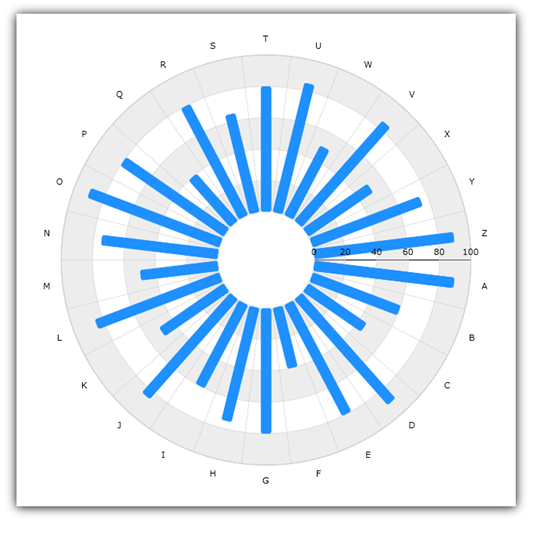
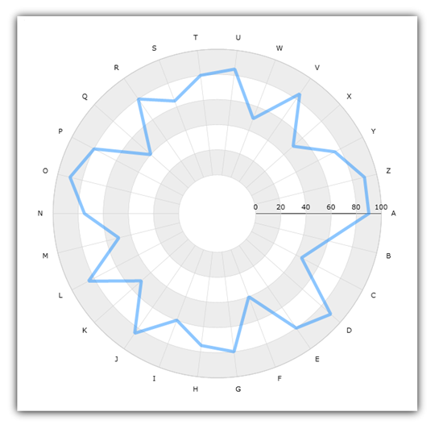
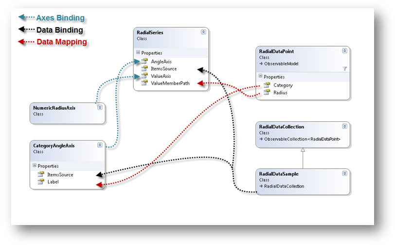
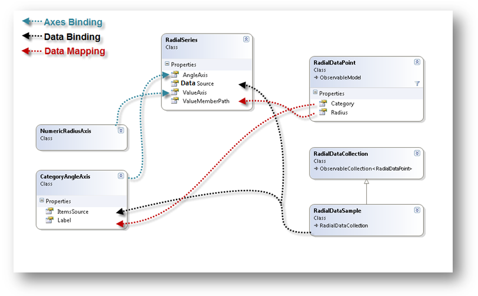

////
|metadata|
{
    "name": "datachart-radial-series-overview",
    "controlName": ["{DataChartName}"],
    "tags": ["Charting","Data Binding","Data Presentation","Sample Data Source"],
    "guid": "98311847-9620-482c-9df3-75a4736d46d1",
    "buildFlags": [],
    "createdOn": "2014-06-05T19:39:00.5353321Z"
}
|metadata|
////

= Radial Series

This topic explains the common properties for Radial Series in the link:{DataChartLink}.{DataChartName}.html[{DataChartName}]™ control.

=== In This Topic

This topic contains the following sections:

* <<_Introduction,Introduction>>
* <<_Types,Types of Radial Series>>
* <<_Preview,Preview of Radial Series>> 
* <<_SimilarSeries,Similar Series>>
* <<_SupportedAxes,Supported Axes>> 
* <<DataBinding,Data Binding>>
** <<DataRequirements,Data Requirements>>
** <<DataSample,Data Sample>>
** <<BindingDiagram,Binding Diagram>>
* <<RelatedContent,Related Content>>

[[_Introduction]]
== Introduction

Radial Series is a group of series that takes data and render it as collection of data points wrapped around a circle (rather than stretching along a horizontal line as link:datachart-category-series-overview.html[Category Series] do). Just like Category Series, Radial Series are also mapping a list of categories from the minimum to the maximum of the extent of the chart, and support the same category grouping mechanisms of Category Series. In addition, the labels can be configured to appear near or wide from the chart. This can be configured with the |link:{DataChartLink}.CategoryAngleAxis.html[CategoryAngleAxis] `LabelMode` property.

[[_Types]]
== Types of Radial Series

The {DataChartName} control supports the following types of Radial Series and each of them is discussed in an individual topic:

* link:datachart-radial-area-series.html[Radial Area Series]
* link:datachart-radial-line-series.html[Radial Line Series]
* link:datachart-radial-column-series.html[Radial Column Series]
* link:datachart-radial-pie-series.html[Radial Pie Series]
 
Refer to above topics to learn how to create a specific type of Radial Series and bind data to it. 

[[_Preview]]
== Preview of Radial Series

This section provides preview images for all types of Radial Series.

image::images/xamDataChart_Radial_Series_01.png[]

Figure 1: Sample Radial Pie Series

Figure 2: Sample Radial Column Series

Figure 3: Sample Radial Line Series

image::images/xamDataChart_Radial_Series_04.png[]

Figure 4: Sample Radial Area Series

[[_SimilarSeries]]
== Similar Series
 
Every Radial Series have a rough Category Series equivalent. The following table shows an analogy between these types of series by mapping types of the Radial Series to types of Category Series.

[options="header", cols="a,a"]
|====
|Radial Series Type|Category Series Type

| link:{DataChartLink}.radialAreaSeries.html[RadialAreaSeries]
| link:{DataChartLink}.AreaSeries.html[AreaSeries]

| link:{DataChartLink}.RadialLineSeries.html[RadialLineSeries]
| link:{DataChartLink}.LineSeries.html[LineSeries]

| link:{DataChartLink}.radialColumnSeries.html[RadialColumnSeries]
| link:{DataChartLink}.ColumnSeries.html[ColumnSeries]

| link:{DataChartLink}.RadialPieSeries.html[RadialPieSeries]
| link:{DataChartLink}.ColumnSeries.html[ColumnSeries]

|====
 

[[_SupportedAxes]] 
== Supported Axes

The {DataChartName} control provides various types of axes but only two types of axes can be used with all types of Radial Series. The following table lists these supported axes:

[options="header", cols="a,a,a"]
|====
|Series Type| Radius Axis Type | Angle Axis Type 
|`RadialAreaSeries` 
|link:{DataChartLink}.NumericRadiusAxis.html[NumericRadiusAxis]
|link:{DataChartLink}.CategoryAngleAxis.html[CategoryAngleAxis]
 
|`RadialLineSeries` 
|link:{DataChartLink}.NumericRadiusAxis.html[NumericRadiusAxis]
|link:{DataChartLink}.CategoryAngleAxis.html[CategoryAngleAxis]
 
|`RadialColumnSeries` 
|link:{DataChartLink}.NumericRadiusAxis.html[NumericRadiusAxis]
|link:{DataChartLink}.CategoryAngleAxis.html[CategoryAngleAxis]
 
|`RadialPieSeries` 
|link:{DataChartLink}.NumericRadiusAxis.html[NumericRadiusAxis]
|link:{DataChartLink}.CategoryAngleAxis.html[CategoryAngleAxis] & link:{DataChartLink}.ProportionalCategoryAngleAxis.html[ProportionalCategoryAngleAxis]
|====

.Note:
[NOTE]
====
Radial Series do not support link:{DataChartLink}.NumericAngleAxis.html[NumericAngleAxis] type. Refer to link:datachart-polar-series-overview.html[Polar Series] topic if you want to use `NumericRadiusAxis` with `NumericAngleAxis` to plot two numeric data columns.
====

In addition, each of Radial Series must have binding set to one angle axis using the link:{DataChartLink}.RadialBase{ApiProp}AngleAxis.html[AngleAxis] property and one radius axis using the link:{DataChartLink}.RadialBase{ApiProp}ValueAxis.html[ValueAxis] property. For more information on axes refer to these topics:

* link:datachart-using-category-angle-axis.html[Using Category Angle Axis] 
* link:datachart-using-numeric-radius-axis.html[Using Numeric Radius Axis] 
* link:datachart-axes.html[Chart Axes] 
 
[[DataBinding]]
== Data Binding

This section provides information about binding data for all types of Radial Series from data requirements through data sample to binding diagrams.

[[DataRequirements]]
==== Data Requirements

Similarly to other types of series in the {DataChartName} control, Radial Series also use link:{DataChartLink}.Series~{ApiDataSource}.html[{ApiDataSource}] property to bind data. The following is a list of data requirements for Radial Series:

* The data model must contain at least one category data column which is mapped to the link:{DataChartLink}.axis{ApiProp}label.html[Label] property of the link:{DataChartLink}.CategoryAngleAxis.html[CategoryAngleAxis] 
* The data model must contain at least one numeric data column (e.g. Radius) which is mapped using the link:{DataChartLink}.PolarBase{ApiProp}RadiusMemberPath.html[RadiusMemberPath] property of Radial Series (e.g. link:{DataChartLink}.PolarLineSeries.html[PolarLineSeries])
* The data source must contain at least one data items otherwise the chart will not render the Radial Series.
* The data source must implement the link:http://msdn.microsoft.com/en-us/library/system.collections.ienumerable.aspx[IEnumerable] interface (e.g. link:http://msdn.microsoft.com/en-us/library/6sh2ey19.aspx[List], link:http://msdn.microsoft.com/en-us/library/ms132397.aspx[Collection], link:http://msdn.microsoft.com/en-us/library/7977ey2c.aspx[Queue], or link:http://msdn.microsoft.com/en-us/library/system.collections.stack.aspx[Stack])

For more information on the requirements for the specific types of series, refer to the link:datachart-series-requirements.html[Series Requirements] topic.

[[DataSample]]
==== Data Sample

An example of object that meets above criteria is the link:resources-sample-category-data.html[Sample Category Data] which you can download and use it in your project.

[[BindingDiagrams]]
==== Binding Diagrams

The following figure shows how binding data to Radial Series works in the {DataChartName} control.

ifdef::xaml[]

endif::xaml[]

ifdef::win-forms,android[]

endif::win-forms,android[]
  
[[RelatedContent]]
== Related Content

* link:datachart-series-requirements.html[Series Requirements]
* link:datachart-radial-area-series.html[Radial Area Series]
* link:datachart-radial-line-series.html[Radial Line Series]
* link:datachart-radial-column-series.html[Radial Column Series]
* link:datachart-radial-pie-series.html[Radial Pie Series]
* link:datachart-using-category-angle-axis.html[Using Category Angle Axis]
* link:datachart-using-numeric-radius-axis.html[Using Numeric Radius Axis]