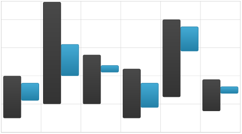
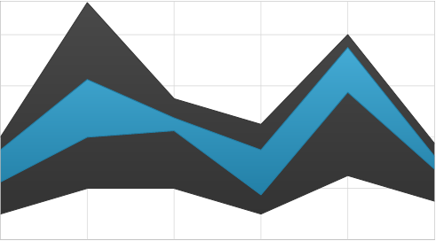

////
|metadata|
{
    "name": "datachart-range-series-overview",
    "controlName": ["{DataChartName}"],
    "tags": ["Charting"],
    "guid": "",
    "buildFlags": [],
    "createdOn": "2017-03-05T19:39:00.3992752Z"
}
|metadata|
////

= Range Series

This topic explains various types of Range Series in the link:{DataChartLink}.{DataChartName}.html[{DataChartName}]™ control.

=== In This Topic

This topic contains the following sections:

* <<_Introduction,Introduction>>
* <<_Types,Types of Range Series>>
* <<_Preview,Preview of Range Series>>
* <<_SimilarSeries,Similar Series>>
* <<_SupportedAxes,Supported Axes>>
* <<_DataBinding,Data Binding>>
** <<_DataRequirements,Data Requirements>>
** <<_DataSample,Data Sample>>
* <<_RelatedContent,Related Content>>

[[_Introduction]]
== Introduction

Range Series is a group of the simplest and most common form of chart series that take data and render it as collection of data points stretched along a horizontal line (e.g. column series) or vertical line (e.g. bar series).

[[_Types]]
== Types of Range Series

The {DataChartName} control supports the following types of Range Series and each of them is discussed in an individual topic:

* link:datachart-category-range-area-series.html[Range Area Series]
* link:datachart-category-range-column-series.html[Range Column Series]

These topics will provide you with useful information on how to use create a specific type of Range Series and bind data to it.

[[_Preview]]
== Preview of Range Series

This section provides preview images for all types of Range Series.
 

Figure 1: Sample implementation of Range Column Series

Figure 2: Sample implementation of Range Area Series
 
[[_SupportedAxes]] 
== Supported Axes

The {DataChartName} control provides various types of axes but only the following types of axes can be used with specific types of Range Series. The following table lists these supported axes:

[options="header", cols="a,a,a"]
|====
|Series Type| XAxis Type | YAxis Type 
 
| 
`RangeColumnSeries` 

`RangeAreaSeries` 
  
|link:{DataChartLink}.CategoryXAxis.html[CategoryXAxis]

link:{DataChartLink}.CategoryDateTimeXAxis.html[CategoryDateTimeXAxis]

ifdef::wpf,win-forms[]
link:{DataChartLink}.TimeXAxis.html[TimeXAxis]

link:{DataChartLink}.OrdinalTimeXAxis.html[OrdinalTimeXAxis]
endif::wpf,win-forms[]
|link:{DataChartLink}.NumericYAxis.html[NumericYAxis]
 
ifdef::wpf,win-forms[]
link:{DataChartLink}.PercentChangeYAxis.html[PercentChangeYAxis] 
endif::wpf,win-forms[]
 
|====

In addition, each of Range Series must have binding set to one x-axis using the property link:{DataChartLink}.HorizontalAnchoredCategorySeries{ApiProp}XAxis.html[XAxis] and one y-axis using link:{DataChartLink}.HorizontalAnchoredCategorySeries{ApiProp}XAxis.html[YAxis] property. For more information on axes, refer to the link:datachart-axes.html[Axes] topic.

[[_DataBinding]] 
== Data Binding

This section provides information about binding data for all types of Range Series from data requirements through data sample to binding diagrams.

[[_DataRequirements]] 
==== Data Requirements

Similarly to other types of series in the {DataChartName} control, Range Series also use link:{DataChartLink}.Series~{ApiDataSource}.html[{ApiDataSource}] property to bind data. The following is a list of data requirements for Range Series:

* The data model should contain one data column (string or date time) which is mapped to the link:{DataChartLink}.Axis{ApiProp}Label.html[Label] property of the category axis (e.g. link:{DataChartLink}.CategoryXAxis.html[CategoryXAxis])pick:[wpf,win-forms=" or the link:{DataChartLink}.TimeAxisBase{ApiProp}DateTimeMemberPath.html[DateTimeMemberPath] when using link:{DataChartLink}.TimeXAxis.html[TimeXAxis]"].
* The data model must contain one numeric data column which is mapped using the link:{DataChartLink}.RangeCategorySeries{ApiProp}HighMemberPath.html[HighMemberPath] property of range series  
* The data model must contain second numeric data column which is mapped using the link:{DataChartLink}.RangeCategorySeries{ApiProp}LowMemberPath.html[LowMemberPath] property of range series  
* The data source must contain at least one data items otherwise the chart will not render the range series.
* The data source must implement the link:http://msdn.microsoft.com/en-us/library/system.collections.ienumerable.aspx[IEnumerable] interface (e.g. link:http://msdn.microsoft.com/en-us/library/6sh2ey19.aspx[List], link:http://msdn.microsoft.com/en-us/library/ms132397.aspx[Collection], link:http://msdn.microsoft.com/en-us/library/7977ey2c.aspx[Queue], or link:http://msdn.microsoft.com/en-us/library/system.collections.stack.aspx[Stack])
 
For more information on the requirements for the specific types of series, refer to the link:datachart-series-requirements.html[Series Requirements] topic.

[[_DataSample]] 
=== Data Sample

An example of object that meets above criteria is the link:resources-sample-energy-data.html[Sample Energy Data] which you can download and use it in your project.

[[_RelatedContent]] 
== Related Content

* link:datachart-axes.html[Axes]
* link:datachart-multiple-axes.html[Using Multiple Axes]
* link:datachart-multiple-series.html[Adding Multiple Series]
* link:datachart-series-requirements.html[Series Requirements]