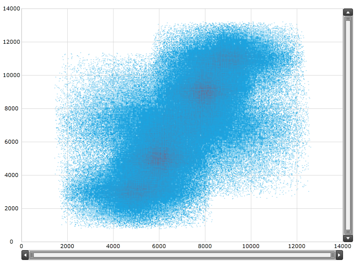
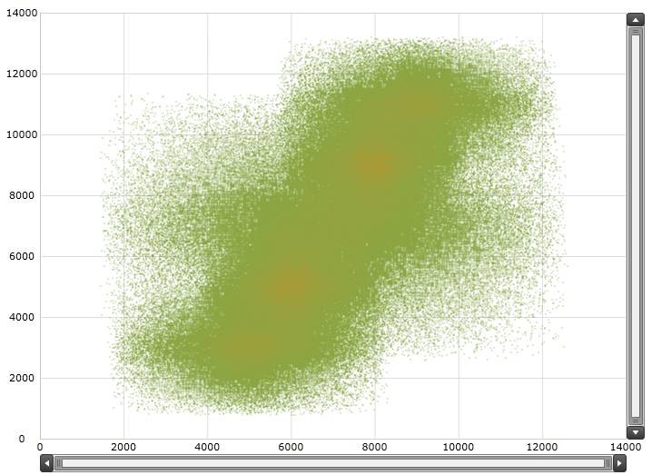
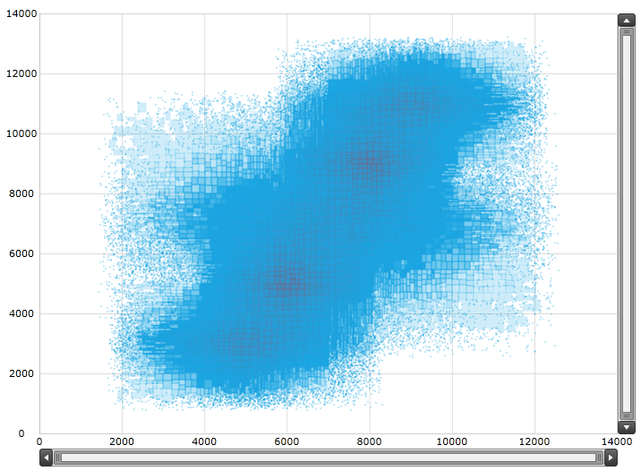
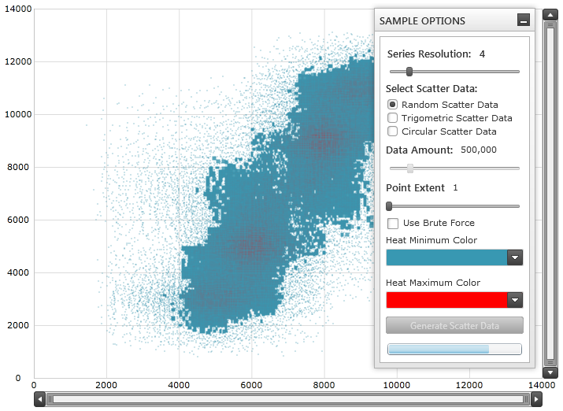
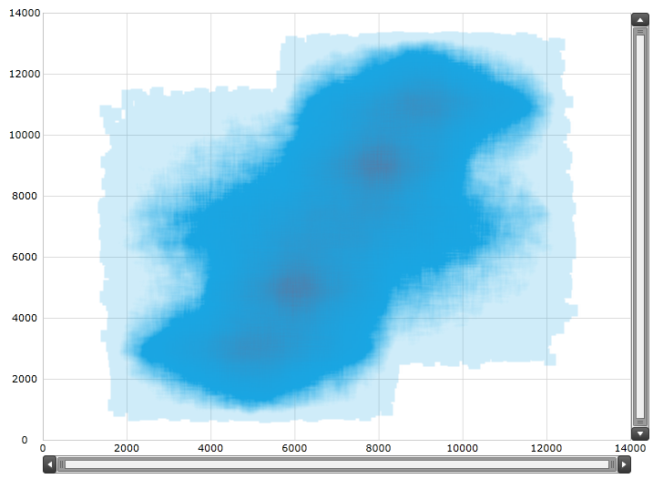

////
|metadata|
{
    "name": "datachart-scatter-high-density-scatter-series",
    "controlName": ["{DataChartName}"],
    "tags": ["Data Binding","Getting Started","How Do I","Performance"],
    "guid": "128868e3-9616-4bfc-a660-fe8cdfa19293",
    "buildFlags": [],
    "createdOn": "2014-06-05T19:39:00.7114028Z"
}
|metadata|
////

= High Density Scatter Series

== Topic Overview

=== Purpose

This topic provides information on using the link:{DataChartLink}.{DataChartName}.html[{DataChartName}™] control’s link:{DataChartLink}.HighDensityScatterSeries_members.html[HighDensityScatterSeries] type of series.

=== Required background

The following topics are prerequisites to understanding this topic:

[options="header", cols="a,a"]
|====
|Topic|Purpose

| link:datachart-getting-started-with-datachart.html[Getting Started with Data Chart]
|This topic explains how to add the _{DataChartName}_ control

| link:datachart-scatter-series-overview.html[Scatter Series]
|This topic explains how add the link:{DataChartLink}.ScatterSeries_members.html[ScatterSeries] to the _{DataChartName}_

|====

=== In this topic

This topic contains the following sections:

* <<HighDensityScatterSeries,High Density Scatter Series>>

** <<Overview,Overview>>
** <<Preview,Preview>>
** <<DataRequirements,Data Requirements>>
** <<DataBinding,Data Binding>>
** <<HeatColorScale,Heat Color Scale>>
** <<HeatColorScaleExample,Heat Color Scale Example>>

* <<Performance,Performance>>

** <<PerformanceOverview,Overview>>
** <<SeriesResolution,Series Resolution>>
** <<SeriesResolutionExample,Series Resolution Example>>
** <<ProgressiveLoading,Progressive Loading>>
** <<ProgressiveLoadingExample,Progressive Loading Example>>
** <<MouseOverSupport,Mouse Over Support>>
** <<MouseOverSupportExample,Mouse Over Support Example>>
** <<BruteForceMode,Brute Force Mode>>
** <<BruteForceModeExample,Brute Force Mode Example>>
** <<PointSize,Point Size>>
** <<PointSizeExample,Point Size Example>>

* <<RelatedContent,Related Content>>

[[HighDensityScatterSeries]]
== High Density Scatter Series

[[Overview]]

=== Overview

Use the _{DataChartName}_  control’s link:{DataChartLink}.HighDensityScatterSeries_members.html[HighDensityScatterSeries] series to bind and show scatter data ranging from hundreds to millions of data points with very little loading time. Because there are so many data points, the series displays the scatter data as tiny dots as opposed to full size markers, and displays areas with the most data using a higher color density representing a cluster of data points.

[[Preview]]

=== Preview

The following screenshot is a preview of the link:{DataChartLink}.HighDensityScatterSeries_members.html[HighDensityScatterSeries] series in the _{DataChartName}_  control bound to 500,000 data points. The areas colored bright red are the area with the highest concentration of data points.

[[DataRequirements]]

=== Data Requirements

Similar to other types of scatter series in the _{DataChartName}_  control, the link:{DataChartLink}.HighDensityScatterSeries_members.html[HighDensityScatterSeries] series has the link:{DataChartLink}.Series~{ApiDataSource}.html[{ApiDataSource}] property for data binding. This property can be bound to objects implementing an link:http://msdn.microsoft.com/en-us/library/system.collections.ienumerable.aspx[IEnumerable] interface.

In addition, each item in the items source must have two data columns for X and Y values to position a data point in the Cartesian coordinate system, and uses the link:{DataChartLink}.HighDensityScatterSeries{ApiProp}XMemberPath.html[XMemberPath] and link:{DataChartLink}.HighDensityScatterSeries{ApiProp}YMemberPath.html[YMemberPath] Path properties to map these data columns.

[[DataBinding]]

=== Data Binding

The following table summarizes the link:{DataChartLink}.HighDensityScatterSeries_members.html[HighDensityScatterSeries] series properties used for data binding.

[options="header", cols="a,a,a"]
|====
|*Property Name*|*Property Type*|* Description*

| link:{DataChartLink}.series~{ApiDataSource}.html[{ApiDataSource}]
|`IEnumerable`
|Gets or sets the items source

| link:{DataChartLink}.HighDensityScatterSeries{ApiProp}XMemberPath.html[XMemberPath]
|`string`
|Uses the link:{DataChartLink}.Series~{ApiDataSource}.html[{ApiDataSource}] property to determine where the X values reside on assigned items

| link:{DataChartLink}.HighDensityScatterSeries{ApiProp}YMemberPath.html[YMemberPath]
|`string`
|Uses the link:{DataChartLink}.Series~{ApiDataSource}.html[{ApiDataSource}] property to determine where the Y values reside on the assigned items

|====

[[HeatColorScale]]

=== Heat Color Scale

The Heat Color Scale is an optional feature that determines the color pattern within the series. The following table summarizes the properties used for determining the color scale.

[options="header", cols="a,a,a"]
|====
|*Property Name*|*Property Type*|* Description*

| link:{DataChartLink}.HighDensityScatterSeries{ApiProp}HeatMinimum.html[HeatMinimum]
|`double`
|Defines the double value representing the minimum end of the color scale

| link:{DataChartLink}.HighDensityScatterSeries{ApiProp}HeatMaximum.html[HeatMaximum]
|`double`
|Defines the double value representing the maximum end of the color scale

| link:{DataChartLink}.HighDensityScatterSeries{ApiProp}HeatMinimumColor.html[HeatMinimumColor]
|`Color`
|Defines the point density color used at the bottom end of the color scale

| link:{DataChartLink}.HighDensityScatterSeries{ApiProp}HeatMaximumColor.html[HeatMaximumColor]
|`Color`
|Defines the point density color used at the top end of the color scale

|====

[[HeatColorScaleExample]]

=== Example

The screenshot, following the table, demonstrates how the _{DataChartName}_  with the link:{DataChartLink}.HighDensityScatterSeries{ApiProp}HeatMinimumColor.html[HeatMinimumColor] and link:{DataChartLink}.HighDensityScatterSeries{ApiProp}HeatMaximumColor.html[HeatMaximumColor] properties of the link:{DataChartLink}.HighDensityScatterSeries_members.html[HighDensityScatterSeries] looks as a result of the following settings:

[options="header", cols="a,a"]
|====
|Property|Value

| link:{DataChartLink}.HighDensityScatterSeries{ApiProp}HeatMinimumColor.html[HeatMinimumColor]
|Green

| link:{DataChartLink}.HighDensityScatterSeries{ApiProp}HeatMaximumColor.html[HeatMaximumColor]
|Orange

|====

Following is the code that implements this example:

ifdef::wpf,win-universal[]

*In XAML:*

[source,xaml]
----
<ig:{DataChartName}.Series>
   <ig:HighDensityScatterSeries
      XAxis="{Binding ElementName=numericXAxis}"
      YAxis="{Binding ElementName=numericYAxis}"
      ItemsSource="{Binding}"
      XMemberPath="XValue"
      YMemberPath="YValue"
      HeatMaximumColor="Orange"
      HeatMinimumColor="Green">
   </ig:HighDensityScatterSeries>
</ig:{DataChartName}.Series>
----

endif::wpf,win-universal[]

[[Performance]]
== Performance

[[PerformanceOverview]]

=== Overview

The link:{DataChartLink}.HighDensityScatterSeries_members.html[HighDensityScatterSeries] series of the `{DataChartName}` is performance optimized. There are many performance specific properties and methods designed to optimize the _{DataChartName}’s_

performance when using hundreds to millions of data points.

[[SeriesResolution]]

=== Series Resolution

The link:{DataChartLink}.HighDensityScatterSeries_members.html[HighDensityScatterSeries] series’ link:{DataChartLink}.series{ApiProp}resolution.html[Resolution] property determines how aggressively the series consolidates display data. The higher the value, the more aggressively data is merged, and the

greater the performance of the series. While using lower values provide enhanced display resolution, it does so with correspondingly diminished performance.

[[SeriesResolutionExample]]

=== Example

The screenshot, following the table, demonstrates how the _{DataChartName}_  renders with the following link:{DataChartLink}.series{ApiProp}resolution.html[Resolution] property of the link:{DataChartLink}.HighDensityScatterSeries_members.html[HighDensityScatterSeries] setting:

[options="header", cols="a,a"]
|====
|Property|Value(1 – 10)

| link:{DataChartLink}.series{ApiProp}resolution.html[Resolution]
|10

|====

Following is the code implemented for this example:

ifdef::wpf,win-universal[]

*In XAML:*

[source,xaml]
----
<ig:{DataChartName}.Series>
   <ig:HighDensityScatterSeries
      XAxis="{Binding ElementName=numericXAxis}"
      YAxis="{Binding ElementName=numericYAxis}"
      ItemsSource="{Binding}"
      XMemberPath="XValue"
      YMemberPath="YValue"
      Resolution="10">
   </ig:HighDensityScatterSeries>
</ig:{DataChartName}.Series>
----

endif::wpf,win-universal[]

[[ProgressiveLoading]]

=== Progressive Loading

The _{DataChartName}_  control progressively renders the link:{DataChartLink}.HighDensityScatterSeries_members.html[HighDensityScatterSeries] series loading the data in pieces so that the UI remains responsive for the entire time it takes to load the _{DataChartName}_ . By default, the link:{DataChartLink}.HighDensityScatterSeries{ApiProp}progressiveload.html[ProgressiveLoad] property is set to true. While _{DataChartName}_  is rendering, the link:{DataChartLink}.HighDensityScatterSeries_members.html[HighDensityScatterSeries] series provides two ways in which you can display the loading status:

* Listens for the link:{DataChartLink}.HighDensityScatterSeries{ApiProp}progressiveloadstatuschanged_ev.html[ProgressiveLoadStatusChanged] event allowing the loading status to display
* The link:{DataChartLink}.HighDensityScatterSeries{ApiProp}progressivestatus.html[ProgressiveStatus] property represents the progressive load series status with values ranging from 0 to 100; 100 being fully loaded. This property binds to controls that indicate the loading status such as a progress bar.

[[ProgressiveLoadingExample]]

=== Example

The screenshot, following this table, illustrates how the _{DataChartName}_  renders with the link:{DataChartLink}.HighDensityScatterSeries_members.html[HighDensityScatterSeries] series link:{DataChartLink}.HighDensityScatterSeries{ApiProp}progressiveloadstatuschanged_ev.html[ProgressiveLoadStatusChanged] event configured:

[options="header", cols="a,a"]
|====
|Property|Value

| link:{DataChartLink}.HighDensityScatterSeries{ApiProp}progressiveload.html[ProgressiveLoad]
|`True`

| link:{DataChartLink}.HighDensityScatterSeries{ApiProp}progressiveloadstatuschanged_ev.html[ProgressiveLoadStatusChanged]
|`OnSeriesProgressiveLoadStatusChanged`

|====

The following is the code used to implement the preceding example:

ifdef::wpf,win-universal[]

*In XAML:*

[source,xaml]
----
<ig:{DataChartName}.Series>
   <ig:HighDensityScatterSeries
      XAxis="{Binding ElementName=numericXAxis}"
      YAxis="{Binding ElementName=numericYAxis}"
      ItemsSource="{Binding}"
      XMemberPath="XValue"
      YMemberPath="YValue"
      Resolution="3"
      ProgressiveLoad="True"
      ProgressiveLoadStatusChanged="OnSeriesProgressiveLoadStatusChanged">
   </ig:HighDensityScatterSeries>
</ig:{DataChartName}.Series>
----

endif::wpf,win-universal[]

ifdef::wpf[]

*In C#:*

[source,csharp]
----
private void OnSeriesProgressiveLoadStatusChanged(object sender,   
                                   ProgressiveLoadStatusEventArgs e)
{
   this.SeriesLoadingProgressBar.Value = e.CurrentStatus;
   if (e.CurrentStatus == 100)
   {
      SeriesLoadingPanel.Visibility = Visibility.Collapsed;
   }
}
----

endif::wpf[]

ifdef::win-forms[]

*In C#:*

[source,csharp]
----
private void OnSeriesProgressiveLoadStatusChanged(object sender,   
                                   ProgressiveLoadStatusEventArgs e)
{
   this.SeriesLoadingProgressBar.Value = e.CurrentStatus;
   if (e.CurrentStatus == 100)
   {
      SeriesLoadingPanel.Visibility = Visibility.Collapsed;
   }
}
----

endif::win-forms[]

ifdef::xamarin[]

*In C#:*

[source,csharp]
----
private void OnSeriesProgressiveLoadStatusChanged(object sender,   
                                   ProgressiveLoadStatusEventArgs e)
{
   this.SeriesLoadingProgressBar.Value = e.CurrentStatus;
   if (e.CurrentStatus == 100)
   {
      SeriesLoadingPanel.Visibility = Visibility.Collapsed;
   }
}
----

endif::xamarin[]

ifdef::wpf[]

*In Visual Basic:*

[source,vb]
----
Private Sub OnSeriesProgressiveLoadStatusChanged(ByVal sender As Object, ByVal e As ProgressiveLoadStatusEventArgs)   Me.SeriesLoadingProgressBar.Value = e.CurrentStatus   If (e.CurrentStatus = 100) Then      SeriesLoadingPanel.Visibility = Visibility.Collapsed   End IfEnd Sub
----

endif::wpf[]

ifdef::win-forms[]

*In Visual Basic:*

[source,vb]
----
Private Sub OnSeriesProgressiveLoadStatusChanged(ByVal sender As Object, ByVal e As ProgressiveLoadStatusEventArgs)   Me.SeriesLoadingProgressBar.Value = e.CurrentStatus   If (e.CurrentStatus = 100) Then      SeriesLoadingPanel.Visibility = Visibility.Collapsed   End IfEnd Sub
----

endif::win-forms[]

ifdef::xamarin[]

*In Visual Basic:*

[source,vb]
----
Private Sub OnSeriesProgressiveLoadStatusChanged(ByVal sender As Object, ByVal e As ProgressiveLoadStatusEventArgs)   Me.SeriesLoadingProgressBar.Value = e.CurrentStatus   If (e.CurrentStatus = 100) Then      SeriesLoadingPanel.Visibility = Visibility.Collapsed   End IfEnd Sub
----

endif::xamarin[]

[[MouseOverSupport]]

=== Mouse over Support

The link:{DataChartLink}.HighDensityScatterSeries_members.html[HighDensityScatterSeries] series’  pick:[sl,wpf,win-phone=" link:{DataChartLink}.Series{ApiProp}mouseoverenabled.html[MouseOverEnabled]"]  pick:[win-universal=" link:{DataChartLink}.Series{ApiProp}pointeroverenabled.html[PointerOverEnabled]"]  property specifies whether or not the `MouseOver` event fires. The default setting for this property is `False`. The mouse over support for this series can be very expensive in terms of memory and performance. The main disadvantage of setting this value to false is the inability to render Tooltips.

[[MouseOverSupportExample]]

=== Example

The screenshot, following this table, illustrates the rendering of the _{DataChartName}_  with the link:{DataChartLink}.HighDensityScatterSeries_members.html[HighDensityScatterSeries] series’  pick:[sl,wpf,win-phone=" link:{DataChartLink}.Series{ApiProp}mouseoverenabled.html[MouseOverEnabled]"]  pick:[win-universal=" link:{DataChartLink}.Series{ApiProp}pointeroverenabled.html[PointerOverEnabled]"]  property set as follows, and with a custom ToolTip:

[options="header", cols="a,a"]
|====
|Property|Value

|pick:[sl,wpf,win-phone=" link:{DataChartLink}.Series{ApiProp}mouseoverenabled.html[MouseOverEnabled]"] pick:[win-universal=" link:{DataChartLink}.Series{ApiProp}pointeroverenabled.html[PointerOverEnabled]"]
|`True`

|====

image::images/High_Density_Scatter_Series_1_5.png[]

The following is the code used to implement the preceding example:

ifdef::wpf,win-universal[]

*In XAML:*

[source,xaml]
----
<ig:{DataChartName}.Series>
   <ig:HighDensityScatterSeries
      XAxis="{Binding ElementName=numericXAxis}"
      YAxis="{Binding ElementName=numericYAxis}"
      ItemsSource="{Binding}"
      XMemberPath="XValue"
      YMemberPath="YValue"
      MouseOverEnabled="True"   >
      <ig:HighDensityScatterSeries.ToolTip>
         <StackPanel>
            <StackPanel Orientation="Horizontal">
               <TextBlock Text="X: " />
               <TextBlock Text="{Binding Item.XValue, StringFormat='#,##0.000'}" />
            </StackPanel>
            <StackPanel Orientation="Horizontal">
               <TextBlock Text="Y: " />
               <TextBlock Text="{Binding Item.YValue, StringFormat='#,##0.000'}" />
            </StackPanel>
         </StackPanel>
      </ig:HighDensityScatterSeries.ToolTip>
   </ig:HighDensityScatterSeries>
</ig:{DataChartName}.Series>
----

endif::wpf,win-universal[]

[[BruteForceMode]]

=== Brute Force Mode

The link:{DataChartLink}.HighDensityScatterSeries{ApiProp}usebruteforce.html[UseBruteForce] property of the link:{DataChartLink}.HighDensityScatterSeries_members.html[HighDensityScatterSeries] series determines how the series rendering. When this property is set to true, the series will not build its internal data structures for rendering, but instead renders all the data points every time, thus allowing for quicker initial load time and less memory usage; however, subsequent navigation through the data is significantly slower.

[[BruteForceModeExample]]

=== Example

The screenshot following this table illustrates the rendering of the _{DataChartName}_  with the link:{DataChartLink}.HighDensityScatterSeries_members.html[HighDensityScatterSeries] series’ link:{DataChartLink}.HighDensityScatterSeries{ApiProp}usebruteforce.html[UseBruteForce] property set as follows:

[options="header", cols="a,a"]
|====
|Property|Value

| link:{DataChartLink}.HighDensityScatterSeries{ApiProp}usebruteforce.html[UseBruteForce]
|`True`

|====

image::images/High_Density_Scatter_Series_1_6.png[]

The following is the code used to implement the preceding example:

ifdef::wpf,win-universal[]

*In XAML:*

[source,xaml]
----
<ig:{DataChartName}.Series>
   <ig:HighDensityScatterSeries
       XAxis="{Binding ElementName=numericXAxis}"
       YAxis="{Binding ElementName=numericYAxis}"
       ItemsSource="{Binding}"
       XMemberPath="XValue"
       YMemberPath="YValue"
       ProgressiveLoadStatusChanged="OnSeriesProgressiveLoadStatusChanged"
       UseBruteForce="True">
   </ig:HighDensityScatterSeries>
</ig:{DataChartName}.Series>
----

endif::wpf,win-universal[]

[[PointSize]]

=== Point Size

The link:{DataChartLink}.HighDensityScatterSeries_members.html[HighDensityScatterSeries] series’ link:{DataChartLink}.HighDensityScatterSeries{ApiProp}pointextent.html[PointExtent] property raises the minimum point size used for rendering high density scatter series’ points. The point size directly affects the series performance, where the higher the link:{DataChartLink}.HighDensityScatterSeries{ApiProp}pointextent.html[PointExtent] property value the lower the performance.

[[PointSizeExample]]

=== Example

The screenshot, following this table, illustrates how the _{DataChartName}_  renders with the link:{DataChartLink}.HighDensityScatterSeries_members.html[HighDensityScatterSeries] series’ link:{DataChartLink}.HighDensityScatterSeries{ApiProp}pointextent.html[PointExtent] property configured thusly:

[options="header", cols="a,a"]
|====
|Property|Value

| link:{DataChartLink}.HighDensityScatterSeries{ApiProp}pointextent.html[PointExtent]
| __7__ 

|====

The following is the code used to implement the preceding example:

ifdef::wpf,win-universal[]

*In XAML:*

[source,xaml]
----
<ig:{DataChartName}.Series>
   <ig:HighDensityScatterSeries
      XAxis="{Binding ElementName=numericXAxis}"
      YAxis="{Binding ElementName=numericYAxis}"
      ItemsSource="{Binding}"
      XMemberPath="XValue"
      YMemberPath="YValue"
      PointExtent="7">
   </ig:HighDensityScatterSeries>
</ig:{DataChartName}.Series>
----

endif::wpf,win-universal[]

[[RelatedContent]]
== Related Content

The following topics provide additional information related to this topic.

[options="header", cols="a,a"]
|====
|Topic|Purpose

| link:datachart-getting-started-with-datachart.html[Getting Started with Data Chart]
|This topic provides information on how to add the `{DataChartName}` control to an application page.

| link:datachart-scatter-series-overview.html[Scatter Series]
|This topic provides information on the scatter series available in the `{DataChartName}` control.

|====