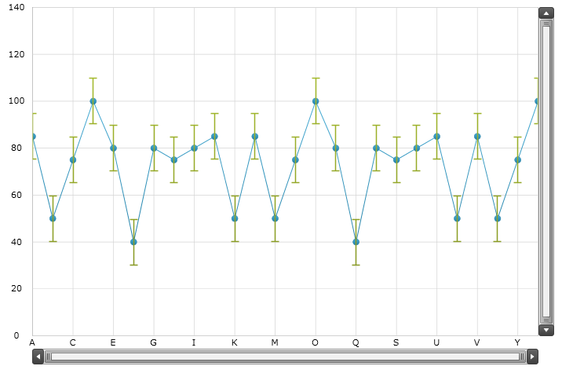
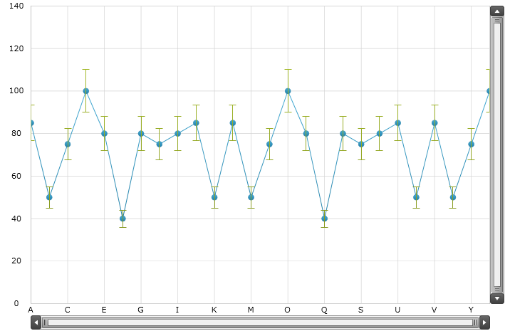
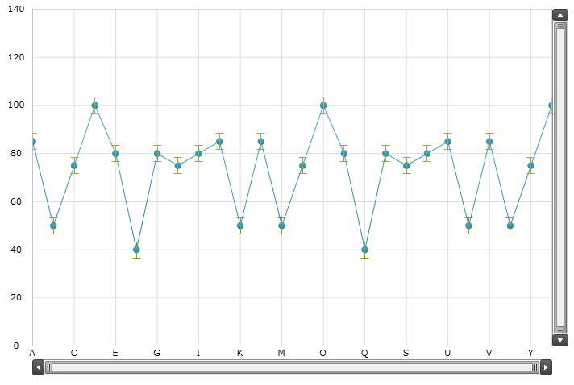
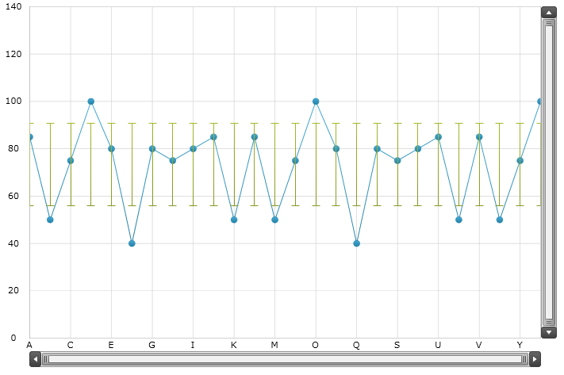
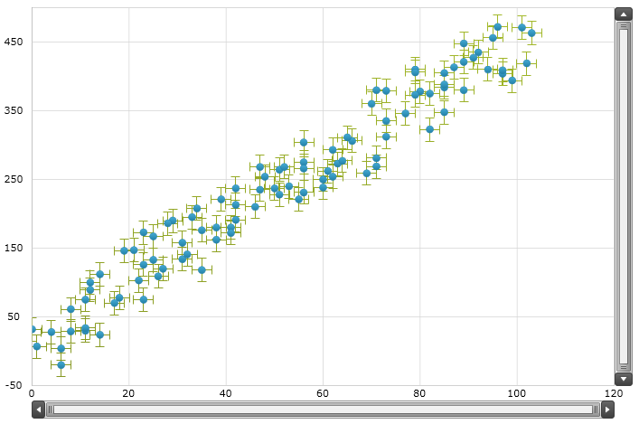
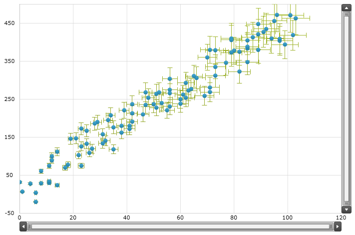
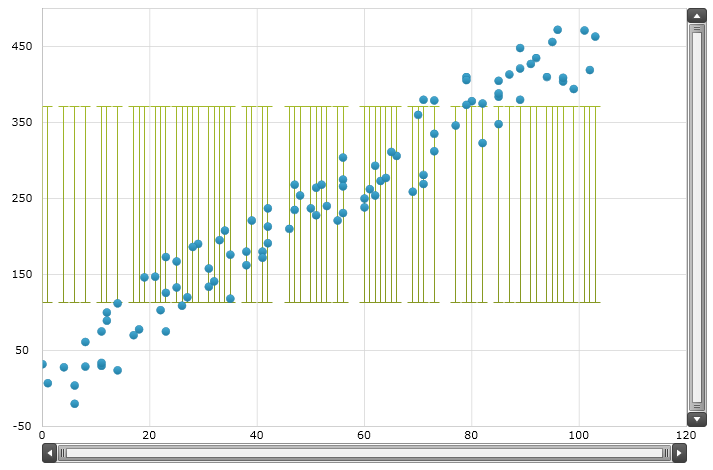

////
|metadata|
{
    "name": "datachart-series-error-bars",
    "controlName": ["{DataChartName}"],
    "tags": ["Charting","Data Presentation","Getting Started","How Do I"],
    "guid": "c86ab3e4-5fac-4e71-994a-cb3fa4c13123",
    "buildFlags": ["wpf","win-universal"],
    "createdOn": "2014-06-05T19:39:00.647376Z"
}
|metadata|
////

= Series Error Bars

This topic introduces the Error Bars feature of the link:{DataChartLink}.{DataChartName}.html[{DataChartName}]™ control and explains, with code examples, how to display error bars on supported series.

== Overview

The topic is organized as follows:

* <<Introduction,Introduction>>
* <<Requirements,Requirements>>
* <<SupportedTypesofSeries,Supported Types of Series>>

** Category Series
** Scatter Series

* <<TypesofErrorBars,Types of Error Bars>>

** Fixed Value Error Bars
** Percentage Error Bars
** Standard Error Bars
** Standard Deviation Error Bars
** Custom Data Error Bars

* <<ErrorBarsProperties,Error Bars Properties>>

** Category Error Bars Properties
** Scatter Error Bars Properties

* <<Examples,Examples>>

** Category Series with Fixed Value Error Bars
** Category Series with Percentage Error Bars
** Category Series with Standard Error Bars
** Category Series with Standard Deviation Error Bars
** Category Series with Custom Data Error Bars
** Scatter Series with Fixed Value Error Bars
** Scatter Series with Percentage Error Bars
** Scatter Series with Standard Error Bars
** Scatter Series with Standard Deviation Error Bars
** Scatter Series with Custom Data Error Bars

* <<RelatedContent,Related Content>>

** link:datachart-series-types.html[Series Types]
** link:datachart-series-requirements.html[Series Requirements]
** link:ig-math-calculators.html[Infragistics Math Calculators]

== Introduction

Error bars are visual representation of the variability of data plotted in the Data Chart using Series objects. They are often used on charts to show an error or uncertainty in data. In general, they provide visualization of how accurate data measurements are or how far the true values could be from the measured values.

== Requirements

ifdef::win-forms[]

In {DataChartName}, the length of error bars is calculated using the Infragistics Math Calculators™ and the following assemblies must be added to a {PlatformName} project before error bars can be displayed on data points.

[options="header", cols="a,a"]
|====
|Assembly|Description

|{ApiPlatform}Math.Calculators.v{ProductVersion}.dll
|{ProductName} assembly containing mathematical calculators to compute error bars, correlation, mean, median, variance and many more mathematical values.

|{ApiPlatform}Math.v{ProductVersion}.dll
|{ProductName} assembly containing standard mathematical constants and all-purpose mathematical functions designed to act on a variety of mathematical objects.

|{ApiPlatform}{DataChartAssembly}.v{ProductVersion}.dll
|{ProductName} assembly containing the {DataChartName} control and various types of Series and Axes for plotting data.

|{ApiPlatform}v{ProductVersion}.dll
|{ProductName} assembly containing shared functionality used by the Infragistics assemblies.

|====

endif::win-forms[]

ifdef::wpf[]

In {DataChartName}, the length of error bars is calculated using the Infragistics Math Calculators™ and the following NuGet packages must be added to a {PlatformName} project before error bars can be displayed on data points.

[options="header", cols="a,a"]
|====
|NuGet Package|Description

|Infragistics.WPF.Math.Calculators
|{ProductName} NuGet package containing mathematical calculators to compute error bars, correlation, mean, median, variance and many more mathematical values.

|Infragistics.WPF.Math
|{ProductName} NuGet package containing standard mathematical constants and all-purpose mathematical functions designed to act on a variety of mathematical objects.

|Infragistics.WPF.Charts
|{ProductName} NuGet package containing the {DataChartName} control and various types of Series and Axes for plotting data.

|====

endif::wpf[]

== Supported Types of Series

This section provides a list of series types that support error bars in the Data Chart control.

Table 1 – Supported Types of Series

[options="header", cols="a,a,a"]
|====
|Type of Series|Supported Error Bars|Preview

| link:datachart-category-series-overview.html[Category Series] : 

* AreaSeries 

* ColumnSeries 

* LineSeries 

* SplineSeries 

* SplineAreaSeries 

* StepAreaSeries 

* StepLineSeries 

|Vertical Error Bars
|image::images/xamDataChart_Series_Error_Bars__01.png[] 

Figure 1 – link:datachart-category-series-overview.html[Category Series] with Error Bars

| link:datachart-scatter-series-overview.html[Scatter Series]: 

* ScatterSeries 

* ScatterLineSeries 

* ScatterSplineSeries 

|Horizontal Error Bars 

Vertical Error Bars
|image::images/xamDataChart_Series_Error_Bars__02.png[] 

Figure 2 – link:datachart-scatter-series-overview.html[Scatter Series] with Error Bars

|====

.Note:
[NOTE]
====
Error bars are not supported by stacked or range types of series in the group of the link:datachart-category-series-overview.html[Category Series] .
====

== Types of Error Bars

The Data Chart supports a number of types of error bars that are listed in the Table 2 below. The length of error bars is calculated using the link:ig-math-calculators.html[Infragistics Math Calculators] that implements the link:{ApiPlatform}datavisualization{ApiVersion}~infragistics.ierrorbarcalculator.html[IErrorBarCalculator] interface.

Table 2 – Types of Error Bars

[options="header", cols="a,a"]
|====
|Type of Error Bars|Description

|Fixed Value Error Bars
|The length of these error bars is equal to a fixed value bound to the Value property of the link:ig-calculators-fixed-value-calculator.html[Infragistics Fixed Value Calculator].

|Percentage Error Bars
|The length of these error bars is equal a percentage value bound to the Value property of the link:ig-calculators-percentage-calculator.html[Infragistics Percentage Calculator].

|Standard Error Bars
|The length of these error bars is calculated using the standard error of a set of data bound to the ItemsSource property of the link:ig-calculators-standard-error-calculator.html[Infragistics Standard Error Calculator].

|Standard Deviation Error Bars
|The length of these error bars is calculated using the standard deviation of a set of data bound to the ItemsSource property of the link:ig-calculators-standard-deviation-calculator.html[Infragistics Standard Deviation Calculator].

|Custom Data Error Bars
|The length of these error bars is provided by arbitrary or custom values in a set of data bound to the ItemsSource property of link:ig-calculators-data-calculator.html[Infragistics Data Calculator].

|====

== Error Bars Properties

== Category Error Bars Properties

The following table provides overview of properties relevant to error bars for all series in the link:datachart-category-series-overview.html[Category Series] group.

[options="header", cols="a,a,a"]
|====
|Property Name|Property Type|Description

|CategorySeries. link:{DataChartLink}.categoryseries{ApiProp}errorbarsettings.html[ErrorBarSettings]
| link:{DataChartLink}.categoryerrorbarsettings.html[CategoryErrorBarSettings]
|Gets or sets the settings of error bars on a Category Series.

|CategoryErrorBarSettings. link:{DataChartLink}.categoryerrorbarsettings{ApiProp}enableerrorbars.html[EnableErrorBars]
| link:{DataChartLink}.enableerrorbars.html[EnableErrorBars]
|Gets or sets the enumeration value that specifies the display type of the error bars: 

Both – Displays both positive and negative error bars 

Positive – Displays only positive error bars (above data points) 

Negative – Displays only negative error bars(below data points) 

None – Hides all error bars

|CategoryErrorBarSettings. link:{DataChartLink}.categoryerrorbarsettings{ApiProp}errorbarcaplength.html[ErrorBarCapLength]
|Int
|Gets or sets the cap length of the error bars.

|CategoryErrorBarSettings. link:{DataChartLink}.categoryerrorbarsettings{ApiProp}strokethickness.html[StrokeThickness]
|Double
|Gets or sets the thickness of the error bars.

|CategoryErrorBarSettings. link:{DataChartLink}.categoryerrorbarsettings{ApiProp}stroke.html[Stroke]
|Brush
|Gets or sets the stoke brush of the error bars.

|CategoryErrorBarSettings. link:{DataChartLink}.categoryerrorbarsettings{ApiProp}calculator.html[Calculator]
| link:{ApiPlatform}datavisualization{ApiVersion}~infragistics.ierrorbarcalculator.html[IErrorBarCalculator]
|Gets or sets a calculator used for calculating values of the error bars: 

DataCalculator – Provides arbitrary or custom values for the error bars 

FixedValueCalculator – Generates error bars with length equal to a fixed value bound to the Value property of the Calculator. 

PercentageCalculator – Generates error bars with length equal to a percentage value bound to the Value property of the calculator. 

StandardDeviationCalculator – Calculates error bars based on the standard deviation of all data items bound to the ItemsSource property of the calculator. 

StandardErrorCalculator – Calculates error bars based on the standard error of a set of data bound to the ItemsSource property of the calculator.

|====

== Scatter Error Bars Properties

The following table provides overview of properties relevant to error bars for all series in the link:datachart-scatter-series-overview.html[Scatter Series] group.

[options="header", cols="a,a,a"]
|====
|Property Name|Property Type|Description

|ScatterBase. link:{DataChartLink}.scatterbase{ApiProp}errorbarsettings.html[ErrorBarSettings]
| link:{DataChartLink}.scattererrorbarsettings.html[ScatterErrorBarSettings]
|Gets or sets the settings of horizontal error bars on a Scatter Series.

|ScatterErrorBarSettings. link:{DataChartLink}.scattererrorbarsettings{ApiProp}enableerrorbarshorizontal.html[EnableErrorBarsHorizontal]
| link:{DataChartLink}.enableerrorbars.html[EnableErrorBars]
|Gets or sets the enumeration value that specifies the display type of the horizontal error bars: 

Both – Displays both positive and negative error bars 

Negative –Displays only negative error bars (on the left side of data points) 

Positive – Displays only positive error bars (on the right side of data points) 

None – Hides all error bars

|ScatterErrorBarSettings. link:{DataChartLink}.scattererrorbarsettings{ApiProp}horizontalerrorbarcaplength.html[HorizontalErrorBarCapLength]
|Int
|Gets or sets the cap length of the horizontal error bars.

|ScatterErrorBarSettings. link:{DataChartLink}.scattererrorbarsettings{ApiProp}horizontalstrokethickness.html[HorizontalStrokeThickness]
|Double
|Gets or sets the thickness of the horizontal error bars.

|ScatterErrorBarSettings. link:{DataChartLink}.scattererrorbarsettings{ApiProp}horizontalstroke.html[HorizontalStroke]
|Brush
|Gets or sets the stoke brush of the horizontal error bars.

|ScatterErrorBarSettings. link:{DataChartLink}.scattererrorbarsettings{ApiProp}horizontalcalculator.html[HorizontalCalculator]
| link:{ApiPlatform}datavisualization{ApiVersion}~infragistics.ierrorbarcalculator.html[IErrorBarCalculator]
|Gets or sets a calculator used for calculating values of the horizontal error bars: 

DataCalculator – Provides arbitrary or custom values for the error bars 

FixedValueCalculator – Generates error bars with length equal to a fixed value bound to the Value property of the Calculator. 

PercentageCalculator – Generates error bars with length equal to a percentage value bound to the Value property of the calculator. 

StandardDeviationCalculator – Calculates error bars based on the standard deviation of all data items bound to the ItemsSource property of the calculator. 

StandardErrorCalculator – Calculates error bars based on the standard error of a set of data bound to the ItemsSource property of the calculator.

|ScatterErrorBarSettings. link:{DataChartLink}.scattererrorbarsettings{ApiProp}horizontalcalculatorreference.html[HorizontalCalculatorReference]
| link:{ApiPlatform}datavisualization{ApiVersion}~infragistics.errorbarcalculatorreference.html[ErrorBarCalculatorReference]
|Gets or sets the enumeration value that specifies the reference value for the PercentageCalculator bound to the HorizontalCalculator property: 

X – Specifies the X member as the reference value for calculation of horizontal error bars 

Y – Specifies the Y member as the reference value for calculation of horizontal error bars

|ScatterErrorBarSettings. link:{DataChartLink}.scattererrorbarsettings{ApiProp}horizontalerrorbarstyle.html[HorizontalErrorBarStyle]
|Style
|Gets or sets the style of the horizontal error bars

|ScatterErrorBarSettings. link:{DataChartLink}.scattererrorbarsettings{ApiProp}enableerrorbarsvertical.html[EnableErrorBarsVertical]
| link:{DataChartLink}.enableerrorbars.html[EnableErrorBars]
|Gets or sets the enumeration value that specifies the display type of the vertical error bars: 

Both – Displays both positive and negative error bars 

Positive – Displays only positive error bars (above data points) 

Negative – Displays only negative error bars (below data points) 

None – Hides all error bars

|ScatterErrorBarSettings. link:{DataChartLink}.scattererrorbarsettings{ApiProp}verticalerrorbarcaplength.html[VerticalErrorBarCapLength]
|Int
|Gets or sets the cap length of the vertical error bars

|ScatterErrorBarSettings. link:{DataChartLink}.scattererrorbarsettings{ApiProp}verticalstrokethickness.html[VerticalStrokeThickness]
|Double
|Gets or sets the thickness of the vertical error bars

|ScatterErrorBarSettings. link:{DataChartLink}.scattererrorbarsettings{ApiProp}verticalstroke.html[VerticalStroke]
|Brush
|Gets or sets the stoke brush of the vertical error bars

|ScatterErrorBarSettings. link:{DataChartLink}.scattererrorbarsettings{ApiProp}verticalcalculator.html[VerticalCalculator]
| link:{ApiPlatform}datavisualization{ApiVersion}~infragistics.ierrorbarcalculator.html[IErrorBarCalculator]
|Gets or sets a calculator used for calculating values of the vertical error bars: 

DataCalculator – Provides arbitrary or custom values for the error bars 

FixedValueCalculator – Generates error bars with length equal to a fixed value bound to the Value property of the calculator. 

PercentageCalculator – Generates error bars with length equal to a percentage value bound to the Value property of the calculator. 

StandardDeviationCalculator – Calculates error bars based on the standard deviation of all data items bound to the ItemsSource property of the calculator. 

StandardErrorCalculator – Calculates error bars based on the standard error of a set of data bound to the ItemsSource property of the calculator.

|ScatterErrorBarSettings. link:{DataChartLink}.scattererrorbarsettings{ApiProp}verticalcalculatorreference.html[VerticalCalculatorReference]
| link:{ApiPlatform}datavisualization{ApiVersion}~infragistics.errorbarcalculatorreference.html[ErrorBarCalculatorReference]
|Gets or sets the enumeration value that specifies the reference value for the PercentageCalculator bound to the VerticalCalculator property: 

X – Specifies the X member as the reference value for calculation of vertical error bars 

Y – Specifies the Y member as the reference value for calculation of vertical error bars

|ScatterErrorBarSettings. link:{DataChartLink}.scattererrorbarsettings{ApiProp}verticalerrorbarstyle.html[VerticalErrorBarStyle]
|Style
|Gets or sets the style of the vertical error bars.

|====

== Examples

This section provides code examples for displaying various types of error bars on series in the Data Chart control.

== Category Series with Fixed Value Error Bars

The following code listing demonstrates how to display the Fixed Value Error Bars on the LineSeries.

ifdef::win-universal[]

*In XAML:*

[source,xaml]
----
xmlns:ig="using:Infragistics.Controls.Charts"
xmlns:igCalc="using:Infragistics.Math.Calculators"
----

endif::win-universal[]

ifdef::wpf[]

*In XAML:*

----
xmlns:ig="http://schemas.infragistics.com/xaml"
xmlns:igCalc=http://schemas.infragistics.com/xaml
----

endif::wpf[]

ifdef::wpf,win-universal[]

*In XAML:*

----
<ig:LineSeries.ErrorBarSettings>
    <ig:ScatterErrorBarSettings EnableErrorBars="Both" >
        <ig:CategoryErrorBarSettings.Calculator>
            <igCalc:FixedValueCalculator Value="10" />
        </ig:CategoryErrorBarSettings.Calculator>
    </ig:ScatterErrorBarSettings>
</ig:LineSeries.ErrorBarSettings>
----

endif::wpf,win-universal[]

ifdef::wpf[]

*In Visual Basic:*

----
Imports {DataChartNamespace}
Imports Infragistics.Math.Calculators
'...
Dim barsSettings As New CategoryErrorBarSettings()
barsSettings.EnableErrorBars = EnableErrorBars.Both
barsSettings.Calculator = New FixedValueCalculator()  
barsSettings.Calculator.Value = 10.0  
'...
Dim series As New LineSeries()
'...
series.ErrorBarSettings = barsSettings
----

endif::wpf[]

ifdef::win-forms[]

*In Visual Basic:*

----
Imports {DataChartNamespace}
Imports Infragistics.Math.Calculators
'...
Dim barsSettings As New CategoryErrorBarSettings()
barsSettings.EnableErrorBars = EnableErrorBars.Both
barsSettings.Calculator = New FixedValueCalculator()  
barsSettings.Calculator.Value = 10.0  
'...
Dim series As New LineSeries()
'...
series.ErrorBarSettings = barsSettings
----

endif::win-forms[]

ifdef::xamarin[]

*In Visual Basic:*

----
Imports {DataChartNamespace}
Imports Infragistics.Math.Calculators
'...
Dim barsSettings As New CategoryErrorBarSettings()
barsSettings.EnableErrorBars = EnableErrorBars.Both
barsSettings.Calculator = New FixedValueCalculator()  
barsSettings.Calculator.Value = 10.0  
'...
Dim series As New LineSeries()
'...
series.ErrorBarSettings = barsSettings
----

endif::xamarin[]

ifdef::wpf[]

*In C#:*

----
using {DataChartNamespace};
using Infragistics.Math.Calculators;
//...
CategoryErrorBarSettings barsSettings = new CategoryErrorBarSettings();
barsSettings.EnableErrorBars = EnableErrorBars.Both;
barsSettings.Calculator = new FixedValueCalculator();
barsSettings.Calculator.Value = 10.0;  
//...
LineSeries series = new LineSeries();
//...
series.ErrorBarSettings = barsSettings;
----

endif::wpf[]

ifdef::win-forms[]

*In C#:*

----
using {DataChartNamespace};
using Infragistics.Math.Calculators;
//...
CategoryErrorBarSettings barsSettings = new CategoryErrorBarSettings();
barsSettings.EnableErrorBars = EnableErrorBars.Both;
barsSettings.Calculator = new FixedValueCalculator();
barsSettings.Calculator.Value = 10.0;  
//...
LineSeries series = new LineSeries();
//...
series.ErrorBarSettings = barsSettings;
----

endif::win-forms[]

ifdef::xamarin[]

*In C#:*

----
using {DataChartNamespace};
using Infragistics.Math.Calculators;
//...
CategoryErrorBarSettings barsSettings = new CategoryErrorBarSettings();
barsSettings.EnableErrorBars = EnableErrorBars.Both;
barsSettings.Calculator = new FixedValueCalculator();
barsSettings.Calculator.Value = 10.0;  
//...
LineSeries series = new LineSeries();
//...
series.ErrorBarSettings = barsSettings;
----

endif::xamarin[]

ifdef::sl,wpf,win-phone,win-universal[]

endif::sl,wpf,win-phone,win-universal[]

Figure 3 - Line Series with the Fixed Value Error Bars

== Category Series with Percentage Error Bars

The following code listing demonstrates how to display the Percentage Error Bars on the LineSeries.

ifdef::wpf,win-universal[]

*In XAML:*

----
<ig:LineSeries.ErrorBarSettings>
    <ig:ScatterErrorBarSettings EnableErrorBars="Both" >
        <ig:CategoryErrorBarSettings.Calculator>
            <igCalc:PercentageCalculator Value="10" />
        </ig:CategoryErrorBarSettings.Calculator>
    </ig:ScatterErrorBarSettings>
</ig:LineSeries.ErrorBarSettings>
----

endif::wpf,win-universal[]

ifdef::wpf[]

*In Visual Basic:*

----
Imports {DataChartNamespace}
Imports Infragistics.Math.Calculators
'...
Dim barsSettings As New CategoryErrorBarSettings()
barsSettings.EnableErrorBars = EnableErrorBars.Both
barsSettings.Calculator = New PercentageCalculator()
barsSettings.Calculator.Value = 10.0
'...
Dim series As New LineSeries()
'...
series.ErrorBarSettings = barsSettings
----

endif::wpf[]

ifdef::win-forms[]

*In Visual Basic:*

----
Imports {DataChartNamespace}
Imports Infragistics.Math.Calculators
'...
Dim barsSettings As New CategoryErrorBarSettings()
barsSettings.EnableErrorBars = EnableErrorBars.Both
barsSettings.Calculator = New PercentageCalculator()
barsSettings.Calculator.Value = 10.0
'...
Dim series As New LineSeries()
'...
series.ErrorBarSettings = barsSettings
----

endif::win-forms[]

ifdef::xamarin[]

*In Visual Basic:*

----
Imports {DataChartNamespace}
Imports Infragistics.Math.Calculators
'...
Dim barsSettings As New CategoryErrorBarSettings()
barsSettings.EnableErrorBars = EnableErrorBars.Both
barsSettings.Calculator = New PercentageCalculator()
barsSettings.Calculator.Value = 10.0
'...
Dim series As New LineSeries()
'...
series.ErrorBarSettings = barsSettings
----

endif::xamarin[]

ifdef::wpf[]

*In C#:*

----
using {DataChartNamespace};
using Infragistics.Math.Calculators;
//...
CategoryErrorBarSettings barsSettings = new CategoryErrorBarSettings();
barsSettings.EnableErrorBars = EnableErrorBars.Both;
barsSettings.Calculator = new PercentageCalculator();
barsSettings.Calculator.Value = 10.0;
//...
LineSeries series = new LineSeries();
//...
series.ErrorBarSettings = barsSettings;
----

endif::wpf[]

ifdef::win-forms[]

*In C#:*

----
using {DataChartNamespace};
using Infragistics.Math.Calculators;
//...
CategoryErrorBarSettings barsSettings = new CategoryErrorBarSettings();
barsSettings.EnableErrorBars = EnableErrorBars.Both;
barsSettings.Calculator = new PercentageCalculator();
barsSettings.Calculator.Value = 10.0;
//...
LineSeries series = new LineSeries();
//...
series.ErrorBarSettings = barsSettings;
----

endif::win-forms[]

ifdef::xamarin[]

*In C#:*

----
using {DataChartNamespace};
using Infragistics.Math.Calculators;
//...
CategoryErrorBarSettings barsSettings = new CategoryErrorBarSettings();
barsSettings.EnableErrorBars = EnableErrorBars.Both;
barsSettings.Calculator = new PercentageCalculator();
barsSettings.Calculator.Value = 10.0;
//...
LineSeries series = new LineSeries();
//...
series.ErrorBarSettings = barsSettings;
----

endif::xamarin[]

ifdef::sl,wpf,win-phone,win-universal[]

endif::sl,wpf,win-phone,win-universal[]

Figure 3 - Line Series with the Percentage Error Bars

== Category Series with Standard Error Bars

The following code listing demonstrates how to display the Standard Error Bars on the LineSeries.

.Note:
[NOTE]
====
The same dataset should be bound to the series object as well as to the StandardErrorCalculator using their ItemsSource properties in order to calculate error bars for all data points. You can download a sample set of data from the Category Data Sample resource.
====

ifdef::wpf,win-universal[]

*In XAML:*

----
<ig:LineSeries.ErrorBarSettings>
    <ig:ScatterErrorBarSettings EnableErrorBars="Both" >
        <ig:CategoryErrorBarSettings.Calculator>
            <igCalc:StandardErrorCalculator ItemsSource="{StaticResource CategoryData}" ValueMemberPath="Value" />
        </ig:CategoryErrorBarSettings.Calculator>
    </ig:ScatterErrorBarSettings>
</ig:LineSeries.ErrorBarSettings>
----

endif::wpf,win-universal[]

ifdef::wpf[]

*In Visual Basic:*

----
Imports {DataChartNamespace}
Imports Infragistics.Math.Calculators
'...
Dim series As New LineSeries()
'...
Dim barsSettings As New CategoryErrorBarSettings()
barsSettings.EnableErrorBars = EnableErrorBars.Both
barsSettings.Calculator = New StandardErrorCalculator()
barsSettings.Calculator.ItemsSource = series.ItemsSource
barsSettings.Calculator.ValueMemberPath = "Value"  
'...
series.ErrorBarSettings = barsSettings
----

endif::wpf[]

ifdef::win-forms[]

*In Visual Basic:*

----
Imports {DataChartNamespace}
Imports Infragistics.Math.Calculators
'...
Dim series As New LineSeries()
'...
Dim barsSettings As New CategoryErrorBarSettings()
barsSettings.EnableErrorBars = EnableErrorBars.Both
barsSettings.Calculator = New StandardErrorCalculator()
barsSettings.Calculator.ItemsSource = series.ItemsSource
barsSettings.Calculator.ValueMemberPath = "Value"  
'...
series.ErrorBarSettings = barsSettings
----

endif::win-forms[]

ifdef::xamarin[]

*In Visual Basic:*

----
Imports {DataChartNamespace}
Imports Infragistics.Math.Calculators
'...
Dim series As New LineSeries()
'...
Dim barsSettings As New CategoryErrorBarSettings()
barsSettings.EnableErrorBars = EnableErrorBars.Both
barsSettings.Calculator = New StandardErrorCalculator()
barsSettings.Calculator.ItemsSource = series.ItemsSource
barsSettings.Calculator.ValueMemberPath = "Value"  
'...
series.ErrorBarSettings = barsSettings
----

endif::xamarin[]

ifdef::wpf[]

*In C#:*

----
using {DataChartNamespace};
using Infragistics.Math.Calculators;
//...
LineSeries series = new LineSeries();
//...
CategoryErrorBarSettings barsSettings = new CategoryErrorBarSettings();
barsSettings.EnableErrorBars = EnableErrorBars.Both;
barsSettings.Calculator = new StandardErrorCalculator();
barsSettings.Calculator.ItemsSource = series.ItemsSource;
barsSettings.Calculator.ValueMemberPath = "Value";  
//...
series.ErrorBarSettings = barsSettings;
----

endif::wpf[]

ifdef::win-forms[]

*In C#:*

----
using {DataChartNamespace};
using Infragistics.Math.Calculators;
//...
LineSeries series = new LineSeries();
//...
CategoryErrorBarSettings barsSettings = new CategoryErrorBarSettings();
barsSettings.EnableErrorBars = EnableErrorBars.Both;
barsSettings.Calculator = new StandardErrorCalculator();
barsSettings.Calculator.ItemsSource = series.ItemsSource;
barsSettings.Calculator.ValueMemberPath = "Value";  
//...
series.ErrorBarSettings = barsSettings;
----

endif::win-forms[]

ifdef::xamarin[]

*In C#:*

----
using {DataChartNamespace};
using Infragistics.Math.Calculators;
//...
LineSeries series = new LineSeries();
//...
CategoryErrorBarSettings barsSettings = new CategoryErrorBarSettings();
barsSettings.EnableErrorBars = EnableErrorBars.Both;
barsSettings.Calculator = new StandardErrorCalculator();
barsSettings.Calculator.ItemsSource = series.ItemsSource;
barsSettings.Calculator.ValueMemberPath = "Value";  
//...
series.ErrorBarSettings = barsSettings;
----

endif::xamarin[]

ifdef::sl,wpf,win-phone,win-universal[]

endif::sl,wpf,win-phone,win-universal[]

Figure 3 - Line Series with the Standard Error Bars

== Category Series with Standard Deviation Error Bars

The following code listing demonstrates how to display the Standard Deviation Error Bars on the LineSeries.

.Note:
[NOTE]
====
The same dataset should be bound to the series object as well as to the StandardDeviationCalculator using their ItemsSource properties in order to calculate error bars for all data points. You can download a sample set of data from the Category Data Sample resource.
====

ifdef::wpf,win-universal[]

*In XAML:*

----
<ig:LineSeries.ErrorBarSettings>
    <ig:ScatterErrorBarSettings EnableErrorBars="Both" >
        <ig:CategoryErrorBarSettings.Calculator>
            <igCalc:StandardDeviationCalculator ItemsSource="{StaticResource CategoryData}" ValueMemberPath="Value" />
        </ig:CategoryErrorBarSettings.Calculator>
    </ig:ScatterErrorBarSettings>
</ig:LineSeries.ErrorBarSettings>
----

endif::wpf,win-universal[]

ifdef::wpf[]

*In Visual Basic:*

----
Imports {DataChartNamespace}
Imports Infragistics.Math.Calculators
'...
Dim series As New LineSeries()
'...
Dim barsSettings As New CategoryErrorBarSettings()
barsSettings.EnableErrorBars = EnableErrorBars.Both
barsSettings.Calculator = New StandardDeviationCalculator() 
barsSettings.Calculator.ItemsSource = series.ItemsSource
barsSettings.Calculator.ValueMemberPath = "Value"  
'...
series.ErrorBarSettings = barsSettings
----

endif::wpf[]

ifdef::win-forms[]

*In Visual Basic:*

----
Imports {DataChartNamespace}
Imports Infragistics.Math.Calculators
'...
Dim series As New LineSeries()
'...
Dim barsSettings As New CategoryErrorBarSettings()
barsSettings.EnableErrorBars = EnableErrorBars.Both
barsSettings.Calculator = New StandardDeviationCalculator() 
barsSettings.Calculator.ItemsSource = series.ItemsSource
barsSettings.Calculator.ValueMemberPath = "Value"  
'...
series.ErrorBarSettings = barsSettings
----

endif::win-forms[]

ifdef::xamarin[]

*In Visual Basic:*

----
Imports {DataChartNamespace}
Imports Infragistics.Math.Calculators
'...
Dim series As New LineSeries()
'...
Dim barsSettings As New CategoryErrorBarSettings()
barsSettings.EnableErrorBars = EnableErrorBars.Both
barsSettings.Calculator = New StandardDeviationCalculator() 
barsSettings.Calculator.ItemsSource = series.ItemsSource
barsSettings.Calculator.ValueMemberPath = "Value"  
'...
series.ErrorBarSettings = barsSettings
----

endif::xamarin[]

ifdef::wpf[]

*In C#:*

----
using {DataChartNamespace};
using Infragistics.Math.Calculators;
//...
LineSeries series = new LineSeries();
//...
CategoryErrorBarSettings barsSettings = new CategoryErrorBarSettings();
barsSettings.EnableErrorBars = EnableErrorBars.Both;
barsSettings.Calculator = new StandardDeviationCalculator();
barsSettings.Calculator.ItemsSource = series.ItemsSource;
barsSettings.Calculator.ValueMemberPath = "Value";  
//...
series.ErrorBarSettings = barsSettings;
----

endif::wpf[]

ifdef::win-forms[]

*In C#:*

----
using {DataChartNamespace};
using Infragistics.Math.Calculators;
//...
LineSeries series = new LineSeries();
//...
CategoryErrorBarSettings barsSettings = new CategoryErrorBarSettings();
barsSettings.EnableErrorBars = EnableErrorBars.Both;
barsSettings.Calculator = new StandardDeviationCalculator();
barsSettings.Calculator.ItemsSource = series.ItemsSource;
barsSettings.Calculator.ValueMemberPath = "Value";  
//...
series.ErrorBarSettings = barsSettings;
----

endif::win-forms[]

ifdef::xamarin[]

*In C#:*

----
using {DataChartNamespace};
using Infragistics.Math.Calculators;
//...
LineSeries series = new LineSeries();
//...
CategoryErrorBarSettings barsSettings = new CategoryErrorBarSettings();
barsSettings.EnableErrorBars = EnableErrorBars.Both;
barsSettings.Calculator = new StandardDeviationCalculator();
barsSettings.Calculator.ItemsSource = series.ItemsSource;
barsSettings.Calculator.ValueMemberPath = "Value";  
//...
series.ErrorBarSettings = barsSettings;
----

endif::xamarin[]

ifdef::sl,wpf,win-phone,win-universal[]

endif::sl,wpf,win-phone,win-universal[]

Figure 3 - Line Series with the Standard Deviation Error Bars

== Category Series with Custom Data Error Bars

The following code listing demonstrates how to display Custom Data Error Bars on the LineSeries. Values for the Custom Data Error Bars are provided by a set of data bound to the ItemsSource property of the DataCalculator.

.Note:
[NOTE]
====
The following code provides sample logic for generating values for Custom Data Error Bars. You need to add it to your project or provide your own values for data error bars.
====

ifdef::wpf[]

*In Visual Basic:*

----
Imports System.Collections.ObjectModel 
'...
Public Class ErrorBarDataSample
    Inherits ErrorBarDataCollection
    Public Sub New()
        Me.New(0.1, 100)
    End Sub
    Public Sub New(variable As Double, items As Integer)
        Dim value As Double = 0
        For i As Integer = 0 To items - 2
            Dim dataPoint As New ErrorBarDataPoint()
            dataPoint.Value = value
            Me.Add(dataPoint)
            If i < (items / 2) Then
                value += variable
            Else
                value -= variable
            End If
        Next
    End Sub
End Class
Public Class ErrorBarDataCollection
    Inherits ObservableCollection(Of ErrorBarDataPoint)
End Class
Public Class ErrorBarDataPoint
    Public Property Value() As Double
        Get
            Return value
        End Get
        Set
            _value = Value
        End Set
    End Property
    Private value As Double
End Class
----

endif::wpf[]

ifdef::win-forms[]

*In Visual Basic:*

----
Imports System.Collections.ObjectModel 
'...
Public Class ErrorBarDataSample
    Inherits ErrorBarDataCollection
    Public Sub New()
        Me.New(0.1, 100)
    End Sub
    Public Sub New(variable As Double, items As Integer)
        Dim value As Double = 0
        For i As Integer = 0 To items - 2
            Dim dataPoint As New ErrorBarDataPoint()
            dataPoint.Value = value
            Me.Add(dataPoint)
            If i < (items / 2) Then
                value += variable
            Else
                value -= variable
            End If
        Next
    End Sub
End Class
Public Class ErrorBarDataCollection
    Inherits ObservableCollection(Of ErrorBarDataPoint)
End Class
Public Class ErrorBarDataPoint
    Public Property Value() As Double
        Get
            Return value
        End Get
        Set
            _value = Value
        End Set
    End Property
    Private value As Double
End Class
----

endif::win-forms[]

ifdef::xamarin[]

*In Visual Basic:*

----
Imports System.Collections.ObjectModel 
'...
Public Class ErrorBarDataSample
    Inherits ErrorBarDataCollection
    Public Sub New()
        Me.New(0.1, 100)
    End Sub
    Public Sub New(variable As Double, items As Integer)
        Dim value As Double = 0
        For i As Integer = 0 To items - 2
            Dim dataPoint As New ErrorBarDataPoint()
            dataPoint.Value = value
            Me.Add(dataPoint)
            If i < (items / 2) Then
                value += variable
            Else
                value -= variable
            End If
        Next
    End Sub
End Class
Public Class ErrorBarDataCollection
    Inherits ObservableCollection(Of ErrorBarDataPoint)
End Class
Public Class ErrorBarDataPoint
    Public Property Value() As Double
        Get
            Return value
        End Get
        Set
            _value = Value
        End Set
    End Property
    Private value As Double
End Class
----

endif::xamarin[]

ifdef::wpf[]

*In C#:*

----
using System.Collections.ObjectModel;
//...
public class ErrorBarDataSample : ErrorBarDataCollection
{
    public ErrorBarDataSample(): this(0.1, 100)
    { }
    public ErrorBarDataSample(double variable, int items)
    {
        double value = 0;
        for (int i = 0; i < items - 1; i++)
        {
            ErrorBarDataPoint dataPoint = new ErrorBarDataPoint();
            dataPoint.Value = value;
              this.Add(dataPoint);
              if (i < (items / 2)) value += variable; else value -= variable;
        }
    }
}
public class ErrorBarDataCollection : ObservableCollection<ErrorBarDataPoint>
{ }
public class ErrorBarDataPoint
{
    public double Value { get; set; }
}
----

endif::wpf[]

ifdef::win-forms[]

*In C#:*

----
using System.Collections.ObjectModel;
//...
public class ErrorBarDataSample : ErrorBarDataCollection
{
    public ErrorBarDataSample(): this(0.1, 100)
    { }
    public ErrorBarDataSample(double variable, int items)
    {
        double value = 0;
        for (int i = 0; i < items - 1; i++)
        {
            ErrorBarDataPoint dataPoint = new ErrorBarDataPoint();
            dataPoint.Value = value;
              this.Add(dataPoint);
              if (i < (items / 2)) value += variable; else value -= variable;
        }
    }
}
public class ErrorBarDataCollection : ObservableCollection<ErrorBarDataPoint>
{ }
public class ErrorBarDataPoint
{
    public double Value { get; set; }
}
----

endif::win-forms[]

ifdef::xamarin[]

*In C#:*

----
using System.Collections.ObjectModel;
//...
public class ErrorBarDataSample : ErrorBarDataCollection
{
    public ErrorBarDataSample(): this(0.1, 100)
    { }
    public ErrorBarDataSample(double variable, int items)
    {
        double value = 0;
        for (int i = 0; i < items - 1; i++)
        {
            ErrorBarDataPoint dataPoint = new ErrorBarDataPoint();
            dataPoint.Value = value;
              this.Add(dataPoint);
              if (i < (items / 2)) value += variable; else value -= variable;
        }
    }
}
public class ErrorBarDataCollection : ObservableCollection<ErrorBarDataPoint>
{ }
public class ErrorBarDataPoint
{
    public double Value { get; set; }
}
----

endif::xamarin[]

ifdef::wpf,win-universal[]

*In XAML:*

----
<ig:LineSeries.ErrorBarSettings>
    <ig:ScatterErrorBarSettings EnableErrorBars="Both" >
        <ig:CategoryErrorBarSettings.Calculator>
            <igCalc:DataCalculator ItemsSource="{StaticResource ErrorBarData}" ValueMemberPath="Value" />
        </ig:CategoryErrorBarSettings.Calculator>
    </ig:ScatterErrorBarSettings>
</ig:LineSeries.ErrorBarSettings>
----

endif::wpf,win-universal[]

ifdef::wpf[]

*In Visual Basic:*

----
Imports {DataChartNamespace}
Imports Infragistics.Math.Calculators
'...
Dim series As New LineSeries()
'...
Dim errorBarsData As New ErrorBarDataSample()
Dim barsSettings As New CategoryErrorBarSettings()
barsSettings.EnableErrorBars = EnableErrorBars.Both
barsSettings.Calculator = New DataCalculator()
barsSettings.Calculator.ItemsSource = errorBarsData
barsSettings.Calculator.ValueMemberPath = "Value"  
'...
series.ErrorBarSettings = barsSettings
----

endif::wpf[]

ifdef::win-forms[]

*In Visual Basic:*

----
Imports {DataChartNamespace}
Imports Infragistics.Math.Calculators
'...
Dim series As New LineSeries()
'...
Dim errorBarsData As New ErrorBarDataSample()
Dim barsSettings As New CategoryErrorBarSettings()
barsSettings.EnableErrorBars = EnableErrorBars.Both
barsSettings.Calculator = New DataCalculator()
barsSettings.Calculator.ItemsSource = errorBarsData
barsSettings.Calculator.ValueMemberPath = "Value"  
'...
series.ErrorBarSettings = barsSettings
----

endif::win-forms[]

ifdef::xamarin[]

*In Visual Basic:*

----
Imports {DataChartNamespace}
Imports Infragistics.Math.Calculators
'...
Dim series As New LineSeries()
'...
Dim errorBarsData As New ErrorBarDataSample()
Dim barsSettings As New CategoryErrorBarSettings()
barsSettings.EnableErrorBars = EnableErrorBars.Both
barsSettings.Calculator = New DataCalculator()
barsSettings.Calculator.ItemsSource = errorBarsData
barsSettings.Calculator.ValueMemberPath = "Value"  
'...
series.ErrorBarSettings = barsSettings
----

endif::xamarin[]

ifdef::wpf[]

*In C#:*

----
using {DataChartNamespace};
using Infragistics.Math.Calculators;
//...
LineSeries series = new LineSeries();
//...
ErrorBarDataSample errorBarsData = new ErrorBarDataSample();
CategoryErrorBarSettings barsSettings = new CategoryErrorBarSettings();
barsSettings.EnableErrorBars = EnableErrorBars.Both;
barsSettings.Calculator = new DataCalculator();
barsSettings.Calculator.ItemsSource = errorBarsData
barsSettings.Calculator.ValueMemberPath = "Value"  
//...
series.ErrorBarSettings = barsSettings;
----

endif::wpf[]

ifdef::win-forms[]

*In C#:*

----
using {DataChartNamespace};
using Infragistics.Math.Calculators;
//...
LineSeries series = new LineSeries();
//...
ErrorBarDataSample errorBarsData = new ErrorBarDataSample();
CategoryErrorBarSettings barsSettings = new CategoryErrorBarSettings();
barsSettings.EnableErrorBars = EnableErrorBars.Both;
barsSettings.Calculator = new DataCalculator();
barsSettings.Calculator.ItemsSource = errorBarsData
barsSettings.Calculator.ValueMemberPath = "Value"  
//...
series.ErrorBarSettings = barsSettings;
----

endif::win-forms[]

ifdef::xamarin[]

*In C#:*

----
using {DataChartNamespace};
using Infragistics.Math.Calculators;
//...
LineSeries series = new LineSeries();
//...
ErrorBarDataSample errorBarsData = new ErrorBarDataSample();
CategoryErrorBarSettings barsSettings = new CategoryErrorBarSettings();
barsSettings.EnableErrorBars = EnableErrorBars.Both;
barsSettings.Calculator = new DataCalculator();
barsSettings.Calculator.ItemsSource = errorBarsData
barsSettings.Calculator.ValueMemberPath = "Value"  
//...
series.ErrorBarSettings = barsSettings;
----

endif::xamarin[]

ifdef::sl,wpf,win-phone,win-universal[]
image::images/xamDataChart_Series_Error_Bars__07.png[]
endif::sl,wpf,win-phone,win-universal[]

Figure 3 - Line Series with the Custom Data Error Bars

== Scatter Series with Fixed Value Error Bars

The following code listing demonstrates how to display the Fixed Value Error Bars on the ScatterSeries.

ifdef::wpf,win-universal[]

*In XAML:*

----
<ig:ScatterSeries.ErrorBarSettings>
    <ig:ScatterErrorBarSettings EnableErrorBarsHorizontal="Both" 
                                EnableErrorBarsVertical="Both" >
        <ig:ScatterErrorBarSettings.HorizontalCalculator>
            <igCalc:FixedValueCalculator Value="2" />
        </ig:ScatterErrorBarSettings.HorizontalCalculator>
        <ig:ScatterErrorBarSettings.VerticalCalculator>
            <igCalc:FixedValueCalculator Value="20" />
        </ig:ScatterErrorBarSettings.VerticalCalculator>
    </ig:ScatterErrorBarSettings>
</ig:ScatterSeries.ErrorBarSettings>
----

endif::wpf,win-universal[]

ifdef::wpf[]

*In Visual Basic:*

----
Imports {DataChartNamespace}
Imports Infragistics.Math.Calculators
'...
Dim barsSettings As New ScatterErrorBarSettings()
barsSettings.EnableErrorBarsHorizontal = EnableErrorBars.Both
barsSettings.HorizontalCalculator = New FixedValueCalculator()  
barsSettings.HorizontalCalculator.Value = 2.0
'...
barsSettings.EnableErrorBarsVertical = EnableErrorBars.Both
barsSettings.VerticalCalculator = New FixedValueCalculator()  
barsSettings.VerticalCalculator.Value = 20.0
'...
Dim series As New ScatterSeries()
'...
series.ErrorBarSettings = barsSettings
----

endif::wpf[]

ifdef::win-forms[]

*In Visual Basic:*

----
Imports {DataChartNamespace}
Imports Infragistics.Math.Calculators
'...
Dim barsSettings As New ScatterErrorBarSettings()
barsSettings.EnableErrorBarsHorizontal = EnableErrorBars.Both
barsSettings.HorizontalCalculator = New FixedValueCalculator()  
barsSettings.HorizontalCalculator.Value = 2.0
'...
barsSettings.EnableErrorBarsVertical = EnableErrorBars.Both
barsSettings.VerticalCalculator = New FixedValueCalculator()  
barsSettings.VerticalCalculator.Value = 20.0
'...
Dim series As New ScatterSeries()
'...
series.ErrorBarSettings = barsSettings
----

endif::win-forms[]

ifdef::xamarin[]

*In Visual Basic:*

----
Imports {DataChartNamespace}
Imports Infragistics.Math.Calculators
'...
Dim barsSettings As New ScatterErrorBarSettings()
barsSettings.EnableErrorBarsHorizontal = EnableErrorBars.Both
barsSettings.HorizontalCalculator = New FixedValueCalculator()  
barsSettings.HorizontalCalculator.Value = 2.0
'...
barsSettings.EnableErrorBarsVertical = EnableErrorBars.Both
barsSettings.VerticalCalculator = New FixedValueCalculator()  
barsSettings.VerticalCalculator.Value = 20.0
'...
Dim series As New ScatterSeries()
'...
series.ErrorBarSettings = barsSettings
----

endif::xamarin[]

ifdef::wpf[]

*In C#:*

----
using {DataChartNamespace};
using Infragistics.Math.Calculators;
//...
ScatterErrorBarSettings barsSettings = new ScatterErrorBarSettings();
barsSettings.EnableErrorBarsHorizontal = EnableErrorBars.Both;
barsSettings.HorizontalCalculator = new FixedValueCalculator();
barsSettings.HorizontalCalculator.Value = 2.0;
//...
barsSettings.EnableErrorBarsVertical = EnableErrorBars.Both;
barsSettings.VerticalCalculator = new FixedValueCalculator();
barsSettings.VerticalCalculator.Value = 20.0;
//...
ScatterSeries series = new ScatterSeries();
//...
series.ErrorBarSettings = barsSettings;
----

endif::wpf[]

ifdef::win-forms[]

*In C#:*

----
using {DataChartNamespace};
using Infragistics.Math.Calculators;
//...
ScatterErrorBarSettings barsSettings = new ScatterErrorBarSettings();
barsSettings.EnableErrorBarsHorizontal = EnableErrorBars.Both;
barsSettings.HorizontalCalculator = new FixedValueCalculator();
barsSettings.HorizontalCalculator.Value = 2.0;
//...
barsSettings.EnableErrorBarsVertical = EnableErrorBars.Both;
barsSettings.VerticalCalculator = new FixedValueCalculator();
barsSettings.VerticalCalculator.Value = 20.0;
//...
ScatterSeries series = new ScatterSeries();
//...
series.ErrorBarSettings = barsSettings;
----

endif::win-forms[]

ifdef::xamarin[]

*In C#:*

----
using {DataChartNamespace};
using Infragistics.Math.Calculators;
//...
ScatterErrorBarSettings barsSettings = new ScatterErrorBarSettings();
barsSettings.EnableErrorBarsHorizontal = EnableErrorBars.Both;
barsSettings.HorizontalCalculator = new FixedValueCalculator();
barsSettings.HorizontalCalculator.Value = 2.0;
//...
barsSettings.EnableErrorBarsVertical = EnableErrorBars.Both;
barsSettings.VerticalCalculator = new FixedValueCalculator();
barsSettings.VerticalCalculator.Value = 20.0;
//...
ScatterSeries series = new ScatterSeries();
//...
series.ErrorBarSettings = barsSettings;
----

endif::xamarin[]

ifdef::sl,wpf,win-phone,win-universal[]

endif::sl,wpf,win-phone,win-universal[]

Figure 3 - Scatter Series with the Fixed Value Error Bars

== Scatter Series with Percentage Error Bars

The following code listing demonstrates how to display the Percentage Error Bars on the ScatterSeries.

ifdef::wpf,win-universal[]

*In XAML:*

----
<ig:ScatterSeries.ErrorBarSettings>
    <ig:ScatterErrorBarSettings EnableErrorBarsHorizontal="Both" 
                                EnableErrorBarsVertical="Both" >
        <ig:ScatterErrorBarSettings.HorizontalCalculator>
            <igCalc:PercentageCalculator Value="5" />
        </ig:ScatterErrorBarSettings.HorizontalCalculator>
        <ig:ScatterErrorBarSettings.VerticalCalculator>
            <igCalc:PercentageCalculator Value="10" />
        </ig:ScatterErrorBarSettings.VerticalCalculator>
    </ig:ScatterErrorBarSettings>
</ig:ScatterSeries.ErrorBarSettings>
----

endif::wpf,win-universal[]

ifdef::wpf[]

*In Visual Basic:*

----
Imports {DataChartNamespace}
Imports Infragistics.Math.Calculators
'...
Dim barsSettings As New ScatterErrorBarSettings()
barsSettings.EnableErrorBarsHorizontal = EnableErrorBars.Both
barsSettings.HorizontalCalculatorReference = ErrorBarCalculatorReference.X
barsSettings.HorizontalCalculator = New PercentageCalculator()
barsSettings.HorizontalCalculator.Value = 5.0
'...
barsSettings.EnableErrorBarsVertical = EnableErrorBars.Both
barsSettings.VerticalCalculatorReference = ErrorBarCalculatorReference.Y
barsSettings.VerticalCalculator = New PercentageCalculator()
barsSettings.HorizontalCalculator.Value = 10.0
'...
Dim series As New ScatterSeries()
'...
series.ErrorBarSettings = barsSettings
----

endif::wpf[]

ifdef::win-forms[]

*In Visual Basic:*

----
Imports {DataChartNamespace}
Imports Infragistics.Math.Calculators
'...
Dim barsSettings As New ScatterErrorBarSettings()
barsSettings.EnableErrorBarsHorizontal = EnableErrorBars.Both
barsSettings.HorizontalCalculatorReference = ErrorBarCalculatorReference.X
barsSettings.HorizontalCalculator = New PercentageCalculator()
barsSettings.HorizontalCalculator.Value = 5.0
'...
barsSettings.EnableErrorBarsVertical = EnableErrorBars.Both
barsSettings.VerticalCalculatorReference = ErrorBarCalculatorReference.Y
barsSettings.VerticalCalculator = New PercentageCalculator()
barsSettings.HorizontalCalculator.Value = 10.0
'...
Dim series As New ScatterSeries()
'...
series.ErrorBarSettings = barsSettings
----

endif::win-forms[]

ifdef::xamarin[]

*In Visual Basic:*

----
Imports {DataChartNamespace}
Imports Infragistics.Math.Calculators
'...
Dim barsSettings As New ScatterErrorBarSettings()
barsSettings.EnableErrorBarsHorizontal = EnableErrorBars.Both
barsSettings.HorizontalCalculatorReference = ErrorBarCalculatorReference.X
barsSettings.HorizontalCalculator = New PercentageCalculator()
barsSettings.HorizontalCalculator.Value = 5.0
'...
barsSettings.EnableErrorBarsVertical = EnableErrorBars.Both
barsSettings.VerticalCalculatorReference = ErrorBarCalculatorReference.Y
barsSettings.VerticalCalculator = New PercentageCalculator()
barsSettings.HorizontalCalculator.Value = 10.0
'...
Dim series As New ScatterSeries()
'...
series.ErrorBarSettings = barsSettings
----

endif::xamarin[]

ifdef::wpf[]

*In C#:*

----
using {DataChartNamespace};
using Infragistics.Math.Calculators;
//...
ScatterErrorBarSettings barsSettings = new ScatterErrorBarSettings();
barsSettings.EnableErrorBarsHorizontal = EnableErrorBars.Both;
barsSettings.HorizontalCalculatorReference = ErrorBarCalculatorReference.X;
barsSettings.HorizontalCalculator = new PercentageCalculator();
barsSettings.HorizontalCalculator.Value = 5.0;
//...
barsSettings.EnableErrorBarsVertical = EnableErrorBars.Both;
barsSettings.VerticalCalculatorReference = ErrorBarCalculatorReference.Y;
barsSettings.VerticalCalculator = new PercentageCalculator();
barsSettings.HorizontalCalculator.Value = 10.0;
//...
ScatterSeries series = new ScatterSeries();
//...
series.ErrorBarSettings = barsSettings;
----

endif::wpf[]

ifdef::win-forms[]

*In C#:*

----
using {DataChartNamespace};
using Infragistics.Math.Calculators;
//...
ScatterErrorBarSettings barsSettings = new ScatterErrorBarSettings();
barsSettings.EnableErrorBarsHorizontal = EnableErrorBars.Both;
barsSettings.HorizontalCalculatorReference = ErrorBarCalculatorReference.X;
barsSettings.HorizontalCalculator = new PercentageCalculator();
barsSettings.HorizontalCalculator.Value = 5.0;
//...
barsSettings.EnableErrorBarsVertical = EnableErrorBars.Both;
barsSettings.VerticalCalculatorReference = ErrorBarCalculatorReference.Y;
barsSettings.VerticalCalculator = new PercentageCalculator();
barsSettings.HorizontalCalculator.Value = 10.0;
//...
ScatterSeries series = new ScatterSeries();
//...
series.ErrorBarSettings = barsSettings;
----

endif::win-forms[]

ifdef::xamarin[]

*In C#:*

----
using {DataChartNamespace};
using Infragistics.Math.Calculators;
//...
ScatterErrorBarSettings barsSettings = new ScatterErrorBarSettings();
barsSettings.EnableErrorBarsHorizontal = EnableErrorBars.Both;
barsSettings.HorizontalCalculatorReference = ErrorBarCalculatorReference.X;
barsSettings.HorizontalCalculator = new PercentageCalculator();
barsSettings.HorizontalCalculator.Value = 5.0;
//...
barsSettings.EnableErrorBarsVertical = EnableErrorBars.Both;
barsSettings.VerticalCalculatorReference = ErrorBarCalculatorReference.Y;
barsSettings.VerticalCalculator = new PercentageCalculator();
barsSettings.HorizontalCalculator.Value = 10.0;
//...
ScatterSeries series = new ScatterSeries();
//...
series.ErrorBarSettings = barsSettings;
----

endif::xamarin[]

ifdef::sl,wpf,win-phone,win-universal[]

endif::sl,wpf,win-phone,win-universal[]

Figure 4 - Scatter Series with the Percentage Error Bars

== Scatter Series with Standard Error Bars

The following code listing demonstrates how to display the Standard Error Bars on the ScatterSeries.

.Note:
[NOTE]
====
The same dataset should be bound to the Series as well as to the StandardErrorCalculator using their ItemsSource properties in order to calculate error bars for all data points. You can download a sample set of data from the Scatter Data Sample resource.
====

ifdef::wpf,win-universal[]

*In XAML:*

----
<ig:ScatterSeries.ErrorBarSettings>
    <ig:ScatterErrorBarSettings EnableErrorBarsHorizontal="Both" >
        <ig:ScatterErrorBarSettings.HorizontalCalculator>
            <igCalc:StandardErrorCalculator ItemsSource="{StaticResource ScatterData}" ValueMemberPath="X" />
        </ig:ScatterErrorBarSettings.HorizontalCalculator>
    </ig:ScatterErrorBarSettings>
</ig:ScatterSeries.ErrorBarSettings>
----

endif::wpf,win-universal[]

ifdef::wpf[]

*In Visual Basic:*

----
Imports {DataChartNamespace}
Imports Infragistics.Math.Calculators
'...
Dim series As New ScatterSeries()
'...
Dim barsSettings As New ScatterErrorBarSettings()
barsSettings.EnableErrorBarsHorizontal = EnableErrorBars.Both
barsSettings.HorizontalCalculator = New StandardErrorCalculator() 
barsSettings.HorizontalCalculator.ItemsSource = series.ItemsSource
barsSettings.HorizontalCalculator.ValueMemberPath = "X"  
'...
series.ErrorBarSettings = barsSettings
----

endif::wpf[]

ifdef::win-forms[]

*In Visual Basic:*

----
Imports {DataChartNamespace}
Imports Infragistics.Math.Calculators
'...
Dim series As New ScatterSeries()
'...
Dim barsSettings As New ScatterErrorBarSettings()
barsSettings.EnableErrorBarsHorizontal = EnableErrorBars.Both
barsSettings.HorizontalCalculator = New StandardErrorCalculator() 
barsSettings.HorizontalCalculator.ItemsSource = series.ItemsSource
barsSettings.HorizontalCalculator.ValueMemberPath = "X"  
'...
series.ErrorBarSettings = barsSettings
----

endif::win-forms[]

ifdef::xamarin[]

*In Visual Basic:*

----
Imports {DataChartNamespace}
Imports Infragistics.Math.Calculators
'...
Dim series As New ScatterSeries()
'...
Dim barsSettings As New ScatterErrorBarSettings()
barsSettings.EnableErrorBarsHorizontal = EnableErrorBars.Both
barsSettings.HorizontalCalculator = New StandardErrorCalculator() 
barsSettings.HorizontalCalculator.ItemsSource = series.ItemsSource
barsSettings.HorizontalCalculator.ValueMemberPath = "X"  
'...
series.ErrorBarSettings = barsSettings
----

endif::xamarin[]

ifdef::wpf[]

*In C#:*

----
using {DataChartNamespace};
using Infragistics.Math.Calculators;
//...
ScatterSeries series = new ScatterSeries();
//...
ScatterErrorBarSettings barsSettings = new ScatterErrorBarSettings();
barsSettings.EnableErrorBarsHorizontal = EnableErrorBars.Both;
barsSettings.HorizontalCalculator = new StandardErrorCalculator();
barsSettings.HorizontalCalculator.ItemsSource = series.ItemsSource;
barsSettings.HorizontalCalculator.ValueMemberPath = "X";  
 //...
series.ErrorBarSettings = barsSettings;
----

endif::wpf[]

ifdef::win-forms[]

*In C#:*

----
using {DataChartNamespace};
using Infragistics.Math.Calculators;
//...
ScatterSeries series = new ScatterSeries();
//...
ScatterErrorBarSettings barsSettings = new ScatterErrorBarSettings();
barsSettings.EnableErrorBarsHorizontal = EnableErrorBars.Both;
barsSettings.HorizontalCalculator = new StandardErrorCalculator();
barsSettings.HorizontalCalculator.ItemsSource = series.ItemsSource;
barsSettings.HorizontalCalculator.ValueMemberPath = "X";  
 //...
series.ErrorBarSettings = barsSettings;
----

endif::win-forms[]

ifdef::xamarin[]

*In C#:*

----
using {DataChartNamespace};
using Infragistics.Math.Calculators;
//...
ScatterSeries series = new ScatterSeries();
//...
ScatterErrorBarSettings barsSettings = new ScatterErrorBarSettings();
barsSettings.EnableErrorBarsHorizontal = EnableErrorBars.Both;
barsSettings.HorizontalCalculator = new StandardErrorCalculator();
barsSettings.HorizontalCalculator.ItemsSource = series.ItemsSource;
barsSettings.HorizontalCalculator.ValueMemberPath = "X";  
 //...
series.ErrorBarSettings = barsSettings;
----

endif::xamarin[]

ifdef::sl,wpf,win-phone,win-universal[]
image::images/xamDataChart_Series_Error_Bars__10.png[]
endif::sl,wpf,win-phone,win-universal[]

Figure 4 - Scatter Series with the Standard Error Bars

== Scatter Series with Standard Deviation Error Bars

The following code listing demonstrates how to display the Standard Deviation Error Bars on the ScatterSeries.

.Note:
[NOTE]
====
The same dataset should be bound to the Series as well as to the StandardDeviationCalculator using their ItemsSource properties in order to calculate error bars for all data points. You can download a sample set of data from the Scatter Data Sample resource.
====

ifdef::wpf,win-universal[]

*In XAML:*

----
<ig:ScatterSeries.ErrorBarSettings>
    <ig:ScatterErrorBarSettings EnableErrorBarsVertical="Both" >
        <ig:ScatterErrorBarSettings.VerticalCalculator>
            <igCalc:StandardDeviationCalculator ItemsSource="{StaticResource ScatterData}" ValueMemberPath="Y" />
        </ig:ScatterErrorBarSettings.VerticalCalculator>
    </ig:ScatterErrorBarSettings>
</ig:ScatterSeries.ErrorBarSettings>
----

endif::wpf,win-universal[]

ifdef::wpf[]

*In Visual Basic:*

----
Imports {DataChartNamespace}
Imports Infragistics.Math.Calculators
'...
Dim series As New ScatterSeries()
'...
Dim barsSettings As New ScatterErrorBarSettings()
barsSettings.EnableErrorBarsVertical = EnableErrorBars.Both
barsSettings.VerticalCalculator = New StandardDeviationCalculator()
barsSettings.VerticalCalculator.ItemsSource = series.ItemsSource
barsSettings.VerticalCalculator.ValueMemberPath = "Y"  
'...
series.ErrorBarSettings = barsSettings
----

endif::wpf[]

ifdef::win-forms[]

*In Visual Basic:*

----
Imports {DataChartNamespace}
Imports Infragistics.Math.Calculators
'...
Dim series As New ScatterSeries()
'...
Dim barsSettings As New ScatterErrorBarSettings()
barsSettings.EnableErrorBarsVertical = EnableErrorBars.Both
barsSettings.VerticalCalculator = New StandardDeviationCalculator()
barsSettings.VerticalCalculator.ItemsSource = series.ItemsSource
barsSettings.VerticalCalculator.ValueMemberPath = "Y"  
'...
series.ErrorBarSettings = barsSettings
----

endif::win-forms[]

ifdef::xamarin[]

*In Visual Basic:*

----
Imports {DataChartNamespace}
Imports Infragistics.Math.Calculators
'...
Dim series As New ScatterSeries()
'...
Dim barsSettings As New ScatterErrorBarSettings()
barsSettings.EnableErrorBarsVertical = EnableErrorBars.Both
barsSettings.VerticalCalculator = New StandardDeviationCalculator()
barsSettings.VerticalCalculator.ItemsSource = series.ItemsSource
barsSettings.VerticalCalculator.ValueMemberPath = "Y"  
'...
series.ErrorBarSettings = barsSettings
----

endif::xamarin[]

ifdef::wpf[]

*In C#:*

----
using {DataChartNamespace};
using Infragistics.Math.Calculators;
//...
ScatterSeries series = new ScatterSeries();
//...
ScatterErrorBarSettings barsSettings = new ScatterErrorBarSettings();
barsSettings.EnableErrorBarsVertical = EnableErrorBars.Both;
barsSettings.VerticalCalculator = new StandardDeviationCalculator(); 
barsSettings.VerticalCalculator.ItemsSource = series.ItemsSource;
barsSettings.VerticalCalculator.ValueMemberPath = "Y";  
//...
series.ErrorBarSettings = barsSettings;
----

endif::wpf[]

ifdef::win-forms[]

*In C#:*

----
using {DataChartNamespace};
using Infragistics.Math.Calculators;
//...
ScatterSeries series = new ScatterSeries();
//...
ScatterErrorBarSettings barsSettings = new ScatterErrorBarSettings();
barsSettings.EnableErrorBarsVertical = EnableErrorBars.Both;
barsSettings.VerticalCalculator = new StandardDeviationCalculator(); 
barsSettings.VerticalCalculator.ItemsSource = series.ItemsSource;
barsSettings.VerticalCalculator.ValueMemberPath = "Y";  
//...
series.ErrorBarSettings = barsSettings;
----

endif::win-forms[]

ifdef::xamarin[]

*In C#:*

----
using {DataChartNamespace};
using Infragistics.Math.Calculators;
//...
ScatterSeries series = new ScatterSeries();
//...
ScatterErrorBarSettings barsSettings = new ScatterErrorBarSettings();
barsSettings.EnableErrorBarsVertical = EnableErrorBars.Both;
barsSettings.VerticalCalculator = new StandardDeviationCalculator(); 
barsSettings.VerticalCalculator.ItemsSource = series.ItemsSource;
barsSettings.VerticalCalculator.ValueMemberPath = "Y";  
//...
series.ErrorBarSettings = barsSettings;
----

endif::xamarin[]

ifdef::sl,wpf,win-phone,win-universal[]

endif::sl,wpf,win-phone,win-universal[]

Figure 5 - Scatter Series with the Standard Deviation Error Bars

== Scatter Series with Custom Data Error Bars

The following code listing demonstrates how to display Custom Data Error Bars on the ScatterSeries. Values for the Custom Data Error Bars are provided by a data set bound to the ItemsSource property of the DataCalculator.

.Note:
[NOTE]
====
The following code provides sample logic for generating values for Custom Data Error Bars. You need to add it your project or provide your own values for data error bars.
====

ifdef::wpf[]

*In Visual Basic:*

----
Imports System.Collections.ObjectModel 
'...
Public Class ErrorBarDataSample
    Inherits ErrorBarDataCollection
    Public Sub New()
        Me.New(0.1, 100)
    End Sub
    Public Sub New(variable As Double, items As Integer)
        Dim value As Double = 0
        For i As Integer = 0 To items – 2
            Dim dataPoint As New ErrorBarDataPoint()
            dataPoint.Value = value
            Me.Add(dataPoint)
            If i < (items / 2) Then
                value += variable
            Else
                value -= variable
            End If
        Next
    End Sub
End Class
Public Class ErrorBarDataCollection
    Inherits ObservableCollection(Of ErrorBarDataPoint)
End Class
Public Class ErrorBarDataPoint
    Public Property Value() As Double
        Get
            Return value
        End Get
        Set
            _value = Value
        End Set
    End Property
    Private value As Double
End Class
----

endif::wpf[]

ifdef::win-forms[]

*In Visual Basic:*

----
Imports System.Collections.ObjectModel 
'...
Public Class ErrorBarDataSample
    Inherits ErrorBarDataCollection
    Public Sub New()
        Me.New(0.1, 100)
    End Sub
    Public Sub New(variable As Double, items As Integer)
        Dim value As Double = 0
        For i As Integer = 0 To items – 2
            Dim dataPoint As New ErrorBarDataPoint()
            dataPoint.Value = value
            Me.Add(dataPoint)
            If i < (items / 2) Then
                value += variable
            Else
                value -= variable
            End If
        Next
    End Sub
End Class
Public Class ErrorBarDataCollection
    Inherits ObservableCollection(Of ErrorBarDataPoint)
End Class
Public Class ErrorBarDataPoint
    Public Property Value() As Double
        Get
            Return value
        End Get
        Set
            _value = Value
        End Set
    End Property
    Private value As Double
End Class
----

endif::win-forms[]

ifdef::xamarin[]

*In Visual Basic:*

----
Imports System.Collections.ObjectModel 
'...
Public Class ErrorBarDataSample
    Inherits ErrorBarDataCollection
    Public Sub New()
        Me.New(0.1, 100)
    End Sub
    Public Sub New(variable As Double, items As Integer)
        Dim value As Double = 0
        For i As Integer = 0 To items – 2
            Dim dataPoint As New ErrorBarDataPoint()
            dataPoint.Value = value
            Me.Add(dataPoint)
            If i < (items / 2) Then
                value += variable
            Else
                value -= variable
            End If
        Next
    End Sub
End Class
Public Class ErrorBarDataCollection
    Inherits ObservableCollection(Of ErrorBarDataPoint)
End Class
Public Class ErrorBarDataPoint
    Public Property Value() As Double
        Get
            Return value
        End Get
        Set
            _value = Value
        End Set
    End Property
    Private value As Double
End Class
----

endif::xamarin[]

ifdef::wpf[]

*In C#:*

----
using System.Collections.ObjectModel;
//...
public class ErrorBarDataSample : ErrorBarDataCollection
{
    public ErrorBarDataSample(): this(0.1, 100)
    { }
    public ErrorBarDataSample(double variable, int items)
    {
        double value = 0;
        for (int i = 0; i < items - 1; i++)
        {
            ErrorBarDataPoint dataPoint = new ErrorBarDataPoint();
            dataPoint.Value = value;
              this.Add(dataPoint);
            if (i < (items / 2)) value += variable; else value -= variable;
        }
    }
}
public class ErrorBarDataCollection : ObservableCollection<ErrorBarDataPoint>
{ }
public class ErrorBarDataPoint
{
    public double Value { get; set; }
}
----

endif::wpf[]

ifdef::win-forms[]

*In C#:*

----
using System.Collections.ObjectModel;
//...
public class ErrorBarDataSample : ErrorBarDataCollection
{
    public ErrorBarDataSample(): this(0.1, 100)
    { }
    public ErrorBarDataSample(double variable, int items)
    {
        double value = 0;
        for (int i = 0; i < items - 1; i++)
        {
            ErrorBarDataPoint dataPoint = new ErrorBarDataPoint();
            dataPoint.Value = value;
              this.Add(dataPoint);
            if (i < (items / 2)) value += variable; else value -= variable;
        }
    }
}
public class ErrorBarDataCollection : ObservableCollection<ErrorBarDataPoint>
{ }
public class ErrorBarDataPoint
{
    public double Value { get; set; }
}
----

endif::win-forms[]

ifdef::xamarin[]

*In C#:*

----
using System.Collections.ObjectModel;
//...
public class ErrorBarDataSample : ErrorBarDataCollection
{
    public ErrorBarDataSample(): this(0.1, 100)
    { }
    public ErrorBarDataSample(double variable, int items)
    {
        double value = 0;
        for (int i = 0; i < items - 1; i++)
        {
            ErrorBarDataPoint dataPoint = new ErrorBarDataPoint();
            dataPoint.Value = value;
              this.Add(dataPoint);
            if (i < (items / 2)) value += variable; else value -= variable;
        }
    }
}
public class ErrorBarDataCollection : ObservableCollection<ErrorBarDataPoint>
{ }
public class ErrorBarDataPoint
{
    public double Value { get; set; }
}
----

endif::xamarin[]

ifdef::wpf,win-universal[]

*In XAML:*

----
<ig:ScatterSeries.ErrorBarSettings>
    <ig:ScatterErrorBarSettings EnableErrorBarsVertical="Both" >
        <ig:ScatterErrorBarSettings.VerticalCalculator>
            <igCalc:DataCalculator ItemsSource="{StaticResource ErrorBarData}" ValueMemberPath="Value" />
        </ig:ScatterErrorBarSettings.VerticalCalculator>
    </ig:ScatterErrorBarSettings>
</ig:ScatterSeries.ErrorBarSettings>
----

endif::wpf,win-universal[]

ifdef::wpf[]

*In Visual Basic:*

----
Imports {DataChartNamespace}
Imports Infragistics.Math.Calculators
'...
Dim series As New ScatterSeries()
'...
Dim errorBarsData As New ErrorBarDataSample(1.5, 100)
Dim barsSettings As New ScatterErrorBarSettings()
barsSettings.EnableErrorBarsVertical = EnableErrorBars.Both
barsSettings.VerticalCalculator = New DataCalculator()  
barsSettings.VerticalCalculator.ItemsSource = errorBarsData
barsSettings.VerticalCalculator.ValueMemberPath = "Value"  
'...
series.ErrorBarSettings = barsSettings
----

endif::wpf[]

ifdef::win-forms[]

*In Visual Basic:*

----
Imports {DataChartNamespace}
Imports Infragistics.Math.Calculators
'...
Dim series As New ScatterSeries()
'...
Dim errorBarsData As New ErrorBarDataSample(1.5, 100)
Dim barsSettings As New ScatterErrorBarSettings()
barsSettings.EnableErrorBarsVertical = EnableErrorBars.Both
barsSettings.VerticalCalculator = New DataCalculator()  
barsSettings.VerticalCalculator.ItemsSource = errorBarsData
barsSettings.VerticalCalculator.ValueMemberPath = "Value"  
'...
series.ErrorBarSettings = barsSettings
----

endif::win-forms[]

ifdef::xamarin[]

*In Visual Basic:*

----
Imports {DataChartNamespace}
Imports Infragistics.Math.Calculators
'...
Dim series As New ScatterSeries()
'...
Dim errorBarsData As New ErrorBarDataSample(1.5, 100)
Dim barsSettings As New ScatterErrorBarSettings()
barsSettings.EnableErrorBarsVertical = EnableErrorBars.Both
barsSettings.VerticalCalculator = New DataCalculator()  
barsSettings.VerticalCalculator.ItemsSource = errorBarsData
barsSettings.VerticalCalculator.ValueMemberPath = "Value"  
'...
series.ErrorBarSettings = barsSettings
----

endif::xamarin[]

ifdef::wpf[]

*In C#:*

----
using {DataChartNamespace};
using Infragistics.Math.Calculators;
//...
ScatterSeries series = new ScatterSeries();
//...
ErrorBarDataSample errorBarsData = new ErrorBarDataSample(1.5, 100);
ScatterErrorBarSettings barsSettings = new ScatterErrorBarSettings();
barsSettings.EnableErrorBarsVertical = EnableErrorBars.Both;
barsSettings.VerticalCalculator = new DataCalculator(); 
barsSettings.VerticalCalculator.ItemsSource = errorBarsData;
barsSettings.VerticalCalculator.ValueMemberPath = "Value";  
//...
series.ErrorBarSettings = barsSettings;
----

endif::wpf[]

ifdef::win-forms[]

*In C#:*

----
using {DataChartNamespace};
using Infragistics.Math.Calculators;
//...
ScatterSeries series = new ScatterSeries();
//...
ErrorBarDataSample errorBarsData = new ErrorBarDataSample(1.5, 100);
ScatterErrorBarSettings barsSettings = new ScatterErrorBarSettings();
barsSettings.EnableErrorBarsVertical = EnableErrorBars.Both;
barsSettings.VerticalCalculator = new DataCalculator(); 
barsSettings.VerticalCalculator.ItemsSource = errorBarsData;
barsSettings.VerticalCalculator.ValueMemberPath = "Value";  
//...
series.ErrorBarSettings = barsSettings;
----

endif::win-forms[]

ifdef::xamarin[]

*In C#:*

----
using {DataChartNamespace};
using Infragistics.Math.Calculators;
//...
ScatterSeries series = new ScatterSeries();
//...
ErrorBarDataSample errorBarsData = new ErrorBarDataSample(1.5, 100);
ScatterErrorBarSettings barsSettings = new ScatterErrorBarSettings();
barsSettings.EnableErrorBarsVertical = EnableErrorBars.Both;
barsSettings.VerticalCalculator = new DataCalculator(); 
barsSettings.VerticalCalculator.ItemsSource = errorBarsData;
barsSettings.VerticalCalculator.ValueMemberPath = "Value";  
//...
series.ErrorBarSettings = barsSettings;
----

endif::xamarin[]

ifdef::sl,wpf,win-phone,win-universal[]
image::images/xamDataChart_Series_Error_Bars__12.png[]
endif::sl,wpf,win-phone,win-universal[]

Figure 6 - Scatter Series with Custom Data Error Bars

== Related Content

link:datachart-series-types.html[Series Types]

link:datachart-series-requirements.html[Series Requirements]

link:ig-math-calculators.html[Infragistics Math Calculators]