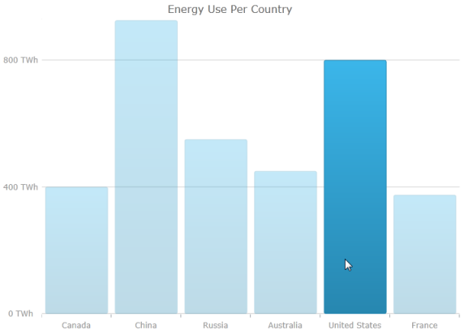

////
|metadata|
{
    "name": "datachart-series-highlighting",
    "tags": ["Getting Started","How Do I"],
    "controlName": ["{DataChartName}"],
    "guid": "e4b3c0e6-4377-45de-91df-9bbd8cb6b932",
    "buildFlags": ["SL","WPF","win-rt"],
    "createdOn": "2014-06-05T19:39:00.7154047Z"
}
|metadata|
////

= Series Highlighting

== Topic Overview

=== Purpose

This topic provides information on enabling the series highlighting feature along with a listing of the supported series. This topic also explains how to configure the series highlighting using the available events.

=== Required background

The following topic is a prerequisite to understanding this topic:

[options="header", cols="a,a"]
|====
|Topic|Purpose

| link:datachart-getting-started-with-datachart.html[Getting Started with Data Chart]
|The _{DataChartName}_ requires a data object model to be mapped to control's `DataContext` property. This article will provide a simple data object model but you can create your own and use it with this sample code instead.

|====

=== In this topic

This topic contains the following sections:

* <<SeriesHighlighting,Series Highlighting>>

** <<Overview,Overview>>
** <<Preview,Preview>>
** <<Properties,Properties>>
** <<Example,Example>>

* <<Events,Events>>

** <<Overview1,Overview>>
** <<EventArgumentsProperties,Event Arguments Properties>>
** <<Example1,Example>>

* <<RelatedContent,Related Content>>

[[SeriesHighlighting]]
== Series Highlighting

[[Overview]]

=== Overview

This feature allows you to highlight an entire series or individual items within the series. For example, highlights the entire line in a series such as the link:{DataChartLink}.lineseries_members.html[LineSeries] as it is all one shape; however, highlights can be applied to each individual column in a series such as link:{DataChartLink}.columnseries_members.html[ColumnSeries]. Individual markers can be highlighted in all supported series.

Currently the feature only supports highlighting via the mouse.

The series highlighting feature is supported for the following series types:

* link:datachart-category-series-overview.html[Category Series]
* link:datachart-category-range-area-series.html[Range Category Series]
* link:datachart-series-financial-price-series-overview.html[Financial Series]
* link:datachart-financial-indicators-overview.html[Financial Indicators]

[[Preview]]

=== Preview

The following screenshot is a preview of the  _xam_  _DataChart_  control with a link:{DataChartLink}.columnseries_members.html[ColumnSeries] and the series highlighting feature enabled.

image::images/xamDataChart_Series_Highlighting_01.png[]

[[Properties]]

=== Properties

The following table summarizes the properties used for series highlighting. These properties are set on the supported series.

[options="header", cols="a,a,a"]
|====
|*Property Name*|*Property Type*|* Description*

| link:{DataChartLink}.series{ApiProp}ishighlightingenabled.html[IsHighlightingEnabled]
|`Boolean`
|Enables the series highlighting feature, by default it is set to False.

| link:{DataChartLinkBase}.{DataChartBase}{ApiProp}highlightingtransitionduration.html[HighlightingTransitionDuration]
|`TimeSpan`
|Determines the duration that the highlighting change takes.

|====

[[Example]]

=== Example

The screenshot, following the table, demonstrates how a chart with the link:{DataChartLink}.series{ApiProp}ishighlightingenabled.html[IsHighlightingEnabled] and link:{DataChartLinkBase}.{DataChartBase}{ApiProp}highlightingtransitionduration.html[HighlightingTransitionDuration] properties of the link:{DataChartLink}.columnseries_members.html[ColumnSeries] looks as a result of the following settings:

[options="header", cols="a,a"]
|====
|Property|Value

| link:{DataChartLink}.series{ApiProp}ishighlightingenabled.html[IsHighlightingEnabled]
|True

| link:{DataChartLinkBase}.{DataChartBase}{ApiProp}highlightingtransitionduration.html[HighlightingTransitionDuration]
|00:00:10

|====

image::images/xamDataChart_Series_Highlighting_01.png[]

Following is the code that implements this example:

ifdef::wpf,win-universal[]

*In XAML:*

[source,xaml]
----
<ig:{DataChartName} x:Name="xamColumnChart" 
                 HighlightingTransitionDuration="00:00:10"
 <ig:{DataChartName}.Series>
 <ig:ColumnSeries ItemsSource="{Binding EnergySampleData}"
                       ValueMemberPath="Coal"
                       Source="{StaticResource DataViewModel}"
                       XAxis="{Binding ElementName=ColumnXAxis}"
                       YAxis="{Binding ElementName=ColumnYAxis}"
                       IsHighlightingEnabled="True">
 </ig:ColumnSeries>
 </ig:{DataChartName}.Series>
</ig:{DataChartName}>
----

endif::wpf,win-universal[]

[[Events]]
== Events

[[Overview1]]

=== Overview

There are two events that are specifically related to the series highlighting feature.

* link:{DataChartLink}.categoryseries{ApiProp}assigningcategorystyle_ev.html[AssigningCategoryStyle]
* link:{DataChartLink}.categoryseries{ApiProp}assigningcategorymarkerstyle_ev.html[AssigningCategoryMarkerStyle] (not supported for Financial Series or Financial Indicators)

The series highlighting feature is supported for the following series types:

* link:datachart-category-series-overview.html[Category Series]
* link:datachart-category-range-area-series.html[Range Category Series]
* link:datachart-series-financial-price-series-overview.html[Financial Series]
* link:datachart-financial-indicators-overview.html[Financial Indicators] 

These events can be configured to achieve the following:

* Modify the way that the highlighting is represented
* Modify the appearance properties assigned to the entire series such as a link:{DataChartLink}.lineseries_members.html[LineSeries], or each individual item in the series for the series having individual items such as link:{DataChartLink}.columnseries_members.html[ColumnSeries].

When using the above events to configure the highlighting on the series, only the properties that are available on that particular series can be used. For example, overriding the Fill or RadiusX property of a link:{DataChartLink}.lineseries_members.html[LineSeries] does not have any affect since those properties do not affect the link:{DataChartLink}.lineseries_members.html[LineSeries].

[[EventArgumentsProperties]]

=== Event Arguments Properties

The following table summarizes the properties of the link:{DataChartLink}.assigningcategorystyleeventargsbase_members.html[AssigningCategoryStyleEventArgsBase].

[options="header", cols="a,a,a"]
|====
|*Property Name*|*Property Type*|* Description*

| link:{DataChartLink}.assigningcategorystyleeventargsbase{ApiProp}startindex.html[StartIndex]
|`Int`
|Start index of the range of data that is currently being highlighted.

| link:{DataChartLink}.assigningcategorystyleeventargsbase{ApiProp}endindex.html[EndIndex]
|`Int`
|End index of the range of the data that is currently being highlighted.

| link:{DataChartLink}.assigningcategorystyleeventargsbase{ApiProp}startdate.html[StartDate]
|`DateTime`
|Start date of the range of data that is currently being highlighted.

| link:{DataChartLink}.assigningcategorystyleeventargsbase{ApiProp}enddate.html[EndDate]
|`DateTime`
|End date of the range of data that is currently being highlighted.

| link:{DataChartLink}.assigningcategorystyleeventargsbase{ApiProp}getitems.html[GetItems]
|`GetCategoryItemsEventHandler`
|Actual items from the data source being highlighted. However, if there is a lot of data and you called it every time the event was fired, will negatively impact performance.

| link:{DataChartLink}.assigningcategorystyleeventargsbase{ApiProp}fill.html[Fill]
|`Brush`
|Overrides the default link:{DataChartLink}.assigningcategorystyleeventargsbase{ApiProp}fill.html[Fill] property of the series. However, this property only takes affect if the Fill property only affects that particular series.

| link:{DataChartLink}.assigningcategorystyleeventargsbase{ApiProp}stroke.html[Stroke]
|`Brush`
|Overrides the default link:{DataChartLink}.assigningcategorystyleeventargsbase{ApiProp}stroke.html[Stroke] property of the series.

| link:{DataChartLink}.assigningcategorystyleeventargsbase{ApiProp}opacity.html[Opacity]
|`Double`
|Overrides the default the link:{DataChartLink}.assigningcategorystyleeventargsbase{ApiProp}opacity.html[Opacity] property of the series.

| link:{DataChartLink}.assigningcategorystyleeventargsbase{ApiProp}highlightinginfo.html[HighlightingInfo]
|`HiglightingInfo`
|Determine the styling of the highlighted series.

| link:{DataChartLink}.assigningcategorystyleeventargsbase{ApiProp}maxallserieshighlightingprogress.html[MaxAllSeriesHighlightingProgress]
|`Double`
|Progress state of the highlighting of the series. Value from 0 to 1.

| link:{DataChartLink}.assigningcategorystyleeventargsbase{ApiProp}sumallserieshighlightingprogress.html[SumAllSeriesHighlightingProgress]
|`Double`
|Progress state of the highlighting of the series. Value from 0 to 1.

| link:{DataChartLink}.assigningcategorystyleeventargsbase{ApiProp}highlightinghandled.html[HighlightingHandled]
|`Bool`
|When set to True the default highlighting does not apply.

| link:{DataChartLink}.assigningcategorystyleeventargsbase{ApiProp}hasdaterange.html[HasDateRange]
|`Bool`
|Determines the event has a valid date range

|====

The link:{DataChartLink}.assigningcategorymarkerstyleeventargs_members.html[AssigningCategoryMarkerStyleEventArgs] inherit all the same properties as the link:{DataChartLink}.assigningcategorystyleeventargsbase_members.html[AssigningCategoryStyleEventArgsBase] as listed in the table above.

[[Example1]]

=== Example

The following screenshot displays an example of using the link:{DataChartLink}.categoryseries{ApiProp}assigningcategorystyle_ev.html[AssigningCategoryStyle] event to change the highlighting feature to fade non highlighting columns instead of changing the highlighting column.

Following is the code implemented for this example:

ifdef::wpf[]

*In C#:*

[source,csharp]
----
private void CategorySeries_OnAssigningCategoryStyle(object sender, AssigningCategoryStyleEventArgs args)
{
 double minOpacity = .3, opacity = 1.0;
   if (args.SumAllSeriesHighlightingProgress > 0.0)
   {
      var progress = 0.0;
      if (args.HighlightingInfo != null)
      {
         progress = args.HighlightingInfo.Progress;
      }
      progress = progress - args.SumAllSeriesHighlightingProgress;
      opacity = minOpacity + (1.0 + progress) * (1.0 - minOpacity);
      args.Opacity = opacity;
      args.HighlightingHandled = true;
      for (var i = 0; i < this.DataChart.Series.Count; i++)
      {
         var curr = this.DataChart.Series[i];
         var series = sender as Infragistics.Controls.Charts.Series;
         if (series != null && series.Name != curr.Name)
         {
            curr.NotifyVisualPropertiesChanged();
         }
      }
   }
}
----

endif::wpf[]

ifdef::win-forms[]

*In C#:*

[source,csharp]
----
private void CategorySeries_OnAssigningCategoryStyle(object sender, AssigningCategoryStyleEventArgs args)
{
 double minOpacity = .3, opacity = 1.0;
   if (args.SumAllSeriesHighlightingProgress > 0.0)
   {
      var progress = 0.0;
      if (args.HighlightingInfo != null)
      {
         progress = args.HighlightingInfo.Progress;
      }
      progress = progress - args.SumAllSeriesHighlightingProgress;
      opacity = minOpacity + (1.0 + progress) * (1.0 - minOpacity);
      args.Opacity = opacity;
      args.HighlightingHandled = true;
      for (var i = 0; i < this.DataChart.Series.Count; i++)
      {
         var curr = this.DataChart.Series[i];
         var series = sender as Infragistics.Controls.Charts.Series;
         if (series != null && series.Name != curr.Name)
         {
            curr.NotifyVisualPropertiesChanged();
         }
      }
   }
}
----

endif::win-forms[]

ifdef::xamarin[]

*In C#:*

[source,csharp]
----
private void CategorySeries_OnAssigningCategoryStyle(object sender, AssigningCategoryStyleEventArgs args)
{
 double minOpacity = .3, opacity = 1.0;
   if (args.SumAllSeriesHighlightingProgress > 0.0)
   {
      var progress = 0.0;
      if (args.HighlightingInfo != null)
      {
         progress = args.HighlightingInfo.Progress;
      }
      progress = progress - args.SumAllSeriesHighlightingProgress;
      opacity = minOpacity + (1.0 + progress) * (1.0 - minOpacity);
      args.Opacity = opacity;
      args.HighlightingHandled = true;
      for (var i = 0; i < this.DataChart.Series.Count; i++)
      {
         var curr = this.DataChart.Series[i];
         var series = sender as Infragistics.Controls.Charts.Series;
         if (series != null && series.Name != curr.Name)
         {
            curr.NotifyVisualPropertiesChanged();
         }
      }
   }
}
----

endif::xamarin[]

ifdef::wpf[]

*In Visual Basic:*

[source,vb]
----
Private Sub CategorySeries_OnAssigningCategoryStyle(ByVal sender As Object, ByVal args As AssigningCategoryStyleEventArgs) 
Dim minOpacity As Double 3 
Dim opacity As Double 1 
If (args.SumAllSeriesHighlightingProgress > 0) Then 
 Dim progress As var = 0 
 If (Not (args.HighlightingInfo) Is Nothing) Then 
 progress = args.HighlightingInfo.Progress 
 End If 
 progress = (progress - args.SumAllSeriesHighlightingProgress) 
 opacity = (minOpacity + ((1 + progress) * (1 - minOpacity))) 
 args.Opacity = opacity 
 args.HighlightingHandled = true 
 Dim i As var = 0 
 Do While (i < Me.DataChart.Series.Count) 
 Dim curr As var = Me.DataChart.Series(i) 
 Dim series As var = CType(sender,Infragistics.Controls.Charts.Series) 
 If ((Not (series) Is Nothing) 
 AndAlso (series.Name <> curr.Name)) Then 
 curr.NotifyVisualPropertiesChanged 
 End If 
 i = (i + 1) 
 Loop 
 End If
End Sub
----

endif::wpf[]

ifdef::win-forms[]

*In Visual Basic:*

[source,vb]
----
Private Sub CategorySeries_OnAssigningCategoryStyle(ByVal sender As Object, ByVal args As AssigningCategoryStyleEventArgs) 
Dim minOpacity As Double 3 
Dim opacity As Double 1 
If (args.SumAllSeriesHighlightingProgress > 0) Then 
 Dim progress As var = 0 
 If (Not (args.HighlightingInfo) Is Nothing) Then 
 progress = args.HighlightingInfo.Progress 
 End If 
 progress = (progress - args.SumAllSeriesHighlightingProgress) 
 opacity = (minOpacity + ((1 + progress) * (1 - minOpacity))) 
 args.Opacity = opacity 
 args.HighlightingHandled = true 
 Dim i As var = 0 
 Do While (i < Me.DataChart.Series.Count) 
 Dim curr As var = Me.DataChart.Series(i) 
 Dim series As var = CType(sender,Infragistics.Controls.Charts.Series) 
 If ((Not (series) Is Nothing) 
 AndAlso (series.Name <> curr.Name)) Then 
 curr.NotifyVisualPropertiesChanged 
 End If 
 i = (i + 1) 
 Loop 
 End If
End Sub
----

endif::win-forms[]

ifdef::xamarin[]

*In Visual Basic:*

[source,vb]
----
Private Sub CategorySeries_OnAssigningCategoryStyle(ByVal sender As Object, ByVal args As AssigningCategoryStyleEventArgs) 
Dim minOpacity As Double 3 
Dim opacity As Double 1 
If (args.SumAllSeriesHighlightingProgress > 0) Then 
 Dim progress As var = 0 
 If (Not (args.HighlightingInfo) Is Nothing) Then 
 progress = args.HighlightingInfo.Progress 
 End If 
 progress = (progress - args.SumAllSeriesHighlightingProgress) 
 opacity = (minOpacity + ((1 + progress) * (1 - minOpacity))) 
 args.Opacity = opacity 
 args.HighlightingHandled = true 
 Dim i As var = 0 
 Do While (i < Me.DataChart.Series.Count) 
 Dim curr As var = Me.DataChart.Series(i) 
 Dim series As var = CType(sender,Infragistics.Controls.Charts.Series) 
 If ((Not (series) Is Nothing) 
 AndAlso (series.Name <> curr.Name)) Then 
 curr.NotifyVisualPropertiesChanged 
 End If 
 i = (i + 1) 
 Loop 
 End If
End Sub
----

endif::xamarin[]

[[RelatedContent]]
== Related Content

The following topics provide additional information related to this topic:

[options="header", cols="a,a"]
|====
|Topic|Purpose

| link:datachart-getting-started-with-datachart.html[Getting Started with Data Chart]
|The {DataChartName} requires a data object model to be mapped to control's DataContext property. This article will provide a simple data object model but you can create your own and use it with this sample code instead.

| link:datachart-using-datachart.html[Configuring {DataChartName}]
|This section is your gateway to important conceptual and task-based information that will help you to use the various features and functionalities provided by the {DataChartName} control.

|====
