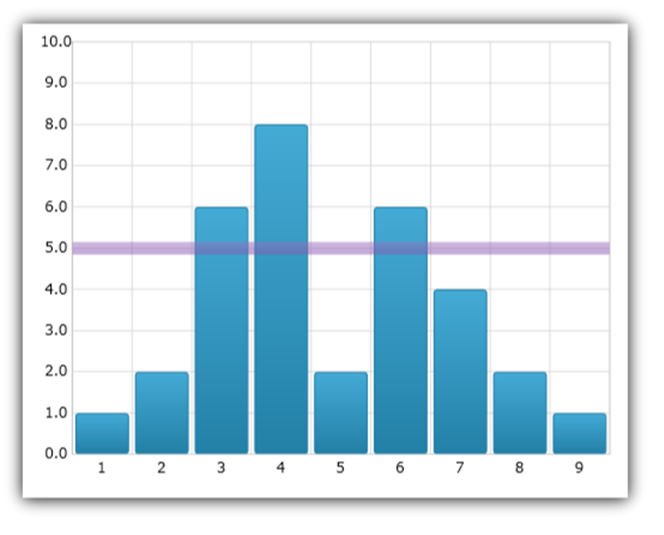
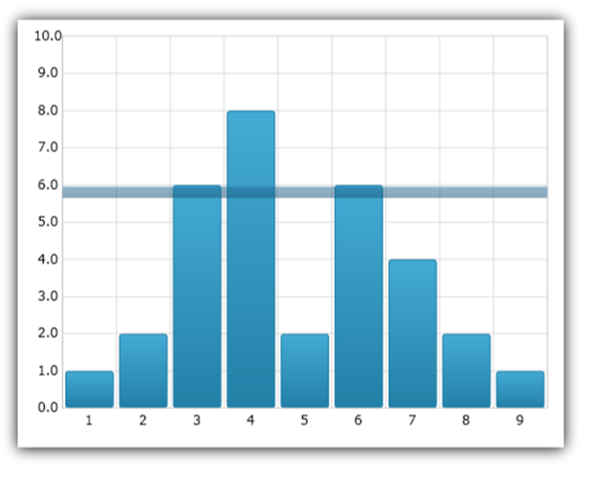

////
|metadata|
{
    "name": "datachart-series-value-overlay",
    "controlName": ["{DataChartName}"],
    "tags": ["Charting","Data Binding","Data Presentation","How Do I"],
    "guid": "94652e25-df0a-49e8-9bb6-16fa8def811f",
    "buildFlags": ["wpf","win-universal","WINFORMS"],
    "createdOn": "2014-06-05T19:39:00.6373746Z"
}
|metadata|
////

= Value Overlay

This topic introduces the Value Overlay feature of the link:{DataChartLink}.{DataChartName}.html[{DataChartName}]™ control and explains, with code examples, how to display value overlays.

== Overview

The topic is organized as follows:

* <<Introduction,Introduction>>
* <<AxisAnnotations,Axis Annotations>>
* <<BindingFixedValue,Binding Fixed Value>>

ifdef::wpf,win-universal[]
* <<BindingValueSlider,Binding Value of Slider>>

endif::wpf,win-universal[]

ifdef::wpf,win-universal[]
* <<BindingMathCalculators,Binding Math Calculators>>

endif::wpf,win-universal[]

ifdef::wpf,win-universal[]
* <<BindingMeanCalculator,Binding Mean Calculator>>

endif::wpf,win-universal[]

ifdef::wpf,win-universal[]
* <<BindingMedianCalculator,Binding Median Calculator>>

endif::wpf,win-universal[]

ifdef::wpf,win-universal[]
* <<BindingVarianceCalculator,Binding Variance Calculator>>

endif::wpf,win-universal[]

ifdef::wpf,win-universal[]
* <<BindingCustomCalculator,Binding Custom Calculator>>

endif::wpf,win-universal[]

* <<RelatedContent,Related Content>>

** link:datachart-multiple-axes.html[Using Multiple Axes]
** link:datachart-multiple-series.html[Adding Multiple Series]
** link:datachart-series-types.html[Series Types]

[[Introduction]]
== Introduction

In the link:{DataChartLink}.{DataChartName}.html[{DataChartName}]™ control, link:{DataChartLink}.valueoverlay.html[ValueOverlay] is used to overlay a single numeric value as a line over other types of series in order to indicate important values such as mean/median of a data set. Unlike other types of series, which use link:{DataChartLink}.series~{ApiDataSource}.html[{ApiDataSource}] property for data binding, ValueOverlay uses the link:{DataChartLink}.valueoverlay{ApiProp}value.html[Value] property to bind a numeric value. In addition, ValueOverlay uses only one Axis as reference. ValueOverlay is a horizontal or vertical line when bound to link:{DataChartLink}.numericxaxis.html[NumericXAxis] and link:{DataChartLink}.numericyaxis.html[NumericYAxis] respectively, a line starting from the center of the chart when bound to link:{DataChartLink}.numericangleaxis.html[NumericAngleAxis] or a circle when bound to link:{DataChartLink}.numericradiusaxis.html[NumericRadiusAxis].

image::images/xamDataChart_Series_Value_Overlay_01.png[]

ValueOverlay appearance properties are inherited from the link:{DataChartLink}.series.html[Series] base class, so link:{DataChartLink}.series{ApiProp}brush.html[Brush],  pick:[win-forms="and"]  link:{DataChartLink}.series{ApiProp}thickness.html[Thickness],  pick:[wpf,win-universal="and"]   pick:[wpf,win-universal=" link:{DataChartLink}.series{ApiProp}dasharray.html[DashArray]"]  are available and they are used in the same way as with other types of series.

[[AxisAnnotations]]
== Axis Annotations

In the {DataChartName}, you are able to add annotations to your axes to show particular values at different points on that axis. This can help you to visualize things such as final series values, overlay values, and values corresponding to crosshairs in the chart.

You can enable the axis annotations by setting the isAxisAnnotationEnabled property of the corresponding overlay to true. In doing so, this will place a box on the corresponding owning axis or axes with the value that that particular overlay or layer represents at the point that it is currently at. 

You can customize the axis annotations in background, value precision, outline, padding, stroke (outline) thickness, and text color. These can be set using the link:{DataChartLink}.valueoverlay{ApiProp}axisannotationbackground.html[AxisAnnotationBackground], link:{DataChartLink}.valueoverlay{ApiProp}axisannotationinterpolatedvalueprecision.html[AxisAnnotationInterpolatedValuePrecision], link:{DataChartLink}.valueoverlay{ApiProp}axisannotationoutline.html[AxisAnnotationOutline], pick:[wpf="link:{DataChartLink}.valueoverlay{ApiProp}axisannotationpadding.html[AxisAnnotationPadding],"] link:{DataChartLink}.valueoverlay{ApiProp}axisannotationstrokethickness.html[AxisAnnotationStrokeThickness], and link:{DataChartLink}.valueoverlay{ApiProp}axisannotationtextcolor.html[AxisAnnotationTextColor] properties, respectively. In addition to these properties, there is also an link:{DataChartLink}.valueoverlay{ApiProp}axisannotationformatlabel_ev.html[AxisAnnotationFormatLabel] event that you can use to fully customize what exactly is shown in axis annotations.

This code snippet demonstrates how to add axis annotations to the ValueOverlay in the Data Chart control.

ifdef::wpf[]

*In XAML:*

----
xmlns:ig="http://schemas.infragistics.com/xaml"
xmlns:local="clr-namespace:[DATA_MODEL_NAMESPACE]"
----

endif::wpf[]

ifdef::win-universal[]

*In XAML:*

----
xmlns:ig="using:Infragistics.Controls.Charts"xmlns:local="using:[DATA_MODEL_NAMESPACE]"
----

endif::win-universal[]

ifdef::wpf,win-universal[]

*In XAML:*

[source]
----
<ig:{DataChartName} x:Name="DataChart" >
    <ig:{DataChartName}.Resources>
        <models:NumericDataSample x:Key="data" />
    </ig:{DataChartName}.Resources>
    <ig:{DataChartName}.Axes>
        <ig:CategoryXAxis x:Name="categoryXAxis" Interval="1"
                          ItemsSource="{StaticResource data}" Label="{}{X}"/>
        <ig:NumericYAxis x:Name="numericYAxis" MinimumValue="0" MaximumValue="10"
                         Interval="1" Label="{}{:N1}" />
    </ig:{DataChartName}.Axes>
    <ig:{DataChartName}.Series>
        <ig:ColumnSeries ItemsSource="{StaticResource data}" 
                         ValueMemberPath="Y"  
                         XAxis="{Binding ElementName=categoryXAxis}" 
                         YAxis="{Binding ElementName=numericYAxis}">
        </ig:ColumnSeries>
        <ig:ValueOverlay IsAxisAnnotationEnabled="True" Axis="{Binding ElementName=numericYAxis}" 
                         Value="7.0" Thickness="5" />
    </ig:{DataChartName}.Series>
----

[source]
----
</ig:{DataChartName}>
----

endif::wpf,win-universal[]

ifdef::wpf[]

*In Visual Basic:*

----
Dim overlay As New ValueOverlay()
overlay.Axis = Me.numericYAxis
overlay.Value = 7.0
overlay.IsAxisAnnotationEnabled = true
Me.DataChart.Series.Add(overlay)
----

endif::wpf[]

ifdef::win-forms[]

*In Visual Basic:*

----
Dim overlay As New ValueOverlay()
overlay.Axis = Me.numericYAxis
overlay.Value = 7.0
overlay.IsAxisAnnotationEnabled = true
Me.DataChart.Series.Add(overlay)
----

endif::win-forms[]

ifdef::xamarin[]

*In Visual Basic:*

----
Dim overlay As New ValueOverlay()
overlay.Axis = Me.numericYAxis
overlay.Value = 7.0
overlay.IsAxisAnnotationEnabled = true
Me.DataChart.Series.Add(overlay)
----

endif::xamarin[]

ifdef::wpf[]

*In C#:*

----
var overlay = new ValueOverlay();
overlay.Axis = this.numericYAxis;
overlay.Value = 7.0;
overlay.IsAxisAnnotationEnabled = true;
this.DataChart.Series.Add(overlay);
----

endif::wpf[]

ifdef::win-forms[]

*In C#:*

----
var overlay = new ValueOverlay();
overlay.Axis = this.numericYAxis;
overlay.Value = 7.0;
overlay.IsAxisAnnotationEnabled = true;
this.DataChart.Series.Add(overlay);
----

endif::win-forms[]

ifdef::xamarin[]

*In C#:*

----
var overlay = new ValueOverlay();
overlay.Axis = this.numericYAxis;
overlay.Value = 7.0;
overlay.IsAxisAnnotationEnabled = true;
this.DataChart.Series.Add(overlay);
----

endif::xamarin[]

The following sections will show you how to bind various items to the ValueOverlay.

[[BindingFixedValue]]
== Binding Fixed Value

This code snippet demonstrates how to bind a fixed value to the ValueOverlay in the Data Chart control.

ifdef::wpf[]

*In XAML:*

----
xmlns:ig="http://schemas.infragistics.com/xaml"
xmlns:local="clr-namespace:[DATA_MODEL_NAMESPACE]"
----

endif::wpf[]

ifdef::win-universal[]

*In XAML:*

----
xmlns:ig="using:Infragistics.Controls.Charts"xmlns:local="using:[DATA_MODEL_NAMESPACE]"
----

endif::win-universal[]

ifdef::wpf,win-universal[]

*In XAML:*

[source]
----
<ig:{DataChartName} x:Name="DataChart" >
    <ig:{DataChartName}.Resources>
        <models:NumericDataSample x:Key="data" />
    </ig:{DataChartName}.Resources>
    <ig:{DataChartName}.Axes>
        <ig:CategoryXAxis x:Name="categoryXAxis" Interval="1"
                          ItemsSource="{StaticResource data}" Label="{}{X}"/>
        <ig:NumericYAxis x:Name="numericYAxis" MinimumValue="0" MaximumValue="10"
                         Interval="1" Label="{}{:N1}" />
    </ig:{DataChartName}.Axes>
    <ig:{DataChartName}.Series>
        <ig:ColumnSeries ItemsSource="{StaticResource data}" 
                         ValueMemberPath="Y"  
                         XAxis="{Binding ElementName=categoryXAxis}" 
                         YAxis="{Binding ElementName=numericYAxis}">
        </ig:ColumnSeries>
        <ig:ValueOverlay Axis="{Binding ElementName=numericYAxis}" 
                         Value="7.0" Thickness="5" />
    </ig:{DataChartName}.Series>
----

[source]
----
</ig:{DataChartName}>
----

endif::wpf,win-universal[]

ifdef::wpf[]

*In Visual Basic:*

----
Dim overlay As New ValueOverlay()
overlay.Axis = Me.numericYAxis
overlay.Value = 7.0
Me.DataChart.Series.Add(overlay)
----

endif::wpf[]

ifdef::win-forms[]

*In Visual Basic:*

----
Dim overlay As New ValueOverlay()
overlay.Axis = Me.numericYAxis
overlay.Value = 7.0
Me.DataChart.Series.Add(overlay)
----

endif::win-forms[]

ifdef::xamarin[]

*In Visual Basic:*

----
Dim overlay As New ValueOverlay()
overlay.Axis = Me.numericYAxis
overlay.Value = 7.0
Me.DataChart.Series.Add(overlay)
----

endif::xamarin[]

ifdef::wpf[]

*In C#:*

----
var overlay = new ValueOverlay();
overlay.Axis = this.numericYAxis;
overlay.Value = 7.0;
this.DataChart.Series.Add(overlay);
----

endif::wpf[]

ifdef::win-forms[]

*In C#:*

----
var overlay = new ValueOverlay();
overlay.Axis = this.numericYAxis;
overlay.Value = 7.0;
this.DataChart.Series.Add(overlay);
----

endif::win-forms[]

ifdef::xamarin[]

*In C#:*

----
var overlay = new ValueOverlay();
overlay.Axis = this.numericYAxis;
overlay.Value = 7.0;
this.DataChart.Series.Add(overlay);
----

endif::xamarin[]

The following image shows ValueOverlay with binding to the value of 7 and overlaid over column series in the Data Chart.

image::images/xamDataChart_Series_Value_Overlay_02.png[]

ifdef::wpf,win-universal[]

[[BindingValueSlider]]
== Binding Value of Slider
endif::wpf,win-universal[]

ifdef::wpf,win-universal[]
This code snippet demonstrates how to bind value of a Slider control to the ValueOverlay in the Data Chart control.
endif::wpf,win-universal[]

ifdef::wpf[]

*In XAML:*

----
xmlns:ig="http://schemas.infragistics.com/xaml"
xmlns:local="clr-namespace:[DATA_MODEL_NAMESPACE]"
----

endif::wpf[]

ifdef::win-universal[]

*In XAML:*

----
xmlns:ig="using:Infragistics.Controls.Charts"xmlns:local="using:[DATA_MODEL_NAMESPACE]"
----

endif::win-universal[]

ifdef::wpf,win-universal[]

*In XAML:*

[source]
----
<ig:{DataChartName}>
----

[source]
----
    <ig:{DataChartName}.Resources>        <models:NumericDataSample x:Key="data" />    </ig:{DataChartName}.Resources>
    <ig:{DataChartName}.Axes>
        <ig:CategoryXAxis x:Name="categoryXAxis" Interval="1"                         ItemsSource="{StaticResource data}" Label="{}{X}"/>
        <ig:NumericYAxis x:Name="numericYAxis" MinimumValue="0" MaximumValue="10"                         Interval="1" Label="{}{:N1}" />
    </ig:{DataChartName}.Axes>
    <ig:{DataChartName}.Series>
        <ig:ColumnSeries ItemsSource="{StaticResource data}" 
                        ValueMemberPath="Y" 
                        XAxis="{Binding ElementName=categoryXAxis}" 
                        YAxis="{Binding ElementName=numericYAxis}">
        </ig:ColumnSeries>
        <ig:ValueOverlay Axis="{Binding ElementName=numericYAxis}" Thickness="5" 
                        Value="{Binding Value, ElementName=ValueSlider}" />
    </ig:{DataChartName}.Series> </ig:{DataChartName}>
<Slider x:Name="ValueSlider" Value="5" Minimum="0" Maximum="10" />
---- 

endif::wpf,win-universal[]

ifdef::wpf,win-universal[]

*In Visual Basic:*

----
Dim overlay As New ValueOverlay()
overlay.Axis = Me.numericYAxis
overlay.Value = Me.ValueSlider.Value
Me.DataChart.Series.Add(overlay)
----

endif::wpf,win-universal[]

ifdef::wpf,win-universal[]

*In C#:*

----
var overlay = new ValueOverlay();
overlay.Axis = this.numericYAxis;
overlay.Value = this.ValueSlider.Value;
this.DataChart.Series.Add(overlay);
----

endif::wpf,win-universal[]

ifdef::wpf,win-universal[]
The following image shows ValueOverlay with binding to the value of a Slider control and overlaid over column series in the Data Chart.
endif::wpf,win-universal[]

ifdef::wpf,win-universal[]

endif::wpf,win-universal[]

ifdef::wpf,win-universal[]

[[BindingMathCalculators]]
== Binding Math Calculators
endif::wpf,win-universal[]

ifdef::wpf,win-universal[]
The following section shows how to use ValueOverlay with Math Calculators that are provided by Infragistics Math Calculators assembly. As result you need to add the Infragistics.WPF.Math.Calculators NuGet package as reference to your project before you start using these code snippets.
endif::wpf,win-universal[]

ifdef::wpf,win-universal[]
All Math Calculators accept an link:{ApiPlatform}math.calculators{ApiVersion}~infragistics.math.calculators.itemssourcecalculator~{ApiDataSource}.html[{ApiDataSource}] of type IEnumerable and a link:{ApiPlatform}math.calculators{ApiVersion}~infragistics.math.calculators.itemssourcecalculator{ApiProp}valuememberpath.html[ValueMemberPath] which must point to a numeric property. If the objects in the ItemsSource are numeric primitives, then the ValueMemberPath should be set to an empty string.
endif::wpf,win-universal[]

ifdef::wpf,win-universal[]

*In Visual Basic:*

----
Public Class ListOfDouble
    Inherits System.Collections.Generic.List(Of Double)
End Class
----

endif::wpf,win-universal[]

ifdef::wpf,win-universal[]

*In C#:*

----
public class ListOfDouble : System.Collections.Generic.List<double>
{
}
----

endif::wpf,win-universal[]

ifdef::wpf[]

*In XAML:*

[source]
----
xmlns:ig="http://schemas.infragistics.com/xaml"
----

xmlns:igMath="http://schemas.infragistics.com/xaml"

[source]
----
xmlns:system="clr-namespace:System;assembly=mscorlib"xmlns:generic="clr-namespace:[DATA_MODEL_NAMESPACE]"
---- 

endif::wpf[]

ifdef::win-universal[]

*In XAML:*

[source]
----
xmlns:ig="using:Infragistics.Controls.Charts"
----

[source]
----
xmlns:igMath="using:Infragistics.Math.Calculators"
----

[source]
----
xmlns:generic="using:[DATA_MODEL_NAMESPACE]"xmlns:system="http://schemas.microsoft.com/winfx/2006/xaml"
---- 

endif::win-universal[]

ifdef::wpf,win-universal[]

*In XAML:*

----
<generic:ListOfDouble x:Key="NumericPrimitives">
    <system:Double>1.0</system:Double>
    <system:Double>2.0</system:Double>
    <system:Double>6.0</system:Double>
    <system:Double>8.0</system:Double>
    <system:Double>2.0</system:Double>
    <system:Double>6.0</system:Double>
    <system:Double>4.0</system:Double>
    <system:Double>2.0</system:Double>
    <system:Double>1.0</system:Double>
</generic:ListOfDouble>
<!--...-->
<igMath:MeanCalculator x:Key="MeanCalculator" ValueMemberPath=""                        ItemsSource="{StaticResource NumericPrimitives}" />
----

endif::wpf,win-universal[]

ifdef::wpf,win-universal[]

*In Visual Basic:*

----
Dim meanCalculator As New MeanCalculator()
meanCalculator.ValueMemberPath = String.Empty
meanCalculator.ItemsSource = New List(Of Double)() From { 1, 2, 6, 8, 2, 6, 4, 2, 1 }
----

endif::wpf,win-universal[]

ifdef::wpf,win-universal[]

*In C#:*

----
var meanCalculator = new MeanCalculator();
meanCalculator.ValueMemberPath = string.Empty;
meanCalculator.ItemsSource = new List<double> { 1, 2, 6, 8, 2, 6, 4, 2, 1 };
----

endif::wpf,win-universal[]

ifdef::wpf,win-universal[]
.Note:
[NOTE]
====
All code snippets in this section use link:resources-numeric-data-sample-1.html[Sample Numeric Data] as data source for the Math Calculators and underlying link:{DataChartLink}.columnseries.html[ColumnSeries] but you can provide your own data instead.
====
endif::wpf,win-universal[]

ifdef::wpf,win-universal[]

[[BindingMeanCalculator]]
== Binding Mean Calculator
endif::wpf,win-universal[]

ifdef::wpf,win-universal[]
link:{ApiPlatform}math.calculators{ApiVersion}~infragistics.math.calculators.meancalculator.html[MeanCalculator] provides a mathematical calculation used to determine the "typical" or "average" value of a series of numbers. The mean is computed by taking the sum of the numbers in a series divided by the count of numbers in the series. Mean is one of the measures of central tendency; the others are mode and median.
endif::wpf,win-universal[]

ifdef::wpf,win-universal[]
This code snippet demonstrates how to bind value of MeanCalculator to the ValueOverlay in the Data Chart control.
endif::wpf,win-universal[]

ifdef::wpf[]

*In XAML:*

----
xmlns:ig="http://schemas.infragistics.com/xaml"xmlns:igMath="http://schemas.infragistics.com/xaml"
xmlns:models="clr-namespace:[DATA_MODEL_NAMESPACE]"
----

endif::wpf[]

ifdef::win-universal[]

*In XAML:*

----
xmlns:ig="using:Infragistics.Controls.Charts"xmlns:igMath="using:Infragistics.Math.Calculators"xmlns:models="using:[DATA_MODEL_NAMESPACE]"
----

endif::win-universal[]

ifdef::wpf,win-universal[]

*In XAML:*

[source]
----
<ig:{DataChartName}>
----

[source]
----
    <ig:{DataChartName}.Resources>        <models:NumericDataSample x:Key="data" />
        <igMath:MeanCalculator x:Key="MeanCalculator" ValueMemberPath="Y"                                ItemsSource="{StaticResource data}" />
    </ig:{DataChartName}.Resources>
    <ig:{DataChartName}.Axes>
        <ig:CategoryXAxis x:Name="categoryXAxis" Interval="1"
----

[source]
----
                        ItemsSource="{StaticResource data}" Label="{}{X}" />
        <ig:NumericYAxis x:Name="numericYAxis" MinimumValue="0" MaximumValue="10"
----

[source]
----
                         Interval="1" Label="{}{:N1}" />
    </ig:{DataChartName}.Axes>
    <ig:{DataChartName}.Series>
        <ig:ColumnSeries ItemsSource="{StaticResource data}" 
                         ValueMemberPath="Y" 
                         XAxis="{Binding ElementName=categoryXAxis}" 
                         YAxis="{Binding ElementName=numericYAxis}" />
        <ig:ValueOverlay Axis="{Binding ElementName=numericYAxis}" Thickness="5" 
                     Value="{Binding Value, Source={StaticResource MeanCalculator}}" />
    </ig:{DataChartName}.Series>
----

[source]
----
</ig:{DataChartName}>
---- 

endif::wpf,win-universal[]

ifdef::wpf,win-universal[]

*In Visual Basic:*

----
Dim meanCalculator As New MeanCalculator()
meanCalculator.ValueMemberPath = "Y"
meanCalculator.ItemsSource = New NumericDataSample()
Dim overlay As New ValueOverlay()
overlay.Axis = numericYAxis
overlay.Value = meanCalculator.Value
DataChart.Series.Add(overlay)
----

endif::wpf,win-universal[]

ifdef::wpf[]

*In C#:*

----
var meanCalculator = new MeanCalculator();
meanCalculator.ValueMemberPath = "Y";
meanCalculator.ItemsSource = new NumericDataSample();
var overlay = new ValueOverlay();
overlay.Axis = numericYAxis;
overlay.Value = meanCalculator.Value;
DataChart.Series.Add(overlay);
----

endif::wpf[]

ifdef::win-forms[]

*In C#:*

----
var meanCalculator = new MeanCalculator();
meanCalculator.ValueMemberPath = "Y";
meanCalculator.ItemsSource = new NumericDataSample();
var overlay = new ValueOverlay();
overlay.Axis = numericYAxis;
overlay.Value = meanCalculator.Value;
DataChart.Series.Add(overlay);
----

endif::win-forms[]

ifdef::xamarin[]

*In C#:*

----
var meanCalculator = new MeanCalculator();
meanCalculator.ValueMemberPath = "Y";
meanCalculator.ItemsSource = new NumericDataSample();
var overlay = new ValueOverlay();
overlay.Axis = numericYAxis;
overlay.Value = meanCalculator.Value;
DataChart.Series.Add(overlay);
----

endif::xamarin[]

ifdef::wpf,win-universal[]
The following image shows ValueOverlay with binding to the value of MeanCalculator and overlaid over column series in the Data Chart.
endif::wpf,win-universal[]

ifdef::wpf,win-universal[]

image::images/xamDataChart_Series_Value_Overlay_04.png[]

endif::wpf,win-universal[]

ifdef::wpf,win-universal[]

[[BindingMedianCalculator]]
== Binding Median Calculator
endif::wpf,win-universal[]

ifdef::wpf,win-universal[]
link:{ApiPlatform}math.calculators{ApiVersion}~infragistics.math.calculators.mediancalculator.html[MedianCalculator] provides calculation for median which is a measure of central tendency that represents the "midpoint" of the data set and is not as sensitive to outliers as the mean calculation. In other words, it is less affected by a few very high or very low values in the data set. Half of the values in the series fall above the median and half fall below it. If there is an even number of data points in the series, the median is the average of the two middle cases when they are sorted (either in ascending or descending order).
endif::wpf,win-universal[]

ifdef::wpf,win-universal[]
This code snippet demonstrates how to bind value of MedianCalculator to the ValueOverlay in the Data Chart control.
endif::wpf,win-universal[]

ifdef::wpf[]

*In XAML:*

----
xmlns:ig="http://schemas.infragistics.com/xaml"xmlns:igMath="http://schemas.infragistics.com/xaml"
xmlns:models="clr-namespace:[DATA_MODEL_NAMESPACE]"
----

endif::wpf[]

ifdef::win-universal[]

*In XAML:*

----
xmlns:ig="using:Infragistics.Controls.Charts"xmlns:igMath="using:Infragistics.Math.Calculators"xmlns:models="using:[DATA_MODEL_NAMESPACE]"
----

endif::win-universal[]

ifdef::wpf,win-universal[]

*In XAML:*

----
<ig:{DataChartName}>
    <ig:{DataChartName}.Resources>
        <models:NumericDataSample x:Key="data" />
        <igMath:MedianCalculator x:Key="MedianCalculator" ValueMemberPath="Y"                               ItemsSource="{StaticResource data}" />
    </ig:{DataChartName}.Resources>
    <ig:{DataChartName}.Axes>
        <ig:CategoryXAxis x:Name="categoryXAxis" Interval="1"                           ItemsSource="{StaticResource data}" Label="{}{X}" />
        <ig:NumericYAxis x:Name="numericYAxis" MinimumValue="0" MaximumValue="10"                          Interval="1" Label="{}{:N1}" />
    </ig:{DataChartName}.Axes>
    <ig:{DataChartName}.Series>
        <ig:ColumnSeries ItemsSource="{StaticResource data}" 
                         ValueMemberPath="Y" 
                         XAxis="{Binding ElementName=categoryXAxis}" 
                         YAxis="{Binding ElementName=numericYAxis}" />
        <ig:ValueOverlay Axis="{Binding ElementName=numericYAxis}" Thickness="5" 
                     Value="{Binding Value, Source={StaticResource MedianCalculator}}" />
    </ig:{DataChartName}.Series>
</ig:{DataChartName}>
----

endif::wpf,win-universal[]

ifdef::wpf,win-universal[]

*In Visual Basic:*

----
Dim medianCalculator As New Infragistics.Math.Calculators.MedianCalculator()
medianCalculator.ValueMemberPath = "Y"
medianCalculator.ItemsSource = New NumericDataSample()
Dim overlay As New Infragistics.Controls.Charts.ValueOverlay()
overlay.Axis = Me.numericYAxis
overlay.Value = medianCalculator.Value
Me.DataChart.Series.Add(overlay)
----

endif::wpf,win-universal[]

ifdef::wpf,win-universal[]

*In C#:*

----
var medianCalculator = new Infragistics.Math.Calculators.MedianCalculator();
medianCalculator.ValueMemberPath = "Y";
medianCalculator.ItemsSource = new NumericDataSample();
var overlay = new Infragistics.Controls.Charts.ValueOverlay();
overlay.Axis = this.numericYAxis;
overlay.Value = medianCalculator.Value;
this.DataChart.Series.Add(overlay);
----

endif::wpf,win-universal[]

ifdef::wpf,win-universal[]
The following image shows ValueOverlay with binding to the value of MedianCalculator and overlaid over column series in the Data Chart.
endif::wpf,win-universal[]

ifdef::wpf,win-universal[]

image::images/xamDataChart_Series_Value_Overlay_05.png[]

endif::wpf,win-universal[]

ifdef::wpf,win-universal[]

[[BindingVarianceCalculator]]
== Binding Variance Calculator
endif::wpf,win-universal[]

ifdef::wpf,win-universal[]
link:{ApiPlatform}math.calculators{ApiVersion}~infragistics.math.calculators.variancecalculator.html[VarianceCalculator] provides calculation for variance which measures dispersion of a data set around the mean. It is calculated from the sum of squared deviations from the mean divided by one less than the number of cases (N-1). Variance is measured in units that are the square of those of the variable itself. As result variance can sometimes be too large to fit in range values of the data set range. If that case, variance should be bound to a text block or to the Value property of ValueOverlay that does not share axis with other series. For more information on this please refer to the link:datachart-multiple-axes.html[Using Multiple Axes] topic.
endif::wpf,win-universal[]

ifdef::wpf,win-universal[]
This code snippet demonstrates how to bind value of VarianceCalculator to the ValueOverlay in the Data Chart control.
endif::wpf,win-universal[]

ifdef::wpf[]

*In XAML:*

----
xmlns:ig="http://schemas.infragistics.com/xaml"xmlns:igMath="http://schemas.infragistics.com/xaml"
xmlns:models="clr-namespace:[DATA_MODEL_NAMESPACE]"
----

endif::wpf[]

ifdef::win-universal[]

*In XAML:*

----
xmlns:ig="using:Infragistics.Controls.Charts"xmlns:igMath="using:Infragistics.Math.Calculators"xmlns:models="using:[DATA_MODEL_NAMESPACE]"
----

endif::win-universal[]

ifdef::wpf,win-universal[]

*In XAML:*

----
<ig:{DataChartName}>
    <ig:{DataChartName}.Resources>
        <models:NumericDataSample x:Key="data" />
        <igMath:VarianceCalculator x:Key="VarianceCalculator" ValueMemberPath="Y"                                    ItemsSource="{StaticResource data}" />
    </ig:{DataChartName}.Resources>
    <ig:{DataChartName}.Axes>
        <ig:CategoryXAxis x:Name="categoryXAxis" Interval="1"                           ItemsSource="{StaticResource data}" Label="{}{X}" />
        <ig:NumericYAxis x:Name="numericYAxis" MinimumValue="0" MaximumValue="10"                          Interval="1" Label="{}{:N1}" />
    </ig:{DataChartName}.Axes>
    <ig:{DataChartName}.Series>
        <ig:ColumnSeries ItemsSource="{StaticResource data}" 
                         ValueMemberPath="Y" 
                         XAxis="{Binding ElementName=categoryXAxis}" 
                         YAxis="{Binding ElementName=numericYAxis}" />
        <ig:ValueOverlay Axis="{Binding ElementName=numericYAxis}" Thickness="5" 
                     Value="{Binding Value, Source={StaticResource VarianceCalculator}}" />
    </ig:{DataChartName}.Series>
</ig:{DataChartName}>
----

endif::wpf,win-universal[]

ifdef::wpf,win-universal[]

*In Visual Basic:*

----
Dim varianceCalculator As New Infragistics.Math.Calculators.VarianceCalculator()
varianceCalculator.ValueMemberPath = "Y"
varianceCalculator.ItemsSource = New NumericDataSample()
Dim overlay As New Infragistics.Controls.Charts.ValueOverlay()
overlay.Axis = Me.numericYAxis
overlay.Value = varianceCalculator.Value
Me.DataChart.Series.Add(overlay)
----

endif::wpf,win-universal[]

ifdef::wpf,win-universal[]

*In C#:*

----
var varianceCalculator = new Infragistics.Math.Calculators.VarianceCalculator();
varianceCalculator.ValueMemberPath = "Y";
varianceCalculator.ItemsSource = new NumericDataSample();
var overlay = new Infragistics.Controls.Charts.ValueOverlay();
overlay.Axis = this.numericYAxis;
overlay.Value = varianceCalculator.Value;
this.DataChart.Series.Add(overlay);
----

endif::wpf,win-universal[]

ifdef::wpf,win-universal[]
The following image shows ValueOverlay with binding to the value of VarianceCalculator and overlaid over column series in the Data Chart.
endif::wpf,win-universal[]

ifdef::wpf,win-universal[]

endif::wpf,win-universal[]

ifdef::wpf,win-universal[]

[[BindingCustomCalculator]]
== Binding Custom Calculator
endif::wpf,win-universal[]

ifdef::wpf,win-universal[]
The following code shows how to create a custom calculator to calculate the lowest value in a data set by inheriting from link:{ApiPlatform}math.calculators{ApiVersion}~infragistics.math.calculators.valuecalculator.html[ValueCalculator] class and providing logic for finding lowest values in the overridden link:{ApiPlatform}math.calculators{ApiVersion}~infragistics.math.calculators.valuecalculator{ApiProp}calculate.html[Calculate] method.
endif::wpf,win-universal[]

ifdef::wpf,win-universal[]

*In Visual Basic:*

----
Imports System.Collections.Generic
Imports Infragistics.Math.Calculators
Namespace Infragistics.Samples.Common.Calculators
    Public Class LowestCalculator
        Inherits ValueCalculator
            ''' 

            ''' Calculates the lowest value in the specified input.
            ''' 

            ''' <param name="input">The input list of double values.</param>
            ''' <returns></returns>
            Public Overrides Function Calculate(input As IList(Of Double)) As Double
                If input Is Nothing OrElse input.Count = 0 Then
                Return Double.NaN
                End If
                Dim lowest As Double = Double.PositiveInfinity
                For Each value As Double In input
                    lowest = System.Math.Min(lowest, value)
                Next
                Return lowest
            End Function
    End Class
End Namespace
----

endif::wpf,win-universal[]

ifdef::wpf,win-universal[]

*In C#:*

----
using System.Collections.Generic;
using Infragistics.Math.Calculators;
namespace Infragistics.Samples.Common.Calculators
{
    public class LowestCalculator : ValueCalculator
    {
        /// 

        /// Calculates the lowest value in the specified input.
        /// 

        /// <param name="input">The input list of double values.</param>
        /// <returns></returns>
        public override double Calculate(IList<double> input)
        {
            if (input == null || input.Count == 0)
            {
                return double.NaN;
            }
            double lowest = double.PositiveInfinity;
            foreach (double value in input)
            {
                lowest = System.Math.Min(lowest, value);
            }
            return lowest;
        }
    }
}
----

endif::wpf,win-universal[]

ifdef::wpf,win-universal[]
This code snippet demonstrates how to bind a value of above custom calculator to the ValueOverlay in the Data Chart control.
endif::wpf,win-universal[]

ifdef::wpf[]

*In XAML:*

----
xmlns:ig="http://schemas.infragistics.com/xaml"xmlns:igMath="http://schemas.infragistics.com/xaml"
xmlns:models="clr-namespace:[DATA_MODEL_NAMESPACE]" xmlns:common="clr-namespace:Infragistics.Samples.Common.Calculators"
----

endif::wpf[]

ifdef::win-universal[]

*In XAML:*

----
xmlns:ig="using:Infragistics.Controls.Charts"xmlns:igMath="using:Infragistics.Math.Calculators"xmlns:models="using:[DATA_MODEL_NAMESPACE]" 
xmlns:common="using:Infragistics.Samples.Common.Calculators"
----

endif::win-universal[]

ifdef::wpf,win-universal[]

*In XAML:*

----
<ig:{DataChartName}>
    <ig:{DataChartName}.Resources>
        <models:NumericDataSample x:Key="data" />
        <common:LowestCalculator x:Key="LowestCalculator" ValueMemberPath="Y"                                  ItemsSource="{StaticResource data}" />
    </ig:{DataChartName}.Resources>
    <ig:{DataChartName}.Axes>
        <ig:CategoryXAxis x:Name="categoryXAxis" Interval="1"                           ItemsSource="{StaticResource data}" Label="{}{X}" />
        <ig:NumericYAxis x:Name="numericYAxis" MinimumValue="0" MaximumValue="10"                          Interval="1" Label="{}{:N1}" />
    </ig:{DataChartName}.Axes>
    <ig:{DataChartName}.Series>
        <ig:ColumnSeries ItemsSource="{StaticResource data}" 
                         ValueMemberPath="Y" 
                         XAxis="{Binding ElementName=categoryXAxis}" 
                         YAxis="{Binding ElementName=numericYAxis}" />
        <ig:ValueOverlay Axis="{Binding ElementName=numericYAxis}" Thickness="5" 
                         Value="{Binding Value, Source={StaticResource LowestCalculator}}" />    </ig:{DataChartName}.Series>
</ig:{DataChartName}>
----

endif::wpf,win-universal[]

ifdef::wpf,win-universal[]

*In Visual Basic:*

----
Dim customCalculator As New Infragistics.Samples.Common.Calculators.LowestCalculator()
customCalculator.ValueMemberPath = "Y"
customCalculator.ItemsSource = New NumericDataSample()
Dim overlay As New Infragistics.Controls.Charts.ValueOverlay()
overlay.Axis = Me.numericYAxis
overlay.Value = customCalculator.Value
Me.DataChart.Series.Add(overlay)
----

endif::wpf,win-universal[]

ifdef::wpf,win-universal[]

*In C#:*

----
var customCalculator = new Infragistics.Samples.Common.Calculators.LowestCalculator();
customCalculator.ValueMemberPath = "Y";
customCalculator.ItemsSource = new NumericDataSample();
var overlay = new Infragistics.Controls.Charts.ValueOverlay();
overlay.Axis = this.numericYAxis;
overlay.Value = customCalculator.Value;
this.DataChart.Series.Add(overlay);
----

endif::wpf,win-universal[]

ifdef::wpf,win-universal[]
The following image shows ValueOverlay with binding to the value of a custom calculator called LowestCalculator and overlaid over column series in the Data Chart.
endif::wpf,win-universal[]

ifdef::wpf,win-universal[]

image::images/xamDataChart_Series_Value_Overlay_07.png[]

endif::wpf,win-universal[]

[[RelatedContent]]
== Related Content

* link:datachart-multiple-axes.html[Using Multiple Axes]
* link:datachart-multiple-series.html[Adding Multiple Series]
* link:datachart-series-types.html[Series Types]