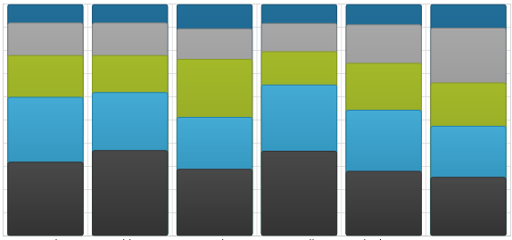
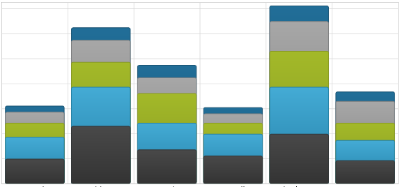

////
|metadata|
{
    "name": "datachart-stacked-series-overview",
    "controlName": ["{DataChartName}"],
    "tags": ["Charting"],
    "guid": "",
    "buildFlags": [],
    "createdOn": "2017-03-05T19:39:00.3992752Z"
}
|metadata|
////

= Stacked Series

This topic explains various types of Stacked Series in the link:{DataChartLink}.{DataChartName}.html[{DataChartName}]™ control.

=== In This Topic

This topic contains the following sections:

* <<_Introduction,Introduction>>
* <<_Types,Types of Stacked Series>>
* <<_SupportedAxes,Supported Axes>>
* <<_DataBinding,Data Binding>>
** <<DataRequirements,Data Requirements>>
** <<DataSample,Data Sample>>
* <<_RelatedContent,Related Content>>

[[_Introduction]]
== Introduction

Stacked Series is a group of the simplest and most common form of chart series that take data and render it as collection of data points stretched along a horizontal line (e.g. column series) or vertical line (e.g. bar series).

[[_Types]]
== Types of Stacked Series

The {DataChartName} control supports the following types of Stacked Series and each of them is discussed in an individual topic:
 
* link:datachart-category-stacked-100-area-series.html[Stacked 100-Area Series]
* link:datachart-category-stacked-100-bar-series.html[Stacked 100-Bar Series]
* link:datachart-category-stacked-100-column-series.html[Stacked 100-Column Series]
* link:datachart-category-stacked-100-line-series.html[Stacked 100-Line Series]
* link:datachart-category-stacked-100-spline-area-series.html[Stacked 100-Spline Area Series]
* link:datachart-category-stacked-100-spline-series.html[Stacked 100-Spline Series]
* link:datachart-category-stacked-area-series.html[Stacked Area Series]
* link:datachart-category-stacked-bar-series.html[Stacked Bar Series]
* link:datachart-category-stacked-column-series.html[Stacked Column Series]
* link:datachart-category-stacked-line-series.html[Stacked Line Series]
* link:datachart-category-stacked-spline-area-series.html[Stacked Spline Area Series]
* link:datachart-category-stacked-spline-series.html[Stacked Spline Series]

These topics will provide you with useful information on how to use create a specific type of Stacked Series and bind data to it.
  

[[_Preview]]
== Preview of Stacked Series

This section provides preview images for all types of Stacked Series.

[options="header", cols="a,a"]
|====
|Series Type|Description

| link:datachart-category-stacked-100-area-series.html[Stacked 100-Area Series]

image::images/Stacked_100-Area_Series_01.png[]
|The Stacked 100-Area Series is identical to the StackedAreaSeries in all aspects except in their treatment of the values on y-axis. Instead of presenting a direct representation of the data, the Stacked100AreaSeries presents the data in terms of percent of the sum of all values in a data point.

| link:datachart-category-stacked-100-bar-series.html[Stacked 100-Bar Series]

image::images/Using_xamDataChart_Category_Series_07.png[]
|Same as the Stacked Bar Series type with the added feature of presenting data in terms of percent of all values in category instead of presenting a direct representation of the data.

| link:datachart-category-stacked-100-column-series.html[Stacked 100-Column Series]

|Same as the Stacked Column Series type with the added feature of presenting data in terms of percent of all values in the same category instead of presenting a direct representation of the data.

| link:datachart-category-stacked-100-line-series.html[Stacked 100-Line Series]

image::images/Stacked_100-Line_Series__01.png[]
|The Stacked 100-Line Series is identical to the StackedLineSeries in all aspects except in their treatment of the values on y-axis. Instead of presenting a direct representation of the data, the Stacked100LineSeries presents the data in terms of percent of the sum of all values in a data point.

| link:datachart-category-stacked-100-spline-area-series.html[Stacked 100-Spline Area Series]

image::images/Stacked_100-Spline_Area_Series__01.png[]
|The Stacked 100-Spline Area Series is identical to the StackedSplineAreaSeries in all aspects except in their treatment of the values on y-axis. Instead of presenting a direct representation of the data, the Stacked100SplineAreaSeries presents the data in terms of percent of the sum of all values in a data point.

| link:datachart-category-stacked-100-spline-series.html[Stacked 100-Spline Series]

image::images/Using_xamDataChart_Stacked_100-Spline_Series__01.png[]
|The Stacked100SplineSeries is identical to the StackedSplineSeries in all aspects except in their treatment of the values on y-axis. Instead of presenting a direct representation of the data, the Stacked100SplineSeries presents the data in terms of percent of the sum of all values in a data point.

| link:datachart-category-stacked-area-series.html[Stacked Area Series]

image::images/Stacked_Area_Series__01.png[]
|Stacked Area Series is rendered using a collection of points connected by line segments (StackedFragmentSeries) with the area below the line filled in and stacked on top of each other. Each stacked fragment in the collection represents one visual element in each stack. Each stack can contain both positive and negative values. All positive values are grouped on the positive side of the y-axis, and all negative values are grouped on the negative side of the y-axis.

| link:datachart-category-stacked-bar-series.html[Stacked Bar Series]

image::images/Using_xamDataChart_Category_Series_06.png[]
|Displays discrete data in bars stacked next to each other. Categories are arranged vertically and values are stacked horizontally. 

Used for showing the changes in a data series over time or for comparing multiple items.

| link:datachart-category-stacked-column-series.html[Stacked Column Series]

|Displays discrete data in columns stacked on top of each other. Categories are arranged horizontally and values are stacked vertically. 

Used for showing the changes in a data series over time or for comparing multiple items.

| link:datachart-category-stacked-line-series.html[Stacked Line Series]

image::images/Using_xamDataChart_Stacked_Line_Series__01.png[]
|Stacked Line Series is rendered using a collection of points connected by line segments (StackedFragmentSeries) that are stacked on top of each other. Each stacked fragment in the collection represents one visual element in each stack. Each stack can contain both positive and negative values. All positive values are grouped on the positive side of the y-axis, and all negative values are grouped on the negative side of the y-axis.

| link:datachart-category-stacked-spline-area-series.html[Stacked Spline Area Series]

image::images/Using_xamDataChart_Stacked_Spline_Area_Series__01.png[]
|Stacked Spline Area Series is rendered using a collection of points connected by smooth curves of spline segments (StackedFragmentSeries) with the area below the spline filled in and stacked on top of each other. Each stacked fragment in the collection represents one visual element in each stack. Each stack can contain both positive and negative values. All positive values are grouped on the positive side of the y-axis, and all negative values are grouped on the negative side of the y-axis.

| link:datachart-category-stacked-spline-series.html[Stacked Spline Series]

image::images/Usin_xamDataChart_Stacked_Spline_Series__01.png[]
|Stacked Spline Series is rendered using a collection of points connected by smooth curves of spline segments (StackedFragmentSeries) that are stacked on top of each other. Each stacked fragment in the collection represents one visual element in each stack. Each stack can contain both positive and negative values. All positive values are grouped on the positive side of the y-axis, and all negative values are grouped on the negative side of the y-axis.

|====
 
[[_SupportedAxes]] 
== Supported Axes

The {DataChartName} control provides various types of axes but only the following types of axes can be used with specific types of Stacked Series. The following table lists these supported axes:

[options="header", cols="a,a,a"]
|====
|Series Type| XAxis Type | YAxis Type 

| `StackedBarSeries` 

`Stacked100BarSeries`
|link:{DataChartLink}.NumericXAxis.html[NumericXAxis]
|link:{DataChartLink}.CategoryYAxis.html[CategoryYAxis]
| 
`StackedColumnSeries` 

`Stacked100ColumnSeries`

`StackedAreaSeries` 

`Stacked100AreaSeries` 

`StackedLineSeries` 

`Stacked100LineSeries` 

`StackedSplineSeries` 

`Stacked100SplineSeries` 
 
`StackedSplineAreaSeries` 

`Stacked100SplineAreaSeries` 

|link:{DataChartLink}.CategoryXAxis.html[CategoryXAxis]

link:{DataChartLink}.CategoryDateTimeXAxis.html[CategoryDateTimeXAxis]

link:{DataChartLink}.TimeXAxis.html[TimeXAxis]
|link:{DataChartLink}.NumericYAxis.html[NumericYAxis]
 
|====

In addition, each of Stacked Series must have binding set to one x-axis using the property link:{DataChartLink}.HorizontalAnchoredCategorySeries{ApiProp}XAxis.html[XAxis] and one y-axis using link:{DataChartLink}.HorizontalAnchoredCategorySeries{ApiProp}XAxis.html[YAxis] property. For more information on axes, refer to the link:datachart-axes.html[Axes] topic.

[[_DataBinding]]
== Data Binding

This section provides information about binding data for all types of Stacked Series from data requirements through data sample to binding diagrams.

[[_DataRequirements]]
=== Data Requirements

Similarly to other types of series in the {DataChartName} control, Stacked Series also use the link:{DataChartLink}.Series~{ApiDataSource}.html[{ApiDataSource}] property to bind data. All series can be bound to any object that implements the link:http://msdn.microsoft.com/en-us/library/system.collections.ienumerable.aspx[IEnumerable] link:http://msdn.microsoft.com/en-us/library/system.collections.ienumerable.aspx[interface (e.g.] link:http://msdn.microsoft.com/en-us/library/6sh2ey19.aspx[List], link:http://msdn.microsoft.com/en-us/library/ms132397.aspx[Collection], link:http://msdn.microsoft.com/en-us/library/7977ey2c.aspx[Queue], or link:http://msdn.microsoft.com/en-us/library/system.collections.stack.aspx[Stack]), however, in case of Stacked Series, each item in this object must have at least one numeric data column which is mapped using the ValueMemberPath property of the series and one data column which is mapped to the link:{DataChartLink}.Axis{ApiProp}Label.html[Label] property of the category axis (e.g. link:{DataChartLink}.CategoryXAxis.html[CategoryXAxis]) or the link:{DataChartLink}.TimeAxisBase{ApiProp}DateTimeMemberPath.html[DateTimeMemberPath] when using link:{DataChartLink}.TimeXAxis.html[TimeXAxis]. For more information on the requirements for the specific types of series, refer to the link:datachart-series-requirements.html[Series Requirements] topic.

[[_DataSample]]
=== Data Sample

An example of object that meets above criteria is the Category Data Sample which you can download from the  link:resources-sample-energy-data.html[Sample Energy Data] resource and use it in your project.

[[_RelatedContent]]
== Related Content

* link:datachart-axes.html[Axes]
* link:datachart-series-requirements.html[Series Requirements]