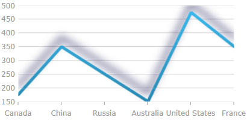

////
|metadata|
{
    "name": "datachart-styling-the-chart-series",
    "tags": ["Charting","Styling"],
    "controlName": ["{DataChartName}"],
    "guid": "6a2a782c-fdc8-430b-8b2b-b7e308aab690",
    "buildFlags": ["SL","WPF"],
    "createdOn": "2014-06-05T19:39:00.6173668Z"
}
|metadata|
////

= Styling the Chart Series ( {DataChartName})

== Topic Overview

=== Purpose

This topic provides a brief overview on how to style the series of the  _{DataChartName}_™ control and demonstrates, as an example, how to apply drop-shadow effect to the series.

=== Required background

The following topics are prerequisites to understanding this topic:

[options="header", cols="a,a"]
|====
|Topic|Purpose

| link:datachart-getting-started-with-datachart.html[Getting Started with Data Chart]
|This topic demonstrates how to create an instance of the  _{DataChartName}_ control and set data binding.

| link:datachart-series.html[Chart Series]
|This topic introduces the concept of chart Series and guides you to the discussion of series types, series data binding, and series legend.

|====

=== In this topic

This topic contains the following sections:

* <<_Ref368413764,Introduction>>

** <<_Ref368413773,Chart series styling summary>>
** <<_Ref368413786,Applying effects to chart series>>

* <<_Ref368413794,Styling the Chart Series by Applying Drop-Shadow Effect>>

** <<_Ref367456519,Overview>>
** <<_Ref367456522,Property settings>>
** <<_Ref367456525,Example>>

* <<_Ref367456536,Related Content>>

[[_Ref368413764]]
== Introduction

[[_Ref368413773]]

=== Chart series styling summary

The series  _{DataChartName}_   can be styled in many aspects, the main of which are applying different fill and outline brushes to the series. This is managed by the link:{DataChartLink}.series{ApiProp}brush.html[Brush] and link:{DataChartLink}.series{ApiProp}outline.html[Outline] properties of the series. Some other aspects of the series’ look-and-fill, such as the thickness of the outline and the opacity of the series, are configurable, too through the link:{DataChartLink}.series{ApiProp}thickness.html[Thickness] and link:{DataChartLink}.series_members.html[Opacity] properties of the series.

[[_Ref368413786]]

=== Applying effects to chart series

Because the link:{DataChartLink}.series_members.html[Series] class used for the  _{DataChartName}_   link:{DataChartLinkBase}.{DataChartBase}{ApiProp}series.html[{DataChartName}.Series] collection is inherited from the `Control` class, it, too, exposes an `Effect` property. The property applies a visual effect to the series visual. The following table maps supported visual effects to the `Effect` property settings that configure them.

[options="header", cols="a,a,a"]
|====
|Effect name|Looks like:|`Effect` property setting

|no effect
|image::images/xamDataChart_Styling_the_Chart_Series_1.png[]
|Not set

|Blur
|image::images/xamDataChart_Styling_the_Chart_Series_2.png[]
| _BlurEffect_ 

|Drop-shadow
|image::images/xamDataChart_Styling_the_Chart_Series_3.png[]
| _DropShadowEffect_ 

|====

Each of the effects can be configured by changing the settings of the effect’s properties. The blur effect can be configured in terms of radius of the blur and the curve used to calculate the blur. The drop-shadow effect can be customized by changing the shadow color, its opacity, direction, offset and blur.

[[_Ref368413794]]
== Styling the Chart Series by Applying Drop-Shadow Effect

[[_Ref367456519]]

=== Overview

There are two alternative ways to apply drop-shadow effect to the series:

* Through the `Effect` property of the link:{DataChartLink}.series_members.html[Series] class
* Through the link:{DataChartLink}.series{ApiProp}isdropshadowenabled.html[IsDropShadowEnabled] property of the series

==== Applying drop-shadow through the `Effect` property of the `Series` class

Set the `Effect` property of the `Series` class to a `DropShadowEffect` instance. The drop-shadow effect is applied out-of-the-box and further customization is possible through customizing the `DropShadowEffect` instance.

[[_Applying_drop-shadow_through]]
==== Applying drop-shadow through the `IsDropShadowEnabled` property of the series

Set the `IsDropShadowEnabled` property of the series to  _"true"_  . Customization of the effect in terms of changing its blur radius, color, direction, depth, and opacity is supported through the respective shadow-related properties of the link:{DataChartLink}.series_members.html[Series] (See <<_Ref367456522,Property settings>> and the example for details.).

.Note:
[NOTE]
====
The `Effect` property, when set, overrides the settings of the `IsDropShadowEnabled` property and the shadow-related properties of the series and renders them ineffective.
====

The default drop-shadow effect differs depending on the series type.

[[_Ref367456522]]

=== Property settings

The following table lists the configurable aspects of the drop-shadow effect (when applied through the `IsDropShadowEnabled` property of the series) to their respective property settings. Note that for these settings to be effective, the `Effect` property of the series must not be set.

[options="header", cols="a,a,a"]
|====
|In order to configure:|Use this property:|And set it to:

|The effect for the series as drop-shadow
| link:{DataChartLink}.series{ApiProp}isdropshadowenabled.html[IsDropShadowEnabled]
| _"true"_ 

|The color of the shadow
| link:{DataChartLink}.series{ApiProp}shadowcolor.html[ShadowColor]
|The desired color

|The offset of the shadow from the series visual
| link:{DataChartLink}.series{ApiProp}shadowdepth.html[ShadowDepth]
|A double value indicating the offset in pixels.

|The direction of the shadow
| link:{DataChartLink}.series{ApiProp}shadowdirection.html[ShadowDirection]
|The desired direction in degrees as an angle from the series visual with 0 meaning the shadow being cast straight to the right, 90 – to the top, 180 – straight to the left and so on.

|The opacity of the shadow
| link:{DataChartLink}.series{ApiProp}shadowopacity.html[ShadowOpacity]
|The desired double value in the range 0 to 1 with _0_ meaning the shadow is transparent and _1_ – the shadow is fully opaque

|The definition level of the edges of the shadow (sharp/blurry)
| link:{DataChartLink}.series{ApiProp}shadowblur.html[ShadowBlur]
|The desired pixel double value representing the blur level. The blur level is defined by the number of pixels throughout which the contour spreads and fades out. The higher the value, the blurrier the shadow.

|====

[[_Example]]

=== Example

This example demonstrates applying drop-shadow through the link:{DataChartLink}.series{ApiProp}isdropshadowenabled.html[IsDropShadowEnabled] property of the series. The screenshot below demonstrates how a line series in a  _{DataChartName}_   control looks as a result of the following shadow-related settings:

[options="header", cols="a,a"]
|====
|Property|Value

| link:{DataChartLink}.series{ApiProp}isdropshadowenabled.html[IsDropShadowEnabled]
| _"true"_ 

| link:{DataChartLink}.series{ApiProp}shadowblur.html[ShadowBlur]
| _20_ 

| link:{DataChartLink}.series{ApiProp}shadowcolor.html[ShadowColor]
| _DarkBlue_ 

| link:{DataChartLink}.series{ApiProp}shadowdepth.html[ShadowDepth]
| _15_ 

| link:{DataChartLink}.series{ApiProp}shadowdirection.html[ShadowDirection]
| _90_ 

| link:{DataChartLink}.series{ApiProp}shadowopacity.html[ShadowOpacity]
| _0.8_ 

|====

Following is the code snippet for setting the shadow related properties of a chart’s line series:

*In XAML:*

[source,xaml]
----
…
<ig:LineSeries IsDropShadowEnabled="True"
               ShadowBlur="20"
               ShadowColor="DarkBlue"
               ShadowDepth="15"
               ShadowDirection="90"
               ShadowOpacity="0.8"
               Thickness="5"
               …
>
…
----

*In Visual Basic:*

----
…
Dim lineSeries = New LineSeries()
lineSeries.IsDropShadowEnabled = True
lineSeries.ShadowBlur = 20
lineSeries.ShadowColor = new SolidColorBrush("DarkBlue")
lineSeries.ShadowDepth = 15
lineSeries.ShadowDirection = 90
lineSeries.ShadowOpacity = 0.8
lineSeries.Thickness = 5
…
----

*In C#:*

----
…
LineSeries lineSeries = New LineSeries();
lineSeries.IsDropShadowEnabled = True;
lineSeries.ShadowBlur = 20;
lineSeries.ShadowColor = new SolidColorBrush("DarkBlue");
lineSeries.ShadowDepth = 15;
lineSeries.ShadowDirection = 90;
lineSeries.ShadowOpacity = 0.8;
lineSeries.Thickness = 5;
…
----

[[_Ref367456536]]
== Related Content

[[_Ref368413843]]

=== Resources

The following material (available outside the Infragistics family of content) provides additional information related to this topic.

[options="header", cols="a,a"]
|====
|Resource|Purpose

|
ifdef::wpf[] 

link:http://msdn.microsoft.com/en-us/library/system.windows.media.effects.dropshadoweffect.aspx[>DropShadowEffect Class] 

endif::wpf[] 

ifdef::sl[] 

link:http://msdn.microsoft.com/en-us/library/system.windows.media.effects.dropshadoweffect(v=vs.95).aspx[DropShadowEffect Class] 

endif::sl[]
|A bitmap effect that paints a drop shadow around the target texture.

|====