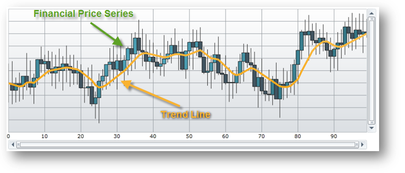

////
|metadata|
{
    "name": "datachart-trend-lines",
    "controlName": ["{DataChartName}"],
    "tags": ["Charting","Getting Started","How Do I"],
    "guid": "04277570-1fb3-4dc9-9058-beed22f9ac3c",
    "buildFlags": [],
    "createdOn": "2014-06-05T19:39:00.6493768Z"
}
|metadata|
////

= Series Trend Lines

This topic explains, with code examples, how to use the trend lines in the link:{DataChartLink}.{DataChartName}.html[{DataChartName}]™ control.

== Overview

The topic is organized as follows:

* <<Introduction,Introduction>>
* <<Preview,Preview>>
* <<SupportedSeries,Supported Series>>
* <<TypesofTrendLines,Types of Trend Lines>>
* <<TrendLinesProperties,Trend Lines Properties>>
* <<Examples,Examples>>

** <<DisplayTrendLine,Display Trend Line>>
** <<StyleTrendLine,Style Trend Line>>

* <<RelatedContent,Related Content>>

** link:datachart-multiple-series.html[Adding Multiple Series]
** link:datachart-series-requirements.html[Series Requirements]
** link:datachart-series-types.html[Series Types]

[[Introduction]]
== Introduction

In the {DataChartName} control, trend line is a line that helps identify a trend in data bound to a Series through its  link:{DataChartLink}.series~{ApiDataSource}.html[{ApiDataSource}] property.

[[Preview]]
== Preview

image::images/Using_xamDataChart_Trend_Lines_01.png[]

Figure 1 – Sample implementation of trend line in the Data Chart.

[[SupportedSeries]]
== Supported Series

Most types of series provide support for plotting trend lines in the chart control and these series are listed in the following table.

Table 1 – Series that support trend lines

[options="header", cols="a,a,a,a,a"]
|====
|Category Series|Financial Series|Scatter Series|Polar Series|Radial Series

| link:datachart-category-area-series.html[Area Series] 

link:datachart-category-bar-series.html[Bar Series] 

link:datachart-category-column-series.html[Column Series] 

link:datachart-category-line-series.html[Line Series] 

link:datachart-category-point-series.html[Point Series] 

link:datachart-category-spline-series.html[Spline Series] 

link:datachart-category-spline-area-series.html[Spline Area Series] 

link:datachart-category-step-area-series.html[Step Area Series] 

link:datachart-category-step-line-series.html[Step Line Series] 

link:datachart-category-waterfall-series.html[Waterfall Series]
| link:{DataChartLink}.absolutevolumeoscillatorindicator.html[AbsoluteVolumeOscillatorIndicator] 

link:{DataChartLink}.accumulationdistributionindicator.html[AccumulationDistributionIndicator] 

link:{DataChartLink}.averagedirectionalindexindicator.html[AverageDirectionalIndexIndicator] 

link:{DataChartLink}.averagetruerangeindicator.html[AverageTrueRangeIndicator] 

link:{DataChartLink}.bollingerbandsoverlay.html[BollingerBandsOverlay] 

link:{DataChartLink}.bollingerbandwidthindicator.html[BollingerBandWidthIndicator] 

link:{DataChartLink}.chaikinoscillatorindicator.html[ChaikinOscillatorIndicator] 

link:{DataChartLink}.chaikinvolatilityindicator.html[ChaikinVolatilityIndicator] 

link:{DataChartLink}.detrendedpriceoscillatorindicator.html[DetrendedPriceOscillatorIndicator] 

link:{DataChartLink}.commoditychannelindexindicator.html[CommodityChannelIndexIndicator] 

link:{DataChartLink}.easeofmovementindicator.html[EaseOfMovementIndicator] 

link:{DataChartLink}.faststochasticoscillatorindicator.html[FastStochasticOscillatorIndicator] 

link:{DataChartLink}.forceindexindicator.html[ForceIndexIndicator] 

link:{DataChartLink}.fullstochasticoscillatorindicator.html[FullStochasticOscillatorIndicator] 

link:{DataChartLink}.marketfacilitationindexindicator.html[MarketFacilitationIndexIndicator] 

link:{DataChartLink}.massindexindicator.html[MassIndexIndicator] 

link:{DataChartLink}.medianpriceindicator.html[MedianPriceIndicator] 

link:{DataChartLink}.moneyflowindexindicator.html[MoneyFlowIndexIndicator] 

link:{DataChartLink}.movingaverageconvergencedivergenceindicator.html[MovingAverageConvergenceDivergenceIndicator] 

link:{DataChartLink}.negativevolumeindexindicator.html[NegativeVolumeIndexIndicator] 

link:{DataChartLink}.onbalancevolumeindicator.html[OnBalanceVolumeIndicator] 

link:{DataChartLink}.percentagevolumeoscillatorindicator.html[PercentageVolumeOscillatorIndicator] 

link:{DataChartLink}.pricechanneloverlay.html[PriceChannelOverlay] 

link:{DataChartLink}.percentagepriceoscillatorindicator.html[PercentagePriceOscillatorIndicator] 

link:{DataChartLink}.positivevolumeindexindicator.html[PositiveVolumeIndexIndicator] 

link:{DataChartLink}.rateofchangeandmomentumindicator.html[RateOfChangeAndMomentumIndicator] 

link:{DataChartLink}.relativestrengthindexindicator.html[RelativeStrengthIndexIndicator] 

link:{DataChartLink}.slowstochasticoscillatorindicator.html[SlowStochasticOscillatorIndicator] 

link:{DataChartLink}.standarddeviationindicator.html[StandardDeviationIndicator] 

link:{DataChartLink}.stochrsiindicator.html[StochRSIIndicator] 

link:{DataChartLink}.trixindicator.html[TRIXIndicator] 

link:{DataChartLink}.typicalpriceindicator.html[TypicalPriceIndicator] 

link:{DataChartLink}.ultimateoscillatorindicator.html[UltimateOscillatorIndicator] 

link:{DataChartLink}.weightedcloseindicator.html[WeightedCloseIndicator] 

link:{DataChartLink}.williamspercentrindicator.html[WilliamsPercentRIndicator]
|
link:datachart-scatter-series-overview.html[Scatter Point Series] 

link:datachart-scatter-series-overview.html[Scatter Line Series] 

link:datachart-scatter-series-overview.html[Scatter Spline Series] 

ifdef::wpf,win-universal,android,win-forms[] 

link:datachart-bubble-series.html[Scatter Bubble Series] 

endif::wpf,win-universal,android,win-forms[] 

|
link:datachart-polar-area-series.html[Polar Area Series] 

link:datachart-polar-line-series.html[Polar Line Series] 

link:datachart-polar-scatter-series.html[Polar Scatter Series] 

link:datachart-polar-spline-series.html[Polar Spline Series] 

link:datachart-polar-spline-area-series.html[Polar Spline Area Series]

| link:datachart-radial-area-series.html[Radial Area Series] 

link:datachart-radial-line-series.html[Radial Line Series] 

link:datachart-radial-column-series.html[Radial Column Series] 

link:datachart-radial-pie-series.html[Radial Pie Series]

|====

.Note:
[NOTE]
====
The above table excludes all stacked and range series in the Category Series group and all overlay series in the Financial Series group because these types of series do not support trend lines.
====

[[TypesofTrendLines]]
== Types of Trend Lines

The Data Chart supports the following types of trend lines through Series object’s TrendLineType property.

Table 2 – Types of trend lines.

[options="header", cols="a,a"]
|====
|Types of Trend Lines|Description

|None
|Specifies no trend line on a series.

|CubicFit
|Specifies a cubic polynomial fit trend line on a series.

|CumulativeAverage
|Specifies a cumulative moving average trend line on a series.

|ExponentialAverage
|Specifies an exponential moving average trend line on a series.

|ExponentialFit
|Specifies an exponential fit trend line on a series.

|LinearFit
|Specifies a linear fit trend line on a series.

|LogarithmicFit
|Specifies a logarithmic fit trend line on a series.

|ModifiedAverage
|Specifies a modified moving average trend line on a series.

|PowerLawFit
|Specifies a power-law fit trend line on a series.

|QuadraticFit
|Specifies a quadratic polynomial fit trend line on a series.

|QuarticFit
|Specifies a quartic polynomial fit trend line on a series.

|QuinticFit
|Specifies a quintic polynomial fit trend line on a series.

|SimpleAverage
|Specifies a simple moving average trend line on a series.

|WeightedAverage
|Specifies a weighted moving average trend line on a series.

|====

[[TrendLinesProperties]]
== Trend Lines Properties

All properties of trend lines start with the "TrendLine" string and they are provided by each Series object.

Table 3 – Trend lines properties.

[options="header", cols="a,a,a"]
|====
|Property Name|Property Type|Description

| link:{DataChartLink}.anchoredcategoryseries{ApiProp}trendlinebrush.html[TrendLineBrush]
|Brush
|Gets or sets the brush used to draw the trend line.

| link:{DataChartLink}.anchoredcategoryseries{ApiProp}trendlinetype.html[TrendLineType] 
|TrendLineType
|Gets or sets the TrendLineType enumeration value that specifies which type of trend line will be displayed along the current series.

| link:{DataChartLink}.anchoredcategoryseries{ApiProp}trendlineperiod.html[TrendLinePeriod]
|int
|Gets or sets the moving average period for the current series object. This property is used only by the following types of trend lines: 

ExponentialAverage 

ModifiedAverage 

SimpleAverage 

WeightedAverage

| link:{DataChartLink}.anchoredcategoryseries{ApiProp}trendlinethickness.html[TrendLineThickness]
|double
|Gets or sets the thickness of the current series object's trend line.

ifdef::wpf,win-universal,android[]
| pick:[xaml,android=" link:{DataChartLink}.anchoredcategoryseries{ApiProp}trendlinezindex.html[TrendLineZIndex]"] 
|int
|Gets or sets the Z-Index of the trend line. Values greater than 1000 will result in the trend line being rendered in front of the series data and lower values will render the trend line behind the series.
endif::wpf,win-universal,android[]

ifdef::wpf,win-universal,android[]
| pick:[wpf,win-universal,android=" link:{DataChartLink}.anchoredcategoryseries{ApiProp}trendlinedasharray.html[TrendLineDashArray]"] 
|DoubleCollection
|Gets or sets a collection of double values that indicate the pattern of dashes and gaps that is used to draw the trend line for the current series object.
endif::wpf,win-universal,android[]

ifdef::wpf,win-universal,android[]
| link:{DataChartLink}.anchoredcategoryseries{ApiProp}trendlinedashcap.html[TrendLineDashCap]
|PenLineCap
|Gets or sets the PenLineCap enumeration value that specifies how the current series object's trend line dash ends are drawn.
endif::wpf,win-universal,android[]

|====

[[Examples]]
== Code Examples

This section provides code examples for using trend lines only with the Financial Price Series. However, the same logic can be applied to other series that support trend lines by replacing the FinancialPriceSeries object with other type of series.

.Note:
[NOTE]
====
These code examples assume that you are familiar with using and binding data to the Financial Price Series. Refer to the link:datachart-series-financial-price-series-overview.html[Financial Series] topic for more information on data requirements for this type of series and data bindings.
====

[[DisplayTrendLine]]
== Display Trend Line

This code snippet demonstrates how to show the Weighted Moving Average trend line on the Financial Price Series using its TrendLineType property. Assigning different TrendLineType enumeration value to this property will change which trend line is displayed with the series.

ifdef::wpf,win-universal[]

*In XAML:*

[source,xaml]
----
<ig:{DataChartName} x:Name="DataChart">
    <ig:{DataChartName}.Series>
        <ig:FinancialPriceSeries 
            TrendLineType="WeightedAverage"
            TrendLinePeriod="10" >
        </ig:FinancialPriceSeries>
    </ig:{DataChartName}.Series>
</ig:{DataChartName}>
----

endif::wpf,win-universal[]

ifdef::wpf[]

*In Visual Basic:*

[source,vb]
----
' create financial price series with a trend line
Dim series As New FinancialPriceSeries()
' ...
series.TrendLineType = TrendLineType.WeightedAverage
series.TrendLinePeriod = 10
' add a series to the chartDataChart.Series.Add(series)
----

endif::wpf[]

ifdef::win-forms[]

*In Visual Basic:*

[source,vb]
----
' create financial price series with a trend line
Dim series As New FinancialPriceSeries()
' ...
series.TrendLineType = TrendLineType.WeightedAverage
series.TrendLinePeriod = 10
' add a series to the chartDataChart.Series.Add(series)
----

endif::win-forms[]

ifdef::wpf[]

*In C#:*

[source,csharp]
----
// create financial price series with a trend line
var series = new FinancialPriceSeries();
// ...
series.TrendLineType = TrendLineType.WeightedAverage;
series.TrendLinePeriod = 10;
// add a series to the chart
DataChart.Series.Add(series);
----

endif::wpf[]

ifdef::win-forms[]

*In C#:*

[source,csharp]
----
// create financial price series with a trend line
var series = new FinancialPriceSeries();
// ...
series.TrendLineType = TrendLineType.WeightedAverage;
series.TrendLinePeriod = 10;
// add a series to the chart
DataChart.Series.Add(series);
----

endif::win-forms[]

ifdef::xamarin[]

*In C#:*

[source,csharp]
----
// create financial price series with a trend line
var series = new FinancialPriceSeries();
// ...
series.TrendLineType = TrendLineType.WeightedAverage;
series.TrendLinePeriod = 10;
// add a series to the chart
DataChart.Series.Add(series);
----

endif::xamarin[]

Figure 2 – Financial Price Series with Weighted Moving Average trend line in the Chart control.

[[StyleTrendLine]]
== Style Trend Line

This code snippet demonstrates how to style a trend line.

ifdef::wpf,win-universal[]

*In XAML:*

[source,xaml]
----
<ig:{DataChartName} x:Name="DataChart">
    <ig:{DataChartName}.Series>
        <ig:FinancialPriceSeries 
            TrendLineBrush="Orange" 
            TrendLineDashArray="3 3"
            TrendLineDashCap="Flat"
            TrendLineThickness="5" >
        </ig:FinancialPriceSeries>
    </ig:{DataChartName}.Series>
</ig:{DataChartName}>
----

endif::wpf,win-universal[]

ifdef::wpf[]

*In Visual Basic:*

[source,vb]
----
' create financial price series and style its trend line
Dim series As New FinancialPriceSeries()
' ...
series.TrendLineBrush = New SolidColorBrush(Colors.Orange)
series.TrendLineDashArray = New DoubleCollection() From { 3.0, 3.0 }
series.TrendLineDashCap = PenLineCap.Flat
series.TrendLineThickness = 5.0
' add a series to the chart
DataChart.Series.Add(series)
----

endif::wpf[]

ifdef::win-forms[]

*In Visual Basic:*

[source,vb]
----
' create financial price series and style its trend line
Dim series As New FinancialPriceSeries()
' ...
series.TrendLineBrush = New SolidColorBrush(Colors.Orange)
series.TrendLineDashArray = New DoubleCollection() From { 3.0, 3.0 }
series.TrendLineDashCap = PenLineCap.Flat
series.TrendLineThickness = 5.0
' add a series to the chart
DataChart.Series.Add(series)
----

endif::win-forms[]

ifdef::wpf[]

*In C#:*

[source,csharp]
----
// create financial price series with and style its trend line
var series = new FinancialPriceSeries();
// ...
series.TrendLineBrush = new SolidColorBrush(Colors.Orange);
series.TrendLineDashArray = new DoubleCollection { 3.0, 3.0 };
series.TrendLineDashCap = PenLineCap.Flat;
series.TrendLineThickness = 5.0;
// add a series to the chart
DataChart.Series.Add(series);
----

endif::wpf[]

ifdef::win-forms[]

*In C#:*

[source,csharp]
----
// create financial price series with and style its trend line
var series = new FinancialPriceSeries();
// ...
series.TrendLineBrush = new SolidColorBrush(Colors.Orange);
series.TrendLineDashArray = new DoubleCollection { 3.0, 3.0 };
series.TrendLineDashCap = PenLineCap.Flat;
series.TrendLineThickness = 5.0;
// add a series to the chart
DataChart.Series.Add(series);
----

endif::win-forms[]

ifdef::xamarin[]

*In C#:*

[source,csharp]
----
// create financial price series with and style its trend line
var series = new FinancialPriceSeries();
// ...
series.TrendLineBrush = new SolidColorBrush(Colors.Orange);
series.TrendLineThickness = 5.0;
// add a series to the chart
DataChart.Series.Add(series);
----

endif::xamarin[]

image::images/Using_xamDataChart_Trend_Lines_03.png[]

Figure 3 – Financial Price Series with styled trend line in the Data Chart.

[[RelatedContent]]
== Related Content

* link:datachart-multiple-series.html[Adding Multiple Series]
* link:datachart-series-requirements.html[Series Requirements]
* link:datachart-series-types.html[Series Types]