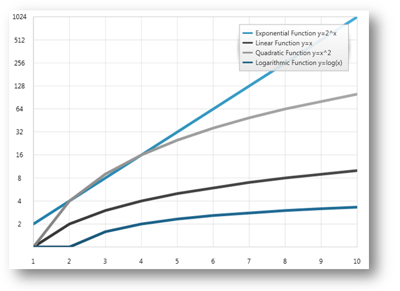

////
|metadata|
{
    "name": "datachart-using-axis-scales",
    "controlName": ["{DataChartName}"],
    "tags": ["Charting","Data Presentation","Getting Started","How Do I"],
    "guid": "4e5dece9-3873-4f38-b195-f9089b68f04a",
    "buildFlags": ["wpf","win-universal"],
    "createdOn": "2014-06-05T19:39:00.5823511Z"
}
|metadata|
////

= Configuring Axis Scales

This topic introduces axis scales feature of the link:{DataChartLink}.{DataChartName}.html[{DataChartName}]™ control and explains, with code examples, how to use supported axis scales.

== Overview

The topic is organized as follows:

* <<Introduction,Introduction>>
* <<Properties,Properties>>
* <<Example,Example>>
* <<RelatedContent,Related Content>>

== Introduction

In the {DataChartName} control, numeric axes allow scaling data values using built-in scalers. This is accomplished by setting enum value to the link:{DataChartLink}.straightnumericaxisbase{ApiProp}scalemode.html[ScaleMode] property on a numeric axis. Setting this property effectively sets the axis scaler to a linear or logarithmic mode.

ifdef::wpf[]
The behavior is the same as setting the link:{DataChartLink}.numericaxisbase.html[NumericAxisBase]. link:{DataChartLink}.straightnumericaxisbase{ApiProp}scaler.html[Scaler] property, but most often you will find the enumerable property more convenient to use. Refer to the 
link:datachart-creating-custom-axis-scalers.html[Creating Custom Axis Scalers] topic for information on how to apply custom axis scalers to the link:{DataChartLink}.straightnumericaxisbase{ApiProp}scaler.html[Scaler] property of numeric axes.
endif::wpf[]

== Properties

The following table lists properties affecting scale of a numeric axis.

[options="header", cols="a,a,a"]
|====
|Axis Property|Property Type|Description

| link:{DataChartLink}.straightnumericaxisbase{ApiProp}scalemode.html[ScaleMode]
| link:{DataChartLink}.numericscalemode.html[NumericScaleMode]
|Gets or sets the scale mode of numeric axis: 

* link:{DataChartLink}.numericscalemode.html[Linear] 

* link:{DataChartLink}.numericscalemode.html[Logarithmic] 

| link:{DataChartLink}.numericaxisbase{ApiProp}LogarithmBase.html[LogarithmBase]
| int
|Gets or sets the logarithm base when numeric axis in `Logarithmic` scale mode: 

ifdef::wpf[]
| link:{DataChartLink}.straightnumericaxisbase{ApiProp}scaler.html[Scaler]
| link:{DataChartLink}.numericscaler.html[NumericScaler]
|Gets or sets the numeric scaler used for scaling the numeric axis. This property should be set to one of the objects: 

For numeric x-axis: 

* link:{DataChartLink}.horizontallinearscaler.html[HorizontalLinearScaler] 

* link:{DataChartLink}.horizontallogarithmicscaler.html[HorizontalLogarithmicScaler] 

For numeric y-axis: 

* link:{DataChartLink}.verticallinearscaler.html[VerticalLinearScaler] 

* link:{DataChartLink}.verticallogarithmicscaler.html[VerticalLogarithmicScaler] 
endif::wpf[]

|====

ifdef::wpf[]
.Note:
[NOTE]
====
Prior to the 2011 Volume 2 release, there were two possible scaling functions for axes: linear and logarithmic. The two modes were toggled using the link:{DataChartLink}.numericaxisbase.html[NumericAxisBase]. link:{DataChartLink}.numericaxisbase{ApiProp}islogarithmic.html[IsLogarithmic] property and the logarithmic base was editable using link:{DataChartLink}.numericaxisbase.html[NumericAxisBase]. link:{DataChartLink}.numericaxisbase{ApiProp}logarithmbase.html[LogarithmBase] property. These properties are still supported, but it is recommended that you use the ScaleMode property or the Scaler property instead of the IsLogarithmic property.
====
endif::wpf[]
 

== Example

The following code snippet shows how to use built-in axis scalers to scale data values plotted in the {DataChartName} control.

ifdef::xaml[]
*In XAML:* 
[source,xaml]
----
<ig:XamDataChart.Axes>
    <ig:NumericXAxis x:Name="xAxis" Name="Linear"  />
    <ig:NumericYAxis x:Name="yAxis" Name="Logarithmic" ScaleMode="Logarithmic" LogarithmBase="2" />
</ig:{DataChartName}.Axes>
----
endif::xaml[]
 

ifdef::wpf,win-universal,win-forms,xamarin[]
*In C#:*
[source,csharp]
----
var xAxis = new NumericXAxis();
xAxis.ScaleMode = NumericScaleMode.Linear;
var yAxis = new NumericYAxis();
yAxis.ScaleMode = NumericScaleMode.Logarithmic;
yAxis.LogarithmBase = 2;
----
endif::wpf,win-universal,win-forms,xamarin[]

  
ifdef::wpf,win-universal,win-forms[]
*In Visual Basic:*
[source,vb]
----
Dim xAxis As New NumericXAxis() 
xAxis.ScaleMode = NumericScaleMode.Linear
Dim xAxis As New NumericYAxis() 
yAxis.ScaleMode = NumericScaleMode.Logarithmic
yAxis.LogarithmBase = 2
----
endif::wpf,win-universal,win-forms[]

Figure 1 – Preview of the {DataChartName} with logarithmic scale applied to y-axis.

== Related Content

* link:datachart-creating-custom-axis-scalers.html[Creating Custom Axis Scalers]