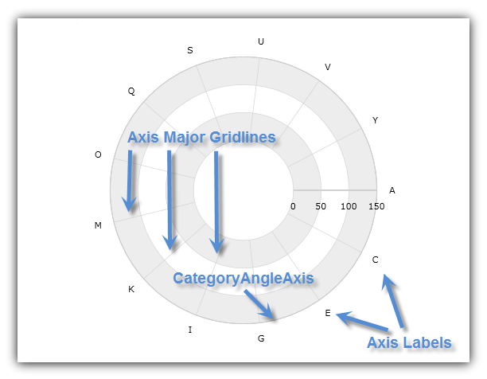
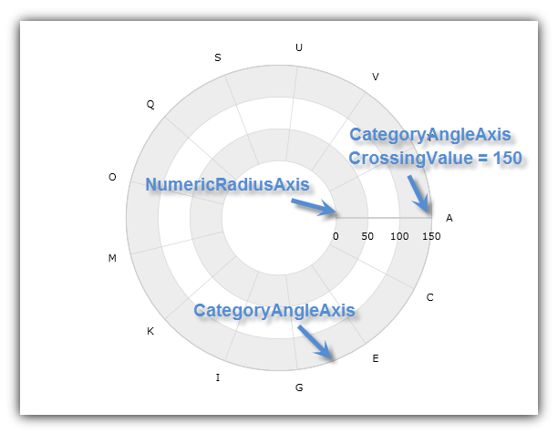
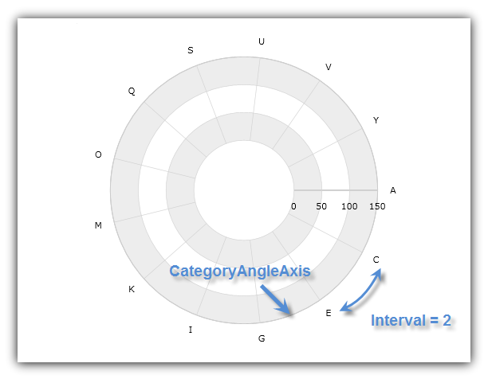

////
|metadata|
{
    "name": "datachart-using-category-angle-axis",
    "controlName": ["{DataChartName}"],
    "tags": ["Charting","Data Presentation"],
    "guid": "3ba809ed-d15a-4596-9543-940560ef615f",
    "buildFlags": [],
    "createdOn": "2014-06-05T19:39:00.6083619Z"
}
|metadata|
////

= Using Category Angle Axis

This topic demonstrates, with code examples, how to use Category Angle Axis in the link:{DataChartLink}.{DataChartName}.html[{DataChartName}]™ control.

The topic is organized as follows:

* <<Introduction,Introduction>>
* <<AxisCrossingProperties,Axis Crossing Properties>>
* <<AxisRangeProperties,Axis Range Properties>>
* <<AxisOffset,Axis Offset>>
* <<RelatedContent,Related Content>>

[[Introduction]]
== Introduction

The link:{DataChartLink}.categoryangleaxis.html[CategoryAngleAxis] has a shape of a circle surrounding the center of the chart with major gridlines that look like radial lines starting from center of chart and pointing outwards. (Figure 1)

Figure 1: Sample implementation of the link:{DataChartLink}.categoryangleaxis.html[CategoryAngleAxis] shape

The link:{DataChartLink}.categoryangleaxis.html[CategoryAngleAxis] is used only with link:datachart-radial-series-overview.html[Radial Series] (in combination with link:{DataChartLink}.numericradiusaxis.html[NumericRadiusAxis] instead of the link:{DataChartLink}.numericangleaxis.html[NumericAngleAxis] that is used only with link:datachart-polar-series-overview.html[Polar Series]). For more information on what axis types are required by a specific series, refer to the link:datachart-series-requirements.html[Series Requirements] topic.

.Note:
[NOTE]
====
All category axes require data binding and data mapping in order to show labels on the axis lines. Refer to the link:datachart-getting-started-with-datachart.html[Getting Started with Data Chart] topic for code example how to bind data to the category.
====

[[AxisCrossingProperties]]
== Axis Crossing Properties

The CategoryAngleAxis has the following axis crossing properties:

link:{DataChartLink}.axis{ApiProp}crossingvalue.html[CrossingValue] – the radius or distance from the beginning of the NumericRadiusAxis. In other words, this value determines the location of intersection of the CategoryAngleAxis on the NumericRadiusAxis. Increasing the value of the CrossingValue property, will move the CategoryAngleAxis farther from the center of the chart and decreasing it will move the angle axis closer to the center along the radius axis. For example, if the NumericRadiusAxis has a range value from 0 to 100 and a value of 50 is set on the CrossingValue property of the CategoryAngleAxis then the angle axis will cross the radius axis at value of 50. By default, the crossing value of the angle is set to the maximum value of radius axis which means that the angle axis will be rendered at the outer ring of the chart

link:{DataChartLink}.axis{ApiProp}crossingaxis.html[CrossingAxis] – the axis in the {DataChartName} control’s  pick:[wpf,win-universal,win-forms=" link:{DataChartLink}.{DataChartName}{ApiProp}axes.html[Axes]"]  pick:[android=" link:{DataChartLink}.{DataChartName}~addaxis.html[Axes]"]  collection that crosses the CategoryAngleAxis. This property must be bound to a NumericRadiusAxis, and vice-versa, if there is more than one CategoryAngleAxis and one NumericRadiusAxis in the {DataChartName} control’s Axes collection. If you don’t specify the crossing axis, then the angle axis will just assume the first axis of the NumericRadiusAxis type in the chart’s Axes collection is the correct crossing axis.

The following code snippets show how to use the CrossingAxis and CrossingValue properties of the CategoryAngleAxis in the {DataChartName} control. It sets the intersection of CategoryAngleAxis with NumericRadiusAxis at radius of 150 from the beginning of NumericRadiusAxis. The result is shown in Figure 2 below.

ifdef::wpf,win-universal[]

*In XAML:*

----
<ig:{DataChartName} x:Name="DataChart" >
    <ig:{DataChartName}.Axes>
        <ig:NumericRadiusAxis x:Name="RadiusAxis"  
                              CrossingAxis="{Binding ElementName=categoryAngleAxis}"
                              CrossingValue="0" >
        </ig:NumericRadiusAxis>
        <ig:CategoryAngleAxis x:Name="categoryAngleAxis"
                             CrossingAxis="{Binding ElementName=RadiusAxis}"
                             CrossingValue="150" >
        </ig:CategoryAngleAxis>
    </ig:{DataChartName}.Axes>
</ig:{DataChartName}>
----

endif::wpf,win-universal[]

ifdef::xamarin[]

*In XAML:*

----
<ig:{DataChartName} x:Name="DataChart" >
    <ig:{DataChartName}.Axes>
        <ig:NumericRadiusAxis x:Name="RadiusAxis"  
                              CrossingAxis="{x:Reference categoryAngleAxis}"
                              CrossingValue="0" >
        </ig:NumericRadiusAxis>
        <ig:CategoryAngleAxis x:Name="categoryAngleAxis"
                             CrossingAxis="{x:Reference RadiusAxis}"
                             CrossingValue="150" >
        </ig:CategoryAngleAxis>
    </ig:{DataChartName}.Axes>
</ig:{DataChartName}>
----

endif::xamarin[]

ifdef::wpf[]

*In Visual Basic:*

----
Dim DataChart As New {DataChartName}()
Dim categoryAngleAxis As New CategoryAngleAxis()
Dim RadiusAxis As New NumericRadiusAxis()
RadiusAxis.CrossingAxis = categoryAngleAxis
RadiusAxis.CrossingValue = 0
categoryAngleAxis.CrossingAxis = RadiusAxis
categoryAngleAxis.CrossingValue = 150
DataChart.Axes.Add(categoryAngleAxis)
DataChart.Axes.Add(RadiusAxis)
----

endif::wpf[]

ifdef::win-forms[]

*In Visual Basic:*

----
Dim DataChart As New {DataChartName}()
Dim categoryAngleAxis As New CategoryAngleAxis()
Dim RadiusAxis As New NumericRadiusAxis()
RadiusAxis.CrossingAxis = categoryAngleAxis
RadiusAxis.CrossingValue = 0
categoryAngleAxis.CrossingAxis = RadiusAxis
categoryAngleAxis.CrossingValue = 150
DataChart.Axes.Add(categoryAngleAxis)
DataChart.Axes.Add(RadiusAxis)
----

endif::win-forms[]

ifdef::wpf[]

*In C#:*

----
var DataChart = new {DataChartName}();
var categoryAngleAxis = new CategoryAngleAxis();
var RadiusAxis = new NumericRadiusAxis();
RadiusAxis.CrossingAxis = categoryAngleAxis;
RadiusAxis.CrossingValue = 0;
categoryAngleAxis.CrossingAxis = RadiusAxis;
categoryAngleAxis.CrossingValue = 150;
DataChart.Axes.Add(categoryAngleAxis);
DataChart.Axes.Add(RadiusAxis);
----

endif::wpf[]

ifdef::win-forms[]

*In C#:*

----
var DataChart = new {DataChartName}();
var categoryAngleAxis = new CategoryAngleAxis();
var RadiusAxis = new NumericRadiusAxis();
RadiusAxis.CrossingAxis = categoryAngleAxis;
RadiusAxis.CrossingValue = 0;
categoryAngleAxis.CrossingAxis = RadiusAxis;
categoryAngleAxis.CrossingValue = 150;
DataChart.Axes.Add(categoryAngleAxis);
DataChart.Axes.Add(RadiusAxis);
----

endif::win-forms[]

ifdef::xamarin[]

*In C#:*

----
var DataChart = new {DataChartName}();
var categoryAngleAxis = new CategoryAngleAxis();
var RadiusAxis = new NumericRadiusAxis();
RadiusAxis.CrossingAxis = categoryAngleAxis;
RadiusAxis.CrossingValue = 0;
categoryAngleAxis.CrossingAxis = RadiusAxis;
categoryAngleAxis.CrossingValue = 150;
DataChart.Axes.Add(categoryAngleAxis);
DataChart.Axes.Add(RadiusAxis);
----

endif::xamarin[]

ifdef::android[]

*In Java:*

[source,js]
----
DataChartView dataChart = new DataChartView(root.getContext());
CategoryAngleAxis categoryAngleAxis = new CategoryAngleAxis();
NumericRadiusAxis RadiusAxis = new NumericRadiusAxis();
RadiusAxis.setCrossingAxis(categoryAngleAxis);
RadiusAxis.setCrossingValue(0.0);
categoryAngleAxis.setCrossingAxis(RadiusAxis);
categoryAngleAxis.setCrossingValue(150);
dataChart.addAxis(categoryAngleAxis);
dataChart.addAxis(RadiusAxis);
----

endif::android[]

Figure 2: The {DataChartName} control with CategoryAngleAxis crossing at 150 radius value of NumericRadiusAxis

[[AxisRangeProperties]]
== Axis Range Properties

The CategoryAngleAxis does not have link:{DataChartLink}.numericaxisbase{ApiProp}minimumvalue.html[MinimumValue] and link:{DataChartLink}.numericaxisbase{ApiProp}maximumvalue.html[MaximumValue] properties. Therefore, it always starts from the first item in data set that is bound to it and then displays axis labels and major gridlines for the rest of items in intervals equal to a value of the link:{DataChartLink}.numericaxisbase{ApiProp}interval.html[Interval] property.

The following code snippet shows how to set interval on the CategoryAngleAxis and display every other axis label in the {DataChartName} control. The result is shown in Figure 3 below.

ifdef::xaml[]

*In XAML:*

----
<ig:{DataChartName} x:Name="DataChart" >
    <ig:{DataChartName}.Axes>
        <ig:CategoryAngleAxis x:Name="categoryAngleAxis"  
                              Interval="2">
        </ig:CategoryAngleAxis>
    </ig:{DataChartName}.Axes>
</ig:{DataChartName}>
----

endif::xaml[]

ifdef::wpf[]

*In Visual Basic:*

----
Dim DataChart As New {DataChartName}()
Dim categoryAngleAxis As New CategoryAngleAxis()
categoryAngleAxis.Interval = 2
DataChart.Axes.Add(categoryAngleAxis)
----

endif::wpf[]

ifdef::win-forms[]

*In Visual Basic:*

----
Dim DataChart As New {DataChartName}()
Dim categoryAngleAxis As New CategoryAngleAxis()
categoryAngleAxis.Interval = 2
DataChart.Axes.Add(categoryAngleAxis)
----

endif::win-forms[]

ifdef::wpf[]

*In C#:*

----
var DataChart = new {DataChartName}();
var categoryAngleAxis = new CategoryAngleAxis();
categoryAngleAxis.Interval = 2;
DataChart.Axes.Add(categoryAngleAxis);
----

endif::wpf[]

ifdef::win-forms[]

*In C#:*

----
var DataChart = new {DataChartName}();
var categoryAngleAxis = new CategoryAngleAxis();
categoryAngleAxis.Interval = 2;
DataChart.Axes.Add(categoryAngleAxis);
----

endif::win-forms[]

ifdef::xamarin[]

*In C#:*

----
var DataChart = new {DataChartName}();
var categoryAngleAxis = new CategoryAngleAxis();
categoryAngleAxis.Interval = 2;
DataChart.Axes.Add(categoryAngleAxis);
----

endif::xamarin[]

ifdef::android[]

*In Java:*

[source,js]
----
DataChartView dataChart = new DataChartView(root.getContext());
CategoryAngleAxis categoryAngleAxis = new CategoryAngleAxis();
categoryAngleAxis.setInterval(1);
dataChart.addAxis(categoryAngleAxis);
----

endif::android[]

Figure 3: CategoryAngleAxis displaying every other axis label in the {DataChartName}

[[AxisOffset]]
== Axis Offset

The CategoryAngleAxis always starts from the 3 o’clock position (the right-hand side of the chart). However, this can be changed by setting the CategoryAngleAxis object’s link:{DataChartLink}.categoryangleaxis{ApiProp}startangleoffset.html[StartAngleOffset] property to an angle that will offset the starting axis location in a clockwise direction. For example, a value of 90 set on the StartAngleOffset property will position the starting point for the CategoryAngleAxis at the 6 o’clock position (the bottom of the chart) and a value of 270 will start this axis at the 12 o’clock position (the top of the chart). The axis index usually increases clockwise, but you can set IsInverted to true on the CategoryAngleAxis in order to make the axis indices increase counter-clockwise instead.

The following code snippets show how to offset starting point of the CategoryAngleAxis in the {DataChartName} control by 60 degrees. The result is shown in Figure 4 below.

ifdef::xaml[]

*In XAML:*

----
<ig:{DataChartName} x:Name="DataChart" >
    <ig:{DataChartName}.Axes>
        <ig:CategoryAngleAxis x:Name="categoryAngleAxis"  
                             StartAngleOffset="60">
        </ig:CategoryAngleAxis>
    </ig:{DataChartName}.Axes>
</ig:{DataChartName}>
----

endif::xaml[]

ifdef::wpf[]

*In Visual Basic:*

----
Dim DataChart As New {DataChartName}()
Dim categoryAngleAxis As New CategoryAngleAxis()
categoryAngleAxis.StartAngleOffset = 60
DataChart.Axes.Add(categoryAngleAxis)
----

endif::wpf[]

ifdef::win-forms[]

*In Visual Basic:*

----
Dim DataChart As New {DataChartName}()
Dim categoryAngleAxis As New CategoryAngleAxis()
categoryAngleAxis.StartAngleOffset = 60
DataChart.Axes.Add(categoryAngleAxis)
----

endif::win-forms[]

ifdef::wpf[]

*In C#:*

----
var DataChart = new {DataChartName}();
var categoryAngleAxis = new CategoryAngleAxis();
categoryAngleAxis.StartAngleOffset = 60;
DataChart.Axes.Add(categoryAngleAxis);
----

endif::wpf[]

ifdef::win-forms[]

*In C#:*

----
var DataChart = new {DataChartName}();
var categoryAngleAxis = new CategoryAngleAxis();
categoryAngleAxis.StartAngleOffset = 60;
DataChart.Axes.Add(categoryAngleAxis);
----

endif::win-forms[]

ifdef::xamarin[]

*In C#:*

----
var DataChart = new {DataChartName}();
var categoryAngleAxis = new CategoryAngleAxis();
categoryAngleAxis.StartAngleOffset = 60;
DataChart.Axes.Add(categoryAngleAxis);
----

endif::xamarin[]

ifdef::android[]

*In Java:*

[source,js]
----
DataChartView dataChart = new DataChartView(root.getContext());
CategoryAngleAxis categoryAngleAxis = new CategoryAngleAxis();
categoryAngleAxis.setStartAngleOffset(60);
dataChart.addAxis(categoryAngleAxis);
----

endif::android[]

image::images/xamDataChart_Using_Category_Angle_Axis_04.png[]

Figure 4: CategoryAngleAxis with 60 degrees offset for the starting angle value

[[RelatedContent]]
== Related Content

* link:datachart-series-requirements.html[Series Requirements]
* link:datachart-radial-series-overview.html[Radial Series]