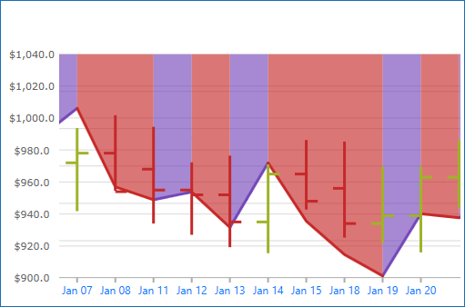

= Using Time X-Axis

This topic demonstrates, with code examples, how to use TimeXAxis in the link:{DataChartLink}.{DataChartName}.html[{DataChartName}]™ control. The benefit of using TimeXAxis is to dynamically change label formats as you zoom in or out of the data.  In addition, axis breaks can be created which omit dates within a range.  For example, weekends can be skipped.

The topic is organized as follows:

* <<Introduction,Introduction>>
* <<AxisBreakProperties,Axis Break Properties>>

Note: The following sections are only required if the default labels (i.e. formatting & intervals) need to be changed.

* <<AxisLabelFormatProperties,Axis Label Format Properties>>
* <<AxisIntervalProperties,Axis Interval Properties>>
* <<RelatedContent,Related Content>>

[[Introduction]]
== Introduction

The link:{DataChartLink}.timexaxis.html[TimeXAxis] may be used with the following series:

* link:datachart-category-series-overview.html[Category Series]

* link:datachart-financial-indicators-overview.html[Financial Indicators]

* link:datachart-series-financial-price-series-overview.html[Financial Series]  

For more information on what axis types are required by a specific series, refer to the link:datachart-series-requirements.html[Series Requirements] topic.

.Note:
[NOTE]
====
All category axes require data binding and data mapping in order to show labels on the axis lines. Refer to the link:datachart-getting-started-with-datachart.html[Getting Started with Data Chart] topic for code example how to bind data to the category.
====

image::images/timeXAxis.png[]

Figure 1: Sample implementation of the link:{DataChartLink}.timeXaxis.html[TimeXAxis]

[[AxisBreakProperties]]
== Axis Break Properties

The link:{DataChartLink}.timexaxis.html[TimeXAxis] has the option to exclude intervals of data with link:{DataChartLink}.timexaxis{ApiProp}breaks.html[Breaks]. As a result, labels will not appear at the excluded interval. For example, working/non-working, holidays, and/or weekends.

An instance of link:{DataChartLink}.timeaxisbreak.html[TimeAxisBreak] can be added to the link:{DataChartLink}.timexaxis{ApiProp}breaks.html[Breaks] property and configured by using a unique link:{DataChartLink}.timeaxisbreak{ApiProp}Start.html[Start], link:{DataChartLink}.timeaxisbreak{ApiProp}End.html[End] and link:{DataChartLink}.timeaxisbreak{ApiProp}Interval.html[Interval].

The following code snippets show how to skip labels on the link:{DataChartLink}.timexaxis.html[TimeXAxis] in the {DataChartName} for a range of years, causing uneven intervals. The result is shown in Figure 2 below.

Figure 2: link:{DataChartLink}.timexaxis.html[TimeXAxis] displaying data from Monday through Friday in 2010.

ifdef::xaml[]

*In XAML:*
[source,xaml]
----
<ig:XamDataChart x:Name="DataChart" >
    <ig:XamDataChart.Axes>
        <ig:TimeXAxis x:Name="xAxis" ItemsSource="{StaticResource data}" DateTimeMemberPath="Date" >
            <ig:TimeXAxis.Breaks>
                <ig:TimeAxisBreak 
                        Start="2009-12-26T00:00:00"
                        End="2009-12-27T23:59:59.99"
                        Interval="7:00:00:00.00"/>
            </ig:TimeXAxis.Breaks>    
        </ig:TimeXAxis>
    </ig:XamDataChart.Axes>
</ig:XamDataChart>
----

endif::xaml[]

ifdef::wpf,win-forms[]

*In Visual Basic:*
[source,vb]
----
Dim axisBreaks = xAxis.Breaks

axisBreaks.Add(New TimeAxisBreak() With { _
	.Start = New DateTime(2009, 12, 26, 0, 0, 0), _
	.[End] = New DateTime(2009, 12, 27, 23, 59, 59), _
	.Interval = New TimeSpan(7, 0, 0, 0, 0) _
})
----

endif::wpf,win-forms[]

ifdef::wpf,win-forms[]

*In C#:*
[source,csharp]
----
var axisBreaks = xAxis.Breaks;

axisBreaks.Add(new TimeAxisBreak 
{ 
    Start = new DateTime(2009, 12, 26, 00, 00, 00), 
    End = new DateTime(2009, 07, 12, 27, 59, 59),
    Interval = new TimeSpan(7, 0, 0, 0, 0)
});
----

endif::wpf,win-forms[]

[[AxisLabelFormatProperties]]
== Axis Label Format Properties

The link:{DataChartLink}.timexaxis.html[TimeXAxis] has the link:{DataChartLink}.timexaxis{ApiProp}labelformats.html[LabelFormats] property which is a collection of type link:{DataChartLink}.timeaxislabelformat.html[TimeAxisLabelFormat]. Each link:{DataChartLink}.timeaxislabelformat.html[TimeAxisLabelFormat] added to the collection is responsible for assigning a unique link:{DataChartLink}.timeaxislabelformat{ApiProp}format.html[Format] and link:{DataChartLink}.timeaxislabelformat{ApiProp}range.html[Range].  This can be especially useful for drilling data from years to milliseconds and adjusting the labels depending on the range of time shown by the chart.

[options="header", cols="a,a,a"]
|====
|Name
|Type
|Description

|link:{DataChartLink}.timeaxislabelformat{ApiProp}format.html[TimeAxisLabelFormat.Format]
|`string`
|Specifies what format to use for the visible range.

|link:{DataChartLink}.timeaxislabelformat{ApiProp}range.html[TimeAxisLabelFormat.Range]
|`TimeSpan`
|Specifies the visible range at which the axis label formats will switch to a different format.  For example, if you have two link:{DataChartLink}.timeaxislabelformat.html[TimeAxisLabelFormat] with a range set to 10 days and another set to 5 hours, as soon as the visible range in the axis becomes less than 10 days it will switch to 5 hour format.
|====

.Note:
[NOTE]
====
The visible range is determined by the dates currently visible along the axis minus the dates that are removed by axis breaks.
====

The following lists a typical set of label formats for the given amount of time in view:

1. 1825 days or more (eg. 5 years) will result in a format of "yyyy".
2. 365 days or more (eg. 1 year) will result in a format of "MMM yy".
3. 1 day or more will result in a format of "MMM dd".
4. 5 hours or more will result in a format of "hh:mm".
5. Below 5 hours will result in a format of "hh:mm:ss".

image::images/timeXAxis_Formats.png[]

Figure 3: The {DataChartName} control with a custom link:{DataChartLink}.timeaxislabelformat.html[TimeAxisLabelFormat] of "hh:mm:ss" 

ifdef::wpf[]

*In XAML:*
[source,xaml]
----
<ig:{DataChartName} x:Name="DataChart" >
    <ig:{DataChartName}.Axes>
       <ig:TimeXAxis x:Name="xAxis" ItemsSource="{StaticResource data}" DateTimeMemberPath="Date" >
            <ig:TimeXAxis.LabelFormats>
                    <ig:TimeAxisLabelFormat     
                        Format="hh:mm:ss" 
                        Range="0.00:00:00"/>
                    <ig:TimeAxisLabelFormat
                        Format="hh:mm"
                        Range="0.05:00:00"/>
                    <ig:TimeAxisLabelFormat
                        Format="MMM dd"
                        Range="1.00:00:00" />
                    <ig:TimeAxisLabelFormat
                        Format="MMM yy"
                        Range="365.0:00:00" />
                    <ig:TimeAxisLabelFormat
                        Format="yyyy"
                        Range="1825.0:00:00" />
            </ig:TimeXAxis.LabelFormats>
        </ig:TimeXAxis>
    </ig:{DataChartName}.Axes>
</ig:{DataChartName}>
----

endif::wpf[]

ifdef::wpf,win-forms[]

*In Visual Basic:*
[source,vb]
----
Dim DataChart = New {DataChartName}()
Dim timeXAxis = New TimeXAxis()
DataChart.Axes.Add(timeXAxis)

Dim axisFormat = xAxis.LabelFormats
axisFormat.Add(New TimeAxisLabelFormat() With { _
	.Format = "hh:mm:ss", _
	.Range = New TimeSpan(0, 0, 0, 0, 0) _
})

axisFormat.Add(New TimeAxisLabelFormat() With { _
	.Format = "hh:mm", _
	.Range = New TimeSpan(0, 5, 0, 0, 0) _
})

axisFormat.Add(New TimeAxisLabelFormat() With { _
	.Format = "MMM dd", _
	.Range = New TimeSpan(1, 0, 0, 0, 0) _
})

axisFormat.Add(New TimeAxisLabelFormat() With { _
	.Format = "MMM yy", _
	.Range = New TimeSpan(365, 0, 0, 0, 0) _
})

axisFormat.Add(New TimeAxisLabelFormat() With { _
	.Format = "yyyy", _
	.Range = New TimeSpan(1825, 0, 0, 0, 0) _
})

----

endif::wpf,win-forms[]

ifdef::wpf,win-forms[]

*In C#:*
[source,csharp]
----
var DataChart = new {DataChartName}();
var timeXAxis = new TimeXAxis();
DataChart.Axes.Add(timeXAxis);

var axisFormat = xAxis.LabelFormats;

axisFormat.Add(new TimeAxisLabelFormat 
{ 
    Format = "hh:mm:ss", 
    Range = new TimeSpan(0, 0, 0, 0, 0)  
});

axisFormat.Add(new TimeAxisLabelFormat 
{ 
    Format = "hh:mm", 
    Range = new TimeSpan(0, 5, 0, 0, 0) 
});

axisFormat.Add(new TimeAxisLabelFormat 
{ 
    Format = "MMM dd", 
    Range = new TimeSpan(1, 0, 0, 0, 0) 
});

axisFormat.Add(new TimeAxisLabelFormat 
{ 
    Format = "MMM yy", 
    Range = new TimeSpan(365, 0, 0, 0, 0) 
});

axisFormat.Add(new TimeAxisLabelFormat 
{ 
    Format = "yyyy",
    Range = new TimeSpan(1825, 0, 0, 0, 0) 
});
----

endif::wpf,win-forms[]

[[AxisIntervalProperties]]
== Axis Intervals Properties

The link:{DataChartLink}.timexaxis.html[TimeXAxis] replaces the conventional link:{DataChartLink}.numericaxisbase{ApiProp}interval.html[Interval] property with an link:{DataChartLink}.timexaxis{ApiProp}intervals.html[Intervals] collection of type link:{DataChartLink}.timeaxisinterval.html[TimeAxisInterval]. Each link:{DataChartLink}.timeaxisinterval.html[TimeAxisInterval] added to the collection is responsible for assigning a unique link:{DataChartLink}.TimeAxisInterval{ApiProp}Interval.html[Interval], link:{DataChartLink}.TimeAxisInterval{ApiProp}Range.html[Range] and link:{DataChartLink}.TimeAxisInterval{ApiProp}Range.html[IntervalType]. This can be especially useful for drilling data from years to milliseconds to provide unique spacing between labels depending on the range of time shown by the chart.

[options="header", cols="a,a,a"]
|====
|Name
|Type
|Description

|link:{DataChartLink}.TimeAxisInterval{ApiProp}Interval.html[TimeAxisInterval.Interval]
|`double`
|Specifies the interval to use.  This is tied to link:{DataChartLink}.TimeAxisInterval{ApiProp}Range.html[IntervalType] property.  If link:{DataChartLink}.TimeAxisInterval{ApiProp}Range.html[IntervalType] is set to `Days` then the numeric value specified in link:{DataChartLink}.TimeAxisInterval{ApiProp}Interval.html[Interval] will be in days.

|link:{DataChartLink}.TimeAxisInterval{ApiProp}Range.html[TimeAxisInterval.Range]
|`TimeSpan`
|Specifies the visible range at which the axis interval will switch to a different interval. For example, if you have two link:{DataChartLink}.TimeAxisInterval.html[TimeAxisInterval] with a range set to 10 days and another set to 5 hours, as soon as the visible range in the axis becomes less than 10 days it will switch to the interval whose range is 5 hours.

|link:{DataChartLink}.TimeAxisInterval{ApiProp}Range.html[TimeAxisInterval.IntervalType]
|link:{DataChartLink}.TimeAxisIntervalType.html[TimeAxisIntervalType]
|Specifies the unit of time for this interval.
|====

.Note:
[NOTE]
====
The visible range is determined by the dates currently visible along the axis minus the dates that are removed by axis breaks.
====

The following screenshot and code snippets demonstrate how to implement several link:{DataChartLink}.timeaxisinterval.html[TimeAxisInterval] in the {DataChartName} control.

image::images/timeXAxis_Intervals.png[]

Figure 4: link:{DataChartLink}.timexaxis.html[TimeXAxis] using a link:{DataChartLink}.timeaxisinterval.html[TimeAxisInterval] with an link:{DataChartLink}.TimeAxisInterval{ApiProp}Interval.html[Interval] of 12 days.

ifdef::xaml[]

*In XAML:*
[source,xaml]
----
<ig:{DataChartName} x:Name="DataChart" >
    <ig:{DataChartName}.Axes>
       <ig:TimeXAxis x:Name="xAxis" ItemsSource="{StaticResource data}" DateTimeMemberPath="Date" >
           <ig:TimeXAxis.Intervals>
              <ig:TimeAxisInterval
                  Range="0.00:00:00"
                  Interval="36" 
                  IntervalType="Seconds" />
              <ig:TimeAxisInterval
                  Range="0.00:30:00" 
                  Interval="5"
                  IntervalType="Minutes" />
              <ig:TimeAxisInterval
                  Range="0.05:00:00" 
                  Interval="1" 
                  IntervalType="Hours" />
              <ig:TimeAxisInterval
                  Range="1.00:00:00"
                  Interval="12" 
                  IntervalType="Days" />
              <ig:TimeAxisInterval
                  Range="365.00:00:00"
                  Interval="1"
                  IntervalType="Months" />
              <ig:TimeAxisInterval
                  Range="1825.0:00:00"
                  Interval="1"
                  IntervalType="Years" />
            </ig:TimeXAxis.Intervals> 
        </ig:TimeXAxis>
    </ig:{DataChartName}.Axes>
</ig:{DataChartName}>
----

endif::xaml[]

ifdef::wpf,win-forms[]

*In Visual Basic:*
[source,vb]
----
Dim axisIntervals = xAxis.Intervals

axisIntervals.Add(New TimeAxisInterval() With { _
	.IntervalType = TimeAxisIntervalType.Seconds, _
	.Interval = 36, _
	.Range = New TimeSpan(0, 0, 0, 0, 0) _
})

axisIntervals.Add(New TimeAxisInterval() With { _
	.IntervalType = TimeAxisIntervalType.Minutes, _
	.Interval = 6, _
	.Range = New TimeSpan(0, 0, 30, 0, 0) _
})

axisIntervals.Add(New TimeAxisInterval() With { _
	.IntervalType = TimeAxisIntervalType.Hours, _
	.Interval = 1, _
	.Range = New TimeSpan(0, 5, 0, 0, 0) _
})

axisIntervals.Add(New TimeAxisInterval() With { _
	.IntervalType = TimeAxisIntervalType.Days, _
	.Interval = 12, _
	.Range = New TimeSpan(1, 0, 0, 0, 0) _
})

axisIntervals.Add(New TimeAxisInterval() With { _
	.IntervalType = TimeAxisIntervalType.Months, _
	.Interval = 1, _
	.Range = New TimeSpan(365, 0, 0, 0, 0) _
})

axisIntervals.Add(New TimeAxisInterval() With { _
	.IntervalType = TimeAxisIntervalType.Years, _
	.Interval = 2, _
	.Range = New TimeSpan(1825, 0, 0, 0, 0) _
})
----

endif::wpf,win-forms[]

ifdef::wpf,win-forms[]

*In C#:*
[source,csharp]
----
var axisIntervals = xAxis.Intervals;

axisIntervals.Add(new TimeAxisInterval 
{ 
    IntervalType = TimeAxisIntervalType.Seconds,
    Interval = 36, 
    Range = new TimeSpan(0, 0, 0, 0, 0) 
});
    
axisIntervals.Add(new TimeAxisInterval 
{ 
    IntervalType = TimeAxisIntervalType.Minutes,
    Interval = 6, 
    Range = new TimeSpan(0, 0, 30, 0, 0) 
});

axisIntervals.Add(new TimeAxisInterval 
{ 
    IntervalType = TimeAxisIntervalType.Hours,   
    Interval = 1, 
    Range = new TimeSpan(0, 5, 0, 0, 0) 
});

axisIntervals.Add(new TimeAxisInterval 
{ 
    IntervalType = TimeAxisIntervalType.Days,
    Interval = 12, 
    Range = new TimeSpan(1, 0, 0, 0, 0) 
});

axisIntervals.Add(new TimeAxisInterval 
{ 
    IntervalType = TimeAxisIntervalType.Months,
    Interval = 1, 
    Range = new TimeSpan(365, 0, 0, 0, 0) 
});

axisIntervals.Add(new TimeAxisInterval 
{ 
    IntervalType = TimeAxisIntervalType.Years,
    Interval = 2, 
    Range = new TimeSpan(1825, 0, 0, 0, 0) 
});
----

endif::wpf,win-forms[]

[[RelatedContent]]
== Related Content

* link:datachart-series-requirements.html[Series Requirements]
* link:datachart-radial-series-overview.html[Radial Series]