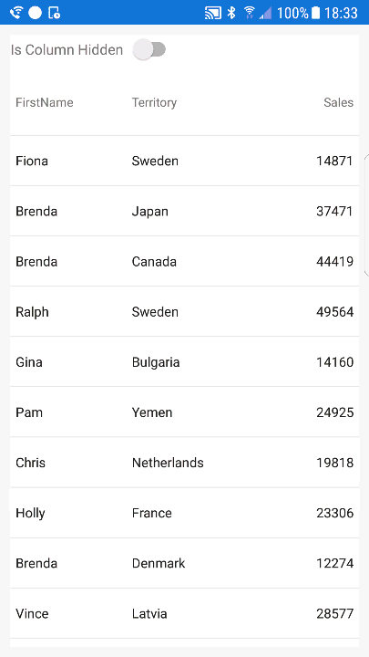

////
|metadata|
{
    "name": "datagrid-animation",
    "controlName": ["{DataGridName}"],
    "tags": [],
    "guid": "d610a8d2-68f0-4f96-9e6a-3121a8bf743d","buildFlags": [],
    "createdOn": "2016-02-05T19:10:27.5445551Z"
}
|metadata|
////

= Animation

The purpose of this topic is to get you familiar working with animations that can be implemented when carrying out operations on columns and rows of the link:{DataGridLink}.{DataGridName}.html[{DataGridName}] control.

=== Overview
This topic contains the following sections:

* <<_Ref437875354,Introduction>>
* <<_Ref437875377,Animation Presets>>
* <<_Ref437519563,Applying Animation Presets>>
* <<_Ref437519564,Customizing Animation Presets>>
** <<AnimationPhases,Animation Phases>> 
** <<CustomizationSettings,Customization Settings>> 
** <<CustomizationSteps,Customization Steps>> 
* <<_Ref437875510,Example of Pre-Phase/Main-Phase Animation>>
* <<_Ref437875518,Example of Main-Phase/Post-Phase Animation>>
* <<RelatedContent,Related Content>>

[[_Ref437875354]]
== Introduction

There are several animation presets that can be applied to the {DataGridName} control which will allow you to implement animations for row selection, cell actualization and each of the column operation types. Refer to the link:datagrid-working-with-columns.html[Working with Columns], topic for more information on types of column operations.

Animation presets are implemented via the pick:[android="set"]<OperationName>AnimationMode pick:[android=" methods"]pick:[xaml="properties"], exposed from the {DataGridName} control. In addition to animation presets, you can also create customized animations, for more details, refer to <<_Ref437519564,Customize Animation Presets>> section of this topic.

[[_Ref437875377]]
== Animation Presets

The following table details the {DataGridName} control's operations with their associated animation preset setter methods as well as the animation presets that can be used with them.

[options="header", cols="a,a,a"]
|====
|*Grid Operation:*|*{ApiMember}:*|*Animation Preset:*

|Row Selection
| link:{DataGridLink}.{DataGridName}{ApiProp}RowSelectionAnimationMode.html[pick:[android="set"]RowSelectionAnimationMode]
|
* link:{DataGridLink}.RowSelectionAnimationMode.html[Auto] 
* link:{DataGridLink}.RowSelectionAnimationMode.html[None] 
* link:{DataGridLink}.RowSelectionAnimationMode.html[ColorBlend] 

|Column Moving
| link:{DataGridLink}.{DataGridName}{ApiProp}ColumnMovingAnimationMode.html[pick:[android="set"]ColumnMovingAnimationMode]
|
* link:{DataGridLink}.ColumnMovingAnimationMode.html[Auto] 
* link:{DataGridLink}.ColumnMovingAnimationMode.html[None] 
* link:{DataGridLink}.ColumnMovingAnimationMode.html[SlideOver] 

|Column Showing
| link:{DataGridLink}.{DataGridName}{ApiProp}ColumnShowingAnimationMode.html[pick:[android="set"]ColumnShowingAnimationMode]
|
* link:{DataGridLink}.ColumnShowingAnimationMode.html[Auto] 
* link:{DataGridLink}.ColumnShowingAnimationMode.html[None] 
* link:{DataGridLink}.ColumnShowingAnimationMode.html[FadeIn] 
* link:{DataGridLink}.ColumnShowingAnimationMode.html[SlideFromLeft] 
* link:{DataGridLink}.ColumnShowingAnimationMode.html[SlideFromRight]  
* link:{DataGridLink}.ColumnShowingAnimationMode.html[SlideFromTop] 
* link:{DataGridLink}.ColumnShowingAnimationMode.html[SlideFromBottom]  
* link:{DataGridLink}.ColumnShowingAnimationMode.html[SlideFromLeftAndFadeIn] 
* link:{DataGridLink}.ColumnShowingAnimationMode.html[SlideFromRightAndFadeIn]  
* link:{DataGridLink}.ColumnShowingAnimationMode.html[SlideFromTopAndFadeIn] 
* link:{DataGridLink}.ColumnShowingAnimationMode.html[SlideFromBottomAndFadeIn]  
 
|Column Hiding
| link:{DataGridLink}.{DataGridName}{ApiProp}ColumnHidingAnimationMode.html[pick:[android="set"]ColumnHidingAnimationMode]
|
* link:{DataGridLink}.ColumnHidingAnimationMode.html[Auto] 
* link:{DataGridLink}.ColumnHidingAnimationMode.html[None] 
* link:{DataGridLink}.ColumnHidingAnimationMode.html[FadeOut] 
* link:{DataGridLink}.ColumnHidingAnimationMode.html[SlideToLeft]  
* link:{DataGridLink}.ColumnHidingAnimationMode.html[SlideToRight]  
* link:{DataGridLink}.ColumnHidingAnimationMode.html[SlideToTop]  
* link:{DataGridLink}.ColumnHidingAnimationMode.html[SlideToBottom]  
* link:{DataGridLink}.ColumnHidingAnimationMode.html[SlideToLeftAndFadeOut]  
* link:{DataGridLink}.ColumnHidingAnimationMode.html[SlideToRightAndFadeOut]  
* link:{DataGridLink}.ColumnHidingAnimationMode.html[SlideToTopAndFadeOut]  
* link:{DataGridLink}.ColumnHidingAnimationMode.html[SlideToBottomAndFadeOut]  

|Column Adding
| link:{DataGridLink}.{DataGridName}{ApiProp}ColumnAddingAnimationMode.html[pick:[android="set"]ColumnAddingAnimationMode]
|
* Auto 
* None 
* FadeIn 
* SlideFromLeft 
* SlideFromRight  
* SlideFromTop 
* SlideFromBottom  
* SlideFromLeftAndFadeIn 
* SlideFromRightAndFadeIn  
* SlideFromTopAndFadeIn 
* SlideFromBottomAndFadeIn 

|Column Property Updating
| link:{DataGridLink}.{DataGridName}{ApiProp}ColumnPropertyUpdatingAnimationMode.html[pick:[android="set"]ColumnPropertyUpdatingAnimationMode]
|
* link:{DataGridLink}.ColumnPropertyUpdatingAnimationMode.html[Auto] 
* link:{DataGridLink}.ColumnPropertyUpdatingAnimationMode.html[None] 
* link:{DataGridLink}.ColumnPropertyUpdatingAnimationMode.html[Interpolate] 
* link:{DataGridLink}.ColumnPropertyUpdatingAnimationMode.html[InterpolateDeep] 

|====

[[_Ref437519563]]
== Applying Animation Presets

The following example demonstrates how to apply a preset animation for the hiding columns and illustrates an application context in which it might be used in; this example uses a checkbox to toggle the visible state for a column to allow observation of the resulting animation. The first part of the example will walk you through setting up the sample.

[start=1]
. Create an instance of the {DataGridName} control with manually defined columns for the FirstName, Sales, and Territory data.

It is necessary to manually define these columns, as you will need to access link:{DataGridLink}.column{ApiProp}IsHidden.html[pick:[android="set"]IsHidden] which is exposed directly from the salesColumn object. For more information, refer to the link:datagrid-working-with-columns.html#_Ref435537803[Working with Columns] topic.
The link:{DataGridLink}.{DataGridName}{ApiProp}AutoGenerateColumns.html[pick:[android="set"]AutoGenerateColumns] to false, this tells the {DataGridName} control not to create columns automatically after its DataSource has been set.

ifdef::android[]
*In Java:*
[source, java]
----
TextColumn nameColumn = new TextColumn();
nameColumn.setKey("FirstName");
TextColumn territoryColumn = new TextColumn();
territoryColumn.setKey("Territory");
NumericColumn salesColumn = new NumericColumn();
salesColumn.setKey("Sales");

DataGridView DataGrid = new DataGridView(this);
DataGrid.setAutoGenerateColumns(false);
DataGrid.setDataSource(new SampleSalesTeam()); 
DataGrid.addColumn(nameColumn);
DataGrid.addColumn(territoryColumn);
DataGrid.addColumn(salesColumn);
----
endif::android[]

ifdef::xaml[]
*In XAML:*
[source, xaml]
----
<ig:XamDataGrid x:Name="DataGrid" AutoGenerateColumns="False">
    <ig:XamDataGrid.ItemsSource>
        <data:SampleSalesTeam />
    </ig:XamDataGrid.ItemsSource>    
    <ig:XamDataGrid.Columns>  
        <ig:TextColumn PropertyPath="FirstName" /> 
        <ig:TextColumn PropertyPath="Territory" /> 
        <ig:NumericColumn PropertyPath="Sales" /> 
    </ig:XamDataGrid.Columns>                
</ig:XamDataGrid>
----
endif::xaml[]

ifdef::xaml[]
*In C#:*
[source, csharp]
---- 
var column0 = new TextColumn();
column0.PropertyPath = "FirstName";
var column1 = new TextColumn();
column1.PropertyPath = "Territory";
var column2 = new NumericColumn();
column2.PropertyPath = "Sales";

var DataGrid = new XamDataGrid();
DataGrid.Columns.Add(column0);
DataGrid.Columns.Add(column1);
DataGrid.Columns.Add(column2);
DataGrid.AutoGenerateColumns = false;
DataGrid.ItemsSource = new SampleSalesTeam();
----
endif::xaml[]

[start=2]
. Apply an animation preset that you want to use when a column is being hidden in the data grid:
 
ifdef::android[]
*In Java:*
[source, java]
----
DataGrid.setColumnHidingAnimationMode(ColumnHidingAnimationMode.FADE_OUT);
----
endif::android[]

ifdef::xaml[]
*In XAML:*
[source, xaml]
----
<ig:XamDataGrid x:Name="DataGrid" ColumnHidingAnimationMode="FadeOut"> 
...
</ig:XamDataGrid>
----
endif::xaml[]

ifdef::xaml[]
*In C#:*
[source, csharp]
----
DataGrid.ColumnHidingAnimationMode = ColumnHidingAnimationMode.FadeOut;
----
endif::xaml[]
 
[start=3]
. Create an instance of control that will trigger hiding of a column in the data grid. For example, you can use a pick:[android="`Checkbox`"]pick:[xamarin="`Switch`"] control and handle its pick:[android="`CheckedChanged`"]pick:[xamarin="`Toggled`"] event as it is demonstrated in the code below:
 
ifdef::android[]
*In Java:*
[source, java]
----
CheckBox checkBox = new CheckBox(this);
checkBox.setChecked(false);
checkBox.setText("Is Column Hidden");
checkBox.setOnCheckedChangeListener(new CompoundButton.OnCheckedChangeListener() 
{
    @Override public void onCheckedChanged(CompoundButton buttonView, boolean isChecked)
    {
        salesColumn.setIsHidden(isChecked);
    }
});
----
endif::android[]

ifdef::xamarin[]
*In XAML:*
[source, xaml]
----
<StackLayout Orientation="Horizontal">
    <Label Text="Is Column Hidden"/>
    <Switch IsToggled="False" Toggled="Switch_Toggled"/>
</StackLayout>
----
endif::xamarin[]

ifdef::xamarin[]
*In C#:*
[source, csharp]
----
var AnimationSwitch = new Switch();
AnimationSwitch.IsToggled = false;
AnimationSwitch.Toggled += Switch_Toggled;
...
private void Switch_Toggled(object sender, ToggledEventArgs e)
{
    DataGrid.Columns[2].IsHidden = e.Value;
}
----
endif::xamarin[]
 

[start=3]
. Verify the result by running the application. 

The following animated graphic shows how hiding the Sales column works in {DataGridName} control. The Column Hide animation starts with the main-phase which is transitioning the Sales column to a hidden state. Notice that the elements of the Sales column become progressively transparent, from the top to bottom within the column. Then the post-phase starts and the remaining columns are re-distributed to appropriately use the unoccupied region that was initially occupied by the previously visible Sales column.

image::images/Animating_DataGridView_Operations_1.gif[]
  
[[_Ref437519564]]
== Customizing Animation Presets

[[AnimationPhases]]
==== Animation Phases

Animations are composed of one or two phases, depending on the column operation being carried out; the table below, lists all column operations with their associated animation phases.

[options="header", cols="a,a,a,a"]
|====
|*Grid Operation*|*Pre-Phase*|*Main-Phase*|*Post-Phase*
 
|Column Exchanging
|None
|link:{DataGridLink}.gridcolumnanimationsettings{ApiProp}ColumnExchangingMainPhase.html[pick:[android="set"]ColumnExchangingMainPhase]
|link:{DataGridLink}.gridcolumnanimationsettings{ApiProp}ColumnExchangingCleanupPhase.html[pick:[android="set"]ColumnExchangingCleanupPhase]

|Column Hiding
|None
|link:{DataGridLink}.gridcolumnanimationsettings{ApiProp}ColumnHidingMainPhase.html[pick:[android="set"]ColumnHidingMainPhase]
|link:{DataGridLink}.gridcolumnanimationsettings{ApiProp}ColumnHidingPostPhase.html[pick:[android="set"]ColumnHidingPostPhase]

|Column Showing
|link:{DataGridLink}.gridcolumnanimationsettings{ApiProp}ColumnShowingPrePhase.html[pick:[android="set"]ColumnShowingPrePhase]
|link:{DataGridLink}.gridcolumnanimationsettings{ApiProp}ColumnShowingMainPhase.html[pick:[android="set"]ColumnShowingMainPhase]
|None

|Column Adding
|link:{DataGridLink}.gridcolumnanimationsettings{ApiProp}ColumnAddingPrePhase.html[pick:[android="set"]ColumnAddingPrePhase]
|link:{DataGridLink}.gridcolumnanimationsettings{ApiProp}ColumnAddingMainPhase.html[pick:[android="set"]ColumnAddingMainPhase]
|None

|Column Moving
|link:{DataGridLink}.gridcolumnanimationsettings{ApiProp}ColumnMovingPrePhase.html[pick:[android="set"]ColumnMovingPrePhase]
|link:{DataGridLink}.gridcolumnanimationsettings{ApiProp}ColumnMovingMainPhase.html[pick:[android="set"]ColumnMovingMainPhase]
|None
 
|Column Property Updating
|None
|link:{DataGridLink}.gridcolumnanimationsettings{ApiProp}ColumnPropertyUpdatingMainPhase.html[pick:[android="set"]ColumnPropertyUpdatingMainPhase]
|None

|====

.Note
[NOTE]
====
The `ColumnExchanging` and `ColumnPropertyUpdating` operations have phases which differ slightly in name only, from the remaining operations; `ColumnExchanging` has a Post-Phase equivalent, called link:{DataGridLink}.gridcolumnanimationsettings{ApiProp}ColumnExchangingCleanupPhase.html[pick:[android="set"]ColumnExchangingCleanupPhase] and `ColumnPropertyUpdating` has a single Main-Phase, which is simply designated as the link:{DataGridLink}.gridcolumnanimationsettings{ApiProp}ColumnPropertyUpdatingMainPhase.html[pick:[android="set"]ColumnPropertyUpdatingMainPhase].
====
 
There are three possible animation phases:
    
* Main-Phase controls the primary animation for a column operation, (this is the immediate change in appearance of a column, generally into or out of view).
* Pre-Phase includes animations that begin before the associated column is transitioned into view; for example, when adding a column, existing columns are displaced to make room for the new.
* Post-Phase is used for column operations that remove a column from view; an example of this is when hiding a column, where after a column is removed, remaining columns are redistributed to fill in the newly available space, that was previously occupied by the hidden column.

[[CustomizationSettings]]
==== Customization Settings

The following table provides descriptions for the most important settings provided by the link:{DataGridLink}.gridcolumnanimationsettings.html[GridAnimationPhaseSettings] type:

[options="header", cols="a,a"]
|====
|*Settings*|*Description*

|link:{DataGridLink}.gridanimationphasesettings{ApiProp}EasingFunctionType.html[pick:[android="set"]EasingFunctionType] 
| Allows you to define the mathematical function for the rate of acceleration for the animation, this is useful for styling the flow of the animation phase.
 
|link:{DataGridLink}.gridanimationphasesettings{ApiProp}DurationMilliseconds.html[pick:[android="set"]DurationMilliseconds] 
| Allows you to define the total duration of the animation main-phase; this is useful if you need the phase to be executed within a specific time frame and provides added flexibility for orchestrating phases within an animation.

|link:{DataGridLink}.gridanimationphasesettings{ApiProp}HoldInitialMilliseconds.html[pick:[android="set"]HoldInitialMilliseconds] 
| Allows you to define a delay time for the phase, this is particularly useful as it will allow you to customize duration between the end of the pre-phase and beginning of the main-phase of the animation for ease of observation.
  
|====

[[CustomizationSteps]]
==== Customization Steps

The process of implementing custom animation consists of the following steps:

[start=1]
. Create an instance of the link:{DataGridLink}.gridcolumnanimationsettings.html[GridColumnAnimationSettings] class. 
This object is used to associate the customized parameters of individual link:{DataGridLink}.gridcolumnanimationsettings.html[GridAnimationPhaseSettings] objects with the desired column operation phase.

[start=2]
. Create an instance of the link:{DataGridLink}.gridcolumnanimationsettings.html[GridAnimationPhaseSettings] class, one for each phase of the `GridAnimationPhaseSettings` object, that you intend to customize. You can customize one or potentially all of the animation phases, but you need to create one `GridAnimationPhaseSettings` object for each phase to be customized; this object stores the customized parameters for the associated phase. Phases that you have not explicitly customized will maintain their default behaviors, as observed with the animation presets.
 
[start=3]
. Customize values of the `GridAnimationPhaseSettings` object, via the exposed animation pick:[android="methods"]pick:[xaml="properties"]. Values which are not explicitly modified will maintain the default values, observed with the animation presets.
[start=4]
. Assign the individual `GridAnimationPhaseSettings` object(s) to desired column operation phase of the `GridColumnAnimationSettings` object.

[start=5]
. Assign the `GridColumnAnimationSettings` object to the `{DataGridName}` control using its link:{DataGridLink}.{DataGridName}{ApiProp}ColumnAnimationSettings.html[pick:[android="set"]ColumnAnimationSettings] {ApiMember}.

Pre-phase/main-phase occur for animations where an element is being transitioned into view. 
The pre-phase animation is involved with operations responsible for bringing a column into view, such as adding a column or showing a column. During the pre-phase, before a column is brought into view, existing columns are redistributed or resized in order to make space for the new column to occupy. The main-phase in this scenario is generally started at some point after the pre-phase has been initiated, (by implementing a delay, illustrated in the following example) and involves the actual transition of the column from a hidden, to a visible state.

The examples below demonstrate how to customize animation phases.

[[_Ref437875510]]
== Example of Pre-Phase/Main-Phase Animation

This example demonstrates the scenario with an animation consisting of a pre-phase/main-phase, using the example of showing a column. 

[start=1]
. Create an instance of the `{DataGridName}` control with manually defined `Column` objects for the FirstName, Sales, and Territory data. Note that the Sales column is hidden in this example so that it can be displayed later using Column Showing animation.
  
ifdef::android[]
*In Java:* 
[source, java]
----
TextColumn nameColumn = new TextColumn();
nameColumn.setKey("FirstName");
TextColumn territoryColumn = new TextColumn();
territoryColumn.setKey("Territory");
final NumericColumn salesColumn = new NumericColumn();
salesColumn.setKey("Sales");
salesColumn.setIsHidden(true);

{DataGridName} DataGrid = new {DataGridName}(this);
DataGrid.setAutoGenerateColumns(false);
DataGrid.addColumn(nameColumn);
DataGrid.addColumn(territoryColumn);
DataGrid.addColumn(salesColumn); 
DataGrid.setDataSource(new SampleSalesTeam());
DataGrid.setColumnShowingAnimationMode(ColumnShowingAnimationMode.FADE_IN);
...
CheckBox checkBox = new CheckBox(this);
checkBox.setChecked(false);
checkBox.setText("Is Column Hidden");
checkBox.setOnCheckedChangeListener(new CompoundButton.OnCheckedChangeListener() {
    @Override public void onCheckedChanged(CompoundButton buttonView, boolean isChecked)
    {
        salesColumn.setIsHidden(!isChecked);
    }
});
----
endif::android[]

ifdef::xamarin[]
*In XAML:*
[source, xaml]
----
<Grid>
    <Grid.RowDefinitions>
        <RowDefinition Height="Auto"/>
        <RowDefinition Height="*"/>
    </Grid.RowDefinitions>
    
    <StackLayout Orientation="Vertical" Grid.Row="0">
            <Label Text="Is Column Hidden" />
            <Switch x:Name="AnimationSwitch" IsToggled="True"/>
    </StackLayout>

    <ig:XamDataGrid x:Name="DataGrid" Grid.Row="1"
                    AutoGenerateColumns="False"  
                    ColumnShowingAnimationMode="FadeIn">
        <ig:XamDataGrid.ItemsSource>
            <data:SampleSalesTeam />
        </ig:XamDataGrid.ItemsSource>
        <ig:XamDataGrid.Columns>   
            <ig:TextColumn PropertyPath="FirstName" />
            <ig:TextColumn PropertyPath="Territory" /> 
            <ig:NumericColumn PropertyPath="Sales" 
                IsHidden="{Binding Source={Reference AnimationSwitch}, Path=IsToggled}"/>
        </ig:XamDataGrid.Columns>         
        <!-- TODO add ColumnAnimationSettings -->
    </ig:XamDataGrid>
</Grid>
----
endif::xamarin[]

ifdef::xamarin[]
*In C#:*
[source, csharp]
----
var column0 = new TextColumn();
column0.PropertyPath = "FirstName";
var column1 = new TextColumn();
column1.PropertyPath = "Territory";
var column2 = new NumericColumn();
column2.PropertyPath = "Sales";
column2.IsHidden = true;

DataGrid.Columns.Add(column0);
DataGrid.Columns.Add(column1);
DataGrid.Columns.Add(column2);
DataGrid.AutoGenerateColumns = false;
DataGrid.ItemsSource = new SampleSalesTeam();
DataGrid.ColumnShowingAnimationMode = ColumnShowingAnimationMode.FadeIn;
...
var AnimationSwitch = new Switch();
AnimationSwitch.IsToggled = true;
AnimationSwitch.Toggled += Switch_Toggled;
...
private void Switch_Toggled(object sender, ToggledEventArgs e)
{
    DataGrid.Columns[2].IsHidden = e.Value;
}
----
endif::xamarin[]

[start=2]
. Create an instance of link:{DataGridLink}.GridColumnAnimationSettings.html[GridColumnAnimationSettings] type with custom parameters for pre-phase and main-phase of the column showing animation:

ifdef::android[]
*In Java:* 
[source, java]
----
GridAnimationPhaseSettings prePhase = new GridAnimationPhaseSettings();
prePhase.setEasingFunctionType(GridEasingFunctionType.CIRCLE_IN_OUT);
prePhase.setDurationMilliseconds(1000);

GridAnimationPhaseSettings mainPhase = new GridAnimationPhaseSettings();
mainPhase.setEasingFunctionType(GridEasingFunctionType.CIRCLE_IN_OUT);
mainPhase.setHoldInitialMilliseconds(1000);
mainPhase.setDurationMilliseconds(2000);

GridColumnAnimationSettings settings = new GridColumnAnimationSettings();
settings.setColumnShowingMainPhase(mainPhase);
settings.setColumnShowingPrePhase(prePhase);
...
DataGrid.setColumnAnimationSettings(settings);
----
endif::android[]

ifdef::xaml[]
*In XAML:*
[source, xaml]
----
<ig.XamDataGrid.ColumnAnimationSettings>
    <ig:GridColumnAnimationSettings>
        <ig.GridColumnAnimationSettings.ColumnShowingPrePhase>
            <ig:GridAnimationPhaseSettings EasingFunctionType="CircleInOut" 
                                           DurationMillisecond="1000"/>
        </ig.GridColumnAnimationSettings.ColumnShowingPrePhase>
        <ig:GridColumnAnimationSettings.ColumnShowingMainPhase>
            <ig:GridAnimationPhaseSettings DurationMilliseconds="2000"
                                           HoldInitialMilliseconds="1000" />
        </ig:GridColumnAnimationSettings.ColumnShowingMainPhase>
    </ig:GridColumnAnimationSettings>
</ig.XamDataGrid.ColumnAnimationSettings>
----
endif::xaml[]

ifdef::xaml[]
*In C#:*
[source, csharp]
----
var settings = new GridColumnAnimationSettings();
settings.ColumnShowingPrePhase = new GridAnimationPhaseSettings
{
    EasingFunctionType = GridEasingFunctionType.CircleInOut,
    DurationMilliseconds = 1000,
};
settings.ColumnShowingMainPhase = new GridAnimationPhaseSettings
{
    EasingFunctionType = GridEasingFunctionType.CircleInOut,
    DurationMilliseconds = 2000,
    HoldInitialMilliseconds = 1000,
};
...
DataGrid.ColumnAnimationSettings = settings;
----
endif::xaml[]
   
[start=3]
. Verify the result by running the application.

The following animated graphic demonstrates how displaying, using customized animation, a column works in `{DataGridName}` control. The `ColumnShowingAnimationMode` starts with the `ColumnShowingPrePhase` which redistributes existing columns to make space for a column to be displayed. In this case, the Territory Column will be shifted to the left, making room for the Sales column to be displayed. Then the `ColumnShowingMainPhase` of animation starts and the Sales column is being transitioned into view. At this point, elements of this column will progressively gain opacity from top to bottom as they come into view.
  
image::images/Animating_DataGridView_Operations_2.gif[]

[[_Ref437875518]]
== Example of main-phase/post-phase animation

Main-phase/post-phase occur for animations where an element is being transitioned out of view.

The main-phase focuses on the primary animation for a column operation; for example, for hiding the column animation, the main-phase specifically involves the transition of the column from a visible state to a hidden state; because when you hide a column, the animation transitions the column out of view, its main-phase occurs simultaneously and usually ends ‘before’ the termination of the animation post-phase. The post-phase of the animation includes periphery elements, such as shifting displayed columns to fill in the space that was initially occupied by the now hidden column.

This example demonstrates the scenario with an animation consisting of a main-phase/post-phase, using the example of hiding a column.

[start=1]
. Create an instance of the `{DataGridName}` control with manually defined `Column` objects for the FirstName, Sales, and Territory data. Note that the Sales column is visible in this example so that it can be hidden later using Column Hiding animation.

ifdef::android[]
*In Java:* 
[source, java]
----
TextColumn nameColumn = new TextColumn();
nameColumn.setKey("FirstName");
TextColumn territoryColumn = new TextColumn();
territoryColumn.setKey("Territory");
final NumericColumn salesColumn = new NumericColumn();
salesColumn.setKey("Sales");
salesColumn.setIsHidden(false);

DataGridView DataGrid = new DataGridView(this);
DataGrid.setAutoGenerateColumns(false);
DataGrid.addColumn(nameColumn);
DataGrid.addColumn(territoryColumn);
DataGrid.addColumn(salesColumn);
DataGrid.setDataSource(new SampleSalesTeam());
DataGrid.setColumnHidingAnimationMode(ColumnHidingAnimationMode.SLIDE_TO_RIGHT_AND_FADE_OUT);
...
CheckBox checkBox = new CheckBox(this);
checkBox.setChecked(false);
checkBox.setText("Is Column Hidden");
checkBox.setOnCheckedChangeListener(new CompoundButton.OnCheckedChangeListener() {
    @Override public void onCheckedChanged(CompoundButton buttonView, boolean isChecked)
    {
        salesColumn.setIsHidden(!isChecked);
    }
});
----
endif::android[]

ifdef::xaml[]
*In XAML:*
[source, xaml]
----
<Grid>
    <Grid.RowDefinitions>
        <RowDefinition Height="Auto"/>
        <RowDefinition Height="*"/>
    </Grid.RowDefinitions>

    <StackLayout Orientation="Vertical" Grid.Row="0">
            <Label Text="Is Column Hidden" />
            <Switch x:Name="AnimationSwitch" IsToggled="False"/>
    </StackLayout>

    <ig:XamDataGrid x:Name="DataGrid" Grid.Row="1"
                    AutoGenerateColumns="False"
                    ColumnHidingAnimationMode="SlideToRightAndFadeOut">
        <ig:XamDataGrid.ItemsSource>
            <data:SampleSalesTeam />
        </ig:XamDataGrid.ItemsSource>
        <ig:XamDataGrid.Columns>
            <ig:TextColumn PropertyPath="FirstName" />
            <ig:TextColumn PropertyPath="Territory" />
            <ig:NumericColumn PropertyPath="Sales"
                IsHidden="{Binding Source={Reference AnimationSwitch}, Path=IsToggled}"/>
        </ig:XamDataGrid.Columns>
        <!-- TODO add ColumnAnimationSettings -->
    </ig:XamDataGrid>
</Grid>
----
endif::xaml[]

ifdef::xaml[]
*In C#:*
[source, csharp]
----
var column0 = new TextColumn();
column0.PropertyPath = "FirstName";
var column1 = new TextColumn();
column1.PropertyPath = "Territory";
var column2 = new NumericColumn();
column2.PropertyPath = "Sales";
column2.IsHidden = false;

DataGrid.Columns.Add(column0);
DataGrid.Columns.Add(column1);
DataGrid.Columns.Add(column2);
DataGrid.AutoGenerateColumns = false;
DataGrid.ItemsSource = new SampleSalesTeam();
DataGrid.ColumnHidingAnimationMode = ColumnHidingAnimationMode.SlideToRightAndFadeOut;
...
var AnimationSwitch = new Switch();
AnimationSwitch.IsToggled = false;
AnimationSwitch.Toggled += Switch_Toggled;
...
private void Switch_Toggled(object sender, ToggledEventArgs e)
{
    DataGrid.Columns[2].IsHidden = e.Value;
}
----
endif::xaml[]

[start=2]
. Create an instance of link:{DataGridLink}.GridColumnAnimationSettings.html[GridColumnAnimationSettings]  type with custom parameters for main-phase and post-phase of the column hiding animation:

ifdef::android[]
*In Java:* 
[source, java]
----
GridAnimationPhaseSettings mainPhase = new GridAnimationPhaseSettings();
mainPhase.setEasingFunctionType(GridEasingFunctionType.CIRCLE_IN_OUT);
mainPhase.setHoldInitialMilliseconds(1000);
mainPhase.setDurationMilliseconds(2000);

GridAnimationPhaseSettings postPhase = new GridAnimationPhaseSettings();
postPhase.setEasingFunctionType(GridEasingFunctionType.CIRCLE_IN_OUT);
postPhase.setDurationMilliseconds(1000);

GridColumnAnimationSettings settings = new GridColumnAnimationSettings();
settings.setColumnHidingMainPhase(mainPhase);
settings.setColumnHidingPostPhase(postPhase);
...
DataGrid.setColumnAnimationSettings(settings);
----
endif::android[]

ifdef::xaml[]
*In XAML:*
[source, xaml]
----
<ig.XamDataGrid.ColumnAnimationSettings>
    <ig:GridColumnAnimationSettings>
        <ig:GridColumnAnimationSettings.ColumnHidingMainPhase>
            <ig:GridAnimationPhaseSettings DurationMilliseconds="2000"
                                           HoldInitialMilliseconds="1000" />
        </ig:GridColumnAnimationSettings.ColumnHidingMainPhase>
        <ig.GridColumnAnimationSettings.ColumnHidingPostPhase>
            <ig:GridAnimationPhaseSettings EasingFunctionType="CircleInOut"
                                           DurationMillisecond="1000"/>
        </ig.GridColumnAnimationSettings.ColumnHidingPostPhase>
    </ig:GridColumnAnimationSettings>
</ig.XamDataGrid.ColumnAnimationSettings>
----
endif::xaml[]

ifdef::xaml[]
*In C#:*
[source, csharp]
----
var settings = new GridColumnAnimationSettings();
settings.ColumnHidingMainPhase = new GridAnimationPhaseSettings
{
    EasingFunctionType = GridEasingFunctionType.CircleInOut,
    DurationMilliseconds = 2000,
    HoldInitialMilliseconds = 1000,
};
settings.ColumnHidingPostPhase = new GridAnimationPhaseSettings
{
    EasingFunctionType = GridEasingFunctionType.CircleInOut,
    DurationMilliseconds = 1000,
};
...
DataGrid.ColumnAnimationSettings = settings;
----
endif::xaml[]
   

[start=3]
. Verify the result by running the application.

The following animated graphic demonstrates how hiding a column, using customized animation, works in `{DataGridName}` control. The `ColumnHidingAnimationMode` starts with the `ColumnHidingMainPhase` which transitions the Sales column out of view by moving each of the column elements to the right margin of the column, where they all become increasingly transparent at the same time. Then the `ColumnHidingPostPhase` of animation starts and the remaining columns are now repositioned, so that they occupy the space, made available by hiding the Sales column.
 
 
  
[[RelatedContent]]   
=== Related Content

The following table lists topics that are related to this topic:

[options="header", cols="a,a"]
|====
|Topic|Purpose
 
| link:datagrid-supported-column-types.html[Supported Column Types]
|This topic provides information on supported column types in the {DataGridName} control.
  
| link:datagrid-working-with-columns.html[Working with Columns]
|This topic provides code examples on working with columns in the {DataGridName} control.
|====