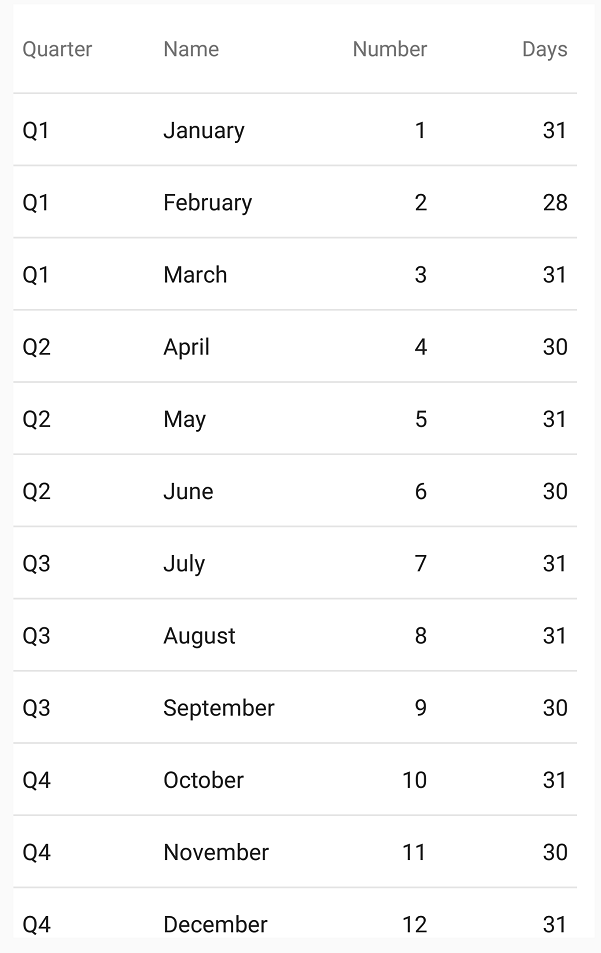

////
|metadata|
{
    "name": "datagrid-binding-local-data-source",
    "controlName": ["{DataGridName}"],
    "tags": [],
    "guid": "","buildFlags": [],
    "createdOn": "2017-03-05T19:09:59.9912322Z"
}
|metadata|
////

= Binding Local Data Source in {DataGridName}

This topic is designed to familiarize you with the concept of binding local data source, as it relates to the link:{DataGridLink}.{DataGridName}.html[{DataGridName}] control.
 
== In this topic

This topic contains the following sections

* <<_Background,Required Background>>
* <<_LocalData,Local Data>> 
* <<_BindingRData,Binding Data>> 
* <<RelatedContent,Related Content>>

[[Background]]   
== Required Background 

The following topics are prerequisites to understanding this topic:

[options="header", cols="a,a"]
|====
|Topic|Purpose

| link:datagrid-getting-started-with-grid.html[Getting Started With {DataGridName}] 
| This topic provides basic steps required for adding the {DataGridName} control to your view and populating it with sample data. 
|====

[[_LocalData]]
== Local Data

This example shows implementation of a local data source that contains a simple collection of Month objects, with each object exposing several pick:[android="fields"]pick:[xaml="properties"], including: Number, Name, Days, and Quarter. This class also exposes a single static method that you will use to populate the {DataGridName} with Month objects.

ifdef::android[]
*In Java:*
[source, java]
----
package com.infragistics.samplegridapp;
import java.util.ArrayList;

public class Month 
{
    public Month() 
    {
    }
    public String Name;
    public String Quarter;
    public int Number;
    public int Days;
    
    public static ArrayList<Month> GenerateList()
    {
        String[] names = {
            "January", "February", "March", "April", 
            "May", "June", "July", "August", "September", 
            "October", "November", "December"
        }; 
        int[] days = {
            31, 28, 31, 30, 31, 30, 31, 31, 30, 31, 30, 31
        };
        ArrayList<Month> items = new ArrayList<Month>();
        
        for (int i = 0; i < 12; i++) {
            Month monthItem = new Month();
            monthItem.Name = names[i];
            monthItem.Days = days[i];
            monthItem.Number = i+1;
            monthItem.Quarter = "Q" + ((i/3)+1);
            items.add(monthItem);
        }
        return items;
    }
}
----
endif::android[]

ifdef::xaml[]
*In C#:*
[source, csharp]
----
using System.Collections.Generic;

namespace Infragistics.Data
{
    public class MonthsList : List<Month>
    {
        public MonthsList()
        {
            var list = Month.GenerateList();
            this.AddRange(list);
        }
    }
    public class Month
    {
        public Month()
        {
        }
        public string Name { get; set; }
        public int Number { get; set; }
        public int Days { get; set; }
        public string Quarter { get; set; }

        public static List<Month> GenerateList()
        {
            string[] names = {
                "January", "February", "March", "April",
                "May", "June", "July", "August", "September",
                "October", "November", "December"
            };
            int[] days = {
                31, 28, 31, 30, 31, 30, 31, 31, 30, 31, 30, 31
            };
            var items = new List<Month>();
            for (int i = 0; i < 12; i++)
            {
                Month monthItem = new Month();
                monthItem.Name = names[i];
                monthItem.Days = days[i];
                monthItem.Number = i + 1;
                monthItem.Quarter = "Q" + ((i / 3) + 1);
                items.Add(monthItem);
            }
            return items;
        }
    }
}
----
endif::xaml[]

[[_BindingRData]]
== Binding Data

[start=1]
. Create a new class file in your project and call it *Month* and paste the above implementation of the `Month` class into this new class file, replacing its contents.

[start=2]
. Create an instance of the `{DataGridName}` control in main view of your project and use its 
link:{DataGridLink}.{DataGridName}{ApiProp}{ApiDataSource}.html[{ApiDataSource}] {ApiMember} to populate it with sample data as demonstrated in the following sample code.
 
ifdef::android[]
*In Java:*
[source, java]
----
import com.infragistics.controls.*;
...
{DataGridName} DataGrid = new {DataGridName}(this);
DataGrid.setAutoGenerateColumns(false);
DataGrid.setDataSource(Month.GenerateList());  
----
endif::android[]

ifdef::xaml[]
*In XAML:*
[source, xaml]
----
xmlns:grids="clr-namespace:Infragistics.XamarinForms.Controls.Grids;assembly=Infragistics.XF.DataGrid"
xmlns:local="clr-namespace:Infragistics.Data;assembly=YourAppName" 
...
<grids:XamDataGrid x:Name="DataGrid" AutoGenerateColumns="False" >
    <grids:XamDataGrid.ItemsSource>
        <local:MonthsList />
    </grids:XamDataGrid.ItemsSource>          
</grids:XamDataGrid>
----
endif::xaml[]

ifdef::xaml[]
*In C#:*
[source, csharp]
----
using {DataGridNamespace};
using Infragistics.Data;
...
var DataGrid = new {DataGridName}();
DataGrid.AutoGenerateColumns = false;
DataGrid.ItemsSource = Month.GenerateList();  
----
endif::xaml[]

[start=3]
. Create two instances of the `TextColumn` for string properties and two instances of `NumericColumn` for numeric properties of data items.

ifdef::android[]
*In Java:*
[source, java]
----
TextColumn column1 = new TextColumn();
column1.setKey("Quarter");
TextColumn column2 = new TextColumn();
column2.setKey("Name");

NumericColumn column3 = new NumericColumn();
column3.setKey("Number");
NumericColumn column4 = new NumericColumn();
column4.setKey("Days");

DataGrid.addColumn(column1);
DataGrid.addColumn(column2);
DataGrid.addColumn(column3); 
DataGrid.addColumn(column4); 
----
endif::android[]

ifdef::xaml[]
*In XAML:*
[source, xaml]
----
<grids:XamDataGrid.Columns>  
    <grids:TextColumn PropertyPath="Quarter" /> 
    <grids:TextColumn PropertyPath="Name" /> 
    <grids:NumericColumn PropertyPath="Number" /> 
    <grids:NumericColumn PropertyPath="Days" /> 
</grids:XamDataGrid.Columns>                
----
endif::xaml[]

ifdef::xaml[]
*In C#:*
[source, csharp]
----
var column1 = new TextColumn();
column1.PropertyPath = "Quarter"; 
var column2 = new TextColumn();
column2.PropertyPath = "Name"; 

var column3 = new NumericColumn();
column3.PropertyPath = "Number"; 
var column4 = new NumericColumn();
column3.PropertyPath = "Days"; 
  
DataGrid.Columns.Add(column1);
DataGrid.Columns.Add(column2);
DataGrid.Columns.Add(column3);
DataGrid.Columns.Add(column4);
----
endif::xaml[]
 
[start=4]
. Save and run your application to verify the result.

Your application will display a {DataGridName} control that contains four link:{DataGridLink}.column.html[Column] types: Name, Number, Days and Quarter and will be populated with 12 rows, each representing one Month object.

[[RelatedContent]]   
=== Related Content

The following table lists topics that are related to this topic:

[options="header", cols="a,a"]
|====
|Topic|Purpose
 
| link:datagrid-supported-column-types.html[Supported Column Types]
|This topic provides information on supported column types in the {DataGridName} control.
  
| link:datagrid-working-with-columns.html[Working with Columns]
|This topic provides code examples on working with columns in the {DataGridName} control.

| link:datagrid-binding-remote-data-source.html[Binding Remote Data Source in {DataGridName}]
|This topic provides code examples on binding remote data to the {DataGridName} control.

|====