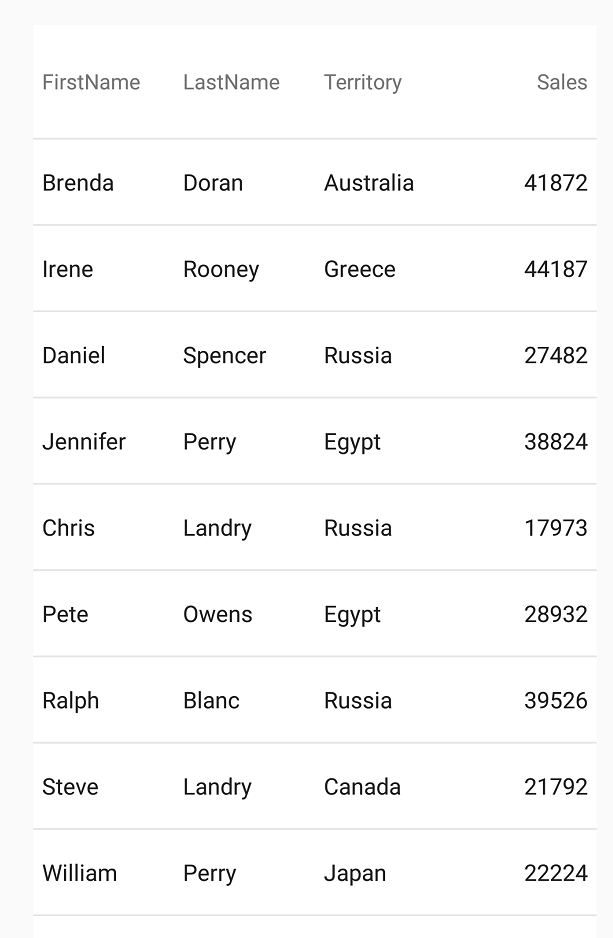

////
|metadata|
{
    "name": "datagrid-getting-started-with-grid",
    "controlName": ["{DataGridName}"],
    "tags": [],
    "guid": "","buildFlags": [],
    "createdOn": "2017-02-05T19:08:29.1330392Z"
}
|metadata|
////

= Getting Started with {DataGridName}

This topic is designed to get you up and running as quickly as possible by describing the basic steps required for adding the link:{DataGridLink}.{DataGridName}.html[{DataGridName}] control to your view and populating it with sample data.
 
=== Overview
This topic contains the following sections

* <<RequiredBackground,Required Background>> 
* <<PreparingProject,Preparing Project>>
* <<CreatingControl,Creating the {DataGridName}>>
* <<VerifyResults,Verify Results>>
* <<RelatedContent,Related Content>>

[[RequiredBackground]]   
=== Required Background

The following topics are prerequisites to understanding this topic:

[options="header", cols="a,a"]
|====
|Topic|Purpose

ifdef::xaml[]
| link:xamarin-project-with-infragistics-controls.html[Creating Project with Infragistics Controls] 
|The _{DataGridName}_ control requires NuGet packages for {ProductName} controls and this article provides instructions how to add them to your project.
endif::xaml[]
 
ifdef::android[]
| link:android-project-with-infragistics-controls.html[Creating Project with Infragistics Controls] 
|The _{DataGridName}_ control requires library files for {ProductName} controls and this article provides instructions how to add them to your project.
endif::android[]
|====
 
[[PreparingProject]]
=== Preparing Project

[start=1]
. Create a new class file in your project and name it SampleSalesPerson; this class will be used to generate sample data.

[start=2]
. Replace content of your SampleSalesPerson class file with the source code from the link:SampleSalesPerson.html[SampleSalesPerson] resource.

[start=3]
. Import the following namespace to your view:

ifdef::android[]
*In Java:*
[source, java]
----
import com.infragistics.controls.*;
----
endif::android[]

ifdef::xamarin[]
*In XAML:*
[source, xaml]
----
xmlns:grids="clr-namespace:Infragistics.XamarinForms.Controls.Grids;assembly=Infragistics.XF.DataGrid"
xmlns:local="clr-namespace:Infragistics.Data;assembly=YourAppName" 
----
endif::xamarin[]

ifdef::xaml[]
*In C#:*
[source, csharp]
----
using {DataGridNamespace};
using Infragistics.Data;
----
endif::xaml[]

[[CreatingControl]]
=== Creating the {DataGridName}

Create an instance of the {DataGridName} control within the main view, and use its 
link:{DataGridLink}.{DataGridName}~{ApiDataSource}.html[{ApiDataSource}] {ApiMember} to populate it with sample data as demonstrated in the following sample code.

ifdef::android[]
*In Java:* 
[source, java]
----  
{DataGridName} DataGrid = new {DataGridName}(this);
DataGrid.setDataSource(SampleSalesPerson.GenerateSalesData(100)); 
----
endif::android[]

ifdef::xaml[]
*In XAML:*
[source, xaml]
----
<grids:XamDataGrid x:Name="DataGrid" >
    <grids:XamDataGrid.ItemsSource>
        <local:SampleSalesTeam />
    </grids:XamDataGrid.ItemsSource>          
</grids:XamDataGrid>
----
endif::xaml[]

ifdef::xaml[]
*In C#:*
[source, csharp]
----
var DataGrid = new {DataGridName}();
DataGrid.ItemsSource = SampleSalesPerson.GenerateSalesData(100);
----
endif::xaml[]

[[VerifyResults]]
=== Verify Results

Save and run your application to verify the result, it should appear similar, (barring differences in screen orientation and resolution) to the screenshot below.

[[RelatedContent]]   
=== Related Content

The following table lists topics that are related to this topic:

[options="header", cols="a,a"]
|====
|Topic|Purpose
 
| link:datagrid-supported-column-types.html[Supported Column Types]
|This topic provides information on supported column types in the {DataGridName} control.
  
| link:datagrid-working-with-columns.html[Working with Columns]
|This topic provides code examples on working with columns in the {DataGridName} control.
|====