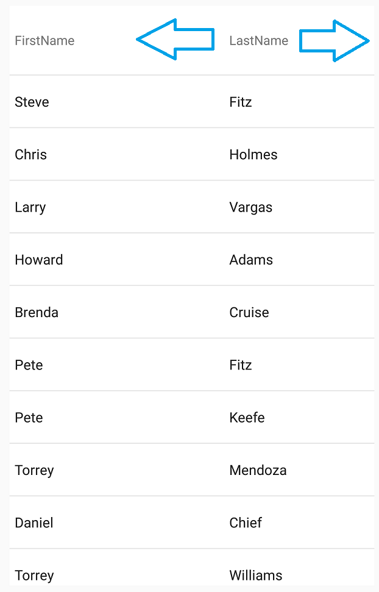

////
|metadata|
{
    "name": "datagrid-horizontal-scrolling",
    "controlName": ["{DataGridName}"],
    "tags": [],
    "guid": "ac75eaa6-4352-4e39-a4db-8b58099b0b6a","buildFlags": [],
    "createdOn": "2016-02-12T15:47:09.7639577Z"
}
|metadata|
////

= Horizontal Scrolling

This topic is designed to quickly familiarize you with the link:{DataGridLink}.{DataGridName}.html[{DataGridName}] control's Horizontal Scrolling feature.

== In this topic

This topic contains the following sections

* <<Requirements,Required Background >>
* <<Overview,Overview>>
* <<ScrollingOnAutoGeneratedColumns,Scrolling On Auto-Generated Columns>>
* <<ScrollingOnPredefinedColumns,Scrolling On Predefined Columns>>
* <<Conclusion,Conclusion>>
* <<RelatedContent,Related Content>>

[[Requirements]]   
== Required Background 

The following topics are prerequisites to understanding this topic:

[options="header", cols="a,a"]
|====
|Topic|Purpose

| link:datagrid-getting-started-with-grid.html[Getting Started With {DataGridName}] 
| This topic provides basic steps required for adding the {DataGridName} control to your view and populating it with sample data. 

| link:SampleSalesPerson.html[Sample Sales Person] 
| This resource topic provides implementation of sample data that you can use a data source for the {DataGridName} control. 

|====
[[Overview]]
== Overview:

Horizontal Scrolling allows you to include content on the {DataGridName} control that would otherwise exceed the actual width of the {DataGridName} control; this is made possible by including a Horizontal Scrolling feature.

Horizontal scrolling behavior is virtually identical to the vertical scrolling ability that is used to “scroll down” a page to view content, (for example, such as rows) that is present below the current viewable area.
 

[[ScrollingOnAutoGeneratedColumns]]
== Scrolling On Auto-Generated Columns

This example assigns an instance of the link:{DataGridLink}.ColumnWidth.html[ColumnWidth] class to the link:{DataGridLink}.{DataGridName}{ApiProp}DefaultColumnWidth.html[pick:[android="set"]DefaultColumnWidth] {ApiMember} of all auto-generated columns in the {DataGridName} control.

ifdef::android[]
*In Java:*
[source, java]
----
ColumnWidth columnWidth = new ColumnWidth();
columnWidth.setValue(300);

DataGrid.setAutoGenerateColumns(true);
DataGrid.setDefaultColumnWidth(columnWidth);
----
endif::android[]

ifdef::xaml[]
*In XAML:*
[source, xaml]
----
<ig:XamDataGrid x:Name="DataGrid" AutoGenerateColumns="True" DefaultColumnWidth="300" />
----
endif::xaml[]

ifdef::xaml[]
*In C#:*
[source, csharp]
----
var columnWidth = new ColumnWidth { IsStarSized = false, Value = 300 };

DataGrid.AutoGenerateColumns = true;
DataGrid.DefaultColumnWidth = columnWidth;
----
endif::xaml[]

[[ScrollingOnPredefinedColumns]]
== Scrolling On Predefined Columns

The following example demonstrates how to implement horizontal sorting on grid columns that you defined in the link:{DataGridLink}.{DataGridName}{ApiPropGet}Columns.html[pick:[android="set"]Columns] collection of {DataGridName} control. In this scenario, the {DataGridName} control is bound to data containing three link:{DataGridLink}.Column_members.html[Column] objects: FirstName, LastName, and Territory; which have been manually defined and have been given a sufficient width such that they effectively exceed the visible width of the {DataGridName} control.

This example assigns an instance of the link:{DataGridLink}.ColumnWidth.html[ColumnWidth] class to all manually defined link:{DataGridLink}.Column_members.html[Column] objects in the {DataGridName} control using their link:{DataGridLink}.column{ApiProp}Width.html[pick:[android="set"]Width] {ApiMebmer}.  

.Note
[NOTE]
====
You can set the column width to any other types of columns in {DataGridName} control, the same way it is demonstrated with link:{DataGridLink}.TextColumn_members.html[TextColumn] object.
====
 
ifdef::android[]
*In Java:*
[source, java]
----
TextColumn column1 = new TextColumn();
column1.setKey("FirstName");
column1.setTitle("FirstName");

TextColumn column2 = new TextColumn();
column2.setKey("LastName");
column2.setTitle("LastName");

TextColumn column3 = new TextColumn();
column3.setKey("Territory");
column3.setTitle("Territory");

ColumnWidth columnWidth = new ColumnWidth();
columnWidth.setValue(300);

column1.setWidth(columnWidth);
column2.setWidth(columnWidth);
column3.setWidth(columnWidth);

DataGrid.setAutoGenerateColumns(false);
DataGrid.addColumn(column1);
DataGrid.addColumn(column2);
DataGrid.addColumn(column3); 
----
endif::android[]

ifdef::xaml[]
*In XAML:*
[source, xaml]
----
<ig:XamDataGrid x:Name="DataGrid" AutoGenerateColumns="False" >
    <ig:XamDataGrid.Columns>  
        <ig:TextColumn HeaderText="FirstName" PropertyPath="FirstName" Width="300" /> 
        <ig:TextColumn HeaderText="LastName" PropertyPath="LastName" Width="300" /> 
        <ig:TextColumn HeaderText="Territory" PropertyPath="Territory" Width="300"  /> 
    </ig:XamDataGrid.Columns>                
</ig:XamDataGrid>
----
endif::xaml[]

ifdef::xaml[]
*In C#:*
[source, csharp]
----
TextColumn column1 = new TextColumn();
column1.PropertyPath = "FirstName";
column1.HeaderText = "FirstName";

TextColumn column2 = new TextColumn();
column2.PropertyPath = "LastName";
column2.HeaderText = "LastName";

TextColumn column3 = new TextColumn();
column3.PropertyPath = "Territory";
column3.HeaderText = "Territory";

var columnWidth = new ColumnWidth { IsStarSized = false, Value = 300 };

column1.Width = columnWidth;
column2.Width = columnWidth;
column3.Width = columnWidth;

DataGrid.AutoGenerateColumns = false;
DataGrid.Columns.Add(column1);
DataGrid.Columns.Add(column2);
DataGrid.Columns.Add(column3);
----
endif::xaml[]

[[Conclusion]]
== Conclusion

Both code examples will enable horizontal scrolling of columns, once you start scrolling left or right within the {DataGridName} control.

[[RelatedContent]]   
=== Related Content

The following table lists topics that are related to this topic:

[options="header", cols="a,a"]
|====
|Topic|Purpose
 
| link:datagrid-supported-column-types.html[Supported Column Types]
|This topic provides information on supported column types in the {DataGridName} control.
  
| link:datagrid-working-with-columns.html[Working with Columns]
|This topic provides code examples on working with columns in the {DataGridName} control.
|====