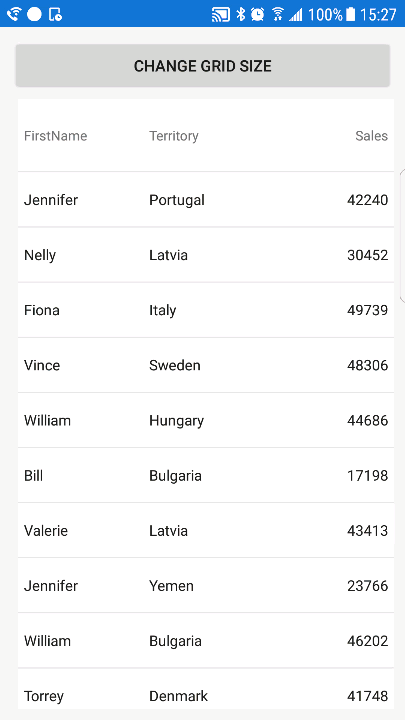
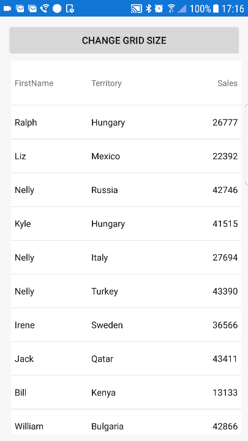

////
|metadata|
{
    "name": "datagrid-responsive-layout-on-grid-resize",
    "controlName": ["{DataGridName}"],
    "tags": [],
    "guid": "","buildFlags": [],
    "createdOn": "2017-02-05T19:11:09.6948794Z"
}
|metadata|
////

= Responsive Layout On Neighbor Resize

This topic is designed to help you understand the concept of responsive layout when a neighboring layout of the link:{DataGridLink}.{DataGridName}.html[{DataGridName}] control is resizing.
  
== Overview

This topic contains the following sections:
 
* <<_Requirements,Required Background>>
* <<_Introduction,Introduction>>
ifdef::xamarin[]  
* <<_Prepare_Application,Prepare Application >>
endif::xamarin[] 
* <<_Responsive_Layout_Example,Responsive Layout Example>>
* <<_Responsive_Layout_Preview,Responsive Layout Preview>>
* <<_Responsive_Layout_Animations,Responsive Layout Animations>>
* <<_RelatedContent,Related Content>>

[_Requirements]]   
== Required Background 

The following topics are prerequisites to understanding this topic:

[options="header", cols="a,a"]
|====
|Topic|Purpose

| link:datagrid-getting-started-with-grid.html[Getting Started With {DataGridName}] 
| This topic provides basic steps required for adding the {DataGridName} control to your view and populating it with sample data. 
 
| link:datagrid-responsive-layout-on-grid-rotation.html[Responsive Layout on Grid Rotation] 
| This topic provides information how to implement responsive layout on rotation of the {DataGridName} control.
 
|====
  
[[_Introduction]]
== Introduction 

It may be necessary to modify the width of the `{DataGridName}` control in your application, due to changes in the dimensions of neighboring layout(s); in such a scenario, you should ensure that the data in your application is presented in such a way that allows for legibility as well as maintaining aesthetics. This example will walk you through the process of implementing a  responsive layout behavior with the {DataGridName} control to respond to the conditions in this scenario. The sample will use a `Button` to change the width of the {DataGridName} control, (by modifying the width of a neighboring view); in response, you will apply the `ResponsiveState` objects to hide low priority columns from view, (Territory and Sales columns) for maintaining readability for critical data, (Name column).

ifdef::xamarin[]  
[[_Prepare_Application]]
== Prepare Application 

Before implementing responsive layout behavior, you need to prepare your application projects and save parameters of device's screen because they will be later used to define `ResponsiveState` objects of the {DataGridName} control.

[start=1]
. In the *Portable* application project, add this code to define parameters of device's screen:

*In C#:*
[source, csharp]
----
public partial class App : Application
{
    static public int ScreenWidth;
    static public int ScreenHeight;
    static public float ScreenDensity = 1;
    ...
}
----

[start=2]
. In the *.Droid* application project, add this code to save parameters of device's screen:

*In C#:*
[source, csharp]
----
public class MainActivity : FormsAppCompatActivity
{
    protected override void OnCreate(Bundle bundle)
    {
        App.ScreenDensity = Resources.DisplayMetrics.Density;
        App.ScreenWidth   = Resources.DisplayMetrics.WidthPixels;
        App.ScreenHeight  = Resources.DisplayMetrics.HeightPixels;
        ...
    }
}
----

[start=3]
. In the *.iOS* application project, add this code to save parameters of device's screen:

*In C#:*
[source, csharp]
----
public partial class AppDelegate : FormsApplicationDelegate
{
    public override bool FinishedLaunching(UIApplication app, NSDictionary options)
    {
        App.ScreenWidth  = (int)UIScreen.MainScreen.Bounds.Width;
        App.ScreenHeight = (int)UIScreen.MainScreen.Bounds.Height; 
        ...
    }
}
----
endif::xamarin[]

[[_Responsive_Layout_Example]]
== Responsive Layout Example

You will need to set up the layouts for the application; this sample uses several nested layouts for controlling and illustrating the {DataGridName} control’s reaction to various width densities by modifying the width of neighbour layouts.

The following diagram illustrates the arrangement of these layouts for clarification:

image::images/Responsive_Layout_On_Neighbor_Resize_1.png[]
  
[start=1]
. Add the following code to your main view to create above layouts with one `{DataGridName}` control that will resize in response to changing size of the `LeftGutter` when a `Button` is clicked.

ifdef::android[]
*In Java:* 
[source, java]
---- 
final TextColumn nameColumn = new TextColumn();
nameColumn.setKey("FirstName");
final TextColumn territoryColumn = new TextColumn();
territoryColumn.setKey("Territory");
final NumericColumn salesColumn = new NumericColumn();
salesColumn.setKey("Sales");

{DataGridName} DataGrid = new {DataGridName}(this);
DataGrid.setAutoGenerateColumns(true);
DataGrid.setDataSource(new SampleSalesTeam());
DataGrid.addColumn(nameColumn);
DataGrid.addColumn(territoryColumn);
DataGrid.addColumn(salesColumn); 

Button button = new Button(this);
button.setText("Adjust Grid Width");
   
final FrameLayout LeftGutter = new FrameLayout(this);
LeftGutter.setMinimumWidth(0);
LeftGutter.setMinimumHeight(100);
 
LinearLayout ContentLayout = new LinearLayout(this);
ContentLayout.setOrientation(LinearLayout.HORIZONTAL);
ContentLayout.addView(LeftGutter);
ContentLayout.addView(DataGrid);

LinearLayout RootLayout = new LinearLayout(this);
RootLayout.setOrientation(LinearLayout.VERTICAL);
RootLayout.addView(Button);
RootLayout.addView(ContentLayout);
setContentView(RootLayout);
----
endif::android[]

ifdef::xamarin[]
*In XAML:*
[source, xaml]
----
<Grid x:Name="RootLayout" Margin="10"  >
    <Grid.RowDefinitions>
        <RowDefinition Height="Auto" />
        <RowDefinition Height="*" />
    </Grid.RowDefinitions>
    
    <Button x:Name="Button" Text="Change Grid Size"/>
    
    <Grid x:Name="ContentLayout" Grid.Row="1">
        <Grid.ColumnDefinitions>
            <ColumnDefinition Width="Auto" />
            <ColumnDefinition Width="*" />
        </Grid.ColumnDefinitions> 
        
        <Grid x:Name="LeftGutter" Grid.Column="0"
               MinimumWidthRequest="0" 
               MinimumHeightRequest="100"
               BackgroundColor="#FFCBCBCB" />
               
        <ig:XamDataGrid x:Name="DataGrid" Grid.Column="1" 
                        AutoGenerateColumns="False">
            <ig:XamDataGrid.ItemsSource>
                <local:SampleSalesTeam />
            </ig:XamDataGrid.ItemsSource>
            <ig:XamDataGrid.Columns>
                <ig:TextColumn PropertyPath="FirstName" />
                <ig:TextColumn PropertyPath="Territory" />
                <ig:NumericColumn PropertyPath="Sales"  />
            </ig:XamDataGrid.Columns> 
        </ig:XamDataGrid>
    </Grid>
</Grid>
----
endif::xamarin[] 

ifdef::wpf[]  
*In XAML:*
[source, xaml]
----
// TODO add XAML code snippet for WPF
----
endif::wpf[]
  
[start=2]
. Create five variables of type `int` for storing width dimensions of `LeftGutter` and the `DataGrid`: 
 
The {DataGridName} control will be responding to changes in its width; these changes in width are the result of the changing width of a neighboring layout. This scenario will toggle between three discrete widths for this neighboring layout as a percentage of the total width of the screen, for this example they will include 0%, 25% and 50%; the {DataGridName} control in response will have its width reduced to the remaining screen widths of 100%, 75% and 40%, respectively for these three states.

The `LeftGutterWidth25` and `LeftGutterWidth50` variables will be used to calculate and store the value in pixels of 25% and 50% of the maximum width of the screen which is stored using the `ContentMaxWidth` variable.

The `DataGridWidth1` and `DataGridWidth2` variables will be used to calculate and store the remaining available screen width that the {DataGridName} control will assume after it is resized, these values are necessary for setting the range values for the ResponsiveStates.

ifdef::android[]
*In Java:* 
[source, java]
----
final int ContentMaxWidth = getResources().getDisplayMetrics().widthPixels;
final int LeftGutterWidth25 = (int)(ContentMaxWidth * .25);
final int LeftGutterWidth50 = (int)(ContentMaxWidth * .50);
final int DataGridWidth1 = ContentMaxWidth - LeftGutterWidth25;
final int DataGridWidth2 = ContentMaxWidth - LeftGutterWidth50;
----
endif::android[]

ifdef::xamarin[]  
[source, csharp]
----
static int ContentMaxWidth = (int)(App.ScreenWidth / App.ScreenDensity);
static int LeftGutterWidth25 = (int)(ContentMaxWidth * .25);
static int LeftGutterWidth50 = (int)(ContentMaxWidth * .50);
static int DataGridWidth1 = ContentMaxWidth - LeftGutterWidth25;
static int DataGridWidth2 = ContentMaxWidth - LeftGutterWidth50;
---- 
endif::xamarin[] 

ifdef::wpf[]  
*In C#:*
[source, csharp]
----
// TODO add code snippet for WPF
----
endif::wpf[]

[start=3]
. Add the following code to handle *Click* event for the button that will toggle through three width values of the {DataGridName} control, (in incremental widths of 100%, 50% and 25%) which are relatively proportional to the total width available on the screen.

ifdef::android[]
*In Java:* 
[source, java]
----
button.setOnClickListener(new View.OnClickListener() 
{
    @Override public void onClick(View v) 
    {
        // Condition 1: if LeftGutter has its default width 
        // then set its width to LeftGutterStop: 25% of screen width 
        if (LeftGutter.getWidth() == 0) 
        {
            LeftGutter.setMinimumWidth(LeftGutterWidth25);
        }
        // Condition 2: if LeftGutter's width is equal to LeftGutterWidth25
        // then set its width to LeftGutterWidth50: 50% of screen width  
        else if (LeftGutter.getWidth() == LeftGutterWidth25) 
        {
            LeftGutter.setMinimumWidth(LeftGutterWidth50);
        }
        // Condition 3: if LeftGutter's width is equal to LeftGutterWidth50
        // then set its width to  default state of 0  
        else if (LeftGutter.getWidth() == LeftGutterWidth50) 
        {
            LeftGutter.setMinimumWidth(0);
        }
    }
});
----
endif::android[]

ifdef::xamarin[]  
*In C#:*
[source, csharp]
----
Button.Clicked += Button_Clicked;
...
private void Button_Clicked(object sender, EventArgs e)
{
    // Condition 1: if LeftGutter has its default width 
    // then set its width to LeftGutterStop: 25% of screen width
    if (LeftGutter.Width <= 0)
    {
        LeftGutter.WidthRequest = LeftGutterWidth25;
    }
    // Condition 2: if LeftGutter's width is equal to LeftGutterWidth25
    // then set its width to LeftGutterWidth50: 50% of screen width 
    else if (LeftGutter.Width == LeftGutterWidth25)
    {
        LeftGutter.WidthRequest = LeftGutterWidth50;
    }
    // Condition 3: if LeftGutter's width is equal to LeftGutterWidth50
    // then set its width to  default state of 0 
    else if (LeftGutter.Width == LeftGutterWidth50)
    {
        LeftGutter.WidthRequest = 0;
    }
}
----
endif::xamarin[]

ifdef::wpf[]  
*In C#:*
[source, csharp]
----
// TODO add code snippet for WPF
----
endif::wpf[]

[start=4]
. Add a helper method for creating link:{DataGridLink}.ResponsivePhase.html[ResponsivePhase] objects as is demonstrated in code below:

ifdef::android[]
*In Java:* 
[source, java]
---- 
private ResponsivePhase CreatePhase(string columnName, string propertyName, object value)
{
    var setter = new ColumnPropertySetter(columnName, propertyName, value);
    return new ResponsivePhase().addColumnPropertySetter(setter);
}
----
endif::android[]

ifdef::xaml[]  
*In C#:*
[source, csharp]
---- 
private ResponsivePhase CreatePhase(string columnName, string propertyName, object value)
{
    var setter = new ColumnPropertySetter()
    {
        ColumnName = columnName,
        PropertyName = propertyName,
        Value = value,
    }; 
    return new ResponsivePhase().AddColumnPropertySetter(setter);
}
----
endif::xaml[]

[start=5]
. Create the first link:{DataGridLink}.ResponsiveState.html[ResponsiveState] which will be used as the default state of the {DataGridName} control, prior to any adjustments to its width.

This responsive state will activate when the {DataGridName} control’s width is within the range of *DataGridWidth1* to *ContentMaxWidth* values and display the *Territory* and *Sales* columns.

ifdef::android[]
*In Java:* 
[source, java]
----
ResponsiveState state1 = new ResponsiveState(); 
state1.setMaximumWidth(TypedValue.COMPLEX_UNIT_PX, ContentMaxWidth);
state1.setMinimumWidth(TypedValue.COMPLEX_UNIT_PX, DataGridWidth1 + 1);
state1.addResponsivePhase(CreatePhase("Territory", "IsHidden", false));
state1.addResponsivePhase(CreatePhase("Sales", "IsHidden", false));
----
endif::android[]

ifdef::xaml[]  
*In C#:*
[source, csharp]
---- 
var state1 = new ResponsiveState();
state1.MaximumWidth = ContentMaxWidth;  
state1.MinimumWidth = DataGridWidth1 + 1; 
state1.AddResponsivePhase(CreatePhase("Territory", "IsHidden", false));
state1.AddResponsivePhase(CreatePhase("Sales", "IsHidden", false)); 
----
endif::xaml[]
 
[start=6]
. Create the second link:{DataGridLink}.ResponsiveState.html[ResponsiveState] which will be used when the {DataGridName} control is resized to a width range between *DataGridWidth1* and *DataGridWidth2* and hide the *Sales* column.

ifdef::android[]
*In Java:* 
[source, java]
----
ResponsiveState state2 = new ResponsiveState(); 
state2.setMaximumWidth(TypedValue.COMPLEX_UNIT_PX, DataGridWidth1);
state2.setMinimumWidth(TypedValue.COMPLEX_UNIT_PX, DataGridWidth2 + 1);
state2.addResponsivePhase(CreatePhase("Territory", "IsHidden", false));
state2.addResponsivePhase(CreatePhase("Sales", "IsHidden", true));
----
endif::android[]

ifdef::xaml[]  
*In C#:*
[source, csharp]
---- 
var state2 = new ResponsiveState();
state2.MaximumWidth = DataGridWidth1;  
state2.MinimumWidth = DataGridWidth2 + 1; 
state2.AddResponsivePhase(CreatePhase("Territory", "IsHidden", false));
state2.AddResponsivePhase(CreatePhase("Sales", "IsHidden", true)); 
----
endif::xaml[]

[start=6]
. Create the third link:{DataGridLink}.ResponsiveState.html[ResponsiveState] which will be used when the {DataGridName} control is resized to a width less than *DataGridWidth2* and hide both  *Territory* and *Sales* columns.

ifdef::android[]
*In Java:* 
[source, java]
----
ResponsiveState state3 = new ResponsiveState(); 
state3.setMaximumWidth(TypedValue.COMPLEX_UNIT_PX, DataGridWidth2);
state3.setMinimumWidth(0);
state3.addResponsivePhase(CreatePhase("Territory", "IsHidden", true));
state3.addResponsivePhase(CreatePhase("Sales", "IsHidden", true));
----
endif::android[]

ifdef::xaml[]  
*In C#:*
[source, csharp]
---- 
var state3 = new ResponsiveState();
state3.MaximumWidth = DataGridWidth2;  
state3.MinimumWidth = 0; 
state3.AddResponsivePhase(CreatePhase("Territory", "IsHidden", true));
state3.AddResponsivePhase(CreatePhase("Sales", "IsHidden", true)); 
----
endif::xaml[]

[start=7]
. Add all three `ResponsiveState` objects to the {DataGridName} control as shown in this code snippet:

ifdef::android[]
*In Java:* 
[source, java]
----
DataGrid.addResponsiveState(state1);
DataGrid.addResponsiveState(state2);
DataGrid.addResponsiveState(state3);
----
endif::android[]

ifdef::xaml[]  
*In C#:*
[source, csharp]
---- 
DataGrid.ResponsiveStates.Add(state1);
DataGrid.ResponsiveStates.Add(state2);
DataGrid.ResponsiveStates.Add(state3);
----
endif::xaml[]

[start=8]
. Save and run your application to verify the responsive layout behavior of the {DataGridName} control.

[[_Responsive_Layout_Preview]]
== Responsive Layout Preview

The following animated graphic demonstrates how the {DataGridName} control's layout responses when width of a neighboring layout (*LeftGutter*) changes three times. 

* Initially, the *LeftGutter* has zero width and the *DataGrid* shows all three columns, (*Name*, *Territory*, *Sales*) which represents the first responsive state. 
* Then width of *LeftGutter* increases to 25% of the screen's width; this triggers the second responsive state which hides the *Sales* column. 
* After another width increase, the *LeftGutter* occupies 50% of the screen's width and the third responsive state triggers hiding of the *Territory* column. 
* Finally, width of *LeftGutter* resets back to zero and the first responsive state triggers to show again both *Territory* and *Sales* columns.

[[_Responsive_Layout_Animations]]
== Responsive Layout Animations

You can also apply animations to the grid to show smooth transitions between responsive states. For example, applying fade out animation for column hiding operation in the data grid:
 
ifdef::android[]
*In Java:*
[source, java]
----
DataGrid.setColumnHidingAnimationMode(ColumnHidingAnimationMode.FADE_OUT);
----
endif::android[]

ifdef::xaml[]
*In XAML:*
[source, xaml]
----
<ig:XamDataGrid x:Name="DataGrid" ColumnHidingAnimationMode="FadeOut"> 
...
</ig:XamDataGrid>
----
endif::xaml[]

ifdef::xaml[]
*In C#:*
[source, csharp]
----
DataGrid.ColumnHidingAnimationMode = ColumnHidingAnimationMode.FadeOut;
----
endif::xaml[]

This animated graphic shows how the {DataGridName} control's layout responses with addition of animating column hide operation.

[[_RelatedContent]]   
== Related Content

The following table lists topics that are related to this topic:

[options="header", cols="a,a"]
|====
|Topic|Purpose

| link:datagrid-responsive-layout-on-grid-rotation.html[Responsive Layout on Grid Rotation}] 
| This topic provides information how to implement responsive layout on rotation of the {DataGridName} control.

| link:datagrid-animation.html[Animation]
| This topic provides information on applying with animations while performing operations on columns and rows of the {DataGridName} control.

| link:datagrid-supported-column-types.html[Supported Column Types]
|This topic provides information on supported column types in the {DataGridName} control.
  
| link:datagrid-working-with-columns.html[Working with Columns]
|This topic provides code examples on working with columns in the {DataGridName} control.

|====