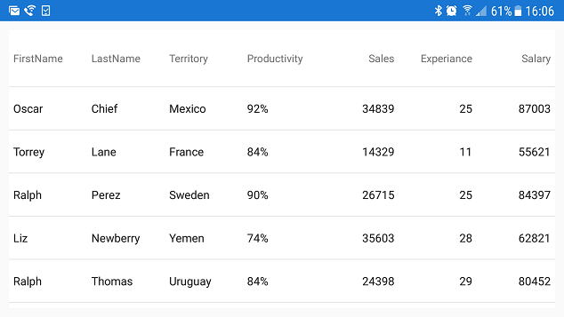

////
|metadata|
{
    "name": "datagrid-responsive-layout-on-grid-rotation",
    "controlName": ["{DataGridName}"],
    "tags": [],
    "guid": "","buildFlags": [],
    "createdOn": "2017-02-05T19:11:09.6948794Z"
}
|metadata|
////

= Responsive Layout On Grid Rotation

This topic is designed to help you understand the concept of responsive layout when the link:{DataGridLink}.{DataGridName}.html[{DataGridName}] control is rotated.
   

== Overview

This topic contains the following sections:

* <<_Introduction,Introduction>>
* <<_Preview,Preview>>
ifdef::xamarin[]  
* <<_Prepare_Application,Prepare Application >>
endif::xamarin[]
* <<_Example,Code Example>> 
* <<_RelatedContent,Related Content>>

[[_Introduction]]
== Introduction 

Responsive layouts allow you to react to scenarios in your application where horizontal screen real estate is significantly reduced, such as when a device is rotated from a horizontal to a vertical orientation; in such cases retaining all {DataGridName} columns in a visible state may impair both readability of data as well as reducing the aesthetics of an application. Therefore, columns which display less critical information may be removed from view, while still displaying columns which contain the most relevant data.

This behavior essentially allows you to orchestrate which columns should assume or maintain a visible state via the use of two or more link:{DataGridLink}.ResponsiveState.html[ResponsiveState] objects, each associated with a specific numeric range based on minimum and maximum widths of the screen, thus allowing you to react dynamically to any changes to screen width densities within the {DataGridName} control.
 

[[_Preview]]
== Preview 

The concept of responsive layout may be more easily understood by the following illustrations, which demonstrates a basic rotational layout scenario.

In the first screenshot, the {DataGridName} control is displayed in a horizontal orientation and it contains seven visible columns: *First Name*, *Last Name*, *Territory*, *Productivity*, *Sales*, *Experience*, and *Salary*.

In the second screenshot, the device has been rotated to the vertical orientation; as a result of the decrease in horizontal screen area, the width of the {DataGridName} control is also significantly reduced. All of the columns remain visible, having assumed a horizontally compressed appearance which not only makes discerning the presented data difficult by the user, but is also creating a generally unpleasant aesthetic and poor user experience:

However, with the responsive grid layout, this scenario may be reacted to by removing the least relevant columns (*Experience*, *Territory*, *Salary*) from view and redistributing the remaining columns to make use of this new space. 
 
image::images/Responsive_Layout_On_Grid_Rotation_3.png[]
 
ifdef::xamarin[]  
[[_Prepare_Application]]
== Prepare Application 

Before implementing responsive layout behavior, you need to prepare your application projects and save parameters of device's screen because they will be later used to define `ResponsiveState` objects of the {DataGridName} control.

[start=1]
. In the *Portable* application project, add this code to define parameters of device's screen:

*In C#:*
[source, csharp]
----
public partial class App : Application
{
    static public int ScreenWidth;
    static public int ScreenHeight;
    static public float ScreenDensity = 1;
    ...
}
----

[start=2]
. In the *.Droid* application project, add this code to save parameters of device's screen:

*In C#:*
[source, csharp]
----
public class MainActivity : FormsAppCompatActivity
{
    protected override void OnCreate(Bundle bundle)
    {
        App.ScreenDensity = Resources.DisplayMetrics.Density;
        App.ScreenWidth   = Resources.DisplayMetrics.WidthPixels;
        App.ScreenHeight  = Resources.DisplayMetrics.HeightPixels;
        ...
    }
}
----

[start=3]
. In the *.iOS* application project, add this code to save parameters of device's screen:

*In C#:*
[source, csharp]
----
public partial class AppDelegate : FormsApplicationDelegate
{
    public override bool FinishedLaunching(UIApplication app, NSDictionary options)
    {
        App.ScreenWidth  = (int)UIScreen.MainScreen.Bounds.Width;
        App.ScreenHeight = (int)UIScreen.MainScreen.Bounds.Height; 
        ...
    }
}
----
endif::xamarin[]

[[_Example]]
== Code Example

Rotating a device which is running your application may drastically alter the available horizontal area of the {DataGridName} control in your application, this example will walk you through the process of implementing design pattern for responsive layout on device rotation, with the {DataGridName} control to compensate for this condition.
 
 
[start=1]
. In your main view, implement 4 variables of type `int` to store dimension data for the device’s visible area, this data will be used to determine the device orientation.
 
ifdef::android[]
*In Java:*

[source, java]
----
int ContentWidth  = getResources().getDisplayMetrics().widthPixels;
int ContentHeight = getResources().getDisplayMetrics().heightPixels;
int ThresholdMax = Math.max(ContentHeight, ContentWidth);
int ThresholdMin = Math.min(ContentHeight, ContentWidth);
----
endif::android[]

ifdef::xamarin[]
*In C#*
[source, csharp]
----
static int ContentWidth = (int)(App.ScreenWidth / App.ScreenDensity);
static int ContentHeight = (int)(App.ScreenHeight / App.ScreenDensity);
static int ThresholdMax = Math.Max(ContentHeight, ContentWidth);
static int ThresholdMin = Math.Min(ContentHeight, ContentWidth);
----
endif::xamarin[]

ifdef::wpf[]
*In C#*
[source, csharp]
----
// TODO add code snippet
----
endif::wpf[]

[start=2]
. Create an instance of link:{DataGridLink}.{DataGridName}.html[{DataGridName}] control in your main view.

ifdef::android[]
*In Java:*
[source, java]
----
{DataGridName} DataGrid = new {DataGridName}(this);
DataGrid.setAutoGenerateColumns(true);
DataGrid.setDataSource(SampleSalesPerson.GenerateSalesData(300));

setContentView(DataGrid);
----
endif::android[]

ifdef::xaml[]
*In C#:*
[source, csharp]
----
var DataGrid = new {DataGridName}();
DataGrid.AutoGenerateColumns = true;
DataGrid.ItemsSource = SampleSalesPerson.GenerateSalesData(300);
----
endif::xaml[]

ifdef::xaml[]
*In XAML:*
[source, xaml]
----
<ig:XamDataGrid x:Name="DataGrid" AutoGenerateColumns="True">
    <ig:XamDataGrid.ItemsSource>
        <local:SampleSalesTeam />
    </ig:XamDataGrid.ItemsSource> 
</ig:XamDataGrid>
----
endif::xaml[]

[start=3]
. Add a helper method for creating link:{DataGridLink}.ResponsivePhase.html[ResponsivePhase] objects as is demonstrated in code below:

ifdef::android[]
*In Java:* 
[source, java]
---- 
private ResponsivePhase CreatePhase(string columnName, string propertyName, object value)
{
    var setter = new ColumnPropertySetter(columnName, propertyName, value);
    return new ResponsivePhase().addColumnPropertySetter(setter);
}
----
endif::android[]

ifdef::xaml[]  
*In C#:*
[source, csharp]
---- 
private ResponsivePhase CreatePhase(string columnName, string propertyName, object value)
{
    var setter = new ColumnPropertySetter()
    {
        ColumnName = columnName,
        PropertyName = propertyName,
        Value = value,
    }; 
    return new ResponsivePhase().AddColumnPropertySetter(setter);
}
----
endif::xaml[]

[start=4]
. Create an instance of the link:{DataGridLink}.ResponsiveState.html[ResponsiveState] class and define which columns should not be hidden in the landscape orientation as demonstrated in the following code snippet.

ifdef::android[]
*In Java:*

[source, java]
----
ResponsiveState state1 = new ResponsiveState();
state1.setName("Landscape State");
state1.setMaximumWidth(TypedValue.COMPLEX_UNIT_PX, ThresholdMax);
state1.setMinimumWidth(TypedValue.COMPLEX_UNIT_PX, ThresholdMin + 1); 
state1.AddResponsivePhase(CreatePhase("Salary", "IsHidden", false));
state1.AddResponsivePhase(CreatePhase("Territory", "IsHidden", false));
state1.AddResponsivePhase(CreatePhase("Experience", "IsHidden", false));
----
endif::android[]

ifdef::xaml[]
*In C#:*
[source, csharp]
---- 
var state1 = new ResponsiveState();
state1.Name = "Landscape State";
state1.MaximumWidth = ThresholdMax;  
state1.MinimumWidth = ThresholdMin + 1;
state1.AddResponsivePhase(CreatePhase("Salary", "IsHidden", false));
state1.AddResponsivePhase(CreatePhase("Territory", "IsHidden", false));
state1.AddResponsivePhase(CreatePhase("Experience", "IsHidden", false));
---- 
endif::xaml[]

[start=5]
. Next, create second instance of the link:{DataGridLink}.ResponsiveState.html[ResponsiveState] class and define which columns should be hidden in the portrait orientation as demonstrated in the following code snippet.

ifdef::android[]
*In Java:*

[source, java]
----
ResponsiveState state2 = new ResponsiveState();
state2.setName("Portrait State");
state2.setMaximumWidth(TypedValue.COMPLEX_UNIT_PX, ThresholdMin);
state2.setMinimumWidth(0); 
state2.AddResponsivePhase(CreatePhase("Salary", "IsHidden", true));
state2.AddResponsivePhase(CreatePhase("Territory", "IsHidden", true));
state2.AddResponsivePhase(CreatePhase("Experience", "IsHidden", true));
----
endif::android[]

ifdef::xaml[]
*In C#:*
[source, csharp]
---- 
var state2 = new ResponsiveState();
state2.Name = "Portrait State";
state2.MaximumWidth = ThresholdMin;  
state2.MinimumWidth = 0;
state2.AddResponsivePhase(CreatePhase("Salary", "IsHidden", true));
state2.AddResponsivePhase(CreatePhase("Territory", "IsHidden", true));
state2.AddResponsivePhase(CreatePhase("Experience", "IsHidden", true));
---- 
endif::xaml[]
   
  
[start=6]
. Add both `ResponsiveState` objects to the {DataGridName} control as shown in this code snippet:

ifdef::android[]
*In Java:* 
[source, java]
----
DataGrid.addResponsiveState(state1);
DataGrid.addResponsiveState(state2);
----
endif::android[]

ifdef::xaml[]  
*In C#:*
[source, csharp]
---- 
DataGrid.ResponsiveStates.Add(state1);
DataGrid.ResponsiveStates.Add(state2);
----
endif::xaml[]

    
[start=7]
. Save and run your application to verify the responsive layout behavior of the {DataGridName} control.

Orienting the device horizontally, (causing it to assume a landscape mode) the {DataGridName} control will display all 7 columns: *First Name*, *Last Name*, *Territory*, *Productivity*, *Sales*, *Experience*, and *Salary*.

[start=17]

Changing the device orientation from a horizontal to a vertical orientation will cause the device to assume portrait mode and the {DataGridName} control will hide *Experience*, *Territory*, and *Salary* columns from view and display only 4 columns as illustrated in the following image:

image::images/Responsive_Layout_On_Grid_Rotation_3.png[]

[[_RelatedContent]]   
=== Related Content

The following table lists topics that are related to this topic:

[options="header", cols="a,a"]
|====
|Topic|Purpose
 
| link:datagrid-responsive-layout-on-grid-resize.html[Responsive Layout on Grid Resize}] 
| This topic provides information how to implement responsive layout when a neighboring layout of the link:{DataGridLink}.{DataGridName}.html[{DataGridName}] control is resizing.

| link:datagrid-supported-column-types.html[Supported Column Types]
|This topic provides information on supported column types in the {DataGridName} control.
  
| link:datagrid-working-with-columns.html[Working with Columns]
|This topic provides code examples on working with columns in the {DataGridName} control.
|====