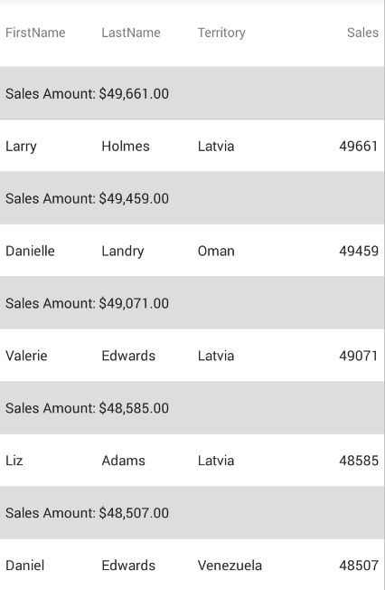

= Row Grouping

This topic will walk you through the process of implementing row grouping on the link:{DataGridLink}.{DataGridName}.html[{DataGridName}] control.

== In this topic

This topic contains the following sections:

* <<ReqBackground, Required Background>>
* <<Overview, Overview>>
* <<PropSettings, Property Settings>>
* <<GroupingExample, Grouping Rows - Code Example>>
* <<GroupFormattingExample, Formatting Grouped Rows - Code Example>>
* <<GroupingSplitExample, Split Grouped Rows - Code Example>>
* <<GroupStylingExample, Styling Grouped Rows - Code Example>>
* <<Related, Related Content>>

[[ReqBackground]]
== Required Background

|===
|Topic|Purpose

| link:datagrid-getting-started-with-grid.html[Getting Started With {DataGridName}] 
| This topic provides basic steps required for adding the {DataGridName} control to your view and populating it with sample data. 

|link:datagrid-sorting.html[Sorting {DataGridName}]
| This topic provides information to familiarize you with the sorting behaviors that can be implemented in the {DataGridName} control.

|===

[[Overview]]
== Overview

The {DataGridName} control has functionality to allow grouping of your rows by a property on your underlying data item. This is useful if you have duplicate data values for different records, and would like to see your records sectioned by the property path that contains those duplicate values.

You can do this by adding a link:{DataGridLink}.columngroupdescription.html[ColumnGroupDescription] element to the link:{DataGridLink}.{DataGridName}{ApiPropGet}groupdescriptions.html[GroupDescriptions] collection of the {DataGridName} and setting its `PropertyPath` property. You can use the constructor of the `ColumnGroupDescription` element to set the `PropertyPath` as well.

When grouping by multiple property-paths, you can customize the display of the row groupings by setting the `GroupHeaderDisplayMode` property. This property has two options - Combined and Split. The "Combined" option will place the multiple property-paths inline in the same grouped header, whereas the "Split" option will place the property-paths in separate, hierarchical headers based on the order of the groupings.

[[PropSettings]]
== Property Settings

By default, when you group by a particular property on your underlying data item, the group headers will show up as "Property Name: Property Value" for each property that you group by. You can modify the way that these group rows are shown by setting the following properties in the {DataGridName} control.

|===
|Property Name|Property Type|Description

|link:{DataGridLink}.{DataGridName}{ApiPropGet}sectionheader.html[SectionHeader]
|link:{DataGridLink}.sectionheader.html[SectionHeader]
|Allows you to modify the different styling properties of the {DataGridName} group headers.

You can also use a link:{DataGridLink}.templatesectionheader.html[TemplateSectionHeader] element to provide your own custom content for your group headers.

|link:{DataGridLink}.{DataGridName}{ApiPropGet}isgrouprowsticky.html[IsGroupRowSticky]
|`bool`
|When set to true, the group header will be fixed to the top as you scroll through the data rows associated with that particular group. When you get to a new group, that new group's section header will take the top spot.

|link:{DataGridLink}.{DataGridName}{ApiPropGet}groupheaderdisplaymode.html[GroupHeaderDisplayMode]
|link:{DataGridLink}.{DataGridName}{ApiPropGet}datasourcesectionheaderdisplaymode.html[DataSourceSectionHeaderDisplayMode]
|When grouping by multiple property-paths and set to "Combined", this will place the multiple property-paths inline in the same grouped header. The "Split" option will use a separate, hierarchical header for each property path.

|===

There are also properties and an event on the `ColumnGroupDescription` element that allow you to format the way that your groups appear in the grid. These properties are listed below:

|===
|Property Name|Property Type|Description

|link:{DataGridLink}.columnsortdescription{ApiProp}propertypath.html[PropertyPath]
|`string`
|The property on the underlying data item that will be grouped by. This does not necessarily need to be shown in the {DataGridName}.

|link:{DataGridLink}.columnsortdescription{ApiProp}sortdirection.html[SortDirection]
|link:{DataGridLinkBase}.listsortdirection.html[ListSortDirection]
|Determines whether the groups are in an ascending or descending sort direction.

|link:{DataGridLink}.columngroupdescription{ApiProp}displayname.html[DisplayName]
|`string`
|Gets or sets text that is displayed for the property that is grouped by. If left blank, the ColumnGroupDescription.PropertyPath will be shown.

|link:{DataGridLink}.columngroupdescription{ApiProp}valueformat.html[ValueFormat]
|`string`
|Gets or sets the format string for the grouped value.

|link:{DataGridLink}.columngroupdescription{ApiProp}formattext_ev.html[FormatText Event]
|link:{DataGridLink}.formatgrouptexteventhandler.html[FormatGroupTextEventHandler]
|This event fires when a particular group's value is being evaluated. The link:{DataGridLink}.formatgrouptexteventargs.html[FormatGroupTextEventArgs] arguments of this event allow you to set the final displayed text for a group header, overriding the `DisplayName` property. You can also view the group name, group value, and formatted value based upon the `ValueFormat` property using the `GroupName`, `GroupValue`, and `FormattedValue` properties of the event arguments, respectively.

|===

[[GroupingExample]]
== Grouping Rows - Code Example

The following example shows how to group rows in the {DataGridName} control. This, and the following code example use the link:samplesalesperson.html[SampleSalesPerson] data source.

*In XAML:*
[source, xaml]
----
xmlns:ig="clr-namespace:{DataGridNamespace};assembly={ApiPlatform}DataGrid"
...
<ig:{DataGridName} ItemsSource="{Binding}">
    <ig:{DataGridName}.GroupDescriptions>
        <ig:ColumnGroupDescription PropertyPath="Territory"/>
    </ig:{DataGridName}.GroupDescriptions>
</ig:{DataGridName}>
----

*In C#:*
[source,csharp]
----
{DataGridName} grid = new {DataGridName}() { ItemsSource = new SampleSalesTeam() };
grid.GroupDescriptions.Add(new ColumnGroupDescription("Territory"));
----

The above code snippets will result in a {DataGridName} that looks like the following:

image:images/datagrid_grouping_nostyle.png[]

[[GroupFormattingExample]]
== Formatting Grouped Rows - Code Example

The following example shows how to format the way the group headers are displayed using the `DisplayName`, `ValueFormat`, and `SortDirection` properties mentioned above.

*In XAML:*
[source, xaml]
----
xmlns:ig="clr-namespace:{DataGridNamespace};assembly={ApiPlatform}DataGrid"
...
<ig:{DataGridName} ItemsSource="{Binding}">
    <ig:{DataGridName}.GroupDescriptions>
        <ig:ColumnGroupDescription PropertyPath="Sales"
                                   DisplayName="Sales Amount"
                                   SortDirection="Descending"
                                   ValueFormat="C"/>
    </ig:{DataGridName}.GroupDescriptions>
</ig:{DataGridName}>
----

*In C#:*
[source, csharp]
----
{DataGridName} grid = new {DataGridName}() { ItemsSource = new SampleSalesTeam() };

ColumnGroupDescription desc = new ColumnGroupDescription("Sales");
desc.SortDirection = ListSortDirection.Descending;
desc.DisplayName = "Sales Amount";
desc.ValueFormat = "C";

grid.GroupDescriptions.Add(desc);
----

The above code snippet will result in a {DataGridName} that looks like the following:

[[GroupingSplitExample]]
== Split Grouped Rows - Code Example

The following example shows the result of a {DataGridName} with multiple groups with the `GroupHeaderDisplayMode` set to "Split." 

*In XAML:*
[source,xaml]
----
xmlns:ig="clr-namespace:{DataGridNamespace};assembly={ApiPlatform}DataGrid"
...
<ig:{DataGridName} x:Name="dataGrid" ItemsSource="{Binding}" GroupHeaderDisplayMode="Split">
    <ig:{DataGridName}.GroupDescriptions>
        <ig:ColumnGroupDescription PropertyPath="Territory"/>
        <ig:ColumnGroupDescription PropertyPath="FirstName" />
    </ig:{DataGridName}.GroupDescriptions>
</ig:{DataGridName}>
----

The above code snippet will result in a {DataGridName} that looks like the following:

image:images/datagrid_row_grouping_split.png[]

[[GroupStylingExample]]
== Styling Grouped Rows - Code Example

The following example shows how to style the way the group headers are shown using the link:{DataGridLink}.templatesectionheader.html[TemplateSectionHeader] with a link:https://developer.xamarin.com/guides/xamarin-forms/application-fundamentals/templates/data-templates/selector/[DataTemplateSelector].

*In XAML:*
[source, xaml]
----
xmlns:ig="clr-namespace:{DataGridNamespace};assembly={ApiPlatform}DataGrid"
xmlns:local="clr-namespace:MyAppNamespace
...
<ig:{DataGridName} ItemsSource="{Binding}">
    <ig:{DataGridName}.GroupDescriptions>
        <ig:ColumnGroupDescription PropertyPath="Territory"/>
    </ig:{DataGridName}.GroupDescriptions>
    <ig:{DataGridName}.SectionHeader>
        <ig:TemplateSectionHeader Background="Navy">
            <ig:TemplateSectionHeader.ContentTemplate>
                <local:GroupContentSelector/>
            </ig:TemplateSectionHeader.ContentTemplate>
        </ig:TemplateSectionHeader>
    </ig:{DataGridName}.SectionHeader>
</ig:{DataGridName}>
----

*In C#:*
[source,csharp]
----
{DataGridName} grid = new {DataGridName}() { ItemsSource = new SampleSalesTeam() };       
grid.GroupDescriptions.Add(new ColumnGroupDescription("Territory"));

TemplateSectionHeader header = new TemplateSectionHeader() { Background = new SolidColorBrush(Color.Navy) };
header.ContentTemplate = new GroupContentSelector();

grid.SectionHeader = header;
----

When using a DataTemplateSelector with the TemplateSectionHeader's ContentTemplate property, it is important to note that the `BindableObject` parameter of the OnSelectTemplate override will be the TemplateSectionHeader itself, while the "object item" parameter will be a `Dictionary<string, object>`, where the strings are the property names and the objects are the property values.

*In C#:*
[source,csharp]
----
public class GroupContentSelector : DataTemplateSelector
{
    protected override DataTemplate OnSelectTemplate(object item, BindableObject container)
    {
        System.Collections.Generic.Dictionary<string, object> dict = item as Dictionary<string, object>;
        KeyValuePair<string, object> itemPair = dict.First();

        DataTemplate template = new DataTemplate(() =>
        {
            Label label = new Label() { HorizontalTextAlignment = TextAlignment.Center, VerticalTextAlignment = TextAlignment.Center };
            label.TextColor = Color.White;                

            if(itemPair.Value != null)
            {
                label.Text = itemPair.Value.ToString();
            }

            return label;
        });

        return template;
    }
}
----

This above code snippet will result in a {DataGridName} that looks like the following:

image:images/datagrid_grouping_styled.png[]

[[Related]]
== Related Content

|===

|Topic|Purpose

|link:datagrid-row-pinning.html[Row Pinning]
|This topic details, with code examples, how to configure row pinning in the {DataGridName} control.

|===