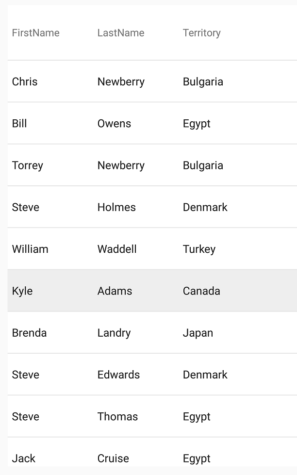

////
|metadata|
{
    "name": "datagrid-row-selection",
    "controlName": ["{DataGridName}"],
    "tags": [],
    "guid": "26254643-58cf-4fee-9342-8142850e1e3f","buildFlags": [],
    "createdOn": "2016-03-01T17:05:46.213579Z"
}
|metadata|
////

= Row Selection

This topic will walk you through the process of implementing row selection on the link:{DataGridLink}.{DataGridName}.html[{DataGridName}] control.

== In this topic
This topic contains the following sections

* <<Requirements,Required Background >>
* <<Overview,Overview>>
* <<_Ref444597611,Single Row Selection>>
* <<_Ref444597620,Multiple Row Selection>>
* <<_Ref444597625,Working with Selected Rows>>
* <<_Ref444513251,Selecting Rows by Items>>
* <<_Ref444534896,Selecting Rows via Keys of Item>>
* <<RelatedContent,Related Content>>

[[Requirements]]   
== Required Background 

The following topics are prerequisites to understanding this topic:

[options="header", cols="a,a"]
|====
|Topic|Purpose

| link:datagrid-getting-started-with-grid.html[Getting Started With {DataGridName}] 
| This topic provides basic steps required for adding the {DataGridName} control to your view and populating it with sample data. 

| link:SampleSalesPerson.html[Sample Sales Person] 
| This resource topic provides implementation of sample data that you can use a data source for the {DataGridName} control. 

|====
[[Overview]]   
== Overview

The {DataGridName} control allows three modes of selection for its rows, all of which are implemented by using the link:{DataGridLink}.{DataGridName}{ApiProp}SelectionMode.html[pick:[android="set"]SelectionMode] {ApiMember}, exposed by the {DataGridName} control:

* Single Row - select single row
* Multiple Row - select multiple rows
* None - prevents selection of rows

 
[[_Ref444597611]]
== Single Row Selection:

[start=1]
. Set selection to single row, as demonstrated in the following code snippet.

ifdef::android[]
*In Java:*
[source, java]
----
DataGrid.setSelectionMode(GridSelectionMode.SINGLE_ROW);
----
endif::android[]

ifdef::xaml[]
*In XAML:*
[source, xaml]
----
<ig:XamDataGrid x:Name="DataGrid" SelectionMode="SingleRow" />
----

*In C#:*
[source, csharp]
----
DataGrid.SelectionMode = GridSelectionMode.SingleRow;
----
endif::xaml[]

[start=2]
. Verify the result; the {DataGridName} control should now respond to touch input upon any of its rows by applying a selected highlighting, upon selecting a different row via touch input, the selection highlighting will be applied to that row; only the currently selected row will be displayed with an active appearance.

The following screenshot demonstrates a grid with a single row selected.

image::images/GridSelectionMode-Final_1.png[]

[[_Ref444597620]]
== Multiple Row Selection:

[start=1]
. Set selection to multiple row, as demonstrated in the following code snippet.

ifdef::android[]
*In Java:*
[source, java]
----
DataGrid.setSelectionMode(GridSelectionMode.MULTIPLE_ROW);
----
endif::android[]

ifdef::xaml[]
*In XAML:*
[source, xaml]
----
<ig:XamDataGrid x:Name="DataGrid" SelectionMode="MultipleRow" />
----

*In C#:*
[source, csharp]
----
DataGrid.SelectionMode = GridSelectionMode.MultipleRow;
----
endif::xaml[]

[start=2]
. Verify the result; the {DataGridName} control will now respond to touch input upon any of its rows by applying a selected highlighting to any number of its rows; highlighting for selected rows will only be removed if those rows are selected once more via touch input.

The following screenshot illustrates this behavior, individual row selection is now independent of previously selected rows and multiple rows may not have their selected appearance applied simultaneously.

[[_Ref444597625]]
== Working with Selected Rows

the {DataGridName} control allows you to obtain a reference to the underlying data source objects associated with its selected rows in the following ways:

[options="header", cols="a,a"]
|====
|Member|Purpose

| link:{DataGridLink}.{DataGridName}{ApiPropGet}SelectedItems.html[pick:[android="set"]SelectedItems] 
| Returns a collection of the selected items.

| link:{DataGridLink}.{DataGridName}{ApiPropGet}SelectedKeys.html[pick:[android="set"]SelectedKeys] 
| Returns a collection of the keys of selected items
|====

Both the link:{DataGridLink}.{DataGridName}{ApiPropGet}SelectedItems.html[pick:[android="set"]SelectedItems] and link:{DataGridLink}.{DataGridName}{ApiPropGet}SelectedKeys.html[pick:[android="set"]SelectedKeys] may be implemented with single and multiple row selection modes as they resolve to the entire collection of items or their keys associated with those rows that are selected.

[start=1]

. Enable row selection with the following code.

ifdef::android[]
*In Java:*
[source, java]
----
DataGrid.setSelectionMode(GridSelectionMode.MULTIPLE_ROW);
----
endif::android[]

ifdef::xaml[]
*In C#:*
[source, csharp]
----
DataGrid.SelectionMode = GridSelectionMode.MultipleRow;
----
endif::xaml[]

[start=2]
. Add the following event handler and then iterate through the selected items to log information about these items.

ifdef::android[]
*In Java:*
[source, java]
----
DataGrid.setOnGridSelectedItemsChangedListener(new OnGridSelectedItemsChangedListener() {
   @Override public void selectedItemsChanged({DataGridName} dataGridView,
        GridSelectedItemsChangedEvent gridSelectedItemsChangedEvent) 
        {
            Log.v("","SelectedItems:");
            for(int i = 0; i < dataGridView.getSelectedItems().size(); i++)
            {
                SalesPerson item = (SalesPerson)dataGridView.getSelectedItems().get(i);
                Log.v("", "index=" + i + " name=" + item.FirstName + " " + item.LastName);
            }
        }
});
----
endif::android[]

ifdef::xaml[]
*In C#:*
[source, csharp]
----
DataGrid.SelectedItemsChanged += (s, e) =>
{
    Debug.WriteLine("SelectedItems:");
    for (int i = 0; i < DataGrid.SelectedItems.Count; i++)
    {
        var item = (SampleSalesPerson)DataGrid.SelectedItems[i];
        Debug.WriteLine("index=" + i + " name=" + item.FirstName + " " + item.LastName);
    }
};
----
endif::xaml[]

[start=3]
. Verify result: The {DataGridName} control will respond to touch input to any of its rows and the first and last name associated with the underlying item of each selected row will be logged in the log console. The following screenshot and console output illustrate this behavior.

----
SelectedItems:
index=0 name=William Vargas
index=1 name=Oscar Perry
index=2 name=William Perez
index=3 name=Ralph Holmes
index=4 name=Jack Adams
----

image::images/GridSelectionMode-Final_3.png[]

[[_Ref444513251]]
== Selecting Rows by Items

The {DataGridName} control allows the selection of its rows programmatically, by manipulating its SelectedItems collection, by the use of its link:{DataGridLink}.{DataGridName}{ApiPropGet}SelectedItems.html[pick:[android="set"]SelectedItems] {ApiMember}. Using this approach, selection of the row is accomplished by adding the underlying item that is associated with that row to the collection.

The following example demonstrates how to programmatically select a row using the link:{DataGridLink}.{DataGridName}{ApiPropGet}SelectedItems.html[pick:[android="set"]SelectedItems] {ApiMember}.

[start=1]
. Enable row selection with the following code.

ifdef::android[]
*In Java:*
[source, java]
----
DataGrid.setSelectionMode(GridSelectionMode.MULTIPLE_ROW);
----
endif::android[]

ifdef::xaml[]
*In C#:*
[source, csharp]
----
DataGrid.SelectionMode = GridSelectionMode.MultipleRow;
----
endif::xaml[]

[start=2]
. Declare two objects by accessing their index position within the link:{DataGridLink}.{DataGridName}{ApiPropGet}ActualDataSource.html[pick:[android="set"]ActualDataSource] of the {DataGridName} control.

ifdef::android[]
*In Java:*
[source, java]
----
Object item1 = DataGrid.getActualDataSource().getItemAtIndex(1);
Object item2 = DataGrid.getActualDataSource().getItemAtIndex(2);
----
endif::android[]

ifdef::xaml[]
*In C#:*
[source, csharp]
----
var item1 = DataGrid.ActualDataSource.GetItemAtIndex(1);
var item2 = DataGrid.ActualDataSource.GetItemAtIndex(2); 
----
endif::xaml[]

[start=3]
. Add above item object using the `Add()` method on the  link:{DataGridLink}.{DataGridName}{ApiPropGet}SelectedItems.html[pick:[android="set"]SelectedItems] collection.

The parameter includes the actual item reference, whose associated row will be selected within the {DataGridName} control.

ifdef::android[]
*In Java:*
[source, java]
----
DataGrid.getSelectedItems().add(item1);
DataGrid.getSelectedItems().add(item2);
----
endif::android[]

ifdef::xaml[]
*In C#:*
[source, csharp]
---- 
DataGrid.SelectedItems.Add(item1);
DataGrid.SelectedItems.Add(item2);
----
endif::xaml[]

[start=4]
. Verify result: the {DataGridName} control will programmatically select row with index 1 and 2 by looking up items in the `pick:[android="get"]SelectedItems` collection.

image::images/GridSelectionMode-Final_4.png[]

[[_Ref444534896]]
== Selecting Rows via Keys of Items

The {DataGridName} control also allows the selection of its rows programmatically by manipulating its SelectedKeys collection, using the link:{DataGridLink}.{DataGridName}{ApiPropGet}SelectedKeys.html[pick:[android="set"]SelectedKeys] {ApiMember}. Using this approach, selection of the row is accomplished by adding the key of the underlying item that is associated with a row, to the collection; this is particularly useful when working with a virtual data source, where you may not have access to the instance(s) of the item(s) that you need to be programmatically selected.

The following example demonstrates how to programmatically select a row, by the use of the link:{DataGridLink}.{DataGridName}{ApiPropGet}SelectedKeys.html[pick:[android="set"]SelectedKeys] {ApiMember}.

[start=1]
. Enable row selection with the following code.

ifdef::android[]
*In Java:*
[source, java]
----
DataGrid.setSelectionMode(GridSelectionMode.MULTIPLE_ROW);
----
endif::android[]

ifdef::xaml[]
*In C#:*
[source, csharp]
----
DataGrid.SelectionMode = GridSelectionMode.MultipleRow;
----
endif::xaml[]

[start=2]
. Create a string array instance with a size of 2, as in the following code snippet.

Here, you are targeting an item using two of its underlying public properties, in this case they are `FirstName` and `LastName`. For the first index of the array, assign the string value of `FirstName` and for the second index, assign the value of `LastName`.

ifdef::android[]
*In Java:*
[source, java]
----
final String propertyArray[] = new String[2];
propertyArray[0] = "FirstName";
propertyArray[1] = "LastName";
----
endif::android[]

ifdef::xaml[]
*In C#:*
[source, csharp]
----
var propertyArray = new string[2];
propertyArray[0] = "FirstName";
propertyArray[1] = "LastName";
----
endif::xaml[]

[start=3]
. Assign propertyArray as the link:{DataGridLink}.{DataGridName}{ApiPropGet}PrimaryKey.html[pick:[android="set"]PrimaryKey] {ApiMember} of the {DataGridName} control.

ifdef::android[]
*In Java:*
[source, java]
----
DataGrid.setPrimaryKey(propertyArray);
----
endif::android[]

ifdef::xaml[]
*In C#:*
[source, csharp]
----
DataGrid.PrimaryKey = propertyArray;
----
endif::xaml[]

.Note
[NOTE]
====
If the primaryKey for the {DataGridName} control is not set, then the hashcode of the object will instead be used as the primaryKey; if multiple objects share the same hashcode, then all of the objects will be selected, simultaneously.
====

[start=4]
. Declare a new string array instance with a size of 2 and assign values of data item that you want to select.

.Note
[NOTE]
==== 
For example, assign a value of “Kyle” to the first index position and assign a value of “Adams” to the second index position. Note that there must be and data item with these values otherwise the {DataGridName} control will not select any rows.
====

ifdef::android[]
*In Java:*
[source, java]
----
String primaryKeyArray[] = new String[2];
primaryKeyArray[0] = "Kyle";
primaryKeyArray[1] = "Adams";
----
endif::android[]

ifdef::xaml[]
*In C#:*
[source, csharp]
----
var primaryKeyArray = new string[2];
primaryKeyArray[0] = "Kyle";
primaryKeyArray[1] = "Adams";
----
endif::xaml[]

[start=5]
. Create a link:{DataGridLink}.PrimaryKeyValue.html[PrimaryKeyValue] instance and pass in the the propertyArray, (which describes the public properties that should be considered for a matching item) and the primaryKeyArray instances, (which describes what those public property values should be, for a matching items).

ifdef::android[]
*In Java:*
[source, java]
----
PrimaryKeyValue primarykeyValue = new PrimaryKeyValue(propertyArray, primaryKeyArray);
----
endif::android[]

ifdef::xaml[]
*In C#:*
[source, csharp]
----
var primarykeyValue = new PrimaryKeyValue(propertyArray, primaryKeyArray);
----
endif::xaml[]

[start=6]
. Add primaryKeyValue to the `SelectedKeys` collection of the {DataGridName} control.

ifdef::android[]
*In Java:*
[source, java]
----
DataGrid.getSelectedKeys().add(primarykeyValue);
----
endif::android[]

ifdef::xaml[]
*In C#:*
[source, csharp]
----
DataGrid.SelectedKeys.Add(primarykeyValue);
----
endif::xaml[]

[start=7]
. Verify result: the {DataGridName} control will programmatically select the row that is associated with the data item whose `FirstName` property is equal to “Kyle” and whose `LastName` property is equal to “Adams”.

[[RelatedContent]]   
=== Related Content

The following table lists topics that are related to this topic:

[options="header", cols="a,a"]
|====
|Topic|Purpose
 
| link:datagrid-supported-column-types.html[Supported Column Types]
|This topic provides information on supported column types in the {DataGridName} control.
  
| link:datagrid-working-with-columns.html[Working with Columns]
|This topic provides code examples on working with columns in the {DataGridName} control.
|====