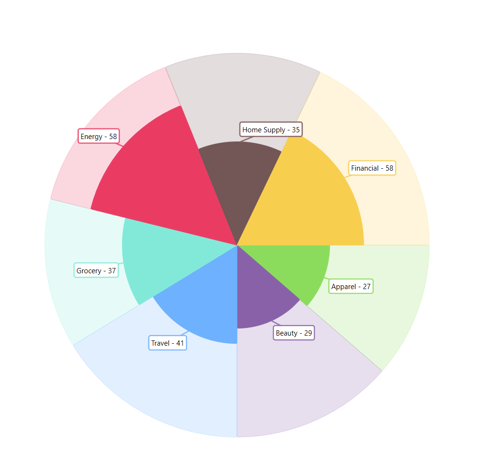

////
|metadata|
{
    "name": "piechart-selection",
    "controlName": ["{PieChartName}"],
    "tags": ["Charting","Data Presentation","How Do I"],
    "guid": "",
    "buildFlags": ["SL","WPF","win-phone","WINFORMS","ANDROID","XAMARIN"],
    "createdOn": "2014-06-05T19:53:12.0788999Z"
}
|metadata|
////

= Selection

This topic provides information for enabling and using the different highlighting features in the link:{DataPieChartLink}.{DataPieChartName}.html[{DataPieChartName}] control. 

The topic contains the following sections:

* <<Requirements,Requirements>>
* <<Overview,Highlighting Overview>>
* <<HighlightBehaviors, Highlighting Behaviors>>
* <<HighlightModes,Highlighting Modes>>
* <<HighlightFilter,Highlight Filter>>
* <<ExampleData, Example Data>>
* <<RelatedTopics,Related Content>>

[[Requirements]]
== Requirements

This article assumes you have already read the link:data-pie-chart-data-binding.html[Data Binding] topic, and uses the code within it as a starting point.

[[Overview]]
== Highlighting Overview

The {DataPieChartName} supports mouse over highlighting, as well as a highlighting overlay that can be configured by providing a separate data source. The following sections describe these features in more detail:

[[HighlightBehaviors]]
=== Highlighting Behaviors

The `HighlightingBehavior` property determines how a slice will be highlighted. This is represented by a `SeriesHighlightingBehavior` enumeration. The following are the options of that enumeration and what they do:

- `DirectlyOver`: The slices are only highlighted when the mouse is directly over them.
- `NearestItems`: The nearest slice to the mouse position will be highlighted.
- `NearestItemsAndSeries`: The nearest slice and series to the mouse position will be highlighted.
- `NearestItemsRetainMainShapes`: The nearest items to the mouse position will be highlighted and the main shapes of the series will not be de-emphasized.

[[HighlightModes]]
=== Highlighting Modes

The `HighlightingMode` property determines how the data pie chart slices respond to being highlighted. This property is defined by the `SeriesHighlightingMode` enumeration. The following are the options of that enumeration and what they do:

- `Brighten`: The series will have its color brightened when the mouse position is over or near it.
- `BrightenSpecific`: The specific slice will have its color brightened when the mouse position is over or near it.
- `FadeOthers`: The series will retain its color when the mouse position is over or near it, while the others will appear faded. 
- `FadeOthersSpecific`: The specific slice will retain its color when the mouse position is over or near it, while the others will appear faded.
- `None`: The series and slices will not be highlighted.

[[CodeExample]]
== Code Example

ifdef::wpf[]

*In XAML:*

[source,xaml]
----
<ig:{DataPieChartName} ItemsSource="{Binding Data}"
                       HighlightingBehavior="NearestItems"
                       HighlightingMode="BrightenSpecific" />
----

*In C#:*

[source, csharp]
----
{DataPieChartName} dataPieChart = new {DataPieChartName}()
{                
    ItemsSource = data,
    HighlightingMode = SeriesHighlightingMode.BrightenSpecific,
    HighlightingBehavior = SeriesHighlightingBehavior.NearestItems
};
----

endif::wpf[]

ifdef::win-forms[]

*In C#:*

[source,csharp]
----
{DataPieChartName} dataPieChart = new {DataPieChartName}()
{                
    Dock = DockStyle.Fill,
    DataSource = data,
    HighlightingMode = SeriesHighlightingMode.BrightenSpecific,
    HighlightingBehavior = SeriesHighlightingBehavior.NearestItems
};
----

endif::win-forms[]

[[HighlightFilter]]
=== Highlighting Filter

The highlight filter of the {DataPieChartName} is applied by specifying a `HighlightedDataSource` for the control and by setting the `HighlightedValuesDisplayMode` property to `Overlay`. The `HighlightedDataSource` expects a subset of the data assigned to the `DataSource` property of the {DataPieChartName}.

When these conditions are met, the values of the subset will be highlighted, while the remainder of the full set of data will be faded - effectively creating a highlight for the subset and allowing easier visualization of a subset of your data within the same control.

[[CodeExample]]
== Code Example

ifdef::wpf[]

*In XAML:*

[source,xaml]
----
<ig:{DataPieChartName} 
    ItemsSource="{Binding OnlineTrafficHighlightTotals}"
    HighlightedItemsSource="{Binding OnlineTrafficHighlightDesktopOnly}"
    HighlightedValuesDisplayMode="Overlay" />
----

*In C#:*

[source, csharp]
----
{DataPieChartName} dataPieChart = new {DataPieChartName}()
{          
    DataContext = new SampleViewModel();   
    //OR   
    ItemsSource = new OnlineTrafficHighlightTotals(),
    HighlightedItemsSource = new OnlineTrafficHighlightDesktopOnly(),
    HighlightedValuesDisplayMode="Overlay"
};
----

endif::wpf[]

ifdef::win-forms[]

*In C#:*

[source,csharp]
----
{DataPieChartName} dataPieChart = new {DataPieChartName}()
{                
    Dock = DockStyle.Fill,
    DataSource = new OnlineTrafficHighlightTotals(),
    HighlightedItemsSource = new OnlineTrafficHighlightDesktopOnly(),
    HighlightedValuesDisplayMode="Overlay"
};
----

endif::win-forms[]

ifdef::wpf[]

*In C#: SampleViewModel*

[source, csharp]
----
public class SampleViewModel
    : INotifyPropertyChanged
{
    public event PropertyChangedEventHandler PropertyChanged;
    protected void OnPropertyChanged(string propertyName)
    {
        PropertyChangedEventHandler handler = PropertyChanged;
        if (handler != null)
        {
            handler(this, new PropertyChangedEventArgs(propertyName));
        }
    }

    private OnlineTrafficHighlightTotals _onlineTrafficHighlightTotals = null;
    public OnlineTrafficHighlightTotals OnlineTrafficHighlightTotals
    {
        get
        {
            if (_onlineTrafficHighlightTotals == null)
            {
                _onlineTrafficHighlightTotals = new OnlineTrafficHighlightTotals(); 
            }
            return _onlineTrafficHighlightTotals;
        }
    }
    
    private OnlineTrafficHighlightDesktopOnly _onlineTrafficHighlightDesktopOnly = null;
    public OnlineTrafficHighlightDesktopOnly OnlineTrafficHighlightDesktopOnly
    {
        get
        {
            if (_onlineTrafficHighlightDesktopOnly == null)
            {
                _onlineTrafficHighlightDesktopOnly = new OnlineTrafficHighlightDesktopOnly(); 
            }
            return _onlineTrafficHighlightDesktopOnly;
        }
    }
    
}
----

endif::wpf[]

[[ExampleData]]
=== Example Data

*In C#:*

[source, csharp]
----
public class OnlineTrafficHighlightTotalsItem
{
    public string Category { get; set; }
    public double Value { get; set; }
}

public class OnlineTrafficHighlightTotals
    : List<OnlineTrafficHighlightTotalsItem>
{
    public OnlineTrafficHighlightTotals()
    {
        this.Add(new OnlineTrafficHighlightTotalsItem()
        {
            Category = @"Apparel",
            Value = 56
        });
        this.Add(new OnlineTrafficHighlightTotalsItem()
        {
            Category = @"Beauty",
            Value = 67
        });
        this.Add(new OnlineTrafficHighlightTotalsItem()
        {
            Category = @"Travel",
            Value = 80
        });
        this.Add(new OnlineTrafficHighlightTotalsItem()
        {
            Category = @"Grocery",
            Value = 62
        });
        this.Add(new OnlineTrafficHighlightTotalsItem()
        {
            Category = @"Energy",
            Value = 74
        });
        this.Add(new OnlineTrafficHighlightTotalsItem()
        {
            Category = @"Home Supply",
            Value = 65
        });
        this.Add(new OnlineTrafficHighlightTotalsItem()
        {
            Category = @"Financial",
            Value = 88
        });
    }
}

public class OnlineTrafficHighlightDesktopOnlyItem
{
    public string Category { get; set; }
    public double Value { get; set; }
}

public class OnlineTrafficHighlightDesktopOnly
    : List<OnlineTrafficHighlightDesktopOnlyItem>
{
    public OnlineTrafficHighlightDesktopOnly()
    {
        this.Add(new OnlineTrafficHighlightDesktopOnlyItem()
        {
            Category = @"Apparel",
            Value = 27
        });
        this.Add(new OnlineTrafficHighlightDesktopOnlyItem()
        {
            Category = @"Beauty",
            Value = 29
        });
        this.Add(new OnlineTrafficHighlightDesktopOnlyItem()
        {
            Category = @"Travel",
            Value = 41
        });
        this.Add(new OnlineTrafficHighlightDesktopOnlyItem()
        {
            Category = @"Grocery",
            Value = 37
        });
        this.Add(new OnlineTrafficHighlightDesktopOnlyItem()
        {
            Category = @"Energy",
            Value = 58
        });
        this.Add(new OnlineTrafficHighlightDesktopOnlyItem()
        {
            Category = @"Home Supply",
            Value = 35
        });
        this.Add(new OnlineTrafficHighlightDesktopOnlyItem()
        {
            Category = @"Financial",
            Value = 58
        });
    }
}
----

[[RelatedTopics]]
== Related Content

* link:data-pie-chart-data-binding.html[Data Binding]
* link:data-pie-chart-others-category.html[Others Category]