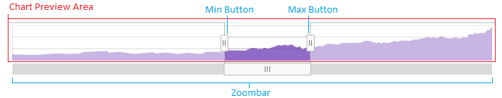

= Zoom Pane

=== Purpose
This topic demonstrates the Zoom Pane of the link:{FinancialChartLink}.{FinancialChartName}.html[{FinancialChartName}] control.

pick:[wpf="image::images/financialchart_wpf_zoompane.png[]"]
pick:[jquery="image::images/financialchart_jquery_zoompane.png[]"]

The above screenshot highlights the Zoom Pane of the chart. You may enable the Zoom Pane by setting the pick:[wpf="link:{FinancialChartLink}.{FinancialChartName}{ApiProp}ZoomSliderType.html[ZoomSliderType] property"]pick:[jquery="link:{FinancialChartLink}.{FinancialChartName}{ApiProp}zoomSliderType[zoomSliderType] option"]  to a value other than `None`. To use the Zoom Pane, you can scroll the mouse wheel over another pane, you can click/drag to select an area of a pane to zoom, or you can adjust the Zoom Pane itself by the bars on the sides and scrollbar on the bottom.

The Zoom Pane displays the link:financial-chart-pane-price.html[Price Pane].  You may choose a different chart type to render in the Zoom Pane than what is in the Price Pane.  The below image points out the important areas of the Zoom Pane in more detail.

[options="header", cols="a,a"]
|====
|Area|Description

|Chart Preview Area
|Shows a preview of the area being zoomed in compared to the whole Price Pane.

|Min Button
|Allows the user to set the `From` date on the X axis.

|Max Button
|Allows the user to set the `To` date on the X axis.

|Zoombar
|Allows the user to scroll the charts zoomed area along the X axis of the chart's data.
|====

ifdef::xaml[]
*In XAML:*
[source,xaml]
----
<ig:{FinancialChartName} ItemsSource="{Binding}" ZoomSliderType="Bar" />
----
endif::xaml[]

ifdef::wpf[]
*In Visual Basic:*
[source,vb]
----
Dim chart = New {FinancialChartName}()
chart.ZoomSliderType = Infragistics.Controls.Charts.FinancialChartZoomSliderType.Bar
----

*In C#:*
[source,csharp]
----
var chart = new {FinancialChartName}();
chart.ZoomSliderType = Infragistics.Controls.Charts.FinancialChartZoomSliderType.Bar;
----
endif::wpf[]

ifdef::jquery[]
*In JavaScript*
[source,javascript]
----
$("#financialChart").{FinancialChartName}({ 
    dataSource: data,
    zoomSliderType: "Bar"
});
----

[source,js]
----
$("#financialChart").{FinancialChartName}("option", "zoomSliderType", "Bar");
----
endif::jquery[]

== Related Content

[options="header", cols="a,a"]
|====
|Topic|Purpose

|link:financial-chart-pane-price.html[Price Pane]
|This article explains the Price pane.

|link:financial-chart-pane-indicator.html[Indicator Panes]
|This article explains the Indicator pane.

|link:financial-chart-pane-volume.html[Volume Pane]
|This article explains the Volume pane.

|====