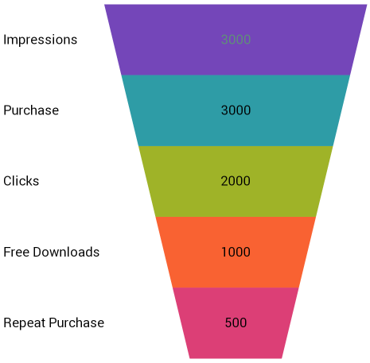

////
|metadata|
{
    "name": "funnelchart-data-binding",
    "controlName": ["{FunnelChartName}"],
    "tags": ["Data Binding"],
    "guid": "a61a6e30-c292-42f1-b815-4adcc051fe86",
    "buildFlags": ["SL","WPF","win-phone","ANDROID"],
    "createdOn": "2014-06-05T19:53:12.0358823Z"
}
|metadata|
////

= Data Binding

This topic demonstrates how to bind data to the link:{FunnelChartLink}.{FunnelChartName}.html[{FunnelChartName}]™ control. Code examples and screenshots are provided throughout the topic.

== Overview

== The topic is organized as follows:

* <<Introduction,Introduction>>
* <<RequiredReferences,Required References>> 
* <<RequiredNamespaces,Required Namespaces>> 
* <<Data_Requirements,Data Requirements>>
* <<Data_Rendering_Rules,Data Rendering Rules>>
* <<StepsOverview,Steps Overview>>
* <<Steps,Steps>>
* <<RelatedContent,Related Content>>

[[Introduction]]
== Introduction

The procedure demonstrated in this topic shows how to bind the {FunnelChartName} control to a data collection. You will define a data collection, add the Funnel Chart control to your application, and then bind the control’s  pick:[wpf,win-universal=" link:{FunnelChartLink}.{FunnelChartName}{ApiProp}itemssource.html[ItemsSource]"]  pick:[android=" link:{FunnelChartLink}.{FunnelChartName}{ApiProp}datasource.html[DataSource]"]pick:[xamarin=" link:{FunnelChartLink}.{FunnelChartName}{ApiProp}itemssource.html[ItemsSource]"]  to an instance of the data collection.

[[RequiredReferences]]
== Required References

ifdef::wpf[]

Add a reference to the following NuGet package:

** Infragistics.WPF.Charts

For more information on setting up the NuGet feed and adding NuGet packages, you can take a look at the following documentation: link:nuget-feeds.html[NuGet Feeds].

endif::wpf[]

ifdef::win-universal[]
** {ApiPlatform}{FunnelChartAssembly}{ApiVersion}.dll
** {ApiPlatform}{DataVizAssembly}{ApiVersion}.dll
** {ApiPlatform}{ApiVersion}dll
endif::win-universal[]

ifdef::win-forms[]
* {ApiPlatform}{FunnelChartAssembly}{ApiVersion}.dll
* {ApiPlatform}{DataVizAssembly}{ApiVersion}.dll
* {ApiPlatform}Portable.Core{ApiVersion}.dll
endif::win-forms[]

ifdef::android[]
** Infragistics.DataChart.jar
** DV.Shared.jar
** Infragistics.Core.jar
** Infragistics.UI.jar
endif::android[]

ifdef::xamarin[]
Add assembly references by following instructions in the link:xamarin-project-with-infragistics-controls.html#NuGetPackages[Add References Through NuGet Packages] topic.
endif::xamarin[]

ifdef::win-forms,sl,win-phone,win-universal,wpf,xamarin[]
[[RequiredNamespaces]]
== Required Namespaces
endif::win-forms,sl,win-phone,win-universal,wpf,xamarin[]

ifdef::sl,win-phone,win-universal,wpf[]

*In XAML:* 
[source,xaml]
----
xmlns:ig="http://schemas.infragistics.com/xaml"
xmlns:local="clr-namespace:FunnelChart_Demo"
---- 
endif::sl,win-phone,win-universal,wpf[]

ifdef::xamarin[]

*In XAML:* 
[source,xaml]
----
xmlns:ig="clr-namespace:Infragistics.XamarinForms.Controls.Charts;assembly=Infragistics.XF.Charts"
xmlns:local="clr-namespace:FunnelChart_Demo"
---- 
endif::xamarin[]

In the procedure below, FunnelChart_Demo is the namespace in which the data model is defined. The following using statement is required in the FunnelChart_Demo or the class that contains the data model:

ifdef::win-forms,sl,win-phone,win-universal,wpf,xamarin[]

*In C#:*
[source,csharp]
----
using System.Collections.ObjectModel;
---- 
endif::win-forms,sl,win-phone,win-universal,wpf,xamarin[]

ifdef::win-forms,sl,win-phone,win-universal,wpf[] 
*In Visual Basic:*
[source,vb]
----
Imports System.Collections.ObjectModel
---- 
endif::win-forms,sl,win-phone,win-universal,wpf[]

[[Data_Requirements]]
== Data Requirements

While the chart control allows you to easily point it to your own data model, it is important that you are supplying the appropriate amount and type of data that the chart requires. If the data does not meet the minimum requirements based on the type of chart that you are using, an error will be generated.

The following is a list of data requirements for funnel chart:

* The data model must contain one numeric column.
* The data model may contain an optional string column for legend labels.

[[Data_Rendering_Rules]]
== Data Rendering Rules

The chart data is rendered using the following rules:

* Axes will not be rendered since the funnel chart does not use axes.
* Each row constitutes a single colored section of the funnel.
* The data values do not need to be percentages, as the sum of the data values in the column is used to calculate the percentage applicable to each row.
* The string column that is mapped to the label property of the data mapping is used as labels in the legend.
* Only the first series in the series collection will be rendered.

[[StepsOverview]]
== Steps Overview

[start=1]
. Defining a Data Model
[start=2]
. Adding an Instance of the Funnel Chart control
[start=3]
. (Optional) Verifying the result

[[Steps]]
== Steps

[start=1]
. Define a Data Model.

Create a class to model the data. The following code creates the TestDataItem class representing simple value-label pairs, as well as a TestData class representing a collection of those pairs:

ifdef::win-forms,sl,win-phone,win-universal,wpf[]

*In Visual Basic:*

----
Public Class TestData
    Inherits ObservableCollection(Of TestDataItem)
    Public Sub New()
    Dim slice1 As New TestDataItem()
    slice1.Label = "Impressions"
    slice1.Value = 3000
    Add(slice1)
    Dim slice2 As New TestDataItem()
    slice2.Label = "Clicks"
    slice2.Value = 2000
    Add(slice2)
    Dim slice3 As New TestDataItem()
    slice3.Label = "Free Downloads"
    slice3.Value = 1000
    Add(slice3)
    Dim slice4 As New TestDataItem()
    slice4.Label = "Purchase"
    slice4.Value = 3000
    Add(slice4)
    Dim slice5 As New TestDataItem()
    slice5.Label = "Repeat Purchase"
    slice5.Value = 500
    Add(slice5)
End Sub
End Class
Public Class TestDataItem
    Public Property Label() As String
        Get
            Return m_Label
        End Get
        Set
            m_Label = Value
        End Set
    End Property
    Private m_Label As String
    Public Property Value() As Double
        Get
            Return m_Value
        End Get
        Set
            m_Value = Value
        End Set
    End Property
    Private m_Value As Double
End Class
----

endif::win-forms,sl,win-phone,win-universal,wpf[]

ifdef::win-forms,sl,win-phone,win-universal,wpf,xamarin[]

*In C#:*
[source,csharp]
----
public class TestData : ObservableCollection<TestDataItem> {
        public TestData() {            
            Add(new TestDataItem() {
                Label = "Impressions",
                Value = 3000
            });
            Add(new TestDataItem() {
                Label = "Clicks",
                Value = 2000
            });
            Add(new TestDataItem() {
                Label = "Free Downloads",
                Value = 1000
            });
            Add(new TestDataItem() {
                Label = "Purchase",
                Value = 3000
            });
            Add(new TestDataItem() {
                Label = "Repeat Purchase",
                Value = 500
            });
        }
    }
    public class TestDataItem
    {
        public string Label { get; set; }
        public double Value { get; set; }
    }
----

endif::win-forms,sl,win-phone,win-universal,wpf,xamarin[]

ifdef::android[]

*In Java:*

[source,js]
----
public class TestDataItem {
private String _label;
public String getLabel() {
return _label;
}
public String setLabel(String label) { 
_label = label;
return label;
}
private double _value;
public double getValue(){
return _value;
} 
public double setValue(double value) {
_value = value;
return _value;
}
public TestDataItem(String label, double value){
_label = label;
_value = value;
}
}
  
public class TestData extends ArrayList<TestDataItem> {
public TestData(){
add(new TestDataItem("Impressions",3000));
add(new TestDataItem("Clicks",2000));
add(new TestDataItem("Free Downloads",1000));
add(new TestDataItem("Purchase",3000));
add(new TestDataItem("Repeat Purchase",500));
}
}
----

endif::android[]

[start=2]
. Add an instance of the {FunnelChartName} Control.

ifdef::sl,win-phone,win-universal,wpf[]
Add an instance of the data collection to the layout root in XAML:
endif::sl,win-phone,win-universal,wpf[]

ifdef::xamarin[]
Add an instance of the data collection to the ContentPage BindingContext in XAML:
endif::xamarin[]

ifdef::sl,win-phone,win-universal,wpf[]

*In XAML:*
[source,xaml]
----
<UserControl.Resources>
        <local:TestData x:Key="data" />
</UserControl.Resources>
<Grid x:Name="LayoutRoot" Background="White">
        <ig:{FunnelChartName} 
                x:Name="funnel"
                Grid.Column="0" Margin="10"
                ItemsSource="{StaticResource data}"
                ValueMemberPath="Value"
                UseOuterLabelsForLegend="True"                   
                InnerLabelMemberPath="Value"
                OuterLabelMemberPath="Label"
                OuterLabelVisibility="Visible"
                UseUnselectedStyle="True"  
                AllowSliceSelection="
                TransitionDuration="0:00:00.8" >
        </ig:{FunnelChartName}>
    </Grid>
----

endif::sl,win-phone,win-universal,wpf[]

ifdef::xamarin[]

*In XAML:*
[source,xaml]
----
<ContentPage.BindingContext>
    <local:TestData />
</ContentPage.BindingContext>
<ig:XamFunnelChart x:Name="funnel" 
                    Margin="10" 
                    ItemsSource="{Binding}"
                    ValueMemberPath="Value"
                    AllowSliceSelection="True"
                    SelectedSliceOpacity="0.5" 
                    UseOuterLabelsForLegend="True"
                    InnerLabelMemberPath="Value"
                    OuterLabelMemberPath="Label"
                    OuterLabelVisibility="Visible">
</ig:XamFunnelChart>
----
endif::xamarin[]

ifdef::android[]

*In Java:*

[source,js]
----
FrameLayout rootView = (FrameLayout) inflater.inflate(R.layout.fragment_main, container, false);
TestData data = new TestData();
Context context = rootView.getContext();
FunnelChartView funnelChart = new FunnelChartView(context);
FrameLayout.LayoutParams funnelParams = new FrameLayout.LayoutParams(500, 500);
funnelParams.gravity = Gravity.CENTER;
funnelChart.setLayoutParams(funnelParams);
funnelChart.setDataSource(data);
funnelChart.setValueMemberPath("Value");
funnelChart.setUseOuterLabelsForLegend(true);
funnelChart.setInnerLabelMemberPath("Value");
funnelChart.setInnerLabelVisibility(Visibility.VISIBLE);
funnelChart.setOuterLabelMemberPath("Label");
funnelChart.setOuterLabelVisibility(Visibility.VISIBLE);
funnelChart.setUseUnselectedStyle(true);
funnelChart.setAllowSliceSelection(false);
----

endif::android[]

pick:[win-forms="*In Visual Basic:*"]

ifdef::win-forms[]
[source,vb]
----
Me.funnel = New Infragistics.Win.DataVisualization.UltraFunnelChart()
Me.funnel.DataSource = New TestData()
Me.funnel.ValueMemberPath = "Value"
Me.funnel.InnerLabelMemberPath = "Value"
Me.funnel.InnerLabelVisibility = Infragistics.Portable.Components.UI.Visibility.Visible
Me.funnel.OuterLabelMemberPath = "Label"
Me.funnel.OuterLabelVisibility = Infragistics.Portable.Components.UI.Visibility.Visible
Me.funnel.UseOuterLabelsForLegend = True
Me.funnel.UseUnselectedStyle = True
Me.funnel.AllowSliceSelection = True
Me.funnel.TransitionDuration = 1
----
endif::win-forms[]

pick:[win-forms="*In C#:*"]

ifdef::win-forms[]
[source,csharp]
----
this.funnel = new Infragistics.Win.DataVisualization.UltraFunnelChart();
this.funnel.DataSource = new TestData();
this.funnel.ValueMemberPath = "Value";
this.funnel.InnerLabelMemberPath = "Value";
this.funnel.InnerLabelVisibility = Infragistics.Portable.Components.UI.Visibility.Visible;
this.funnel.OuterLabelMemberPath = "Label";
this.funnel.OuterLabelVisibility = Infragistics.Portable.Components.UI.Visibility.Visible;
this.funnel.UseOuterLabelsForLegend = true;
this.funnel.UseUnselectedStyle = true;
this.funnel.AllowSliceSelection = true;
this.funnel.TransitionDuration = 1;
----
endif::win-forms[]

[start=3]
. (Optional) Verify the Result.

Run your application to verify the result. If you have successfully bound the Funnel Chart control to the data collection, the chart will look like the one shown here:

ifdef::sl,win-phone,win-universal,android,wpf[]
image::images/xamFunnelChart_DataBind_01.png[]
endif::sl,win-phone,win-universal,android,wpf[]

ifdef::win-forms,xamarin[]

endif::win-forms,xamarin[]

[[RelatedContent]]
== Related Content

link:funnelchart-getting-started-with-funnelchart.html[Getting Started with {FunnelChartName}]