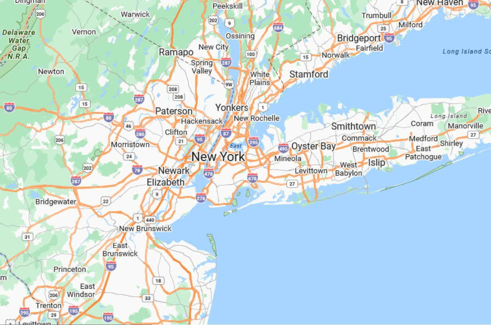

////
|metadata|
{
    "controlName": ["{GeoMapName}"],
    "tags": []
}
|metadata|
////

= Displaying Geographic Imagery from Azure Maps

=== Purpose

This topic provides information on displaying geographic imagery from Azure Maps in the background content of the link:{GeoMapLink}.{GeoMapName}_members.html[{GeoMapName}]™ control.

=== Required background

The following table lists the topics required as a prerequisite to understanding this topic.

[options="header", cols="a,a"]
|====
|Topic|Purpose

| link:geographicmap-adding-geographicmap-to-a-page.html[Adding {GeoMapName} to a Page] 

|This topic provides information on how to add the _{GeoMapName}_ control to an application page.

| link:geographicmap-visual-elements-of-geographicmap.html[Visual Elements of {GeoMapName}]
|This topic provides information about the layout of the visual elements in the  control

| link:geographicmap-using-geographic-imagery.html[Using Geographic Imagery] 

|This topic provides an overview of rendering geographic imagery in the background content of the _{GeoMapName}_ control.

|====

=== In this topic

This topic contains the following sections:

* <<_Ref320395369,Geographic Imagery from Azure Maps>>

** <<_Ref320193474,Overview>>
** <<_Ref320395376,Previews>>
** <<_Ref320471950,Requirements>>
** <<Example,Example>>

* <<_Ref320185294,Related Content>>

[[_Ref320395369]]
== Geographic Imagery from Azure Maps

[[_Ref320193474]]
=== Overview

Azure Maps is Microsoft’s® licensed geographic imagery mapping service. This geographic imagery service is accessible directly on the link:https://azure.microsoft.com/en-us/products/azure-maps/[Azure Maps] web site. The _{GeoMapName}_ control displays geographic imagery from Azure Maps in the map’s background content using the link:{GeoMapLink}.Azuremapsimagery.html[AzureMapsImagery] class. However, by default the _{GeoMapName}_ control displays geographic imagery from the Open Street Maps in the map background content requiring you to configure the control to display Azure Maps’ geographic imagery. Prior to using Azure Maps’ geographic imagery, you must register and obtain a Azure Map API key from link:http://www.Azuremapsportal.com[www.Azuremapsportal.com]. You must use the Azure Maps’ API key to set the link:{GeoMapLink}.Azuremapsimagery.html[AzureMapsImagery] object’s link:{GeoMapLink}.Azuremapsimagery~apikey.html[ApiKey] property.

[[_Ref320395376]]
=== Previews

The following images are previews of the _{GeoMapName}_ control in supported map styles of geographic imagery from the Azure Maps service.

[cols="a"]
|====

|image::images/GeographicMap_Displaying_Geographic_Imagery_from_Azure_Maps_1.png[] 

Azure Map imagery with *Satellite* style

|image::images/GeographicMap_Displaying_Geographic_Imagery_from_Azure_Maps_2.png[] 

Azure Map imagery with *Road* style

|image::images/GeographicMap_Displaying_Geographic_Imagery_from_Azure_Maps_3.png[] 

Azure Map imagery with *HybridRoad* style

|====

[[_Ref320471950]]

=== Requirements

In order to use geographic imagery from Azure Maps, you must first register and obtain a Map API key from the link:http://www.Azuremapsportal.com[www.Azuremapsportal.com] website. You must set this Azure API key as the link:{GeoMapLink}.Azuremapsimagery.html[AzureMapsImagery] object’s link:{GeoMapLink}.Azuremapsimagery~apikey.html[ApiKey] property.

TLS1.2 or TLS1.3 is required in order for the map to render properly. If you are using .NET 4.7 and later, you can ignore this step. For more details please visit link:https://learn.microsoft.com/en-us/azure/azure-maps/azure-maps-authentication/[https://learn.microsoft.com/en-us/azure/azure-maps/azure-maps-authentication]

A full list of frameworks support for TLS is listed here:
link:https://learn.microsoft.com/en-us/dotnet/framework/network-programming/tls#tls-support-in-net-framework[TLS support in .NET Framework]

.TLS 1.2
[TLS 1.2]
====
ServicePointManager.SecurityProtocol = (SecurityProtocolType)3072;
====

This is explicitly required when using eg. .NET 4.0 that doesnt' provide this out of the box. Make sure to add the line above in your eg. form's constructor prior to adding the map.

=== Property settings

The following table summarizes important members of the link:{GeoMapLink}.Azuremapsimagery.html[AzureMapsImagery] class.

[options="header", cols="a,a,a"]
|====
|*Property* *Name*|*Property* *Type*|*Description*

| link:{GeoMapLink}.Azuremapsimagery~apikey.html[ApiKey]
|_String_
|Represents the property for setting an API key required for the Azure Maps imagery service. 

You must obtain this key from the link:http://www.Azuremapsportal.com/[http://www.Azuremapsportal.com] website.

| link:{GeoMapLink}.Azuremapsimagery~culturename.html[CultureName]
|_String_
|Represents a property for setting the culture name for the tile source.

| link:{GeoMapLink}.Azuremapsimagerystyle.html[ImageryStyle]
| link:{GeoMapLink}.Azuremapsimagerystyle.html[AzureMapsImageryStyle]
|Represents the property for setting the Azure Maps imagery tiles map style. This property can be set to the following link:{GeoMapLink}.Azuremapsimagerystyle.html[AzureMapsImageryStyle] enumeration values, such as: 

* Satellite - Specifies the map style with no roads or labels providing a satellite perspective.

* Road - Specifies the map style with a aerial overlay with roads and labels.

* DarkGrey - Specifies the map in black and white with road and labels overlays.

* LabelsRoadOverlay - Specifies the map with roads and labels overlay only.

* TerraOverlay - Specifies a terrain map style with shaded relief to highlight elevation and landscape features

* HybridRoadOverlay - Satellite background combined with road and label overlays

* HybridDarkGreyOverlay - Satellite background combined with dark grey label overlays

* LabelsDarkGreyOverlay - One of several overlays of city labels

* TrafficDelayOverlay - Displays traffic delays and congestion areas in real time

* TrafficAbsoluteOverlay - Displays current traffic speeds as absolute values

* TrafficReducedOverlay - Displays reduced traffic flow with light-based visualization

* TrafficRelativeOverlay - Displays traffic speeds relative to normal conditions

* TrafficRelativeOverlay - Displays traffic speeds relative to normal conditions for enhanced contrast

* WeatherRadarOverlay - Displays near real-time radar imagery of precipitation

* WeatherInfraredOverlay - Displays infrared satellite imagery of cloud cover

|====

=== Example

The screenshot following this table illustrates how to display geographic imagery from Azure Maps in the background content of the _{GeoMapName}_ control. This is accomplished by configuring the _{GeoMapName}_ control as follows:

[options="header", cols="a,a"]
|====
|*Property*|* Value*

| pick:[wpf="link:{GeoMapLink}.xamgeographicmap~backgroundcontent.html[BackgroundContent]"]pick:[win-forms="BackgroundContent"]
|AzureMapsImagery

| link:{GeoMapLink}.Azuremapsimagerystyle.html[ImageryStyle]
|Road

| link:{GeoMapLink}.Azuremapsimagery~apikey.html[ApiKey]
|Azure Map API key

|====

Following is the code used in implementing this example:

.Note
[NOTE]
====
You must replace those strings set to the _ApiKey_ property with your own Azure Map API key.
====
 
ifdef::wpf[]
*In XAML:* 

[source,xaml]
---- 
<ig:XamGeographicMap Name="igMap">
   <ig:XamGeographicMap.BackgroundContent>
      <ig:AzureMapsImagery ImageryStyle="Road"
                    ApiKey="API_KEY" />
   </ig:XamGeographicMap.BackgroundContent>
</ig:XamGeographicMap>
---- 
endif::wpf[]

*In Visual Basic:* 

[source,vb]
---- 
Dim igMap As {GeoMapName}
Dim AzureMaps as AzureMapsImagery
AzureMaps.ImageryStyle = AzureMapsImageryStyle.Road
AzureMaps.ApiKey = "API_KEY"
ifdef::wpf[]
igMap.BackgroundContent = AzureMaps
endif::wpf[]
ifdef::win-forms[]
igMap.SetImagery(AzureMaps)
endif::win-forms[]
---- 

*In C#:* 

[source,csharp]
---- 
var igMap = new {GeoMapName}
var AzureMaps = new AzureMapsImagery();
AzureMaps.ImageryStyle = AzureMapsImageryStyle.Road; 
AzureMaps.ApiKey = "API_KEY";
ifdef::wpf[]
igMap.BackgroundContent = AzureMaps;
endif::wpf[]
ifdef::win-forms[]
igMap.SetImagery(AzureMaps);
endif::win-forms[]
---- 
 

[[_Ref320185294]]
== Related Content

The following topics provide additional information related to this topic.

[options="header", cols="a,a"]
|====
| *Topic* | *Purpose* 

| link:geographicmap-adding-geographicmap-to-a-page.html[Adding {GeoMapName}]
|This topic provides information on how to bind geographic imagery in the _{GeoMapName}_ control.

| link:geographicmap-displaying-geographic-imagery-from-open-street-maps.html[Displaying Geographic Imagery from Open Street Maps]
|This topic provides information on how to display geographic imagery from Open Street Maps service in the _{GeoMapName}_ control.

|====