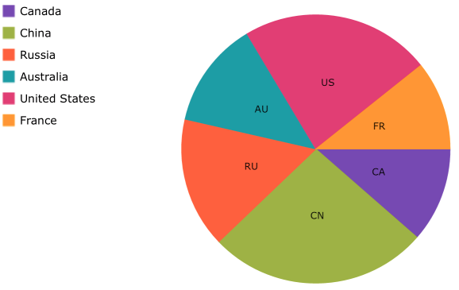

= Legend

ifdef::android,xamarin,wpf,win-universal[]
This topic provides information for configuring the link:{PieChartLink}.{PieChartName}.html[{PieChartName}]™ in order to use an link:{ItemLegendLink}.ItemLegend.html[ItemLegend].
endif::android,xamarin,wpf,win-universal[]

ifdef::win-forms[]
This topic provides information for configuring the link:{PieChartLink}.{PieChartName}.html[{PieChartName}]™ in order to use an link:{ItemLegendLink}.UltraItemLegend.html[UltraItemLegend].
endif::win-forms[]

=== Overview

This topic contains the following sections:

* <<Requirements,Requirements>>
* <<Properties,Properties>>
* <<CodeExample,Code Example>>
* <<RelatedContent,Related Content>>

[[Requirements]]
=== Requirements

This article assumes you have already read the link:piechart-data-binding.html[Data Binding] topic and have a pie chart already bound to some data.

[[Properties]]
=== Properties

ifdef::wpf[]

In order to display a legend next to the {PieChartName} an ItemLegend needs to be created and assigned to the link:{PieChartLink}.{PieChartBase}{ApiProp}Legend.html[Legend] property. The link:{PieChartLink}.{PieChartBase}{ApiProp}LegendLabelMemberPath.html[LegendLabelMemberPath] can then be used to specify which property on your data model it will use to display inside the legend for each pie slice.

Additionally you can use the link:{PieChartLink}.{PieChartBase}{ApiProp}LegendItemTemplate.html[LegendItemTemplate] and link:{PieChartLink}.{PieChartBase}{ApiProp}LegendItemBadgeTemplate.html[LegendItemBadgeTemplate] properties and the various font properties on ItemLegend to further customize the look of the legend items.  Here is a list of the properties which affect the legend item visuals:

[options="header", cols="a,a,a"]
|====
|Property Name|Property Type|Description

|*{PieChartName} Properties:*
|
|

|link:{PieChartLink}.{PieChartBase}{ApiProp}LegendItemTemplate.html[LegendItemTemplate]
|`DataTemplate`
|This is a DataTemplate that will be used for rendering the visuals of each legend item.

|link:{PieChartLink}.{PieChartBase}{ApiProp}LegendItemBadgeTemplate.html[LegendItemBadgeTemplate]
|`DataTemplate`
|This is a DataTemplate that is responsible for rendering the badge icon for each legend item.

|link:{PieChartLink}.{PieChartBase}{ApiProp}LegendLabelMemberPath.html[LegendLabelMemberPath]
|`string`
|The property on the data model whose value will be used in the legend for each pie slice.

|*ItemLegend Properties:*
|
|

|link:{LegendLinkBase}.LegendBase{ApiProp}ItemsFontFamily.html[ItemsFontFamily]
|`FontFamily`
|The font family to use for each legend item.

|link:{LegendLinkBase}.LegendBase{ApiProp}ItemsFontSize.html[ItemsFontSize]
|`double`
|The font size to use for each legend item.

|link:{LegendLinkBase}.LegendBase{ApiProp}ItemsFontStretch.html[ItemsFontStretch]
|`FontStretch`
|The font stretch to use for each legend item.

|link:{LegendLinkBase}.LegendBase{ApiProp}ItemsFontStyle.html[ItemsFontStyle]
|`FontStyle`
|The font style to use for each legend item.

|link:{LegendLinkBase}.LegendBase{ApiProp}ItemsFontWeight.html[ItemsFontWeight]
|`FontWeight`
|The font weight to use for each legend item.

|link:{LegendLinkBase}.LegendBase{ApiProp}ItemsForeground.html[ItemsForeground]
|`Brush`
|The foreground color to use for each legend item.

|link:{LegendLinkBase}.LegendBase{ApiProp}ItemsHorizontalAlignment.html[ItemsHorizontalAlignment]
|`HorizontalAlignment`
|The horizontal alignment to use for each legend item.

|link:{LegendLinkBase}.LegendBase{ApiProp}ItemsVerticalAlignment.html[ItemsVerticalAlignment]
|`VerticalAlignment`
|The vertical alignment to use for each legend item.

|====

endif::wpf[]

ifdef::xamarin,win-forms,win-universal[]

In order to display a legend next to the {PieChartName} an ItemLegend needs to be created and assigned to the link:{PieChartLink}.{PieChartBase}{ApiProp}Legend.html[Legend] property of the {PieChartName}.  You can also set the link:{PieChartLink}.{PieChartBase}{ApiProp}LegendLabelMemberPath.html[LegendLabelMemberPath] which is responsible for telling the legend which property in the data source to use for each legend item.  If no link:{PieChartLink}.{PieChartBase}{ApiProp}LegendLabelMemberPath.html[LegendLabelMemberPath] is specified then the legend will use the {PieChartName}'s link:{PieChartLink}.{PieChartBase}{ApiProp}LabelMemberPath.html[LabelMemberPath] property instead.

endif::xamarin,win-forms,win-universal[]

[[CodeExample]]

ifdef::wpf[]

image::images/PieChartWithLegend_WPF.png[align="center"]

*In XAML:*

----
<Grid x:Name="RootLayout">
    <Grid.ColumnDefinitions>
        <ColumnDefinition Width="Auto"/>
        <ColumnDefinition Width="*"/>
    </Grid.ColumnDefinitions>
    
    <ig:{PieChartName} x:Name="pieChart" Grid.Column="1"
                    ItemsSource="{Binding Path=EnergyData}"
                    ValueMemberPath="Coal"
                    LabelMemberPath="CountryAbbreviation"
                    Legend="{Binding ElementName=itemLegend1}">
        <ig:XamPieChart.LegendItemTemplate>
            <DataTemplate>
                <StackPanel Orientation="Horizontal" Margin="1" Visibility="{Binding Series.Visibility}">
                    <ContentPresenter Content="{Binding}"
                                      ContentTemplate="{Binding Series.LegendItemBadgeTemplate}"/>
                    <TextBlock Text="{Binding Path=Item.Country}"
                               Foreground="{Binding Series.Legend.ItemsForeground}"
                               FontStretch="{Binding Series.Legend.ItemsFontStretch}"
                               FontStyle="Italic"
                               FontWeight="Bold"
                               FontSize="16"
                               FontFamily="MS Arial"/>
                </StackPanel>
            </DataTemplate>
        </ig:XamPieChart.LegendItemTemplate>
    </ig:XamPieChart>
    
    <ig:ItemLegend x:Name="itemLegend1" Grid.Column="0"/>
</Grid>
----

*In C#:*

----
// Get the DataTemplate from where ever you have it defined.
DataTemplate customLegendItemTemplate = this.Resources["CustomLegendItemTemplate"] as DataTemplate;

ItemLegend legend = new ItemLegend();

{PieChartName} pieChart = new {PieChartName}();
pieChart.ItemsSource = EnergyData;
pieChart.ValueMemberPath = "Coal";
pieChart.LabelMemberPath = "CountryAbbreviation";
pieChart.LegendItemTemplate = customLegendItemTemplate;
pieChart.Legend = legend;
----

*In Visual Basic:*

----
'Get the DataTemplate from where ever you have it defined.
Dim customLegendItemTemplate As DataTemplate
customLegendItemTemplate = TryCast(Me.FindResource("CustomLegendItemTemplate"), DataTemplate)

Dim legend As New ItemLegend()

Dim pieChart As New {PieChartName}()
pieChart.ItemsSource = EnergyData
pieChart.ValueMemberPath = "Coal"
pieChart.LabelMemberPath = "CountryAbbreviation"
pieChart.LegendItemTemplate = customLegendItemTemplate;
pieChart.Legend = legend
----

endif::wpf[]

ifdef::xamarin,win-forms,win-universal[]

ifdef::xaml[]

*In XAML:*

----
<Grid x:Name="RootLayout">
    <Grid.ColumnDefinitions>
        <ColumnDefinition Width="Auto"/>
        <ColumnDefinition Width="*"/>
    </Grid.ColumnDefinitions>
    
    <ig:{PieChartName} x:Name="pieChart" Grid.Column="1"
                    ItemsSource="{Binding Path=EnergyData}"
                    ValueMemberPath="Coal"
                    LabelMemberPath="CountryAbbreviation"
                    LegendLabelMemberPath="Country"
                    Legend="{x:Reference itemLegend1}">
    </ig:XamPieChart>
    
    <ig:ItemLegend x:Name="itemLegend1" Grid.Column="0"/>
</Grid>
----

endif::xaml[]

*In C#:*

----
ItemLegend legend = new ItemLegend();

{PieChartName} pieChart = new {PieChartName}();
pieChart.ItemsSource = EnergyData;
pieChart.ValueMemberPath = "Coal";
pieChart.LabelMemberPath = "CountryAbbreviation";
pieChart.LegendLabelMemberPath = "Country";
pieChart.Legend = legend;
----

ifdef::win-forms,win-universal[]

*In Visual Basic:*

----
Dim legend As New ItemLegend()

Dim pieChart As New {PieChartName}()
pieChart.ItemsSource = EnergyData
pieChart.ValueMemberPath = "Coal"
pieChart.LabelMemberPath = "CountryAbbreviation"
pieChart.LegendLabelMemberPath = "Country";
pieChart.Legend = legend
----

endif::win-forms,win-universal[]

endif::xamarin,win-forms,win-universal[]

[[RelatedContent]]
=== Related Content

* link:piechart-data-binding.html[Data Binding]