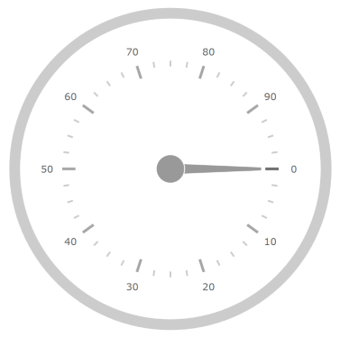

////
|metadata|
{
    "name": "radialgauge-configuring-labels",
    "tags": ["Getting Started","How Do I"],
    "controlName": ["{RadialGaugeName}"],
    "guid": "d556c180-8b27-4566-9214-5605612bbf33",
    "buildFlags": ["SL","WPF","XAMARIN","ANDROID","WINFORMS"],
    "createdOn": "2014-06-05T19:53:11.9738536Z"
}
|metadata|
////

= Configuring Labels ({RadialGaugeName})

=== Purpose

This topic provides a conceptual overview of labels with the _{RadialGaugeName}_™ control. It describes the properties of the labels and also provides an example of how to configure the labels.

=== Required background

The following topics are prerequisites to understanding this topic:

[options="header", cols="a,a"]
|====
|Topic|Purpose

| link:radialgauge.html[{RadialGaugeName}]
|This section gives you an overview of the _{RadialGaugeName}_™ control and its main features.

| link:radialgauge-getting-started-with-radialgauge.html[Adding {RadialGaugeName}]
|This topic explains using a code example how to add the _{RadialGaugeName}_™ control to a {PlatformName} application.

|====

=== In this topic

This topic contains the following sections:

* <<Overview,Labels Overview>>
* <<Preview,Preview>>
* <<Properties,Label Properties and Events>>
* <<Example,Configuring the Label>>
* <<TitleProperties,Title Properties & Styling>>
* <<RelatedContent,Related Content>>

[[Overview]]
== Labels Overview

=== Labels overview

The gauge labels are visual elements displaying numeric values at a specified interval on the scale.

[[Preview]]

=== Preview

The following image is a preview of the _{RadialGaugeName}_ control displaying labels.

[[Properties]]
== Label Properties and Events

=== Label properties and events summary

The following table summarizes the _{RadialGaugeName}_ control’s label properties.

[options="header", cols="a,a,a"]
|====
|Property Name|Property Type|Description

| link:{RadialGaugeLink}.{RadialGaugeName}{ApiProp}labelextent.html[LabelExtent]
|`Double`
|Determines the label position as a value between 0 and 1 from the center of the gauge with 0 placing the labels at the center of the gauge and 1 placing the labels on the radius of the gauge.

| link:{RadialGaugeLink}.{RadialGaugeName}{ApiProp}labelinterval.html[LabelInterval]
|`Double`
|Determines the interval to use for rendering labels; by default this is the same interval as the tick marks on the scale.

|====

The following table summarizes the _{RadialGaugeName}_ control’s label related events.

[options="header", cols="a,a"]
|====
|Event Name|Description

| link:{RadialGaugeLink}.{RadialGaugeName}{ApiProp}alignlabel_ev.html[AlignLabel]
|This event is raised when aligning a gauge label along the scale

| link:{RadialGaugeLink}.{RadialGaugeName}{ApiProp}formatlabel_ev.html[FormatLabel]
|This event is raised when formatting a gauge label

|====

[[Example]]
== Configuring the Label

=== Example

The following screenshot illustrates how the _{RadialGaugeName}_ control renders with the label’s properties configured like this:

[options="header", cols="a,a"]
|====
|Property|Value

| link:{RadialGaugeLink}.{RadialGaugeName}{ApiProp}labelinterval.html[LabelInterval]
|15

| link:{RadialGaugeLink}.{RadialGaugeName}{ApiProp}labelextent.html[LabelExtent]
|0.44

|====

image::images/Configuring_Labels_2_17_1.png[]

The following is the code for implementing this example

ifdef::xaml[]

*In XAML:*

[source,xaml]
----
<{RadialGaugeName} x:Name="radialGauge"
         LabelExtent="0.44" 
         LabelInterval="15"/>
----

endif::xaml[]

ifdef::sl[]

*In C#:*

[source,csharp]
----
var radialGauge = new {RadialGaugeName}();
radialGauge.LabelExtent = 0.44;
radialGauge.LabelInterval = 15;
----

endif::sl[]

ifdef::win-universal[]

*In C#:*

[source,csharp]
----
var radialGauge = new {RadialGaugeName}();
radialGauge.LabelExtent = 0.44;
radialGauge.LabelInterval = 15;
----

endif::win-universal[]

ifdef::wpf[]

*In C#:*

[source,csharp]
----
var radialGauge = new {RadialGaugeName}();
radialGauge.LabelExtent = 0.44;
radialGauge.LabelInterval = 15;
----

endif::wpf[]

ifdef::win-forms[]

*In C#:*

[source,csharp]
----
var radialGauge = new {RadialGaugeName}();
radialGauge.LabelExtent = 0.44;
radialGauge.LabelInterval = 15;
----

endif::win-forms[]

ifdef::xamarin[]

*In C#:*

[source,csharp]
----
var radialGauge = new {RadialGaugeName}();
radialGauge.LabelExtent = 0.44;
radialGauge.LabelInterval = 15;
----

endif::xamarin[]

ifdef::sl[]

*In Visual Basic:*

[source,vb]
----
Dim radialGauge As {RadialGaugeName} = New {RadialGaugeName}
radialGauge.LabelExtent = 0.44
radialGauge.LabelInterval = 15
----

endif::sl[]

ifdef::win-universal[]

*In Visual Basic:*

[source,vb]
----
Dim radialGauge As {RadialGaugeName} = New {RadialGaugeName}
radialGauge.LabelExtent = 0.44
radialGauge.LabelInterval = 15
----

endif::win-universal[]

ifdef::wpf[]

*In Visual Basic:*

[source,vb]
----
Dim radialGauge As {RadialGaugeName} = New {RadialGaugeName}
radialGauge.LabelExtent = 0.44
radialGauge.LabelInterval = 15
----

endif::wpf[]

ifdef::win-forms[]

*In Visual Basic:*

[source,vb]
----
Dim radialGauge As {RadialGaugeName} = New {RadialGaugeName}
radialGauge.LabelExtent = 0.44
radialGauge.LabelInterval = 15
----

endif::win-forms[]

ifdef::android[]

*In Java:*

[source,js]
----
radialGauge.setLabelExtent(.44);
radialGauge.setLabelInterval(15);
----

endif::android[]

[[TitleProperties]]
== Title Properties

The following table summarizes the _{RadialGaugeName}_ control’s title properties.

[options="header", cols="a,a,a"]
|====
|Property Name|Property Type

| link:{RadialGaugeLink}.{RadialGaugeName}{ApiProp}titletext.html[TitleText]
|`String`
|Gets or sets the text displayed in the title of the gauge.

| link:{RadialGaugeLink}.{RadialGaugeName}{ApiProp}subtitletext.html[SubtitleText]
|`String`
|Gets or sets the text displayed in the subtitle of the gauge.

| link:{RadialGaugeLink}.{RadialGaugeName}{ApiProp}highlightlabeltext.html[HighlightLabelText]
|`String`
|Gets or sets the text displayed for the highlight label of the gauge.

| link:{RadialGaugeLink}.{RadialGaugeName}{ApiProp}titledisplaysvalue.html[TitleDisplaysValue]
|`Bool`
|Gets or sets the title showing the value of the gauge needle position.

| link:{RadialGaugeLink}.{RadialGaugeName}{ApiProp}subtitledisplaysvalue.html[SubtitleDisplaysValue]
|`Bool`
|Gets or sets the subtitle showing the value of the gauge needle position.

| link:{RadialGaugeLink}.{RadialGaugeName}{ApiProp}highlightLabelDisplaysValue.html[HighlightLabelDisplaysValue]
|`Bool`
|Gets or sets the highlight label showing the highlight value of the highlight needle.

| link:{RadialGaugeLink}.{RadialGaugeName}{ApiProp}titlebrush.html[Titlebrush]
|`String`
|Gets or sets the brush to use for rendering inner unit text

| link:{RadialGaugeLink}.{RadialGaugeName}{ApiProp}titlefontsize.html[TitleFontSize]
|`Double`
|Gets or sets the font size for the Value.

| link:{RadialGaugeLink}.{RadialGaugeName}{ApiProp}subtitlebrush.html[SubtitleBrush]
|`String`
|Gets or sets the brush to use for rendering inner unit text

| link:{RadialGaugeLink}.{RadialGaugeName}{ApiProp}subtitlefontsize.html[SubtitleFontSize]
|`Double`
|Gets or sets the font size for the Value.

| link:{RadialGaugeLink}.{RadialGaugeName}{ApiProp}highlightlabelbrush.html[HighlightLabelBrush]
|`String`
|Gets or sets the brush to use for rendering inner unit text

| link:{RadialGaugeLink}.{RadialGaugeName}{ApiProp}highlightlabelfontsize.html[HighlightLabelFontSize]
|`Double`
|Gets or sets the font size for the Value.

|====

[[RelatedContent]]
== Related Content

The following topics provide additional information related to this topic:

[options="header", cols="a,a"]
|====
|Topic|Purpose

| link:radialgauge-getting-started-with-radialgauge.html[Adding {RadialGaugeName}]
|This topic explains using a code example how to add the _{RadialGaugeName}_™ control to a {PlatformName} application.

| link:radialgauge-configuring-the-backing.html[Configuring the Background ({RadialGaugeName})]
|This topic provides a conceptual overview of the _{RadialGaugeName}_™ control’s backing feature. It describes the properties of the backing area and provides an example of its implementation.

| link:radialgauge-configuring-optical-scaling.html[Configuring Optical Scaling ({RadialGaugeName})]
|This topic provides a conceptual overview of labels with the {RadialGaugeName}™ control. It describes the properties of the scaling and configure the settings.

| link:radialgauge-configuring-needles.html[Configuring Needles ({RadialGaugeName})]
|This topic provides a conceptual overview of needles with the {RadialGaugeName}™ control. It describes the properties of the needles and also provides an example of how to configure them.

| link:radialgauge-configuring-ranges.html[Configuring Ranges ({RadialGaugeName})]
|This topic provides a conceptual overview of the {RadialGaugeName}™ control’s ranges. It describes the properties of the ranges and provides an example of how to add ranges to the radial gauge.

| link:radialgauge-configuring-the-scale.html[Configuring the Scale ({RadialGaugeName})]
|This topic provides a conceptual overview of the {RadialGaugeName}™ control’s scale. It describes the properties of the scale and also provides an example of how to implement it.

| link:radialgauge-configuring-tick-marks.html[Configuring the Tick Marks ({RadialGaugeName})]
|This topic provides a conceptual overview of tick marks with the {RadialGaugeName}™ control. It describes the tick marks’ properties and provides an example of how to implement them.

|====