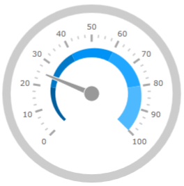

////
|metadata|
{
    "name": "radialgauge",
    "tags": ["Getting Started","How Do I"],
    "controlName": ["{RadialGaugeName}"],
    "guid": "9daa61e7-3725-4ce9-803d-06d80e245891",
    "buildFlags": ["SL","WPF","XAMARIN","ANDROID","WINFORMS","win-universal"],
    "createdOn": "2014-06-05T19:53:11.9658503Z"
}
|metadata|
////

= {RadialGaugeName}

=== Purpose

This section gives you an overview of the _{RadialGaugeName}_™ control and its main features.

== About {RadialGaugeName}

=== Overview

The _{RadialGaugeName}_™ control is a data visualization tool capable of displaying a gauge containing a number of visual elements, such as a scale with tick marks and labels, a needle, and a number of ranges. Create a scale by supplying link:{RadialGaugeLink}.{RadialGaugeName}{ApiProp}minimumvalue.html[MinimumValue] and link:{RadialGaugeLink}.{RadialGaugeName}{ApiProp}maximumvalue.html[MaximumValue] values and a needle can point to a value by setting the link:{RadialGaugeLink}.{RadialGaugeName}{ApiProp}value.html[Value] property. The gauge also supports ranges, which provide visual cues for the scale, for more information see the link:radialgauge-configuring-ranges.html[Configuring Ranges ({RadialGaugeName})] topic.

The gauge comes with a backing shape drawn behind the scale that acts as a background for the gauge. The backing can be circular, which turns the shape into a full circle, or it can be fitted, which makes it sweep the scale – only providing backing behind the scale portion of the gauge, for more information see the link:radialgauge-configuring-the-backing.html[Configuring the Background ({RadialGaugeName})] topic.

Gauge needle are available in one of the several predefined shapes. The needle can have a pivot shape, which is placed in the center of the gauge. The pivot shape also takes one of the predefined shapes. Pivot shapes that include an overlay or an underlay can have a separate pivot brush applied to the shape. For more information see the link:radialgauge-configuring-needles.html[Configuring Needles ({RadialGaugeName})] topic.

This gauge supports only one scale, one needle, one set of tick marks and one set of labels. Practically all the changes made to the _{RadialGaugeName}_ control are animation enhancements. This animation is highly customizable by setting the link:{RadialGaugeLink}.{RadialGaugeName}{ApiProp}transitionduration.html[TransitionDuration] property. You can achieve numerous needle shapes by fine tuning its shape parameters.

=== Preview

The following screenshot is a preview of the _{RadialGaugeName}_ control with three ranges added to it.

== Related Content

The following topics provide additional information related to this topic:

[options="header", cols="a,a"]
|====
|Topic|Purpose

| link:radialgauge-getting-started-with-radialgauge.html[Adding {RadialGaugeName}]
|This topic explains using a code example how to add the _{RadialGaugeName}_™ control to a {PlatformName} application.

| link:radialgauge-configuring-the-backing.html[Configuring the Background ({RadialGaugeName})]
|This topic provides a conceptual overview of the _{RadialGaugeName}_™ control’s backing feature. It describes the properties of the backing area and provides an example of its implementation.

| link:radialgauge-configuring-labels.html[Configuring Labels ({RadialGaugeName})]
|This topic provides a conceptual overview of labels with the {RadialGaugeName}™ control. It describes the properties of the labels and also provides an example of how to configure the labels.

| link:radialgauge-configuring-optical-scaling.html[Configuring Optical Scaling ({RadialGaugeName})]
|This topic provides a conceptual overview of labels with the {RadialGaugeName}™ control. It describes the properties of the scaling and configure the settings.

| link:radialgauge-configuring-needles.html[Configuring Needles ({RadialGaugeName})]
|This topic provides a conceptual overview of needles with the {RadialGaugeName}™ control. It describes the properties of the needles and also provides an example of how to configure them.

| link:radialgauge-configuring-ranges.html[Configuring Ranges ({RadialGaugeName})]
|This topic provides a conceptual overview of the {RadialGaugeName}™ control’s ranges. It describes the properties of the ranges and provides an example of how to add ranges to the radial gauge.

| link:radialgauge-configuring-the-scale.html[Configuring the Scale ({RadialGaugeName})]
|This topic provides a conceptual overview of the {RadialGaugeName}™ control’s scale. It describes the properties of the scale and also provides an example of how to implement it.

| link:radialgauge-configuring-tick-marks.html[Configuring the Tick Marks ({RadialGaugeName})]
|This topic provides a conceptual overview of tick marks with the {RadialGaugeName}™ control. It describes the tick marks’ properties and provides an example of how to implement them.

|====
 