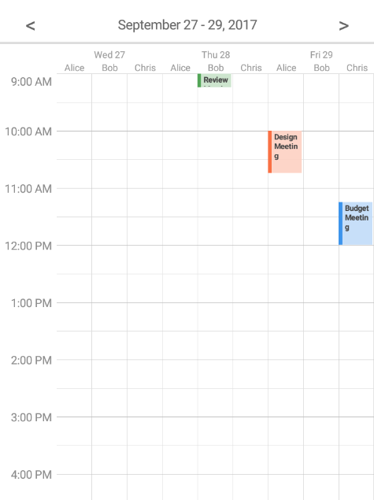
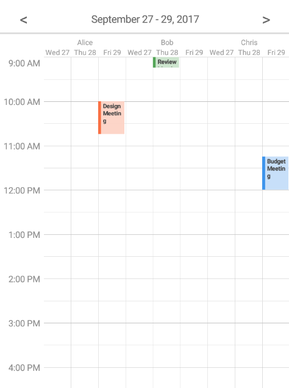

////
|metadata|
{
    "name": "scheduler-activity-grouping",
    "controlName": ["scheduler"],
    "tags": [],
    "guid": "","buildFlags": [],
    "createdOn": "2017-09-13T09:37:02.0484523Z"
}
|metadata|
////

= Activity Grouping ({SchedulerName})

== Purpose

This topic explains how the control can group activities based on different criteria.

== Required Background

[options="header", cols="a,a"]
|=======
|Topic|Purpose

|link:scheduler-overview.html[Overview ({SchedulerName})]
|This topic provides an overview of the {SchedulerName} control.

|link:scheduler-binding-schedulelistdatasource.html[Binding Using ScheduleListDataSource ({SchedulerName})]
|This topic explains how to bind the control to a data source using ScheduleListDataSource.

|link:scheduler-dayview.html[Day View ({SchedulerName})]
|This topic explains how data is presented in the {SchedulerName}'s day view.

|link:scheduler-weekview.html[Week View ({SchedulerName})]
|This topic explains how data is presented in the {SchedulerName}'s week view.

|=======

== In this topic

* <<Ref00001, Overview>>
* <<Ref00002, Grouping by Date>>
* <<Ref00003, Grouping by Resource>>
* <<Ref00004, Related Topics>>

[[Ref00001]]
== Overview

The activity grouping feature allows you to group activities by dates or resources. This feature is supported by {SchedulerName}'s day view and week view. 

[[Ref00002]]
== Grouping by Date

To group activities by date set the link:{SchedulerXFLink}.xamscheduler~activityGroupingMode.html[ActivityGroupingMode] property to link:{SchedulerCoreLink}.core.activityGroupingMode.html[ResourcesWithinDate].

The following screenshot shows a day view displaying the chosen time range of three days and all available resources under each of the days.

[[Ref00003]]
== Grouping by Resource

To group activities by resource set the link:{SchedulerXFLink}.xamscheduler~activityGroupingMode.html[ActivityGroupingMode] property to link:{SchedulerCoreLink}.core.activityGroupingMode.html[DatesWithinResource].

The following screenshot shows a day view displaying all available resources and the chosen time range of three days under each of the resources. 

[[Ref00004]]
== Related Topics

The following topics provide additional information related to this topic.

[options="header", cols="a,a"]
|=======
|Topic|Purpose

|link:scheduler-agendaview.html[Agenda View ({SchedulerName})]
|This topic explains how data is presented in the {SchedulerName}'s agenda view.

|link:scheduler-monthview.html[Month View ({SchedulerName})]
|This topic explains how data is presented in the {SchedulerName}'s month view.

|=======