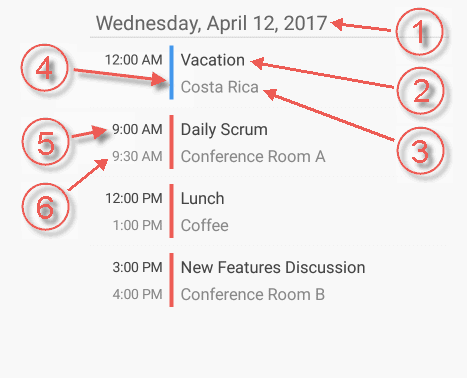

////
|metadata|
{
    "name": "scheduler-agendaview",
    "controlName": ["scheduler"],
    "tags": [],
    "guid": "","buildFlags": [],
    "createdOn": "2017-03-30T09:37:02.0484523Z"
}
|metadata|
////

= Agenda View ({SchedulerName})

== Purpose

This topic explains how data is presented in the {SchedulerName}'s agenda view.

== Required Background

[options="header", cols="a,a"]
|=======
|Topic|Purpose

|link:scheduler-overview.html[Overview ({SchedulerName})]
|This topic provides an overview of the {SchedulerName} control.

|link:scheduler-binding-schedulelistdatasource.html[Binding Using ScheduleListDataSource ({SchedulerName})]
|This topic explains how to bind the control to a data source using ScheduleListDataSource.

|=======

== In this topic

* <<Ref00001, Overview>>
* <<Ref00002, Configuring>>
* <<Ref00003, Events>>
* <<Ref00004, Styling>>
* <<Ref00005, Related Topics>>

[[Ref00001]]
== Overview

The agenda view of the {SchedulerName} is visualizing the activities which occur during a specific time range. The time range is specified using the link:{SchedulerXFLink}.xamscheduler~agendaviewminimumdate.html[AgendaViewMinimumDate] and link:{SchedulerXFLink}.xamscheduler~agendaviewmaximumdate.html[AgendaViewMaximumDate] properties. The activities are presented in the agenda view with their subject, location and times. If an activity has a resource associated with it and the resource has a color scheme set, this color will be used for drawing the vertical separator between the activity's time and activity's subject.

The following image shows the agenda view along with its visual elements:

. Day Header
. Activity subject
. Activity location
. Separator drawn using the associated resource's color scheme
. Activity start time (available if the activity is starting during the particular day)
. Activity end time (available if the activity is ending during the particular day)

[[Ref00002]]
== Configuring

The following table maps some configurable aspect/behavior of the agenda view to the property/method that is responsible for:

[options="header", cols="a,a,a"]
|=======
|Aspect|Description|Property/Method

|Agenda view visibility
|The month view allows sharing its occupied space with an agenda view. This happens by splitting the available to the view space in two.
|link:{SchedulerXFLink}.xamscheduler~monthviewagendavisibility.html[MonthViewAgendaVisibility]

|Inter Day Spacing
|Configure the space between the days in the agenda view.
|link:{SchedulerXFLink}.xamscheduler~agendaviewinterdayspacing.html[AgendaViewInterDaySpacing]

|Set a specific day in view
|Ensure that a specific day is visible in the agenda view by invoking this method.
|link:{SchedulerXFLink}.xamscheduler~ensuredayvisibleinagendaview.html[EnsureDayVisibleInAgendaView]

|=======

[[Ref00003]]
== Events

The following table maps some of the user interactions to the events that are raised by the control:

[options="header", cols="a,a,a"]
|=======
|User Interaction
|Description
|Event

|Activity tapped
|Occurs when tapping on an activity in the month view or in the integrated agenda view.
|link:{SchedulerXFLink}.xamscheduler~appointmentclicked_ev.html[AppointmentClicked]

|Activity selected
|Occurs after an activity is selected in the month view or in the integrated agenda view.
|link:{SchedulerXFLink}.xamscheduler~appointmentselected_ev.html[AppointmentSelected]

|=======

[[Ref00004]]
== Styling

The agenda view is highly configurable in terms of fonts, sizes and colors. There are a lot of properties at your disposal to configure this view and all of their names are prefixed with *AgendaView* so that it is easier for you to find them. For example:

* The properties for controlling the foreground and background colors are of type `Brush`. For example: link:{SchedulerXFLink}.xamscheduler~agendaviewbackgroundbrush.html[AgendaViewBackgroundBrush] or link:{SchedulerXFLink}.xamscheduler~agendaviewappointmentsubjecttextbrush.html[AgendaViewAppointmentSubjectTextBrush].

* The properties for controlling the font sizes are of type `double`. For example: link:{SchedulerXFLink}.xamscheduler~agendaviewappointmentsubjectfontsize.html[AgendaViewAppointmentSubjectFontSize].

* The properties for controlling the font family are of type `string`. For example: link:{SchedulerXFLink}.xamscheduler~agendaviewappointmentsubjectfontfamily.html[AgendaViewAppointmentSubjectFontFamily].

* The properties for controlling the font styling are of type `FontAttributes`. For example: link:{SchedulerXFLink}.xamscheduler~agendaviewappointmentsubjectfontattributes.html[AgendaViewAppointmentSubjectFontAttributes]

[[Ref00005]]
== Related Topics

The following topics provide additional information related to this topic.

[options="header", cols="a,a"]
|=======
|Topic|Purpose

|link:scheduler-dayview.html[Day View ({SchedulerName})]
|This topic explains how data is presented in the {SchedulerName}'s day view.

|link:scheduler-monthview.html[Month View ({SchedulerName})]
|This topic explains how data is presented in the {SchedulerName}'s month view.

|link:scheduler-weekview.html[Week View ({SchedulerName})]
|This topic explains how data is presented in the {SchedulerName}'s week view.

|link:scheduler-appointment.html[Appointment ({SchedulerName})]
|This topic explains the appointment activity type.

|=======