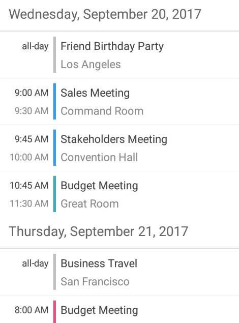
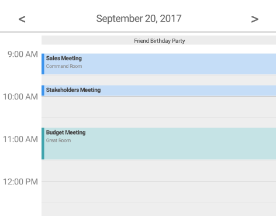
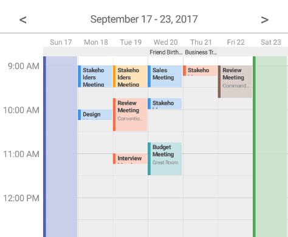

////
|metadata|
{
    "name": "scheduler-all-day-activity",
    "controlName": ["scheduler"],
    "tags": [],
    "guid": "","buildFlags": [],
    "createdOn": "2017-03-30T09:37:02.0484523Z"
}
|metadata|
////

= All-Day Activity ({SchedulerName})

== Purpose

This topic explains the all-day activity type.

== Required Background

[options="header", cols="a,a"]
|=======
|Topic|Purpose

|link:scheduler-overview.html[Overview ({SchedulerName})]
|This topic provides an overview of the {SchedulerName} control.

|link:scheduler-binding-schedulelistdatasource.html[Binding Using ScheduleListDataSource ({SchedulerName})]
|This topic explains how to bind the control to a data source using ScheduleListDataSource.

|link:scheduler-appointment.html[Appointment ({SchedulerName})]
|This topic explains the Appointment activity type.

|=======

== In This Topic

* <<Ref00001, Overview>>
* <<Ref00003, Code Example>>
* <<Ref00004, Related Topics>>

[[Ref00001]]
== Overview

When you have an activity which occupies an entire day or days you can use the "all-day" feature of the activities. To define an activity as all-day you have to set its link:{SchedulerCoreLink}.activitybase~isallDay.html[IsAllDay] property to `true`. In this case the activity will start at midnight on its start date until midnight of the day following the end date.

All available {SchedulerName} views are supporting all-day activities, however there are some differences in the way they are visualized.

* The month view renders all-day activities like any other activity.

* The agenda view renders all-day activities on top of the activities list for each day and with the text "all-day" at the time constrains slot: +

* The day view renders all-day activities in a special all-day activities area on top of all activities with no information in the time slot area. +

* The week view renders all-day activities in a special all-day activities area on top of all activities with no information in the time slot area. +

[[Ref00003]]
== Code Example

The following code example demonstrates how to configure an activity as "all-day":

*In C#:*
[source,csharp]
----
Appointment appointment1 = new Appointment();
appointment1.Subject = "Anniversary";
appointment1.Location = "Restaurant";
appointment1.Start = new DateTime(DateTime.Today.Year, DateTime.Today.Month, DateTime.Today.Day);
appointment1.End = new DateTime(DateTime.Today.Year, DateTime.Today.Month, DateTime.Today.Day);
appointment1.IsAllDay = true;
----

[[Ref00004]]
== Related Topics

[options="header", cols="a,a"]
|=======
|Topic|Purpose

|link:scheduler-recurrence.html[Recurrent Activity ({SchedulerName})]
|This topic explains the repetitive behavior of the activities.

|link:scheduler-resources.html[Resources ({SchedulerName})]
|This topic provides information about the resources concept of the {SchedulerName} control.

|=======