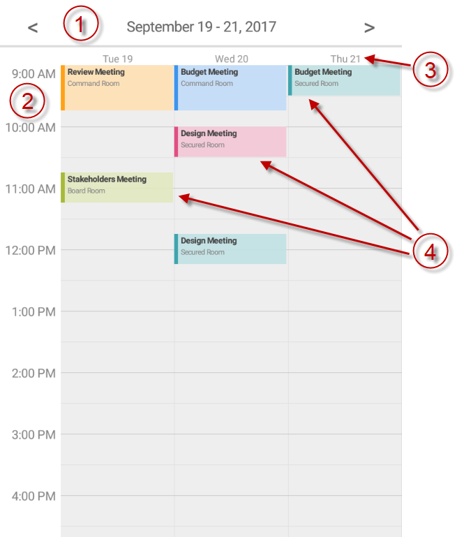

////
|metadata|
{
    "name": "scheduler-dayview",
    "controlName": ["scheduler"],
    "tags": [],
    "guid": "","buildFlags": [],
    "createdOn": "2017-09-13T09:37:02.0484523Z"
}
|metadata|
////

= Day View ({SchedulerName})

== Purpose

This topic explains how data is presented in the {SchedulerName}'s day view.

== Required Background

[options="header", cols="a,a"]
|=======
|Topic|Purpose

|link:scheduler-overview.html[Overview ({SchedulerName})]
|This topic provides an overview of the {SchedulerName} control.

|link:scheduler-binding-schedulelistdatasource.html[Binding Using ScheduleListDataSource ({SchedulerName})]
|This topic explains how to bind the control to a data source using ScheduleListDataSource.

|=======

== In this topic

* <<Ref00001, Overview>>
* <<Ref00002, Configuring>>
* <<Ref00003, Events>>
* <<Ref00004, Styling>>
* <<Ref00005, Related Topics>>

[[Ref00001]]
== Overview

The day view of the {SchedulerName} is visualizing the activities by rendering them in a vertical list with time slots. The time slots' duration can be configured. Each activity occupies only the time slots between its start and end time. If there are two (or more) activities occupying the same time slot they are rendered side by side.

This view has the ability to show up to 7 days which are also rendered side by side. The top part of the day view contains a navigation header which shows the currently selected days and also allows the user to navigate to the previous or the next group of days. The bottom part contains time slots' hours on the left and the activities on the right organized in columns (one for each day).

You can configure the day view to display all 24 hours or only the working hours.

The following image shows the day view, configured to display three days:

. Navigation Header
. Time slots
. Day headers
. Activities in the time slots

[[Ref00002]]
== Configuring

The following table maps some configurable aspect/behavior of the day view to the property/method that is responsible for:

[options="header", cols="a,a,a"]
|=======
|Aspect|Description|Property/Method

|Visible days
|You can control how many days are visible at a time in the day view. Currently between 1 and 7 days are supported.
|link:{SchedulerXFLink}.xamscheduler~dayviewnumberofdays.html[DayViewNumberOfDays]

|Time slot duration
|Configure the time slots' duration. Currently 5, 6, 10, 15, 30 and 60 minutes are supported.
|link:{SchedulerXFLink}.xamscheduler~timeslotinterval.html[TimeSlotInterval]

|Working days and hours
|You can configure this view to display only working hours or all 24 hours.
|link:{SchedulerXFLink}.xamscheduler~workinghoursdisplaymode.html[WorkingHoursDisplayMode]

|=======

[[Ref00003]]
== Events

The following table maps some of the user interactions to the events that are raised by the control:

[options="header", cols="a,a,a"]
|=======
|User Interaction
|Description
|Event

|Activity tapped
|Occurs when tapping on an activity in the day view.
|link:{SchedulerXFLink}.xamscheduler~appointmentclicked_ev.html[AppointmentClicked]

|Activity selected
|Occurs after an activity is selected in the day view.
|link:{SchedulerXFLink}.xamscheduler~appointmentselected_ev.html[AppointmentSelected]

|Time slot selected
|Occurs when a time slot is selected in the day view.
|link:{SchedulerXFLink}.xamscheduler~timeslotselected_ev.html[TimeSlotSelected]

|=======

[[Ref00004]]
== Styling

The day view is highly configurable in terms of fonts, sizes and colors. There are a lot of properties at your disposal to configure this view and all of their names are prefixed with *DayView* so that it is easier for you to find them. For example:

* The properties for controlling the foreground and background colors are of type `Brush`. For example: link:{SchedulerXFLink}.xamscheduler~dayviewbackgroundbrush.html[DayViewBackgroundBrush] or link:{SchedulerXFLink}.xamscheduler~dayviewappointmentsubjecttextbrush.html[DayViewAppointmentSubjectTextBrush].

* The properties for controlling the font sizes are of type `double`. For example: link:{SchedulerXFLink}.xamscheduler~dayviewappointmentsubjectfontsize.html[DayViewAppointmentSubjectFontSize].

* The properties for controlling the font family are of type `string`. For example: link:{SchedulerXFLink}.xamscheduler~dayviewappointmentsubjectfontfamily.html[DayViewAppointmentSubjectFontFamily].

* The properties for controlling the font styling are of type `FontAttributes`. For example: link:{SchedulerXFLink}.xamscheduler~dayviewappointmentsubjectfontattributes.html[DayViewAppointmentSubjectFontAttributes]

[[Ref00005]]
== Related Topics

The following topics provide additional information related to this topic.

[options="header", cols="a,a"]
|=======
|Topic|Purpose

|link:scheduler-agendaview.html[Agenda View ({SchedulerName})]
|This topic explains how data is presented in the {SchedulerName}'s agenda view.

|link:scheduler-monthview.html[Month View ({SchedulerName})]
|This topic explains how data is presented in the {SchedulerName}'s month view.

|link:scheduler-weekview.html[Week View ({SchedulerName})]
|This topic explains how data is presented in the {SchedulerName}'s week view.

|=======