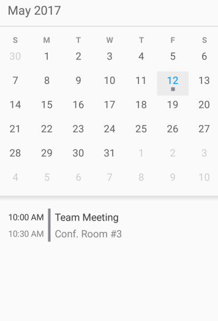

////
|metadata|
{
    "name": "scheduler-getting-started",
    "controlName": ["scheduler"],
    "tags": [],
    "guid": "","buildFlags": [],
    "createdOn": "2017-03-30T09:37:02.0484523Z"
}
|metadata|
////

= Getting Started ({SchedulerName})

== Purpose
This topic provides information on how to get started with the {SchedulerName} control in your applications.

== Required Background

[options="header", cols="a,a"]
|=======
|Topic|Purpose
|link:scheduler-overview.html[Overview ({SchedulerName})]
|This topic provides an overview of the {SchedulerName} control.
|=======

== In This Topic

* <<Ref00001, Overview>>
* <<Ref00002, Steps>>
* <<Ref00003, Related Topics>>

[[Ref00001]]
== Overview
The steps below will guide you on how to quickly setup a {SchedulerName} in your page showing one appointment.

The following image is a preview of the result:

[[Ref00002]]
== Steps

ifdef::xamarin[]
. Create a Xamarin.Forms application project.

. link:xamarin-project-with-infragistics-controls.html#NuGetPackages[Add References Through NuGet Packages].

. Create new Forms Content Page Xaml

. In the page XAML add the following namespace:
+
*In XAML:*
+
[source,xaml]
----
xmlns:igScheduler="clr-namespace:Infragistics.XamarinForms.Controls.Scheduler;assembly=Infragistics.XF.Scheduler"
----

. Add the {SchedulerName} definition in the content grid:
+
*In XAML:*
+
[source,xaml]
----
<Grid>
    <igScheduler:XamScheduler x:Name="scheduler" />
</Grid>
----

. Open the page's code-behind and add the following namespace:
+
*In C#:*
+
[source,csharp]
----
using Infragistics.Scheduler;
using Infragistics.XamarinForms.Controls.Scheduler;
----

. Create a private method for populating the {SchedulerName}'s activities:
+
*In C#:*
+
[source,csharp]
----
private void PopulateActivities()
{
    DateTime today = DateTime.Now.Date;

    // Create an appointment
    Appointment appointment1 = new Appointment();
    appointment1.Subject = "Team Meeting";
    appointment1.Location = "Conf. Room #3";
    appointment1.Start = new DateTime(today.Year, today.Month, today.Day, 10, 0, 0);
    appointment1.End = new DateTime(today.Year, today.Month, today.Day, 10, 30, 0);
    
    
    // Create a list of appointment
    ObservableCollection<Appointment> appointments = new ObservableCollection<Appointment>();
    appointments.Add(appointment1);

    // Create a ScheduleListDataSource instance
    ScheduleListDataSource dataSource = new ScheduleListDataSource();
    dataSource.AppointmentItemsSource = appointments;

    // Set the data source to the control
    this.scheduler.DataSource = dataSource;
}
----

. Invoke the method defined in the previous step just after the InitializeComponent() invocation in the page's constructor.
+
*In C#:*
+
[source,csharp]
----
PopulateActivities();
----

. Build, deploy and run your application.
endif::xamarin[]

[[Ref00003]]
== Related Topics

[options="header", cols="a,a"]
|=======
|Topic|Purpose

|link:scheduler-binding.html[Binding to Data ({SchedulerName})]
|The topics in this section explain different ways to populate the {SchedulerName} control with data.

|link:scheduler-views.html[Views ({SchedulerName})]
|The topics in this section provide information about the different views used by the {SchedulerName} control to present data.

|link:scheduler-activities.html[Activities ({SchedulerName})]
|The topics in this section provide information about the activities concept of the {SchedulerName} control.

|link:scheduler-resources.html[Resources ({SchedulerName})]
|This topic provides information about the resources concept of the {SchedulerName} control.

|=======